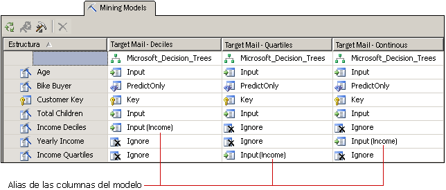

# Personalizar la estructura y los modelos de minería de datos
  Después de seleccionar un algoritmo que satisfaga sus necesidades empresariales, puede personalizar el modelo de minería de datos de las maneras siguientes para intentar mejorar los resultados.  
  
-   Utilice columnas de datos diferentes en el modelo o cambie el uso, el tipo de contenido o el método de discretización de las columnas.  
  
-   Cree filtros en el modelo de minería de datos para restringir los datos que se usan al entrenarlo.  
  
-   Cambie el algoritmo que se usó para analizar los datos.  
  
-   Establezca los parámetros del algoritmo para controlar los umbrales, las divisiones del árbol y otras condiciones importantes.  
  
 En este tema se describen estas opciones.  
  
## Cambiar los datos que usa el modelo  
 Las decisiones que tome sobre qué columnas de datos se han de utilizar en el modelo y cómo usar y procesar esos datos, pueden afectar en gran medida a los resultados del análisis. Los temas siguientes proporcionan información para ayudar a entender estas opciones.  
  
### Usar la selección de características  
 La mayor parte de los algoritmos de minería de datos de [!INCLUDE[ssASnoversion](../../includes/ssasnoversion-md.md)] utiliza un proceso denominado *selección de características* para seleccionar solo los atributos más útiles e incorporarlos a un modelo. Reducir el número de columnas y atributos puede mejorar el rendimiento y la calidad del modelo. Los métodos de selección de características disponibles difieren dependiendo del algoritmo que se elija.  
  
 [Selección de características &#40;minería de datos&#41;](../../analysis-services/data-mining/feature-selection-data-mining.md).  
  
### Cambiar el uso  
 Puede cambiar las columnas que están incluidas en un modelo de minería de datos y cómo se utiliza cada columna. Si no obtiene los resultados esperados, debe muestrear las columnas que utilizó como entrada y preguntarse si las columnas son una buena elección y si hay algo que pueda hacer para mejorar el tratamiento de los datos, como podría ser:  
  
-   Identificar las variables de categorías que ha etiquetado equivocadamente como números.  
  
-   Agregar categorías para contraer el número de atributos y facilitar la búsqueda de correlaciones.  
  
-   Cambiar la manera en que los números se discretizan, o se combinan.  
  
-   Quitar las columnas que tienen muchos valores únicos, o las columnas que son en realidad datos de referencia y no resultan de utilidad para el análisis, como las direcciones o el segundo nombre.  
  
 No necesita quitar físicamente las columnas de la estructura de minería de datos; basta con marcar la columna como **Omitir**. La columna se quita del modelo de minería de datos, pero otros modelos de minería de datos de la estructura aún podrán utilizarla o hacer referencia a ella en una consulta de obtención de datos.  
  
### Crear alias para las columnas de modelo  
 Cuando [!INCLUDE[ssASnoversion](../../includes/ssasnoversion-md.md)] crea el modelo de minería de datos, usa los mismos nombres de columna que se encuentran en la estructura de minería de datos. Puede agregar un alias a cualquier columna del modelo de minería de datos. Esto podría facilitar la comprensión del uso o el contenido de la columna, o hacer el nombre más corto para su comodidad en la creación de consultas. Los alias también son útiles si desea crear una copia de una columna y asignarle un nombre descriptivo.  
  
 Cree un alias modificando la propiedad **Name** de la columna de minería de datos. [!INCLUDE[ssASnoversion](../../includes/ssasnoversion-md.md)] continúa usando el nombre original como el identificador de la columna y el nuevo valor que escribe para **Nombre** se convierte en el alias de columna y aparece en la cuadrícula entre paréntesis junto al uso de la columna.  
  
   
  
 El gráfico muestra los modelos relacionados que tienen varias copias de una columna de estructura de minería de datos, todos relacionados con los ingresos. Cada copia de la columna de estructura se ha hecho de datos discretos de una manera diferente. Cada uno de los modelos del diagrama usan una columna diferente de la estructura de minería de datos; en cambio, para comodidad en la comparación de las columnas por los modelos, se ha cambiado el nombre de la columna de cada modelo a [**Income**].  
  
### Agregar filtros  
 Puede agregar un filtro a un modelo de minería de datos. Un filtro es un conjunto de condiciones WHERE que restringe los datos en los casos de modelo a algún subconjunto. El filtro se usa en el aprendizaje del modelo y se puede usar opcionalmente al probar el modelo o crear gráficos de precisión.  
  
 Agregando filtros, puede reutilizar las estructuras de minería de datos pero crea modelos basados en subconjuntos muy diferentes de los datos. O bien, simplemente puede usar filtros para eliminar algunas filas y mejorar la calidad del análisis.  
  
 Para obtener más información, vea [Filtros para modelos de minería &#40;Analysis Services - Minería de datos&#41;](../../analysis-services/data-mining/filters-for-mining-models-analysis-services-data-mining.md).  
  
## Cambiar el algoritmo  
 Aunque los modelos nuevos que agregue a una estructura de minería de datos comparten el mismo conjunto de datos, puede obtener resultados diferentes utilizando un algoritmo distinto (si los datos lo admiten) o cambiando los parámetros del algoritmo. También puede establecer marcas de modelado.  
  
 La elección de algoritmo determina qué tipo de resultados se van a obtener. Para obtener información general sobre cómo funciona un algoritmo concreto o sobre los escenarios empresariales donde se beneficiaría del uso de un algoritmo determinado, vea [Algoritmos de minería de datos &#40;Analysis Services: Minería de datos&#41;](../../analysis-services/data-mining/data-mining-algorithms-analysis-services-data-mining.md).  
  
 Vea el tema de referencia técnica de cada algoritmo para obtener una descripción de los requisitos y las restricciones, así como información detallada sobre las personalizaciones que cada algoritmo admite.  
  
|||  
|-|-|  
|[Algoritmo de árboles de decisión de Microsoft](../../analysis-services/data-mining/microsoft-decision-trees-algorithm.md)|[Algoritmo de serie temporal de Microsoft](../../analysis-services/data-mining/microsoft-time-series-algorithm.md)|  
|[Algoritmo de clústeres de Microsoft](../../analysis-services/data-mining/microsoft-clustering-algorithm.md)|[Algoritmo de red neuronal de Microsoft](../../analysis-services/data-mining/microsoft-neural-network-algorithm.md)|  
|[Algoritmo Bayes naive de Microsoft](../../analysis-services/data-mining/microsoft-naive-bayes-algorithm.md)|[Algoritmo de regresión logística de Microsoft](../../analysis-services/data-mining/microsoft-logistic-regression-algorithm.md)|  
|[Algoritmo de asociación de Microsoft](../../analysis-services/data-mining/microsoft-association-algorithm.md)|[Algoritmo de regresión lineal de Microsoft](../../analysis-services/data-mining/microsoft-linear-regression-algorithm.md)|  
|[Algoritmo de clústeres de secuencia de Microsoft](../../analysis-services/data-mining/microsoft-sequence-clustering-algorithm.md)||  
  
## Personalizar los parámetros de algoritmo  
 Cada algoritmo admite parámetros que sirven para personalizar su comportamiento y ajustar los resultados del modelo. Para obtener información sobre cómo se utiliza cada parámetro, consulte los temas siguientes:  
  
 El tema correspondiente a cada tipo de algoritmo también enumera las funciones de predicción que se pueden utilizar con modelos basados en ese algoritmo.  
  
|Nombre de la propiedad|Se aplica a|  
|-------------------|----------------|  
|AUTO_DETECT_PERIODICITY|[Referencia técnica del algoritmo de serie temporal de Microsoft](../../analysis-services/data-mining/microsoft-time-series-algorithm-technical-reference.md)|  
|CLUSTER_COUNT|[Referencia técnica del algoritmo de clústeres de Microsoft](../../analysis-services/data-mining/microsoft-clustering-algorithm-technical-reference.md)   [Referencia técnica del algoritmo de clústeres de secuencia de Microsoft](../../analysis-services/data-mining/microsoft-sequence-clustering-algorithm-technical-reference.md)|  
|CLUSTER_SEED|[Referencia técnica del algoritmo de clústeres de Microsoft](../../analysis-services/data-mining/microsoft-clustering-algorithm-technical-reference.md)|  
|CLUSTERING_METHOD|[Referencia técnica del algoritmo de clústeres de Microsoft](../../analysis-services/data-mining/microsoft-clustering-algorithm-technical-reference.md)|  
|COMPLEXITY_PENALTY|[Referencia técnica del algoritmo de árboles de decisión de Microsoft](../../analysis-services/data-mining/microsoft-decision-trees-algorithm-technical-reference.md)   [Referencia técnica del algoritmo de serie temporal de Microsoft](../../analysis-services/data-mining/microsoft-time-series-algorithm-technical-reference.md)|  
|FORCE_REGRESSOR|[Referencia técnica del algoritmo de árboles de decisión de Microsoft](../../analysis-services/data-mining/microsoft-decision-trees-algorithm-technical-reference.md)   [Referencia técnica del algoritmo de regresión lineal de Microsoft](../../analysis-services/data-mining/microsoft-linear-regression-algorithm-technical-reference.md)   [Marcas de modelado &#40;Minería de datos&#41;](../../analysis-services/data-mining/modeling-flags-data-mining.md)|  
|FORECAST_METHOD|[Referencia técnica del algoritmo de serie temporal de Microsoft](../../analysis-services/data-mining/microsoft-time-series-algorithm-technical-reference.md)|  
|HIDDEN_NODE_RATIO|[Referencia técnica del algoritmo de red neuronal de Microsoft](../../analysis-services/data-mining/microsoft-neural-network-algorithm-technical-reference.md)|  
|HISTORIC_MODEL_COUNT|[Referencia técnica del algoritmo de serie temporal de Microsoft](../../analysis-services/data-mining/microsoft-time-series-algorithm-technical-reference.md)|  
|HISTORICAL_MODEL_GAP|[Referencia técnica del algoritmo de serie temporal de Microsoft](../../analysis-services/data-mining/microsoft-time-series-algorithm-technical-reference.md)|  
|HOLDOUT_PERCENTAGE|[Referencia técnica del algoritmo de regresión logística de Microsoft](../../analysis-services/data-mining/microsoft-logistic-regression-algorithm-technical-reference.md)   [Referencia técnica del algoritmo de red neuronal de Microsoft](../../analysis-services/data-mining/microsoft-neural-network-algorithm-technical-reference.md)   Nota: Este parámetro es distinto del valor de porcentaje de datos de exclusión que se aplica a una estructura de minería de datos.|  
|HOLDOUT_SEED|[Referencia técnica del algoritmo de regresión logística de Microsoft](../../analysis-services/data-mining/microsoft-logistic-regression-algorithm-technical-reference.md)   [Referencia técnica del algoritmo de red neuronal de Microsoft](../../analysis-services/data-mining/microsoft-neural-network-algorithm-technical-reference.md)   Nota: Este parámetro es distinto del valor de inicialización de datos de exclusión que se aplica a una estructura de minería de datos.|  
|INSTABILITY_SENSITIVITY|[Referencia técnica del algoritmo de serie temporal de Microsoft](../../analysis-services/data-mining/microsoft-time-series-algorithm-technical-reference.md)|  
|MAXIMUM_INPUT_ATTRIBUTES|[Referencia técnica del algoritmo de clústeres de Microsoft](../../analysis-services/data-mining/microsoft-clustering-algorithm-technical-reference.md)   [Referencia técnica del algoritmo de árboles de decisión de Microsoft](../../analysis-services/data-mining/microsoft-decision-trees-algorithm-technical-reference.md)   [Referencia técnica del algoritmo de regresión lineal de Microsoft](../../analysis-services/data-mining/microsoft-linear-regression-algorithm-technical-reference.md)   [Referencia técnica del algoritmo Bayes naive de Microsoft](../../analysis-services/data-mining/microsoft-naive-bayes-algorithm-technical-reference.md)   [Referencia técnica del algoritmo de red neuronal de Microsoft](../../analysis-services/data-mining/microsoft-neural-network-algorithm-technical-reference.md)   [Referencia técnica del algoritmo de regresión logística de Microsoft](../../analysis-services/data-mining/microsoft-logistic-regression-algorithm-technical-reference.md)|  
|MAXIMUM_ITEMSET_COUNT|[Referencia técnica del algoritmo de asociación de Microsoft](../../analysis-services/data-mining/microsoft-association-algorithm-technical-reference.md)|  
|MAXIMUM_ITEMSET_SIZE|[Referencia técnica del algoritmo de asociación de Microsoft](../../analysis-services/data-mining/microsoft-association-algorithm-technical-reference.md)|  
|MAXIMUM_OUTPUT_ATTRIBUTES|[Referencia técnica del algoritmo de árboles de decisión de Microsoft](../../analysis-services/data-mining/microsoft-decision-trees-algorithm-technical-reference.md)   [Referencia técnica del algoritmo de regresión lineal de Microsoft](../../analysis-services/data-mining/microsoft-linear-regression-algorithm-technical-reference.md)   [Referencia técnica del algoritmo de regresión logística de Microsoft](../../analysis-services/data-mining/microsoft-logistic-regression-algorithm-technical-reference.md)   [Referencia técnica del algoritmo Bayes naive de Microsoft](../../analysis-services/data-mining/microsoft-naive-bayes-algorithm-technical-reference.md)   [Referencia técnica del algoritmo de red neuronal de Microsoft](../../analysis-services/data-mining/microsoft-neural-network-algorithm-technical-reference.md)|  
|MAXIMUM_SEQUENCE_STATES|[Referencia técnica del algoritmo de clústeres de secuencia de Microsoft](../../analysis-services/data-mining/microsoft-sequence-clustering-algorithm-technical-reference.md)|  
|MAXIMUM_SERIES_VALUE|[Referencia técnica del algoritmo de serie temporal de Microsoft](../../analysis-services/data-mining/microsoft-time-series-algorithm-technical-reference.md)|  
|MAXIMUM_STATES|[Referencia técnica del algoritmo de clústeres de Microsoft](../../analysis-services/data-mining/microsoft-clustering-algorithm-technical-reference.md)   [Referencia técnica del algoritmo de red neuronal de Microsoft](../../analysis-services/data-mining/microsoft-neural-network-algorithm-technical-reference.md)   [Referencia técnica del algoritmo de clústeres de secuencia de Microsoft](../../analysis-services/data-mining/microsoft-sequence-clustering-algorithm-technical-reference.md)|  
|MAXIMUM_SUPPORT|[Referencia técnica del algoritmo de asociación de Microsoft](../../analysis-services/data-mining/microsoft-association-algorithm-technical-reference.md)|  
|MINIMUM_IMPORTANCE|[Referencia técnica del algoritmo de asociación de Microsoft](../../analysis-services/data-mining/microsoft-association-algorithm-technical-reference.md)|  
|MINIMUM_ITEMSET_SIZE|[Referencia técnica del algoritmo de asociación de Microsoft](../../analysis-services/data-mining/microsoft-association-algorithm-technical-reference.md)|  
|MINIMUM_DEPENDENCY_PROBABILITY|[Referencia técnica del algoritmo Bayes naive de Microsoft](../../analysis-services/data-mining/microsoft-naive-bayes-algorithm-technical-reference.md)|  
|MINIMUM_PROBABILITY|[Referencia técnica del algoritmo de asociación de Microsoft](../../analysis-services/data-mining/microsoft-association-algorithm-technical-reference.md)|  
|MINIMUM_SERIES_VALUE|[Referencia técnica del algoritmo de serie temporal de Microsoft](../../analysis-services/data-mining/microsoft-time-series-algorithm-technical-reference.md)|  
|MINIMUM_SUPPORT|[Referencia técnica del algoritmo de asociación de Microsoft](../../analysis-services/data-mining/microsoft-association-algorithm-technical-reference.md)   [Referencia técnica del algoritmo de clústeres de Microsoft](../../analysis-services/data-mining/microsoft-clustering-algorithm-technical-reference.md)   [Referencia técnica del algoritmo de árboles de decisión de Microsoft](../../analysis-services/data-mining/microsoft-decision-trees-algorithm-technical-reference.md)   [Referencia técnica del algoritmo de clústeres de secuencia de Microsoft](../../analysis-services/data-mining/microsoft-sequence-clustering-algorithm-technical-reference.md)   [Referencia técnica del algoritmo de serie temporal de Microsoft](../../analysis-services/data-mining/microsoft-time-series-algorithm-technical-reference.md)|  
|MISSING_VALUE_SUBSTITUTION|[Referencia técnica del algoritmo de serie temporal de Microsoft](../../analysis-services/data-mining/microsoft-time-series-algorithm-technical-reference.md)|  
|MODELLING_CARDINALITY|[Referencia técnica del algoritmo de clústeres de Microsoft](../../analysis-services/data-mining/microsoft-clustering-algorithm-technical-reference.md)|  
|PERIODICITY_HINT|[Referencia técnica del algoritmo de serie temporal de Microsoft](../../analysis-services/data-mining/microsoft-time-series-algorithm-technical-reference.md)|  
|PREDICTION_SMOOTHING|[Referencia técnica del algoritmo de serie temporal de Microsoft](../../analysis-services/data-mining/microsoft-time-series-algorithm-technical-reference.md)|  
|SAMPLE_SIZE|[Referencia técnica del algoritmo de clústeres de Microsoft](../../analysis-services/data-mining/microsoft-clustering-algorithm-technical-reference.md)   [Referencia técnica del algoritmo de regresión logística de Microsoft](../../analysis-services/data-mining/microsoft-logistic-regression-algorithm-technical-reference.md)   [Referencia técnica del algoritmo de red neuronal de Microsoft](../../analysis-services/data-mining/microsoft-neural-network-algorithm-technical-reference.md)|  
|SCORE_METHOD|[Referencia técnica del algoritmo de árboles de decisión de Microsoft](../../analysis-services/data-mining/microsoft-decision-trees-algorithm-technical-reference.md)|  
|SPLIT_METHOD|[Referencia técnica del algoritmo de árboles de decisión de Microsoft](../../analysis-services/data-mining/microsoft-decision-trees-algorithm-technical-reference.md)|  
|STOPPING_TOLERANCE|[Referencia técnica del algoritmo de clústeres de Microsoft](../../analysis-services/data-mining/microsoft-clustering-algorithm-technical-reference.md)|  
  
## Vea también  
 [Algoritmos de minería de datos &#40;Analysis Services: Minería de datos&#41;](../../analysis-services/data-mining/data-mining-algorithms-analysis-services-data-mining.md)   
 [Arquitectura física &#40;Analysis Services - Minería de datos&#41;](../../analysis-services/data-mining/physical-architecture-analysis-services-data-mining.md)  
  
  
