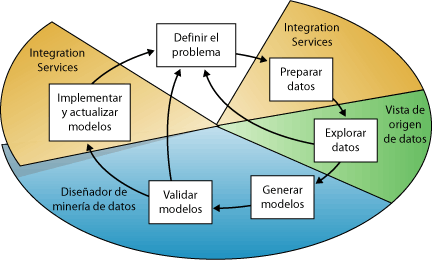
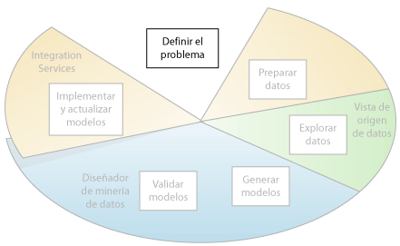
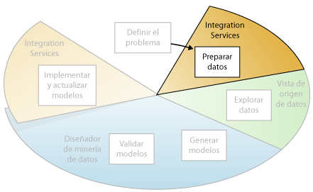
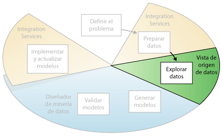
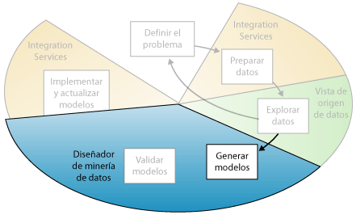
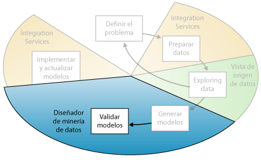
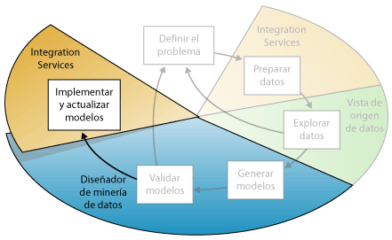

# Conceptos de minería de datos
[!INCLUDE[ssas-appliesto-sqlas](../../includes/ssas-appliesto-sqlas.md)]
  La minería de datos es el proceso de detectar la información procesable de los conjuntos grandes de datos. Utiliza el análisis matemático para deducir los patrones y tendencias que existen en los datos. Normalmente, estos patrones no se pueden detectar mediante la exploración tradicional de los datos porque las relaciones son demasiado complejas o porque hay demasiado datos.  
  
 Estos patrones y tendencias se pueden recopilar y definir como un *modelo de minería de datos*. Los modelos de minería de datos se pueden aplicar en escenarios como los siguientes:  
  
-   **Pronóstico**: cálculo de las ventas y predicción de las cargas del servidor o del tiempo de inactividad del servidor.  
  
-   **Riesgo y probabilidad**: elección de los mejores clientes para la distribución de correo directo, determinación del punto de equilibrio probable para los escenarios de riesgo, y asignación de probabilidades a diagnósticos y otros resultados.  
  
-   **Recomendaciones**: determinación de los productos que se pueden vender juntos y generación de recomendaciones.  
  
-   **Búsqueda de secuencias**: análisis de los artículos que los clientes han introducido en el carrito de la compra y predicción de posibles eventos.  
  
-   **Agrupación**: distribución de clientes o eventos en grupos de elementos relacionados, y análisis y predicción de afinidades.  
  
 La generación de un modelo de minería de datos forma parte de un proceso mayor que incluye desde la formulación de preguntas acerca de los datos y la creación de un modelo para responderlas, hasta la implementación del modelo en un entorno de trabajo. Este proceso se puede definir mediante los seis pasos básicos siguientes:  
  
1.  [Definir el problema](#DefiningTheProblem)  
  
2.  [Preparar los datos](#PreparingData)  
  
3.  [Explorar los datos](#ExploringData)  
  
4.  [Generar modelos](#BuildingModels)  
  
5.  [Explorar y validar los modelos](#ValidatingModels)  
  
6.  [Implementar y actualizar los modelos](#DeployingandUpdatingModels)  
  
 El siguiente diagrama describe las relaciones existentes entre cada paso del proceso y las tecnologías de [!INCLUDE[msCoName](../../includes/msconame-md.md)] [!INCLUDE[ssNoVersion](../../includes/ssnoversion-md.md)] que se pueden usar para completar cada paso.  
  
   
  
 El proceso que se ilustra en el diagrama es cíclico, lo que significa que la creación de un modelo de minería de datos es un proceso dinámico e iterativo. Una vez que ha explorado los datos, puede que descubra que resultan insuficientes para crear los modelos de minería de datos adecuados y que, por tanto, debe buscar más datos. O bien, puede generar varios modelos y descubrir entonces que no responden adecuadamente al problema planteado cuando los definió y que, por tanto, debe volver a definir el problema. Es posible que deba actualizar los modelos una vez implementados debido a que haya más datos disponibles. Puede que haya que repetir cada paso del proceso muchas veces para crear un modelo adecuado.  
  
 La minería de datos de Microsoft SQL Server ofrece un entorno integrado para crear y trabajar con modelos de minería de datos. Este entorno incluye SQL Server Development Studio, que contiene algoritmos de minería de datos y herramientas de consulta que facilitan la generación de una solución completa para una serie de proyectos, y [!INCLUDE[ssManStudioFull](../../includes/ssmanstudiofull-md.md)], que contiene herramientas que permiten examinar modelos y administrar objetos de minería de datos. Para obtener más información, vea [Crear modelos multidimensionales al usar las herramientas de datos de SQL Server &#40;SSDT&#41;](../../analysis-services/multidimensional-models/creating-multidimensional-models-using-sql-server-data-tools-ssdt.md).  
  
 Si quiere ver un ejemplo de cómo las herramientas de [!INCLUDE[ssNoVersion](../../includes/ssnoversion-md.md)] se pueden aplicar en un escenario empresarial, vea [Tutorial básico de minería de datos](http://msdn.microsoft.com/library/6602edb6-d160-43fb-83c8-9df5dddfeb9c).  
  
##   Definir el problema  
 El primer paso del proceso de minería de datos, tal como se resalta en el siguiente diagrama, consiste en definir claramente el problema y considerar formas de usar los datos para proporcionar una respuesta para el mismo.  
  
   
  
 Este paso incluye analizar los requisitos empresariales, definir el ámbito del problema, definir las métricas por las que se evaluará el modelo y definir los objetivos concretos del proyecto de minería de datos. Estas tareas se traducen en preguntas como las siguientes:  
  
-   ¿Qué está buscando? ¿Qué tipos de relaciones intenta buscar?  
  
-   ¿Refleja el problema que está intentando resolver las directivas o procesos de la empresa?  
  
-   ¿Desea realizar predicciones a partir del modelo de minería de datos o solamente buscar asociaciones y patrones interesantes?  
  
-   ¿Qué resultado o atributo desea predecir?  
  
-   ¿Qué tipo de datos tiene y qué tipo de información hay en cada columna? En caso de que haya varias tablas, ¿cómo se relacionan? ¿Necesita limpiar, agregar o procesar los datos antes de poder usarlos?  
  
-   ¿Cómo se distribuyen los datos? ¿Los datos son estacionales? ¿Los datos representan con precisión los procesos de la empresa?  
  
 Para responder a estas preguntas, puede que deba dirigir un estudio de disponibilidad de datos para investigar las necesidades de los usuarios de la empresa con respecto a los datos disponibles. Si los datos no abarcan las necesidades de los usuarios, podría tener que volver a definir el proyecto.  
  
 También debe considerar las maneras en las que los resultados del modelo se pueden incorporar en los indicadores de rendimiento clave (KPI) que se utilizan para medir el progreso comercial.  
  
##   Preparar los datos  
 El segundo paso del proceso de minería de datos, como se indica en el siguiente diagrama, consiste en consolidar y limpiar los datos identificados en el paso [Definir el problema](#DefiningTheProblem) .  
  
   
  
 Los datos pueden estar dispersos en la empresa y almacenados en formatos distintos; también pueden contener incoherencias como entradas que faltan o incorrectas. Por ejemplo, los datos pueden mostrar que un cliente adquirió un producto incluso antes que se ofreciera en el mercado o que el cliente compra regularmente en una tienda situada a 2.000 kilómetros de su casa.  
  
 La limpieza de datos no solamente implica quitar los datos no válidos o interpolar valores que faltan, sino también buscar las correlaciones ocultas en los datos, identificar los orígenes de datos que son más precisos y determinar qué columnas son las más adecuadas para el análisis. Por ejemplo, ¿debería utilizar la fecha de envío o la fecha de pedido? ¿Qué influye más en las ventas: la cantidad, el precio total o un precio con descuento? Los datos incompletos, los datos incorrectos y las entradas que parecen independientes, pero que de hecho están estrechamente correlacionadas, pueden influir en los resultados del modelo de maneras que no espera.  
  
 Por consiguiente, antes de empezar a generar los modelos de minería de datos, debería identificar estos problemas y determinar cómo los corregirá. En la minería de datos, por lo general se trabaja con un conjunto de datos de gran tamaño y no se puede examinar la calidad de los datos de cada transacción; por tanto, es posible que necesite usar herramientas de generación de perfiles de datos, y de limpieza y filtrado automático de datos, como las que se proporcionan en [!INCLUDE[ssISnoversion](../../includes/ssisnoversion-md.md)], [!INCLUDE[ssMDSlong](../../includes/ssmdslong-md.md)]o [!INCLUDE[ssDQSnoversionLong](../../includes/ssdqsnoversionlong-md.md)] para explorar los datos y buscar incoherencias. Para obtener más información, vea estos recursos:  
  
-   [Integration Services en Business Intelligence Development Studio](https://technet.microsoft.com/library/ms174181\(v=sql.110\).aspx)  
  
-   [Introducción a Master Data Services &#40;MDS&#41;](../../master-data-services/master-data-services-overview-mds.md)  
  
-   [Data Quality Services](../../data-quality-services/data-quality-services.md)  
  
 Es importante tener en cuenta que los datos que se usan para la minería de datos no necesitan almacenarse en un cubo de procesamiento analítico en línea (OLAP), ni siquiera en una base de datos relacional, aunque puede usar ambos como orígenes de datos. Puede realizar minería de datos mediante cualquier origen de datos definido como origen de datos de [!INCLUDE[ssASnoversion](../../includes/ssasnoversion-md.md)] . Por ejemplo, archivos de texto, libros de Excel o datos de otros proveedores externos. Para obtener más información, vea [Orígenes de datos admitidos &#40;SSAS - Multidimensionales&#41;](../../analysis-services/multidimensional-models/supported-data-sources-ssas-multidimensional.md).  
  
##   Explorar los datos  
 El tercer paso del proceso de minería de datos, como se resalta en el siguiente diagrama, consiste en explorar los datos preparados.  
  
   
  
 Debe conocer los datos para tomar las decisiones adecuadas al crear los modelos de minería de datos. Entre las técnicas de exploración se incluyen calcular los valores mínimos y máximos, calcular la media y las desviaciones estándar, y examinar la distribución de los datos. Por ejemplo, al revisar el máximo, el mínimo y los valores de la media se podría determinar que los datos no son representativos de los clientes o procesos de negocio, y que por consiguiente debe obtener más datos equilibrados o revisar las suposiciones que son la base de sus expectativas. Las desviaciones estándar y otros valores de distribución pueden proporcionar información útil sobre la estabilidad y exactitud de los resultados. Una desviación estándar grande puede indicar que agregar más datos podría ayudarle a mejorar el modelo. Los datos que se desvían mucho de una distribución estándar se podrían sesgar o podrían representar una imagen precisa de un problema de la vida real, pero dificultar el ajustar un modelo a los datos.  
  
 Al explorar los datos para conocer el problema empresarial, puede decidir si el conjunto de datos contiene datos defectuosos y, a continuación, puede inventar una estrategia para corregir los problemas u obtener una descripción más profunda de los comportamientos que son típicos de su negocio.  
  
 Puede usar herramientas como [!INCLUDE[ssMDSshort](../../includes/ssmdsshort-md.md)] para sondear los orígenes de datos disponibles y determinar su disponibilidad para la minería de datos. Puede usar herramientas como [!INCLUDE[ssDQSnoversionLong](../../includes/ssdqsnoversionlong-md.md)], o el generador de perfiles de datos de Integration Services, para analizar la distribución de los datos y solucionar problemas, como la existencia de datos incorrectos o la falta de datos.  
  
 Cuando tenga definido los orígenes, combínelos en una vista del origen de datos con el Diseñador de vistas del origen de datos de [!INCLUDE[ssBIDevStudio](../../includes/ssbidevstudio-md.md)]. Para obtener más información, vea [Vistas del origen de datos en modelos multidimensionales](../../analysis-services/multidimensional-models/data-source-views-in-multidimensional-models.md). Este diseñador también contiene algunas herramientas que podrá usar para explorar los datos y comprobar que funcionarán a la hora de crear un modelo. Para obtener más información, vea [Explorar datos en una vista del origen de datos &#40;Analysis Services&#41;](../../analysis-services/multidimensional-models/explore-data-in-a-data-source-view-analysis-services.md).  
  
 Tenga en cuenta que cuando se crea un modelo, [!INCLUDE[ssASnoversion](../../includes/ssasnoversion-md.md)] crea automáticamente resúmenes estadísticos de los datos contenidos en él, que puede consultar para su uso en informes o análisis. Para obtener más información, vea [Consultas de minería de datos](../../analysis-services/data-mining/data-mining-queries.md).  
  
##   Generar modelos  
 El cuarto paso del proceso de minería de datos, como se resalta en el siguiente diagrama, consiste en generar el modelo o modelos de minería de datos. Usará los conocimientos adquiridos en el paso [Explorar los datos](#ExploringData) para definir y crear los modelos.  
  
   
  
 Deberá definir qué columnas de datos desea que se usen; para ello, creará una estructura de minería de datos. La estructura de minería de datos se vincula al origen de datos, pero en realidad no contiene ningún dato hasta que se procesa. Al procesar la estructura de minería de datos, [!INCLUDE[ssASnoversion](../../includes/ssasnoversion-md.md)] genera agregados y otra información estadística que se puede usar para el análisis. Cualquier modelo de minería de datos que esté basado en la estructura puede utilizar esta información. Para obtener más información sobre cómo se relacionan las estructuras de minería de datos con los modelos de minería de datos, vea [Arquitectura lógica &#40;Analysis Services - Minería de datos&#41;](../../analysis-services/data-mining/logical-architecture-analysis-services-data-mining.md).  
  
 Antes de procesar la estructura y el modelo, un modelo de minería de datos simplemente es un contenedor que especifica las columnas que se usan para la entrada, el atributo que está prediciendo y parámetros que indican al algoritmo cómo procesar los datos. El procesamiento de un modelo a menudo se denomina *entrenamiento*. El entrenamiento hace referencia al proceso de aplicar un algoritmo matemático concreto a los datos de la estructura para extraer patrones. Los patrones que encuentre en el proceso de entrenamiento dependerán de la selección de los datos de entrenamiento, el algoritmo que elija y cómo se haya configurado el algoritmo. [!INCLUDE[ssCurrent](../../includes/sscurrent-md.md)]contiene muchos algoritmos diferentes, cada uno está preparado para un tipo diferente de tarea y crea un tipo distinto de modelo. Para obtener una lista de los algoritmos proporcionados en [!INCLUDE[ssCurrent](../../includes/sscurrent-md.md)], vea [Algoritmos de minería de datos &#40;Analysis Services: Minería de datos&#41;](../../analysis-services/data-mining/data-mining-algorithms-analysis-services-data-mining.md).  
  
 También puede utilizar los parámetros para ajustar cada algoritmo y puede aplicar filtros a los datos de entrenamiento para utilizar un subconjunto de los datos, creando resultados diferentes. Después de pasar los datos a través del modelo, el objeto de modelo de minería de datos contiene los resúmenes y modelos que se pueden consultar o utilizar para la predicción.  
  
 Puede definir un modelo nuevo mediante el Asistente para minería de datos de [!INCLUDE[ssBIDevStudio](../../includes/ssbidevstudio-md.md)] o con el lenguaje DMX (Extensiones de minería de datos). Para obtener más información sobre cómo usar el Asistente para minería de datos, vea [Asistente para minería de datos &#40;Analysis Services - Minería de datos&#41;](../../analysis-services/data-mining/data-mining-wizard-analysis-services-data-mining.md). Para obtener más información sobre cómo usar DMX, vea [Referencia de Extensiones de minería de datos &#40;DMX&#41;](../../dmx/data-mining-extensions-dmx-reference.md).  
  
 Es importante recordar que siempre que los datos cambian, debe actualizar la estructura y el modelo de minería de datos. Al actualizar una estructura de minería de datos volviéndola a procesar, [!INCLUDE[ssASnoversion](../../includes/ssasnoversion-md.md)] recupera los datos del origen, incluido cualquier dato nuevo si el origen se actualiza dinámicamente, y vuelve a rellenar la estructura de minería de datos. Si tiene modelos que están basados en la estructura, puede elegir actualizar estos, lo que significa que se vuelven a entrenar con los nuevos datos, o puede dejar los modelos tal cual. Para más información, vea [Requisitos y consideraciones de procesamiento &#40;minería de datos&#41;](../../analysis-services/data-mining/processing-requirements-and-considerations-data-mining.md).  
  
##   Explorar y validar los modelos  
 El quinto paso del proceso de minería de datos, como se resalta en el siguiente diagrama, consiste en explorar los modelos de minería de datos que ha generado y comprobar su eficacia.  
  
   
  
 Antes de implementar un modelo en un entorno de producción, es aconsejable probar si funciona correctamente. Además, al generar un modelo, normalmente se crean varios con configuraciones diferentes y se prueban todos para ver cuál ofrece los resultados mejores para su problema y sus datos.  
  
 [!INCLUDE[ssASnoversion](../../includes/ssasnoversion-md.md)]proporciona herramientas que ayudan a separan los datos en conjuntos de datos de prueba para que pueda evaluar con precisión el rendimiento de todos los modelos en los mismos datos y entrenamiento. El conjunto de datos de entrenamiento se utiliza para generar el modelo y el conjunto de datos de prueba para comprobar la precisión del modelo mediante la creación de consultas de predicción. Estas particiones pueden hacer automáticamente mientras se genera el modelo de minería de datos. Para obtener más información, vea [Prueba y validación &#40;minería de datos&#41;](../../analysis-services/data-mining/testing-and-validation-data-mining.md).  
  
 Puede explorar las tendencias y patrones que los algoritmos detectan mediante los visores del diseñador de minería de datos de [!INCLUDE[ssBIDevStudio](../../includes/ssbidevstudio-md.md)]. Para obtener más información, vea [Visores de modelos de minería de datos](../../analysis-services/data-mining/data-mining-model-viewers.md). También puede comprobar si los modelos crean predicciones correctamente mediante herramientas del diseñador como el gráfico de mejora respecto al modelo predictivo y la matriz de clasificación. Para comprobar si el modelo es específico de sus datos o se puede usar para realizar inferencias en la población general, puede usar la técnica estadística denominada *validación cruzada* para crear automáticamente subconjuntos de los datos y probar el modelo con cada uno. Para obtener más información, vea [Prueba y validación &#40;minería de datos&#41;](../../analysis-services/data-mining/testing-and-validation-data-mining.md).  
  
 Si ninguno de los modelos que ha creado en el paso [Generar modelos](#BuildingModels) funciona correctamente, puede que deba volver a un paso anterior del proceso y volver a definir el problema o volver a investigar los datos del conjunto de datos original.  
  
##   Implementar y actualizar los modelos  
 El último paso del proceso de minería de datos, como se resalta en el siguiente diagrama, consiste en implementar los modelos que funcionan mejor en un entorno de producción.  
  
   
  
 Una vez que los modelos de minería de datos se encuentran en el entorno de producción, puede llevar acabo diferentes tareas, dependiendo de sus necesidades. Las siguientes son algunas de las tareas que puede realizar:  
  
-   Use los modelos para crear predicciones que luego podrá usar para tomar decisiones comerciales. [!INCLUDE[ssNoVersion](../../includes/ssnoversion-md.md)]proporciona el lenguaje DMX, que puede usar para crear consultas de predicción y el generador de consultas de predicción para ayudarle a generar las consultas. Para obtener más información, vea [Referencia de Extensiones de minería de datos &#40;DMX&#41;](../../dmx/data-mining-extensions-dmx-reference.md).  
  
-   Crear consultas de contenido para recuperar estadísticas, reglas o fórmulas del modelo. Para obtener más información, vea [Consultas de minería de datos](../../analysis-services/data-mining/data-mining-queries.md).  
  
-   Incrustar la funcionalidad de minería de datos directamente en una aplicación. Puede incluir Objetos de administración de análisis (AMO), que contiene un conjunto de objetos que la aplicación pueda utilizar para crear, cambiar, procesar y eliminar estructuras y modelos de minería de datos. También puede enviar mensajes XML for Analysis (XMLA) directamente a una instancia de [!INCLUDE[ssASnoversion](../../includes/ssasnoversion-md.md)]. Para obtener más información, vea [Desarrollo (Analysis Services - Minería de datos)](https://technet.microsoft.com/library/bb522473\(v=sql.110\).aspx).  
  
-   Utilizar [!INCLUDE[ssISnoversion](../../includes/ssisnoversion-md.md)] para crear un paquete en el que se utilice un modelo de minería de datos para dividir de forma inteligente los datos entrantes en varias tablas. Por ejemplo, si una base de datos se actualiza continuamente con clientes potenciales, puede utilizar un modelo de minería de datos junto con [!INCLUDE[ssISnoversion](../../includes/ssisnoversion-md.md)] para dividir los datos entrantes en clientes que probablemente compren un producto y clientes que probablemente no compren un producto. Para más información, consulte [Usos típicos de Integration Services](http://msdn.microsoft.com/en-us/3b97897a-d418-4ef4-b5a4-5aabf4fa6bca).  
  
-   Crear un informe que permita a los usuarios realizar consultas directamente en un modelo de minería de datos existente. Para obtener más información, vea [Reporting Services en SQL Server Data Tools &#40;SSDT&#41;](../../reporting-services/tools/reporting-services-in-sql-server-data-tools-ssdt.md).  
  
-   Actualizar los modelos después de la revisión y análisis. Cualquier actualización requiere que vuelve a procesar los modelos. Para más información, consulte [Processing Data Mining Objects](../../analysis-services/data-mining/processing-data-mining-objects.md).  
  
-   Actualizar dinámicamente los modelos, cuando entren más datos en la organización, y realizar modificaciones constantes para mejorar la efectividad de la solución debería ser parte de la estrategia de implementación. Para obtener más información, vea [Administración de las soluciones y los objetos de minería de datos](../../analysis-services/data-mining/management-of-data-mining-solutions-and-objects.md).  
  
## Vea también  
 [Soluciones de minería de datos](../../analysis-services/data-mining/data-mining-solutions.md)   
 [Herramientas de minería de datos](../../analysis-services/data-mining/data-mining-tools.md)  
  
  
