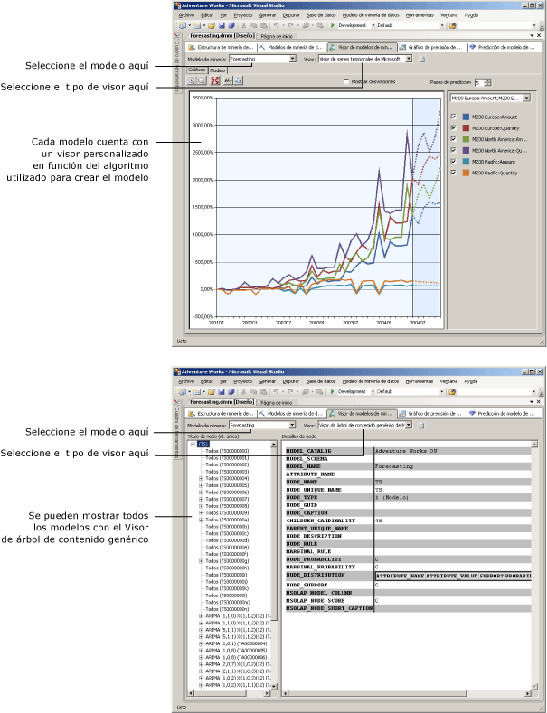

# Visores de modelos de minería de datos
[!INCLUDE[ssas-appliesto-sqlas](../../includes/ssas-appliesto-sqlas.md)]Después de entrenar un modelo de minería de datos en [!INCLUDE[msCoName](../../includes/msconame-md.md)] [!INCLUDE[ssNoVersion](../../includes/ssnoversion-md.md)] [!INCLUDE[ssASnoversion](../../includes/ssasnoversion-md.md)], puede explorar el modelo para buscar tendencias interesantes. Como los resultados de los modelos de minería de datos son complejos y pueden resultar difíciles de comprender sin formato, investigar los datos visualmente suele ser la manera más fácil de entender las reglas y relaciones que los algoritmos descubren en los datos.  
  
 Cada algoritmo que utilice para generar un modelo devuelve un tipo de resultados diferente. Por tanto, [!INCLUDE[ssASnoversion](../../includes/ssasnoversion-md.md)] proporciona un visor independiente para cada algoritmo. Cuando se examina un modelo de minería de datos en [!INCLUDE[ssBIDevStudioFull](../../includes/ssbidevstudiofull-md.md)], el modelo se muestra en la pestaña **Visor de modelos de minería de datos** del Diseñador de minería de datos, utilizando el visor adecuado para el modelo.  
  
## Cómo utilizar los visores de modelos  
 Primero seleccione el modelo de minería de datos y, a continuación, seleccione un visor. Cada modelo siempre tiene dos visores disponibles: un visor personalizado, que puede incluir varias pestañas, y el visor genérico.  
  
 Dependiendo del tipo de modelo que haya seleccionado, verá opciones muy diferentes para explorar el modelo. Los visores personalizados asociados a cada tipo de modelo se adaptan al algoritmo que se usó para crear el modelo de minería de datos seleccionado. Cada visor personalizado tiene diversas herramientas y cuadros de diálogo para ayudar a explorar las estadísticas y patrones del modelo, ver los gráficos, trabajar interactivamente con umbrales de probabilidad o filtrar los elementos por el nombre.  
  
 El diagrama siguiente muestra la diferencia cuando se elige un visor personalizado o un visor genérico para el mismo modelo:  
  
1.  Primero, podrá ver el visor personalizado que se muestra al seleccionar un modelo de minería de datos basado en el algoritmo de serie temporal de Microsoft.  
  
     Este visor personalizado determinado crea automáticamente un gráfico de serie temporal y proporciona cinco predicciones.  
  
2.  A continuación, verá el mismo modelo, mostrado mediante el **Visor de árbol de contenido genérico de Microsoft**.  
  
     A la izquierda, el visor genérico muestra una lista de los nodos del modelo. Puede hacer clic en un nodo para ver su contenido en el panel derecho.  
  
   
  
## Más información acerca del Visor de árbol de contenido genérico de Microsoft  
 Cada modelo también se puede visualizar con el [Visor de árbol de contenido genérico de Microsoft &#40;minería de datos&#41;](http://msdn.microsoft.com/library/751b4393-f6fd-48c1-bcef-bdca589ce34c). Este visor muestra el contenido del modelo de minería de datos según un formato de tabla HTML normalizado. Sin embargo, la organización de los nodos y el contenido de cada nodo variarán considerablemente dependiendo del algoritmo utilizado para generar los resultados.  
  
 Mientras que los visores personalizados están diseñados para explorar y describir el modelo, el visor genérico es más útil cuando ya se entiende el modelo y se desea extraer estadísticas o reglas a partir de un nodo concreto. Por ejemplo, utilice el visor genérico cuando desee ver información detallada sobre los patrones y estadísticas que [!INCLUDE[ssASnoversion](../../includes/ssasnoversion-md.md)] capturó durante el análisis, como la probabilidad de un nodo, o una fórmula de regresión.  
  
 También puede escribir *consultas de contenido* utilizando DMX para obtener toda la información que se muestra en el visor. Para más información, vea [Consultas de contenido &#40;minería de datos&#41;](../../analysis-services/data-mining/content-queries-data-mining.md).  
  
## En esta sección  
 Los temas siguientes describen con más detalle cada uno de los visores, y cómo interpretar la información incluida en ellos.  
  
 [Examinar un modelo usando el Visor de árboles de Microsoft](../../analysis-services/data-mining/browse-a-model-using-the-microsoft-tree-viewer.md)  
 Describe el Visor de árboles de [!INCLUDE[msCoName](../../includes/msconame-md.md)] . Este visor muestra los modelos de minería de datos generados con el algoritmo Árboles de decisión de [!INCLUDE[msCoName](../../includes/msconame-md.md)] y el algoritmo Regresión lineal de [!INCLUDE[msCoName](../../includes/msconame-md.md)] .  
  
 [Examinar un modelo usando el Visor de clústeres de Microsoft](../../analysis-services/data-mining/browse-a-model-using-the-microsoft-cluster-viewer.md)  
 Describe el Visor de clústeres de [!INCLUDE[msCoName](../../includes/msconame-md.md)] . Este visor muestra los modelos de minería de datos que se generan con el algoritmo de clústeres de [!INCLUDE[msCoName](../../includes/msconame-md.md)] .  
  
 [Examinar un modelo usando el Visor de serie temporal de Microsoft](../../analysis-services/data-mining/browse-a-model-using-the-microsoft-time-series-viewer.md)  
 Describe el Visor de series temporales de [!INCLUDE[msCoName](../../includes/msconame-md.md)] . Este visor muestra los modelos de minería de datos que se generan con el algoritmo de serie temporal de [!INCLUDE[msCoName](../../includes/msconame-md.md)] .  
  
 [Examinar un modelo usando el visor Bayes naive de Microsoft](../../analysis-services/data-mining/browse-a-model-using-the-microsoft-naive-bayes-viewer.md)  
 Describe el Visor Bayes naive de [!INCLUDE[msCoName](../../includes/msconame-md.md)] . Este visor muestra los modelos de minería de datos que se generan con el algoritmo Bayes naive de [!INCLUDE[msCoName](../../includes/msconame-md.md)] .  
  
 [Examinar un modelo usando el Visor de clústeres de secuencia de Microsoft](../../analysis-services/data-mining/browse-a-model-using-the-microsoft-sequence-cluster-viewer.md)  
 Describe el Visor de clústeres de secuencia de [!INCLUDE[msCoName](../../includes/msconame-md.md)] . Este visor muestra los modelos de minería de datos que se generan con el algoritmo de clústeres de secuencia de [!INCLUDE[msCoName](../../includes/msconame-md.md)] .  
  
 [Examinar un modelo usando el Visor de reglas de asociación de Microsoft](../../analysis-services/data-mining/browse-a-model-using-the-microsoft-association-rules-viewer.md)  
 Describe el Visor de reglas de asociación de [!INCLUDE[msCoName](../../includes/msconame-md.md)] . Este visor muestra los modelos de minería de datos que se generan con el algoritmo de asociación de [!INCLUDE[msCoName](../../includes/msconame-md.md)] .  
  
 [Examinar un modelo usando el Visor de redes neuronales de Microsoft](../../analysis-services/data-mining/browse-a-model-using-the-microsoft-neural-network-viewer.md)  
 Describe el Visor de redes neuronales de [!INCLUDE[msCoName](../../includes/msconame-md.md)] . Este visor muestra los modelos de minería de datos realizados con el algoritmo de Red neuronal de [!INCLUDE[msCoName](../../includes/msconame-md.md)] , incluidos los modelos que usan el algoritmo de Regresión logística de [!INCLUDE[msCoName](../../includes/msconame-md.md)] .  
  
 [Examinar un modelo usando el Visor de árbol de contenido genérico de Microsoft](../../analysis-services/data-mining/browse-a-model-using-the-microsoft-generic-content-tree-viewer.md)  
 Describe la información detallada disponible en el  visor genérico para todos los modelos de minería de datos y presenta ejemplos para interpretar la información de cada algoritmo.  
  
## Vea también  
 [Algoritmos de minería de datos &#40;Analysis Services: Minería de datos&#41;](../../analysis-services/data-mining/data-mining-algorithms-analysis-services-data-mining.md)   
 [Diseñador de minería de datos](../../analysis-services/data-mining/data-mining-designer.md)  
  
  
