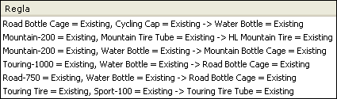

# Algoritmo de asociaci&#243;n de Microsoft
  El algoritmo de asociación de [!INCLUDE[msCoName](../../includes/msconame-md.md)] es un algoritmo que suele usarse para los motores de recomendación. Un motor de recomendación recomienda elementos a los clientes basándose en los elementos que ya han adquirido o en los que tienen interés. El algoritmo de asociación de [!INCLUDE[msCoName](../../includes/msconame-md.md)] también resulta útil para el análisis de la cesta de compra.   
  
 Los modelos de asociación se generan basándose en conjuntos de datos que contienen identificadores para casos individuales y para los elementos que contienen los casos. Un grupo de elementos de un caso se denomina un *conjunto de elementos*. Un modelo de asociación se compone de una serie de conjuntos de elementos y de las reglas que describen cómo estos elementos se agrupan dentro de los casos. Las reglas que el algoritmo identifica pueden utilizarse para predecir las probables compras de un cliente en el futuro, basándose en los elementos existentes en la cesta de compra actual del cliente. El siguiente diagrama muestra una serie de reglas en un conjunto de elementos.  
  
   
  
 Como muestra el diagrama, el algoritmo de asociación de [!INCLUDE[msCoName](../../includes/msconame-md.md)] puede encontrar potencialmente muchas reglas dentro de un conjunto de datos. El algoritmo usa dos parámetros, compatibilidad y probabilidad, para describir los conjuntos de elementos y las reglas que genera. Por ejemplo, si X e Y representan dos elementos que pueden formar parte de la cesta de la compra, el parámetro de soporte es el número de casos del conjunto de datos que contienen la combinación de ambos elementos, X e Y. Mediante el uso del parámetro de soporte en combinación con los parámetros *MINIMUM_SUPPORT* y *MAXIMUM_SUPPORT* definidos por el usuario, el algoritmo controla el número de conjuntos de elementos que se generan. El parámetro de probabilidad, también denominado parámetro de *confianza*, representa la fracción de casos del conjunto de datos que contiene X y que también contiene Y. Mediante el uso del parámetro de probabilidad en combinación con el parámetro *MINIMUM_PROBABILITY*, el algoritmo controla el número de reglas que se generan.  
  
## Ejemplo  
 La empresa [!INCLUDE[ssSampleDBCoShort](../../includes/sssampledbcoshort-md.md)] Cycle está rediseñando la funcionalidad de su sitio web. El objetivo del nuevo diseño es incrementar la venta directa de sus productos. Debido a que la empresa registra cada venta en una base de datos transaccional, se puede utilizar el algoritmo de asociación de [!INCLUDE[msCoName](../../includes/msconame-md.md)] para identificar los conjuntos de productos que suelen adquirirse juntos. Así, se pueden predecir los elementos adicionales en los que un cliente puede estar interesado basándose en los elementos que ya se encuentran en su cesta de la compra.  
  
## Cómo funciona el algoritmo  
 El algoritmo de asociación de [!INCLUDE[msCoName](../../includes/msconame-md.md)] recorre un conjunto de datos para hallar elementos que aparezcan juntos en un caso. Después, agrupa en conjuntos de elementos todos los elementos asociados que aparecen, como mínimo, en el número de casos especificado en el parámetro *MINIMUM_SUPPORT*. Por ejemplo, un conjunto de elementos puede ser "Mountain 200=Existing, Sport 100=Existing" y tener un soporte de 710. El algoritmo generará reglas a partir de los conjuntos de elementos. Estas reglas se usan para predecir la presencia de un elemento en la base de datos, basándose en la presencia de otros elementos específicos que el algoritmo ha identificado como importantes. Por ejemplo, una regla puede ser "if Touring 1000=existing and Road bottle cage=existing, then Water bottle=existing", y puede tener una probabilidad de 0.812. En este ejemplo, el algoritmo identifica que la presencia en la cesta del neumático Touring 1000 y del soporte de la botella de agua predice que probablemente la cesta de compra incluirá también una botella de agua.  
  
 Para obtener una explicación más detallada del algoritmo, junto con una lista de los parámetros que permiten personalizar su comportamiento y controlar los resultados en el modelo de minería de datos, vea [Referencia técnica del algoritmo de asociación de Microsoft](../../analysis-services/data-mining/microsoft-association-algorithm-technical-reference.md).  
  
## Datos requeridos para los modelos de asociación  
 Al preparar los datos para su uso en un modelo de reglas de asociación, conviene comprender qué requisitos son imprescindibles para el algoritmo concreto, incluidos el volumen de datos necesario y la forma en que estos datos se utilizan.  
  
 Los requisitos para un modelo de reglas de asociación son los siguientes:  
  
-   **Una columna de una sola clave** : cada modelo debe contener una columna numérica o de texto que identifique cada registro de manera única. no se permiten las claves compuestas.  
  
-   **Una única columna de predicción** Un modelo de asociación solo puede tener una columna de predicción. Normalmente, se trata de la columna de clave de la tabla anidada, como el campo que contiene los productos que se han comprado. Los valores deben ser discretos o discretizados.  
  
-   **Columnas de entrada** Las columnas de entrada deben ser discretas. Los datos de entrada de un modelo de asociación suelen encontrarse en dos tablas. Por ejemplo, una tabla puede contener la información del cliente y la otra las compras de ese cliente. Es posible incluir estos datos en el modelo mediante el uso de una tabla anidada. Para obtener más información sobre las tablas anidadas, vea [Tablas anidadas &#40;Analysis Services - Minería de datos&#41;](../../analysis-services/data-mining/nested-tables-analysis-services-data-mining.md).  
  
 Para obtener información más detallada sobre los tipos de contenido y los tipos de datos compatibles con los modelos de asociación, vea la sección Requisitos de [Referencia técnica del algoritmo de asociación de Microsoft](../../analysis-services/data-mining/microsoft-association-algorithm-technical-reference.md).  
  
## Ver un modelo de asociación  
 Para explorar el modelo, puede utilizar el **Visor de asociación de Microsoft**. Cuando se observa un modelo de asociación, [!INCLUDE[ssASnoversion](../../includes/ssasnoversion-md.md)] presenta las correlaciones desde distintos ángulos para que se puedan comprender mejor las relaciones y las reglas halladas en los datos. El panel **Conjunto de elementos** del visor proporciona un análisis detallado de las combinaciones o los conjuntos de elementos más comunes. El panel **Reglas** presenta una lista de reglas generalizadas a partir de los datos, agrega cálculos de probabilidad y clasifica las reglas según su importancia relativa. el visor de red de dependencia permite explorar visualmente cómo se conectan los diferentes elementos individuales. Para obtener más información, vea [Examinar un modelo usando el Visor de clústeres de Microsoft](../../analysis-services/data-mining/browse-a-model-using-the-microsoft-cluster-viewer.md).  
  
 Si desea obtener más detalles sobre cualquiera de los conjuntos de elementos y reglas, puede examinar el modelo en el [Visor de árbol de contenido genérico de Microsoft](../../analysis-services/data-mining/browse-a-model-using-the-microsoft-generic-content-tree-viewer.md). El contenido almacenado para el modelo incluye el soporte para cada conjunto de elementos, una puntuación para cada regla y otras estadísticas. Para obtener más información, vea [Contenido del modelo de minería de datos para los modelos de asociación &#40;Analysis Services - Minería de datos&#41;](../../analysis-services/data-mining/mining-model-content-for-association-models-analysis-services-data-mining.md).  
  
## Crear predicciones  
 Una vez procesado el modelo, puede utilizar las reglas y los conjuntos de elementos para realizar predicciones. En un modelo de asociación, una predicción indica qué elemento es probable que se produzca dada la presencia del elemento especificado, y la predicción puede incluir información como la probabilidad, el soporte o la importancia. Para obtener ejemplos de cómo crear consultas en un modelo de asociación, vea [Ejemplos de consultas del modelo de asociación](../../analysis-services/data-mining/association-model-query-examples.md).  
  
 Para obtener información general sobre cómo crear una consulta en un modelo de minería de datos, vea [Consultas de minería de datos](../../analysis-services/data-mining/data-mining-queries.md).  
  
## Rendimiento  
 El proceso de crear conjuntos de elementos y contar las correlaciones puede llevar mucho tiempo. Aunque el algoritmo Reglas de asociación de [!INCLUDE[msCoName](../../includes/msconame-md.md)] usa técnicas de optimización para ahorrar espacio y agilizar el procesamiento, es conveniente saber que se pueden presentar problemas de rendimiento en determinadas circunstancias como las que se mencionan a continuación:  
  
-   El conjunto de datos es grande y tiene muchos elementos individuales.  
  
-   El tamaño mínimo establecido para el conjunto de elementos es demasiado pequeño.  
  
 Para minimizar el tiempo de procesamiento y reducir la complejidad de los conjuntos de elementos, se puede intentar agrupar en categorías los elementos relacionados antes de analizar los datos.  
  
## Comentarios  
  
-   No admite el uso del Lenguaje de marcado de modelos de predicción (PMML) para crear modelos de minería de datos.  
  
-   Admite la obtención de detalles.  
  
-   Admite el uso de modelos de minería de datos OLAP.  
  
-   Admite la creación de dimensiones de minería de datos.  
  
## Vea también  
 [Algoritmos de minería de datos &#40;Analysis Services: Minería de datos&#41;](../../analysis-services/data-mining/data-mining-algorithms-analysis-services-data-mining.md)   
 [Examinar un modelo usando el Visor de reglas de asociación de Microsoft](../../analysis-services/data-mining/browse-a-model-using-the-microsoft-association-rules-viewer.md)   
 [Contenido del modelo de minería de datos para los modelos de asociación &#40;Analysis Services - Minería de datos&#41;](../../analysis-services/data-mining/mining-model-content-for-association-models-analysis-services-data-mining.md)   
 [Referencia técnica del algoritmo de asociación de Microsoft](../../analysis-services/data-mining/microsoft-association-algorithm-technical-reference.md)   
 [Ejemplos de consultas del modelo de asociación](../../analysis-services/data-mining/association-model-query-examples.md)  
  
  