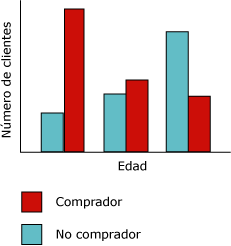
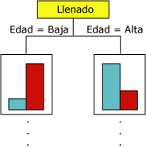
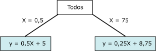

# Algoritmo de árboles de decisión de Microsoft
[!INCLUDE[ssas-appliesto-sqlas](../../includes/ssas-appliesto-sqlas.md)]
  El algoritmo de árboles de decisión de [!INCLUDE[msCoName](../../includes/msconame-md.md)] es un algoritmo de clasificación y regresión para el modelado de predicción de atributos discretos y continuos.  
  
 Para los atributos discretos, el algoritmo hace predicciones basándose en las relaciones entre las columnas de entrada de un conjunto de datos. Utiliza los valores, conocidos como estados, de estas columnas para predecir los estados de una columna que se designa como elemento de predicción. Específicamente, el algoritmo identifica las columnas de entrada que se correlacionan con la columna de predicción. Por ejemplo, en un escenario para predecir qué clientes van a adquirir probablemente una bicicleta, si nueve de diez clientes jóvenes compran una bicicleta, pero solo lo hacen dos de diez clientes de edad mayor, el algoritmo infiere que la edad es un buen elemento de predicción en la compra de bicicletas. El árbol de decisión realiza predicciones basándose en la tendencia hacia un resultado concreto.  
  
 Para los atributos continuos, el algoritmo usa la regresión lineal para determinar dónde se divide un árbol de decisión.  
  
 Si se define más de una columna como elemento de predicción, o si los datos de entrada contienen una tabla anidada que se haya establecido como elemento de predicción, el algoritmo genera un árbol de decisión independiente para cada columna de predicción.  
  
## Ejemplo  
 El departamento de marketing de la empresa [!INCLUDE[ssSampleDBCoFull](../../includes/sssampledbcofull-md.md)] desea identificar las características de los clientes antiguos que podrían indicar si es probable que realicen alguna compra en el futuro. La base de datos [!INCLUDE[ssSampleDBnormal](../../includes/sssampledbnormal-md.md)] almacena información demográfica que describe a los clientes antiguos. Mediante el algoritmo de árboles de decisión de [!INCLUDE[msCoName](../../includes/msconame-md.md)] que analiza esta información, el departamento puede generar un modelo que predice si un determinado cliente va a comprar productos, basándose en el estado de las columnas conocidas sobre ese cliente, como la demografía o los patrones de compra anteriores.  
  
## Cómo funciona el algoritmo  
 El algoritmo de árboles de decisión de [!INCLUDE[msCoName](../../includes/msconame-md.md)] genera un modelo de minería de datos mediante la creación de una serie de divisiones en el árbol. Estas divisiones se representan como *nodos*. El algoritmo agrega un nodo al modelo cada vez que una columna de entrada tiene una correlación significativa con la columna de predicción. La forma en que el algoritmo determina una división varía en función de si predice una columna continua o una columna discreta.  
  
 El algoritmo de árboles de decisión de [!INCLUDE[msCoName](../../includes/msconame-md.md)] utiliza la *selección de características* para guiar la selección de los atributos más útiles. Todos los algoritmos de minería de datos de [!INCLUDE[ssNoVersion](../../includes/ssnoversion-md.md)] Data Mining algorithms to improve performance and the quality of analysis. La selección de características es importante para evitar que los atributos irrelevantes utilicen tiempo de procesador. Si utiliza demasiados atributos de predicción o de entrada al diseñar un modelo de minería de datos, el modelo puede tardar mucho tiempo en procesarse o incluso quedarse sin memoria. Algunos métodos para determinar si hay que dividir el árbol son las métricas estándar del sector para la *entropía* y las redes Bayesianas *.* Para obtener más información sobre los métodos que se usan para seleccionar los atributos significativos y, después, puntuarlos y clasificarlos, vea [Selección de características &#40;minería de datos&#41;](../../analysis-services/data-mining/feature-selection-data-mining.md).  
  
 Un problema común de los modelos de minería de datos es que el modelo se vuelve demasiado sensible a las diferencias pequeñas en los datos de entrenamiento, en cuyo caso se dice que está *sobreajustado* o *sobreentrenado*. Un modelo sobreajustado no se puede generalizar a otros conjuntos de datos. Para evitar sobreajustar un conjunto de datos determinado, el algoritmo de árboles de decisión de [!INCLUDE[msCoName](../../includes/msconame-md.md)] utiliza técnicas para controlar el crecimiento del árbol. Para obtener una explicación más detallada de cómo funciona el algoritmo de árboles de decisión de [!INCLUDE[msCoName](../../includes/msconame-md.md)] , vea [Referencia técnica del algoritmo de árboles de decisión de Microsoft](../../analysis-services/data-mining/microsoft-decision-trees-algorithm-technical-reference.md).  
  
### Predecir columnas discretas  
 La forma en que el algoritmo de árboles de decisión de [!INCLUDE[msCoName](../../includes/msconame-md.md)] genera un árbol para una columna de predicción discreta puede mostrarse mediante un histograma. El siguiente diagrama muestra un histograma que seguimiento una columna de predicción, Bike Buyers, con una columna de entrada, Age. El histograma muestra que la edad de una persona ayuda a distinguir si esa persona comprará una bicicleta.  
  
   
  
 La correlación que aparece en el diagrama hará que el algoritmo de árboles de decisión de [!INCLUDE[msCoName](../../includes/msconame-md.md)] cree un nuevo nodo en el modelo.  
  
   
  
 A medida que el algoritmo agrega nuevos nodos a un modelo, se forma una estructura en árbol. El nodo superior del árbol describe el desglose de la columna de predicción para la población global de clientes. A medida que el modelo crece, el algoritmo considera todas las columnas.  
  
### Predecir columnas continuas  
 Cuando el algoritmo de árboles de decisión de [!INCLUDE[msCoName](../../includes/msconame-md.md)] genera un árbol basándose en una columna de predicción continua, cada nodo contiene una fórmula de regresión. Se produce una división en un punto de no linealidad de la fórmula de regresión. Por ejemplo, considere el siguiente diagrama.  
  
   
  
 En un modelo de regresión estándar, intentaría derivar una fórmula única que represente la tendencia y las relaciones de los datos como un todo.  En cambio, una fórmula única puede hacer un trabajo insuficiente al capturar la discontinuidad en los datos complejos. En su lugar, el algoritmo de árboles de decisión de [!INCLUDE[msCoName](../../includes/msconame-md.md)] busca los segmentos del árbol que son principalmente lineales y crea fórmulas independientes de estos segmentos. Al dividir los datos en segmentos diferentes, el modelo puede hacer un trabajo mejor de aproximación de datos.  
  
 En el siguiente diagrama se representa el diagrama de árbol del modelo en el gráfico de dispersión anterior.  Para predecir el resultado, el modelo proporciona dos fórmulas diferentes: una para la bifurcación izquierda, con la fórmula y = .5x x 5 y otra para la bifurcación derecha, con la fórmula y = .25x + 8,75. El punto donde las dos líneas se unen en el gráfico de dispersión es el punto de no linealidad y donde se dividiría un nodo de un modelo de árbol de decisión.  
  
   
  
 Este es un modelo sencillo con solo dos ecuaciones lineales; por consiguiente, la división en el árbol se encuentra inmediatamente después del nodo **All** . En cambio, una división puede producirse en cualquier nivel del árbol. Eso significa que en un árbol que contenga varios niveles y nodos, donde cada nodo se caracteriza por una colección diferente de atributos, puede que se comparta una fórmula en varios nodos o se aplique solo a un único nodo. Por ejemplo, puede obtener una fórmula de un nodo que se defina como "clientes por encima de una determinada edad e ingresos" y otra en un nodo que represente "clientes que viajan largas distancias". Para ver la fórmula de un nodo o segmento individual, haga clic en el nodo.  
  
## Datos requeridos para los modelos de árboles de decisión  
 Cuando prepare los datos para su uso en un modelo de árboles de decisión, conviene que comprenda qué requisitos son imprescindibles para el algoritmo concreto, incluidos el volumen de datos necesario y la forma en que estos se utilizan.  
  
 Los requisitos para un modelo de árbol de decisión son los siguientes:  
  
-   **Una columna de una sola clave** : cada modelo debe contener una columna numérica o de texto que identifique cada registro de manera única. No están permitidas las claves compuestas.  
  
-   **Una columna de predicción** . Se requiere al menos una columna de predicción. Puede incluir varios atributos de predicción en un modelo y pueden ser de tipos diferentes, numérico o discreto. Sin embargo, el incremento del número de atributos de predicción puede aumentar el tiempo de procesamiento.  
  
-   **Columnas de entrada** . Se requieren columnas de entrada, que pueden ser discretas o continuas. Aumentar el número de atributos de entrada afecta al tiempo de procesamiento.  
  
 Para obtener información más detallada sobre los tipos de contenido y los tipos de datos compatibles con los modelos de árboles de decisión, vea la sección Requisitos de [Referencia técnica del algoritmo de árboles de decisión de Microsoft](../../analysis-services/data-mining/microsoft-decision-trees-algorithm-technical-reference.md).  
  
## Ver un modelo de árboles de decisión  
 Para examinar el modelo, puede utilizar el **Visor de árboles de Microsoft**. Si un modelo genera varios árboles, puede seleccionar uno y el visor muestra un esquema de cómo se clasifican los casos para cada atributo de predicción. También puede ver la interacción de los árboles utilizando el visor de redes de dependencias. Para obtener más información, vea [Examinar un modelo usando el Visor de árboles de Microsoft](../../analysis-services/data-mining/browse-a-model-using-the-microsoft-tree-viewer.md).  
  
 Si desea obtener información más detallada sobre cualquier bifurcación o nodo del árbol, también puede examinar el modelo utilizando el [Visor de árbol de contenido genérico de Microsoft](../../analysis-services/data-mining/browse-a-model-using-the-microsoft-generic-content-tree-viewer.md). El contenido almacenado para el modelo incluye la distribución para todos los valores de cada nodo, las probabilidades en cada nivel del árbol y las fórmulas de regresión para los atributos continuos. Para obtener más información, vea [Mining Model Content for Decision Tree Models &#40;Analysis Services - Data Mining&#41;](../../analysis-services/data-mining/mining-model-content-for-decision-tree-models-analysis-services-data-mining.md).  
  
## Crear predicciones  
 Una vez procesado el modelo, los resultados se almacenan como un conjunto de patrones y estadísticas que se pueden usar para explorar las relaciones o para realizar predicciones.  
  
 Para obtener ejemplos de consultas que se van a usar con un modelo de árboles de decisión, vea [Ejemplos de consultas de modelos de árboles de decisión](../../analysis-services/data-mining/decision-trees-model-query-examples.md).  
  
 Para obtener información general sobre cómo crear consultas con modelos de minería de datos, vea [Consultas de minería de datos](../../analysis-services/data-mining/data-mining-queries.md).  
  
## Comentarios  
  
-   Admite el uso del Lenguaje de marcado de modelos de predicción (PMML) para crear modelos de minería de datos.  
  
-   Admite la obtención de detalles.  
  
-   Admite el uso de modelos de minería de datos OLAP y la creación de dimensiones de minería de datos.  
  
## Vea también  
 [Algoritmos de minería de datos & #40; Analysis Services: minería de datos & #41;](../../analysis-services/data-mining/data-mining-algorithms-analysis-services-data-mining.md)   
 [Referencia técnica del algoritmo de árboles de decisión de Microsoft](../../analysis-services/data-mining/microsoft-decision-trees-algorithm-technical-reference.md)   
 [Ejemplos de consultas de modelo de árboles de decisión](../../analysis-services/data-mining/decision-trees-model-query-examples.md)   
 [Contenido del modelo de minería de datos para modelos de árboles de decisión & #40; Analysis Services: minería de datos & #41;](../../analysis-services/data-mining/mining-model-content-for-decision-tree-models-analysis-services-data-mining.md)  
  
  
