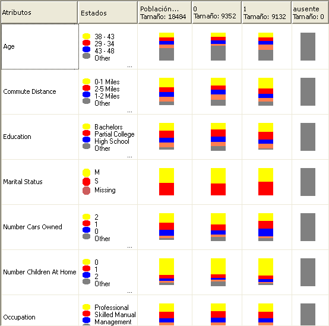

# Microsoft Naive Bayes Algorithm
[!INCLUDE[ssas-appliesto-sqlas](../../includes/ssas-appliesto-sqlas.md)]
  El [!INCLUDE[msCoName](../../includes/msconame-md.md)] algoritmo Bayes Naive es un algoritmo de clasificación basado en los teoremas de Bayes y se puede usar para el modelado de predicción y de exploración. La palabra naïve (ingenuo en inglés) del término Bayes naive proviene del hecho que el algoritmo utiliza técnicas Bayesianas pero no tiene en cuenta las dependencias que puedan existir.  
  
 Desde el punto de vista computacional, el algoritmo es menos complejo que otros algoritmos de [!INCLUDE[msCoName](../../includes/msconame-md.md)] y, por tanto, resulta útil para generar rápidamente modelos de minería de datos que detectan las relaciones entre las columnas de entrada y las columnas de predicción. Puede utilizar este algoritmo para realizar la exploración inicial de los datos y, más adelante, aplicar los resultados para crear modelos de minería de datos adicionales con otros algoritmos más complejos y precisos desde el punto de vista computacional.  
  
## Ejemplo  
 Como parte de su estrategia promocional, el departamento de comercialización de la empresa Adventure Works Cycles ha decidido atraer a posibles clientes realizando un envío por correo de folletos. Para reducir costos, desean enviar los folletos solo a los clientes de los que esperan recibir respuesta. La empresa almacena información en una base de datos sobre datos demográficos y respuestas a envíos de correo anteriores. Desean utilizar estos datos para ver el modo en que los datos demográficos como la edad o la ciudad pueden ayudarles a predecir la respuesta a una promoción, comparando los clientes potenciales con los que tienen características similares y con los que han adquirido productos de la empresa en el pasado. En concreto, lo que desean es ver las diferencias entre los clientes que adquirieron una bicicleta y los que no lo hicieron.  
  
 Mediante el algoritmo Bayes naive de [!INCLUDE[msCoName](../../includes/msconame-md.md)] , el departamento de comercialización pude predecir rápidamente un resultado de un perfil de cliente concreto y, por tanto, puede determinar qué clientes responderán a los folletos con más probabilidad. Con el Visor Bayes naive de [!INCLUDE[msCoName](../../includes/msconame-md.md)] de [!INCLUDE[ssBIDevStudioFull](../../includes/ssbidevstudiofull-md.md)], también pueden investigar visualmente qué columnas de entrada específicas contribuyen a conseguir respuestas positivas a los folletos.  
  
## Cómo funciona el algoritmo  
 El algoritmo Bayes naive de [!INCLUDE[msCoName](../../includes/msconame-md.md)] calcula la probabilidad de cada estado de cada columna de entrada, dado cada posible estado de la columna de predicción.  
  
 Para comprender cómo funciona, utilice el Visor Bayes naive de [!INCLUDE[msCoName](../../includes/msconame-md.md)] de [!INCLUDE[ssBIDevStudioFull](../../includes/ssbidevstudiofull-md.md)] (como se muestra en el siguiente gráfico) para consultar una representación visual del modo en que el algoritmo distribuye los estados.  
  
   
  
 Aquí, el Visor Bayes naive de [!INCLUDE[msCoName](../../includes/msconame-md.md)] muestra cada columna de entrada del conjunto de datos e indica cómo se distribuyen los estados de cada columna, dado cada estado de la columna de predicción.  
  
 Esta vista del modelo se utilizaría para identificar las columnas de entrada que son importantes para diferenciar los distintos estados de la columna de predicción.  
  
 Por ejemplo, en la fila Commute Distance que se muestra aquí, la distribución de valores de entrada es visiblemente diferente para los compradores en comparación con los no compradores. Esto indica que la entrada, Commute Distance = 0-1 miles, es un factor de predicción potencial.  
  
 El visor también proporciona valores para las distribuciones, de modo que pueda ver que para los clientes que viajan entre una y dos millas para ir a trabajar, la probabilidad de que compren una bicicleta es de 0,387, y la probabilidad que no la compren es de 0,287. En este ejemplo, el algoritmo utiliza la información numérica, derivada de un dato de cliente (como la distancia entre el domicilio y el lugar de trabajo), para predecir si un cliente compraría una bicicleta.  
  
 Para más información sobre el uso del visor Bayes naive de [!INCLUDE[msCoName](../../includes/msconame-md.md)] , vea [Examinar un modelo usando el visor Bayes naive de Microsoft](../../analysis-services/data-mining/browse-a-model-using-the-microsoft-naive-bayes-viewer.md).  
  
## Datos requeridos para los modelos Bayes naive  
 Al preparar los datos para su uso en un modelo de entrenamiento Bayes naive, conviene comprender qué requisitos son imprescindibles para el algoritmo, incluidos el volumen de datos necesario y la forma en que estos datos se utilizan.  
  
 Los requisitos para un modelo Bayes naive son los siguientes:  
  
-   **Una columna de una sola clave** : cada modelo debe contener una columna numérica o de texto que identifique cada registro de manera única. No están permitidas las claves compuestas.  
  
-   **Columnas de entrada**: en un modelo Bayes naive, todas las columnas deben ser discretas o se deben haber discretizado los valores. Para más información sobre cómo discretizar columnas (bin), vea [Métodos de discretización &#40;minería de datos&#41;](../../analysis-services/data-mining/discretization-methods-data-mining.md).  
  
-   **Las variables deben ser independientes.** En un modelo Bayes naive, también es importante asegurarse de que los atributos de entrada sean independientes unos de otros. Esto es particularmente importante al utilizar el modelo para la predicción. Si usa dos columnas de datos que ya están estrechamente relacionadas, el efecto sería multiplicar la influencia de esas columnas, lo que puede ocultar otros factores que influyen en el resultado.  
  
     Al contrario, la capacidad del algoritmo de identificar las correlaciones entre las variables es útil cuando está explorando un modelo o conjunto de datos, para identificar las relaciones entre las entradas.  
  
-   **Al menos una columna de predicción** : el atributo de predicción debe contener valores discretos o discretizados.  
  
     Los valores de la columna predecible se pueden tratar como entradas. Este ejercicio puede ser útil si explora un nuevo conjunto de datos, para encontrar relaciones entre las columnas.  
  
## Ver el modelo  
 Para explorar el modelo, puede usar el **Visor Bayes naive de Microsoft**. El visor muestra cómo se relacionan los atributos de entrada con el atributo de predicción. El visor también proporciona un perfil detallado de cada clúster, una lista de los atributos que distinguen cada clúster de los demás, y las características del conjunto de datos de entrenamiento completo. Para más información, vea [Examinar un modelo usando el visor Bayes naive de Microsoft](../../analysis-services/data-mining/browse-a-model-using-the-microsoft-naive-bayes-viewer.md).  
  
 Si quiere obtener más detalles, puede examinar el modelo en el [Visor de árbol de contenido genérico de Microsoft &#40;Minería de datos&#41;](http://msdn.microsoft.com/library/751b4393-f6fd-48c1-bcef-bdca589ce34c). Para más información sobre el tipo de información almacenada en el modelo, vea [Contenido del modelo de minería de datos para los modelos Bayes naive &#40;Analysis Services - Minería de datos&#41;](../../analysis-services/data-mining/mining-model-content-for-naive-bayes-models-analysis-services-data-mining.md).  
  
## Realizar predicciones  
 Una vez entrenado el modelo, los resultados se almacenan como un conjunto de patrones que se puede explorar o utilizar para realizar predicciones.  
  
 Puede crear consultas para devolver las predicciones sobre cómo se relacionan los nuevos datos con el atributo de predicción, o puede recuperar estadísticas que describan las correlaciones que ha hallado el modelo.  
  
 Para más información sobre cómo crear consultas en un modelo de minería de datos, vea [Consultas de minería de datos](../../analysis-services/data-mining/data-mining-queries.md). Para obtener ejemplos de cómo usar las consultas con un modelo de Bayes naive, vea [Ejemplos de consultas del modelo Bayes naive](../../analysis-services/data-mining/naive-bayes-model-query-examples.md).  
  
## Comentarios  
  
-   Admite el uso del Lenguaje de marcado de modelos de predicción (PMML) para crear modelos de minería de datos.  
  
-   Admite la obtención de detalles.  
  
-   No admite la creación de dimensiones de minería de datos.  
  
-   Admite el uso de modelos de minería de datos OLAP.  
  
## Vea también  
 [Algoritmos de minería de datos &#40;Analysis Services: Minería de datos&#41;](../../analysis-services/data-mining/data-mining-algorithms-analysis-services-data-mining.md)   
 [Selección de características &#40;minería de datos&#41;](../../analysis-services/data-mining/feature-selection-data-mining.md)   
 [Ejemplos de consultas del modelo Bayes naive](../../analysis-services/data-mining/naive-bayes-model-query-examples.md)   
 [Contenido del modelo de minería de datos para los modelos Bayes naive &#40;Analysis Services - Minería de datos&#41;](../../analysis-services/data-mining/mining-model-content-for-naive-bayes-models-analysis-services-data-mining.md)   
 [Referencia técnica del algoritmo Bayes naive de Microsoft](../../analysis-services/data-mining/microsoft-naive-bayes-algorithm-technical-reference.md)  
  
  
