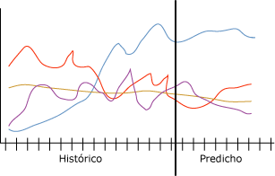

# Algoritmo de serie temporal de Microsoft
[!INCLUDE[ssas-appliesto-sqlas](../../includes/ssas-appliesto-sqlas.md)]El [!INCLUDE[msCoName](../../includes/msconame-md.md)] proporciona varios algoritmos que se optimizan para pronosticar valores continuos, como las ventas de producto, con el tiempo que el algoritmo de serie temporal. Mientras que otros algoritmos de [!INCLUDE[msCoName](../../includes/msconame-md.md)] , como por ejemplo los árboles de decisión, requieren columnas adicionales de nueva información como entrada para predecir una tendencia, los modelos de serie temporal no las necesitan. Un modelo de serie temporal puede predecir tendencias basadas únicamente en el conjunto de datos original utilizado para crear el modelo. Es posible también agregar nuevos datos al modelo al realizar una predicción e incorporar automáticamente los nuevos datos en el análisis de tendencias.  
  
 El siguiente diagrama muestra un modelo típico de previsión en el tiempo de las ventas de un producto en cuatro regiones de ventas diferentes. El modelo presentado en el diagrama de ventas muestra las ventas de cada región como líneas de color rojo, amarillo, púrpura y azul. La línea de cada región consta de dos partes:  
  
-   La información histórica aparece a la izquierda de la línea vertical y representa los datos que el algoritmo utiliza para crear el modelo.  
  
-   La información de la predicción aparece a la derecha de la línea vertical y representa la previsión realizada por el modelo.  
  
 A la combinación de los datos de origen y los datos de la predicción se le denomina *serie*.  
  
   
  
 Una característica importante del algoritmo de serie temporal de [!INCLUDE[msCoName](../../includes/msconame-md.md)] es su capacidad para llevar a cabo predicciones cruzadas. Si entrena el algoritmo con dos series independientes, pero relacionadas, puede utilizar el modelo generado para predecir el resultado de una serie basándose en el comportamiento de la otra. Por ejemplo, las ventas observadas de un producto pueden influir en las ventas previstas de otro producto.  La predicción cruzada también es útil para crear un modelo general que se puede aplicar a múltiples series. Por ejemplo, las predicciones para una región determinada son inestables debido a que  la serie no dispone de datos de buena calidad.  Podría entrenar un modelo general sobre la media de las cuatro regiones y, a continuación, aplicar el modelo a las series individuales para crear predicciones más estables para cada región.  
  
## Ejemplo  
 El equipo de administración de [!INCLUDE[ssSampleDBCoFull](../../includes/sssampledbcofull-md.md)] desea predecir las ventas mensuales de bicicletas para el próximo año. La compañía está especialmente interesada en saber si las ventas de un determinado modelo de bicicleta se pueden utilizar para predecir las ventas de otro modelo. Al utilizar el algoritmo de serie temporal de [!INCLUDE[msCoName](../../includes/msconame-md.md)] en los datos históricos de los últimos tres años, la empresa puede crear un modelo de minería de datos que prevea la venta futura de bicicletas. Además, la organización puede llevar a cabo predicciones cruzadas para ver si las tendencias de venta de modelos individuales de bicicleta están relacionadas.  
  
 Cada trimestre, la compañía tiene previsto actualizar el modelo con datos recientes de ventas y actualizar sus predicciones a las tendencias recientes del modelo. Para suplir los datos de los almacenes que no actualizan los datos de ventas de forma precisa o regular, crearán un modelo de predicción general que utilizarán para crear predicciones para todas las regiones.  
  
## Cómo funciona el algoritmo  
 En [!INCLUDE[ssVersion2005](../../includes/ssversion2005-md.md)], el algoritmo de serie temporal de [!INCLUDE[msCoName](../../includes/msconame-md.md)] usaba un solo método de serie temporal con regresión automática, denominado ARTXP. El algoritmo ARTXP se optimizó para predicciones a corto plazo y, por consiguiente, destacaba en la predicción del siguiente valor probable de una serie. A partir de [!INCLUDE[ssKatmai](../../includes/sskatmai-md.md)], el algoritmo de serie temporal de [!INCLUDE[msCoName](../../includes/msconame-md.md)] incluía un segundo algoritmo, ARIMA, optimizado para la predicción a largo plazo. Para obtener una explicación detallada sobre la implementación de los algoritmos ARIMA y ARTXP, vea [Microsoft Time Series Algorithm Technical Reference](../../analysis-services/data-mining/microsoft-time-series-algorithm-technical-reference.md).  
  
 De forma predeterminada, el algoritmo de serie temporal de [!INCLUDE[msCoName](../../includes/msconame-md.md)] utiliza una mezcla de los dos algoritmos al analizar patrones y realizar predicciones. El algoritmo entrena dos modelos independientes sobre los mismos datos: uno de los modelos usa el algoritmo ARTXP y el otro modelo usa el algoritmo ARIMA. A continuación, el algoritmo combina los resultados de los dos modelos para obtener la mejor predicción sobre un número variable de intervalos de tiempo. Dado que ARTXP obtiene mejores resultados en las predicciones a corto plazo, se le da mayor importancia al principio de una serie de predicciones. Sin embargo, a medida que los intervalos de tiempo que se están prediciendo se adentran en el futuro, se va dando más importancia a ARIMA.  
  
 Es posible también controlar la mezcla de algoritmos para favorecer la predicción a corto o a largo plazo en las series temporales. A partir de [!INCLUDE[ssKatmai](../../includes/sskatmai-md.md)] Standard, puede especificar el algoritmo que se va a usar:  
  
-   Utilizar solo ARTXP para la predicción a corto plazo.  
  
-   Utilizar solo ARIMA para la predicción a largo plazo.  
  
-   Utilizar la mezcla predeterminada de los dos algoritmos.  
  
 A partir de [!INCLUDE[ssEnterpriseEd10](../../includes/ssenterpriseed10-md.md)], también es posible personalizar la manera en que el algoritmo de serie temporal de [!INCLUDE[msCoName](../../includes/msconame-md.md)] combina los modelos para la predicción. Al utilizar un modelo mixto, el algoritmo de serie temporal de [!INCLUDE[msCoName](../../includes/msconame-md.md)] combina los dos algoritmos de la manera siguiente:  
  
-   Solo ARTXP se utiliza siempre para realizar el primer par de predicciones.  
  
-   Tras el primer par de predicciones, se utiliza una combinación de ARIMA y ARTXP.  
  
-   A medida que el número de pasos de la predicción aumenta, las predicciones se basan en mayor medida en ARIMA hasta que llega un momento en que ARTXP deja de utilizarse.  
  
-   Es posible controlar el punto de combinación, esto es, el ritmo al que la ponderación de ARTXP disminuye y la ponderación de ARIMA aumenta, mediante el parámetro PREDICTION_SMOOTHING.  
  
 Ambos algoritmos pueden detectar estacionalidad en los datos en varios niveles. Por ejemplo, sus datos podrían contener ciclos mensuales anidados en ciclos anuales. Para detectar estos ciclos estacionales, es posible proporcionar una sugerencia de periodicidad o bien especificar que el algoritmo deberá detectar automáticamente la periodicidad.  
  
 Además de la periodicidad, hay otros parámetros que controlan el comportamiento del algoritmo de serie temporal de [!INCLUDE[msCoName](../../includes/msconame-md.md)] cuando éste detecta la periodicidad, realiza predicciones o analiza casos. Para obtener más información acerca de cómo establecer los parámetros de los algoritmos, vea [Microsoft Time Series Algorithm Technical Reference](../../analysis-services/data-mining/microsoft-time-series-algorithm-technical-reference.md).  
  
## Datos requeridos para los modelos de serie temporal  
 Al preparar los datos para el entrenamiento de cualquier modelo de minería de datos, es preciso comprender los requisitos del modelo en particular así como la forma en que se utilizan los datos.  
  
 Cada modelo de previsión debe contener una serie de casos, que es la columna que especifica los intervalos de tiempo u otras series sobre las que se produce el cambio. Por ejemplo, los datos del anterior diagrama muestran las series correspondientes al historial y a la previsión de ventas de bicicletas para un período de varios meses. Para este modelo, cada región es una serie y la columna de fecha contiene la serie temporal, que también es la serie de casos. En otros modelos, la serie de escenarios puede ser un campo de texto o algún identificador tal como un id. de cliente o de transacción. Sin embargo, un modelo de serie temporal debe siempre utilizar una fecha, una hora o algún otro valor numérico único para su serie de escenarios.  
  
 Los requisitos para un modelo de serie temporal son los siguientes:  
  
-   **Una única columna Key Time** Cada modelo debe contener una columna numérica o de fecha que se utilizará como serie de casos y que define los intervalos de tiempo que utilizará el modelo. El tipo de datos para la columna de clave temporal puede ser un tipo de datos datetime o bien numérico. Sin embargo, la columna debe contener valores continuos y éstos deben ser únicos para cada serie. La serie de casos para un modelo de serie temporal no pueden estar almacenada en dos columnas como por ejemplo una  columna Año y una columna Mes.  
  
-   **Una columna predecible** Cada modelo debe contener por lo menos una columna predecible alrededor de la que el algoritmo generará el modelo de serie temporal. El tipo de datos de la columna predecible debe contener valores continuos. Por ejemplo, es posible predecir la manera en que los atributos numéricos tales como ingreso, ventas o temperatura, varían con el tiempo. Sin embargo, no es posible utilizar como columna predecible una columna que contenga valores discretos tales como el estado de las compras o el nivel de educación.  
  
-   **Una columna de clave de serie opcional** Cada modelo puede tener una columna de clave adicional que contenga valores únicos que identifiquen a una serie. La columna de clave de serie opcional debe contener valores únicos. Por ejemplo, un solo modelo puede contener ventas de muchos modelos de producto, siempre y cuando haya un solo registro para cada nombre del producto para cada intervalo de tiempo.  
  
 Puede definir los datos de entrada para el modelo de serie temporal de [!INCLUDE[msCoName](../../includes/msconame-md.md)] de dos formas. Sin embargo, puesto el formato de los escenarios de entrada afecta a la definición del modelo de minería, debe considerar sus necesidades de negocio y preparar sus datos en consecuencia. Los dos ejemplos siguientes muestran cómo los datos de entrada afectan al modelo. En ambos ejemplos, el modelo de minería completado contiene patrones de cuatro series distintas:  
  
-   Ventas para el producto A  
  
-   Ventas para el producto B  
  
-   Volumen para el producto A  
  
-   Volumen para el producto B  
  
 En ambos ejemplos, puede predecir nuevas ventas futuras y volúmenes para cada producto. No puede predecir nuevos valores para el producto o para el tiempo.  
  
### Ejemplo 1: Conjunto de datos de serie temporal con serie representada como valores de columna  
 En este ejemplo se utiliza la siguiente tabla de escenarios de entrada:  
  
|TimeID|Product|Sales|Volume|  
|------------|-------------|-----------|------------|  
|1/2001|A|1000|600|  
|2/2001|A|1100|500|  
|1/2001|B|500|900|  
|2/2001|B|300|890|  
  
 La columna TimeID de la tabla contiene un identificador de tiempo e incluye dos entradas para cada día. La columna TimeID se convierte en la serie de casos. Por consiguiente, esta columna se designaría como la columna de clave temporal para el modelo de serie temporal.  
  
 La columna Product define un producto de la base de datos. Esta columna contiene la serie del producto. Por consiguiente, esta columna se designaría como una segunda clave para el modelo de serie temporal.  
  
 La columna Sales describe los beneficios brutos del producto especificado para un día y la columna Volume describe la cantidad del producto especificado que permanece en el almacén. Estas dos columnas contienen los datos que se utilizan para entrenar el modelo. Los atributos Sales y Volume pueden ser atributos de predicción para cada serie de la columna Product.  
  
### Ejemplo 2: Conjunto de datos de serie temporal con cada serie en una columna independiente  
 Aunque en este ejemplo se utilizan básicamente los mismos datos de entrada que en el primer ejemplo, estos se estructuran de manera diferente, como se muestra en la siguiente tabla:  
  
|TimeID|A_Sales|A_Volume|B_Sales|B_Volume|  
|------------|--------------|---------------|--------------|---------------|  
|1/2001|1000|600|500|900|  
|2/2001|1100|500|300|890|  
  
 En esta tabla, la columna TimeID contiene todavía la serie de casos para el modelo de la serie temporal que fue designada como la columna de clave temporal. Sin embargo, las antiguas columnas de ventas y volumen están ahora divididas en dos columnas, cada una de las cuales va precedida por el nombre del producto. Como resultado, solo existe una única entrada para cada día en la columna TimeID. Se crea así un modelo de serie temporal que contendría cuatro columnas predecibles: A_Sales, A_Volume, B_Sales y B_Volume.  
  
 Además, puesto que los productos se han distribuido en columnas diferentes, no es preciso especificar una columna de clave de serie adicional. Todas las columnas del modelo son o una columna de serie de casos o bien una columna predecible.  
  
## Visualización de un modelo de serie temporal  
 Una vez entrenado el modelo, los resultados se almacenan como un conjunto de patrones que se puede explorar o utilizar para realizar predicciones.  
  
 Para explorar el modelo, puede utilizar el [Visor de series temporales](../../analysis-services/data-mining/browse-a-model-using-the-microsoft-time-series-viewer.md). El visor incluye un gráfico que muestra las predicciones futuras y una vista de árbol de las estructuras periódicas en los datos.  
  
 Si desea más información sobre cómo se calculan las predicciones, puede examinar el modelo en el [Visor de árbol de contenido genérico de Microsoft](../../analysis-services/data-mining/browse-a-model-using-the-microsoft-generic-content-tree-viewer.md). El contenido almacenado para el modelo contiene detalles tales como las estructuras periódicas detectadas por los algoritmos ARTXP y ARIMA, la ecuación utilizada para mezclar los algoritmos y otras estadísticas.  
  
## Crear predicciones de serie temporal  
 De forma predeterminada, al visualizar un modelo del serie temporal, [!INCLUDE[ssASnoversion](../../includes/ssasnoversion-md.md)] le muestra cinco predicciones para la serie. Sin embargo, puede crear consultas para obtener un número variable de predicciones, y puede agregar columnas adicionales a las predicciones para obtener estadísticas descriptivas. Para obtener información sobre cómo crear consultas en un modelo de serie temporal, vea [Ejemplos de consultas de modelos de serie temporal](../../analysis-services/data-mining/time-series-model-query-examples.md). Para obtener ejemplos de cómo usar Extensiones de Minería de Datos (DMX) para realizar predicciones de serie temporal, vea [PredictTimeSeries &#40;DMX&#41;](../../dmx/predicttimeseries-dmx.md).  
  
 Al utilizar el algoritmo de serie temporal de [!INCLUDE[msCoName](../../includes/msconame-md.md)] para hacer predicciones, deberían considerarse los siguientes requisitos y restricciones adicionales:  
  
-   La predicción cruzada solo está disponible al usar un modelo mixto, o bien un modelo basado exclusivamente en el algoritmo ARTXP. Si se utiliza un modelo basado únicamente en el algoritmo ARIMA, la predicción cruzada no es posible.  
  
-   Un modelo del serie temporal puede realizar predicciones dispares, a veces considerablemente, dependiendo del sistema operativo de 64 bits que el servidor utiliza. Estas diferencias se producen debido a la desigualdad existente entre la manera en que el sistema basado en [!INCLUDE[vcpritanium](../../includes/vcpritanium-md.md)]representa y administra los valores numéricos en la aritmética de coma flotante, que difiere de la manera en que lo hace el sistema basado en [!INCLUDE[vcprx64](../../includes/vcprx64-md.md)]. Dado que los resultados de predicción pueden ser específicos del sistema operativo, recomendamos que evalúe los modelos sobre el mismo sistema operativo que utilizará en producción.  
  
## Comentarios  
  
-   No admite el uso del lenguaje de marcado de modelos de predicción (PMML) para crear modelos de minería de datos.  
  
-   Admite el uso de modelos de minería de datos OLAP.  
  
-   No admite la creación de dimensiones de minería de datos.  
  
-   Admite la obtención de detalles.  
  
## Vea también  
 [Algoritmos de minería de datos &#40;Analysis Services: Minería de datos&#41;](../../analysis-services/data-mining/data-mining-algorithms-analysis-services-data-mining.md)   
 [Examinar un modelo usando el Visor de Series temporales de Microsoft](../../analysis-services/data-mining/browse-a-model-using-the-microsoft-time-series-viewer.md)   
 [Referencia técnica del algoritmo de serie temporal de Microsoft](../../analysis-services/data-mining/microsoft-time-series-algorithm-technical-reference.md)   
 [Ejemplos de consultas de modelo de serie temporal](../../analysis-services/data-mining/time-series-model-query-examples.md)   
 [Contenido del modelo de minería de datos para los modelos de serie temporal &#40;Analysis Services - Minería de datos&#41;](../../analysis-services/data-mining/mining-model-content-for-time-series-models-analysis-services-data-mining.md)  
  
  
