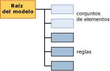

# Contenido del modelo de minería de datos para los modelos de asociación (Analysis Services - Minería de datos)
  En este tema se describe el contenido del modelo de minería de datos específico de los modelos que utilizan el algoritmo Reglas de asociación de [!INCLUDE[msCoName](../../includes/msconame-md.md)] . Para obtener una explicación de terminología general y de estadística relacionada con el contenido del modelo de minería de datos válida para todos los tipos de modelo, vea [Contenido del modelo de minería de datos &#40;Analysis Services - Minería de datos&#41;](../../analysis-services/data-mining/mining-model-content-analysis-services-data-mining.md).  
  
## Descripción de la estructura de un modelo de asociación  
 Un modelo de asociación tiene una estructura simple. Cada modelo tiene un único nodo primario que representa el modelo y sus metadatos, y cada nodo primario tiene una lista plana de conjuntos de elementos y reglas. Estos conjuntos de elementos y reglas no se organizan como árboles, sino que se ordenan con los conjuntos de elementos en primer lugar y las reglas en segundo, como se muestra en el siguiente diagrama.  
  
   
  
 Cada conjunto de elementos está incluido en su propio nodo (NODE_TYPE = 7). El *nodo* incluye la definición del conjunto de elementos, el número de casos que contienen dicho conjunto y otro tipo de información.  
  
 Cada regla también está incluida en su propio nodo (NODE_TYPE = 8). Una *regla* describe un patrón general para la asociación de los elementos. Una regla es similar a una instrucción IF-THEN. El lado izquierdo de la regla muestra una condición o conjunto de condiciones existentes. El lado derecho de la regla muestra el elemento del conjunto de datos que está normalmente asociado a las condiciones del lado izquierdo.  
  
 **Nota** : si desea extraer las reglas o los conjuntos de datos, puede usar una consulta que devuelva únicamente los tipos de nodos deseados. Para más información, vea [Ejemplos de consultas del modelo de asociación](../../analysis-services/data-mining/association-model-query-examples.md).  
  
## Contenido del modelo para un modelo de asociación  
 Esta sección solo proporciona detalles y ejemplos para las columnas del contenido del modelo de minería de datos que son relevantes para los modelos de asociación.  
  
 Para obtener información sobre las columnas de uso general en el conjunto de filas de esquema, como MODEL_CATALOG y MODEL_NAME, vea [Contenido del modelo de minería de datos &#40;Analysis Services - Minería de datos&#41;](../../analysis-services/data-mining/mining-model-content-analysis-services-data-mining.md).  
  
 MODEL_CATALOG  
 Nombre de la base de datos en la que se almacena el modelo.  
  
 MODEL_NAME  
 Nombre del modelo.  
  
 ATTRIBUTE_NAME  
 Nombres de los atributos que corresponden a este nodo.  
  
 NODE_NAME  
 Nombre del nodo. Para un modelo de asociación, esta columna contendrá el mismo valor que NODE_UNIQUE_NAME.  
  
 NODE_UNIQUE_NAME  
 Nombre único del nodo.  
  
 NODE_TYPE  
 Un modelo de asociación genera únicamente los tipos de nodos siguientes:  
  
|Identificador del tipo de nodo|Tipo|  
|------------------|----------|  
|1 (Modelo)|Raíz o nodo primario.|  
|7 (Conjunto de elementos)|Conjunto de elementos o colección de pares de atributo-valor. Ejemplos:   `Product 1 = Existing, Product 2 = Existing`   o bien   `Gender = Male`.|  
|8 (Regla)|Regla que define cómo se relacionan entre sí los elementos.   Ejemplo:   `Product 1 = Existing, Product 2 = Existing -> Product 3 = Existing`.|  
  
 NODE_CAPTION  
 Etiqueta o título asociado al nodo.  
  
 **Nodo de conjunto de elementos** Una lista de elementos separados por comas.  
  
 **Nodo de regla** Contiene los lados derecho e izquierdo de la regla.  
  
 CHILDREN_CARDINALITY  
 Indica el número de elementos secundarios del nodo actual.  
  
 **Nodo primario** : indica el número total de conjuntos de elementos más las reglas.  
  
> [!NOTE]  
>  Para obtener un análisis del recuento de conjuntos de elementos y reglas, vea la columna NODE_DESCRIPTION para el nodo raíz del modelo.  
  
 **Nodo de conjunto de elementos o de regla** : siempre 0.  
  
 PARENT_UNIQUE_NAME  
 Nombre único del nodo primario del nodo.  
  
 **Nodo primario** : siempre NULL.  
  
 **Nodo de conjunto de elementos o de regla** : siempre 0.  
  
 NODE_DESCRIPTION  
 Descripción breve y fácil de comprender del contenido del nodo.  
  
 **Nodo primario** Incluye una lista separada por comas con la siguiente información sobre el modelo:  
  
|Elemento|Description|  
|----------|-----------------|  
|ITEMSET_COUNT|Recuento de todos los conjuntos de elementos del modelo.|  
|RULE_COUNT|Recuento de todas las reglas del modelo.|  
|MIN_SUPPORT|Soporte mínimo para cualquier conjunto de elementos único.   **Nota** Este valor puede ser diferente del valor establecido para el parámetro *MINIMUM _SUPPORT* .|  
|MAX_SUPPORT|Soporte máximo para cualquier conjunto de elementos único.   **Nota** Este valor puede ser diferente del valor establecido para el parámetro *MAXIMUM_SUPPORT* .|  
|MIN_ITEMSET_SIZE|Tamaño del conjunto de elementos más pequeño, representado como recuento de elementos.   Un valor de 0 indica que el estado **Missing** se trató como un elemento independiente.   **Nota** El valor predeterminado del parámetro *MINIMUM_ITEMSET_SIZE* es 1.|  
|MAX_ITEMSET_SIZE|Indica el tamaño del conjunto de elementos más grande que se encontró.   **Nota** Este valor está restringido por el valor establecido para el parámetro *MAX_ITEMSET_SIZE* al crear el modelo. Este tamaño nunca puede superar dicho valor; sin embargo, puede ser menor. El valor predeterminado es 3.|  
|MIN_PROBABILITY|Probabilidad mínima detectada para cualquier conjunto de elementos o regla únicos del modelo.   Ejemplo: 0,400390625   **Nota** En los conjuntos de elementos, este valor es siempre mayor que el establecido para el parámetro *MINIMUM_PROBABILITY* al crear el modelo.|  
|MAX_PROBABILITY|Probabilidad máxima detectada para cualquier conjunto de elementos o regla únicos del modelo.   Ejemplo: 1   **Nota** : no hay ningún parámetro para restringir la probabilidad máxima de los conjuntos de elementos. Si quiere eliminar los elementos que son demasiado frecuentes, use el parámetro *MAXIMUM_SUPPORT* en su lugar.|  
|MIN_LIFT|Cantidad mínima de elevación proporcionada por el modelo para cualquier conjunto de elementos.   Ejemplo: 0,14309369632511   Nota: Conocer la elevación mínima puede ayudar a determinar si la elevación para cualquier conjunto de elementos es importante.|  
|MAX_LIFT|Cantidad máxima de elevación proporcionada por el modelo para cualquier conjunto de elementos.   Ejemplo: 1,95758227647523 **Nota** : conocer la elevación máxima puede ayudar a determinar si la elevación para cualquier conjunto de elementos es importante.|  
  
 **Nodo de conjunto de elementos** Los nodos de conjunto de elementos contienen una lista de los elementos, mostrados como una cadena de texto separada por comas.  
  
 Ejemplo:  
  
 `Touring Tire = Existing, Water Bottle = Existing`  
  
 Esto significa que las cubiertas Touring y las botellas de agua se adquirieron juntas.  
  
 **Nodo de regla** Los nodos de regla contienen el lado izquierdo y el derecho de la regla, separados por una flecha.  
  
 Ejemplo: `Touring Tire = Existing, Water Bottle = Existing -> Cycling cap = Existing`  
  
 Esto significa que si alguien compró una cubierta Touring y una botella de agua, es probable que también comprase una gorra de ciclismo (cycling cup).  
  
 NODE_RULE  
 Fragmento de XML que describe la regla o el conjunto de elementos que está incrustado en el nodo.  
  
 **Nodo primario** : en blanco.  
  
 **Nodo de conjunto de elementos** : en blanco.  
  
 **Nodo de regla** El fragmento XML incluye información útil adicional sobre la regla, como el soporte, la confianza y el número de elementos, así como el identificador del nodo que representa el lado izquierdo de la regla.  
  
 MARGINAL_RULE  
 : en blanco.  
  
 NODE_PROBABILITY  
 Puntuación de confianza o probabilidad asociada al conjunto de elementos o a la regla.  
  
 **Nodo primario** : siempre 0.  
  
 **Nodo de conjunto de elementos** : probabilidad del conjunto de elementos.  
  
 **Nodo de regla** : valor de confianza para la regla.  
  
 MARGINAL_PROBABILITY  
 Igual que NODE_PROBABILITY.  
  
 NODE_DISTRIBUTION  
 Esta tabla contiene información muy diferente, dependiendo de si el nodo es un conjunto de elementos o una regla.  
  
 **Nodo primario** : en blanco.  
  
 **Nodo de conjunto de elementos** : muestra el nombre de cada elemento del conjunto de elementos, junto con un valor de soporte y probabilidad. Por ejemplo, si el conjunto de elementos contiene dos productos, se muestra el nombre de cada uno junto con el recuento de casos que incluyen cada producto.  
  
 **Nodo de regla** : contiene dos filas. La primera fila muestra el atributo del lado derecho de la regla, que es el elemento predicho, junto con una puntuación de confianza.  
  
 La segunda fila es única para los modelos de asociación; contiene un puntero al conjunto de elementos del lado derecho de la regla. El puntero se representa en la columna ATTRIBUTE_VALUE como identificador del conjunto de elementos que contiene únicamente el elemento del lado derecho.  
  
 Por ejemplo, si la regla es `If {A,B} Then {C}`, la tabla contiene el nombre del elemento `{C}`y el identificador del nodo que contiene el conjunto de elementos para el elemento C.  
  
 Este puntero es útil porque permite determinar a partir del nodo de conjunto de elementos cuántos casos en total incluyen el producto del lado derecho. Los casos que están sujetos a la regla `If {A,B} Then {C}` son un subconjunto de los casos incluidos en el conjunto de elementos para `{C}`.  
  
 NODE_SUPPORT  
 Número de casos que admiten este nodo.  
  
 **Nodo primario** : número de casos del modelo.  
  
 **Nodo de conjunto de elementos** : número de casos que contienen todos los elementos del conjunto de elementos.  
  
 **Nodo de regla** : número de casos que contienen todos los elementos incluidos en la regla.  
  
 MSOLAP_MODEL_COLUMN  
 Contiene información diferente dependiendo de si el nodo es un conjunto de elementos o una regla.  
  
 **Nodo primario** : en blanco.  
  
 **Nodo de conjunto de elementos** : en blanco.  
  
 **Nodo de regla** El identificador del conjunto de elementos que contiene los elementos del lado izquierdo de la regla. Por ejemplo, si la regla es `If {A,B} Then {C}`, esta columna incluye el identificador del conjunto de elementos que contiene únicamente `{A,B}`.  
  
 MSOLAP_NODE_SCORE  
 **Nodo primario** : en blanco.  
  
 **Nodo de conjunto de elementos** : puntuación de importancia para el conjunto de elementos.  
  
 **Nodo de regla** : puntuación de importancia para la regla.  
  
> [!NOTE]  
>  La importancia se calcula de forma diferente para los conjuntos de elementos y para las reglas. Para más información, vea [Referencia técnica del algoritmo de asociación de Microsoft](../../analysis-services/data-mining/microsoft-association-algorithm-technical-reference.md).  
  
 MSOLAP_NODE_SHORT_CAPTION  
 : en blanco.  
  
## Vea también  
 [Contenido del modelo de minería de datos &#40;Analysis Services - Minería de datos&#41;](../../analysis-services/data-mining/mining-model-content-analysis-services-data-mining.md)   
 [Algoritmo de asociación de Microsoft](../../analysis-services/data-mining/microsoft-association-algorithm.md)   
 [Ejemplos de consultas del modelo de asociación](../../analysis-services/data-mining/association-model-query-examples.md)  
  
  

