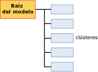

# Contenido del modelo de minería de datos para los modelos de agrupación en clústeres (Analysis Services - Minería de datos)
  En este tema se describe el contenido del modelo de minería de datos específico de los modelos que utilizan el algoritmo de clústeres de Microsoft. Para obtener una explicación general sobre el contenido del modelo de minería de datos para todos los tipos de modelo, vea [Contenido del modelo de minería de datos &#40;Analysis Services - Minería de datos&#41;](../../analysis-services/data-mining/mining-model-content-analysis-services-data-mining.md).  
  
## Descripción de la estructura de un modelo de agrupación en clústeres  
 Un modelo de agrupación en clústeres tiene una estructura simple. Cada modelo tiene un único nodo primario que representa el modelo y sus metadatos, y cada nodo primario tiene una lista plana de clústeres (NODE_TYPE = 5). Esta organización se muestra en la imagen siguiente.  
  
   
  
 Cada nodo secundario representa un único clúster y contiene estadísticas detalladas sobre los atributos de los casos de ese clúster. Esto incluye un recuento del número de casos del clúster y la distribución de los valores que diferencian ese clúster de los demás.  
  
> [!NOTE]  
>  No es necesario realizar iteraciones en los nodos para obtener un recuento o una descripción de los clústeres; el nodo primario del modelo también cuenta y enumera los clústeres.  
  
 El nodo primario contiene estadísticas útiles que describen la distribución real de todos los casos de entrenamiento. Estas estadísticas se encuentran en la columna de la tabla anidada NODE_DISTRIBUTION. Por ejemplo, en la tabla siguiente se muestran varias filas de la tabla NODE_DISTRIBUTION que describen la distribución de los datos demográficos de los clientes para el modelo de agrupación en clústeres, `TM_Clustering`, que se crea en [Tutorial básico de minería de datos](http://msdn.microsoft.com/library/6602edb6-d160-43fb-83c8-9df5dddfeb9c):  
  
|ATTRIBUTE_NAME|ATTRIBUTE_VALUE|Support|PROBABILITY|VARIANCE|VALUE_TYPE|  
|---------------------|---------------------|-------------|-----------------|--------------|-----------------|  
|Age|Missing|0|0|0|1 (ausente)|  
|Age|44.9016152716593|12939|1|125.663453102554|3 (continuo)|  
|Gender|Missing|0|0|0|1 (ausente)|  
|Gender|F|6350|0.490764355823479|0|4 (Discreto)|  
|Gender|M|6589|0.509235644176521|0|4 (Discreto)|  
  
 En estos resultados se puede observar que se utilizaron 12.939 casos para generar el modelo, que la proporción entre hombres y mujeres fue de 50-50, aproximadamente, y que la edad media fue de 44 años. Las estadísticas descriptivas varían dependiendo de si el atributo sobre el que se está informando es un tipo de datos numérico continuo, como la edad, o un tipo de valor discreto, como el género. Las medidas estadísticas *media* y *varianza* se calculan para los tipos de datos continuos, mientras que la *probabilidad* y el *soporte* se calculan para los tipos de datos discretos.  
  
> [!NOTE]  
>  La varianza representa la varianza total para el clúster. Cuando el valor para la varianza es pequeño, indica que la mayoría de los valores de la columna se hallaban bastante cerca de la media. Para obtener la desviación estándar, calcule la raíz cuadrada de la varianza.  
  
 Observe que para cada atributo hay un tipo de valor **Missing** que indica cuántos casos carecían de datos para ese atributo. Los datos ausentes pueden ser relevantes y afectar a los cálculos de varias maneras, dependiendo del tipo de datos. Para más información, vea [Valores ausentes &#40;Analysis Services - Minería de datos&#41;](../../analysis-services/data-mining/missing-values-analysis-services-data-mining.md).  
  
## Contenido del modelo para un modelo de agrupación en clústeres  
 Esta sección solo proporciona detalles y ejemplos para las columnas del contenido del modelo de minería de datos que son relevantes para los modelos de agrupación en clústeres.  
  
 Para obtener información sobre las columnas de uso general en el conjunto de filas de esquema, como MODEL_CATALOG y MODEL_NAME, vea [Contenido del modelo de minería de datos &#40;Analysis Services - Minería de datos&#41;](../../analysis-services/data-mining/mining-model-content-analysis-services-data-mining.md).  
  
 MODEL_CATALOG  
 Nombre de la base de datos en la que se almacena el modelo.  
  
 MODEL_NAME  
 Nombre del modelo.  
  
 ATTRIBUTE_NAME  
 Siempre en blanco en los modelos de agrupación en clústeres porque no hay ningún atributo de predicción en el modo.  
  
 NODE_NAME  
 Siempre lo mismo que NODE_UNIQUE_NAME.  
  
 NODE_UNIQUE_NAME  
 Identificador único para el nodo dentro del modelo. Este valor no puede modificarse.  
  
 NODE_TYPE  
 Un modelo de agrupación en clústeres genera los tipos de nodos siguientes:  
  
|Identificador de nodo y Nombre|Description|  
|----------------------|-----------------|  
|1 (Modelo)|Nodo raíz para el modelo.|  
|5 (clúster)|Contiene un recuento de los casos del clúster, las características de los casos del clúster y las estadísticas que describen los valores del clúster.|  
  
 NODE_CAPTION  
 Nombre descriptivo que se utiliza para la visualización. Cuando se crea un modelo, el valor de NODE_UNIQUE_NAME se utiliza automáticamente como título. Sin embargo, se puede cambiar el valor de NODE_CAPTION y actualizar el nombre para mostrar del clúster, ya sea mediante programación o utilizando el visor.  
  
> [!NOTE]  
>  Al volver a procesar el modelo, todos los cambios llevados a cabo en el nombre se sobrescribirán con los nuevos valores. No se pueden conservar los nombres en el modelo ni realizar un seguimiento de los cambios efectuados en los miembros del clúster entre versiones diferentes de un modelo.  
  
 CHILDREN_CARDINALITY  
 Cálculo del número de elementos secundarios que tiene el nodo.  
  
 **Nodo primario** : indica el número de clústeres existentes en el modelo.  
  
 **Nodos de clúster** : siempre 0.  
  
 PARENT_UNIQUE_NAME  
 Nombre único del nodo primario del nodo.  
  
 **Nodo primario** : siempre NULL.  
  
 **Nodos de clúster** : normalmente 000.  
  
 NODE_DESCRIPTION  
 Descripción del nodo.  
  
 **Nodo primario** Siempre **(Todos)**.  
  
 **Nodos de clúster** Lista separada por comas de los atributos primarios que diferencian el clúster de los otros clústeres.  
  
 NODE_RULE  
 No se utiliza para los modelos de agrupación en clústeres.  
  
 MARGINAL_RULE  
 No se utiliza para los modelos de agrupación en clústeres.  
  
 NODE_PROBABILITY  
 Probabilidad asociada a este nodo. **Nodo primario** : siempre es 1.  
  
 **Nodos de clúster** : la probabilidad representa la probabilidad compuesta de los atributos, con algunos ajustes que dependen del algoritmo utilizado para crear el modelo de agrupación en clústeres.  
  
 MARGINAL_PROBABILITY  
 Probabilidad de alcanzar el nodo desde el nodo primario. En un modelo de agrupación en clústeres, la probabilidad marginal es siempre la misma que la probabilidad del nodo.  
  
 NODE_DISTRIBUTION  
 Tabla que contiene el histograma de probabilidad del nodo.  
  
 **Nodo primario** : vea la introducción a este tema.  
  
 **Nodos de clúster** : representa la distribución de atributos y valores para los casos incluidos en este clúster.  
  
 NODE_SUPPORT  
 Número de casos que admiten este nodo. **Nodo primario** : indica el número de casos de entrenamiento para el modelo completo.  
  
 **Nodos de clúster** : indica el tamaño del clúster como número de casos.  
  
 **Nota** Si el modelo usa la agrupación en clústeres de mediana-K, cada caso puede pertenecer a un único clúster. Sin embargo, si el modelo utiliza la agrupación en clústeres EM, cada caso puede pertenecer a un clúster diferente y a cada caso se le asigna una distancia ponderada para cada clúster al que pertenece. Por consiguiente, para los modelos de EM, la suma del soporte para un clúster individual es mayor que el soporte para todo el modelo.  
  
 MSOLAP_MODEL_COLUMN  
 No se utiliza para los modelos de agrupación en clústeres.  
  
 MSOLAP_NODE_SCORE  
 Muestra una puntuación asociada al nodo.  
  
 **Nodo primario** La puntuación Bayesian Information Criterion (BIC) para el modelo de agrupación en clústeres.  
  
 **Nodos de clúster** : siempre 0.  
  
 MSOLAP_NODE_SHORT_CAPTION  
 Etiqueta que se utiliza para la visualización. Este título no se puede cambiar.  
  
 **Nodo primario** : el tipo de modelo, modelo de clústeres.  
  
 **Nodos de clúster** : el nombre del clúster. Por ejemplo, Clúster 1.  
  
## Comentarios  
 [!INCLUDE[ssASnoversion](../../includes/ssasnoversion-md.md)] proporciona varios métodos para crear un modelo de agrupación en clústeres. Si desconoce el método utilizado para crear el modelo con el que está trabajando, puede recuperar los metadatos del modelo mediante programación, utilizando un cliente ADOMD o AMO, o consultando el conjunto de filas de esquema de minería de datos. Para más información, vea [Consultar los parámetros usados para crear un modelo de minería de datos](../../analysis-services/data-mining/query-the-parameters-used-to-create-a-mining-model.md).  
  
> [!NOTE]  
>  La estructura y el contenido del modelo permanecen invariables, independientemente del método de agrupación en clústeres o de los parámetros utilizados.  
  
## Vea también  
 [Contenido del modelo de minería de datos &#40;Analysis Services - Minería de datos&#41;](../../analysis-services/data-mining/mining-model-content-analysis-services-data-mining.md)   
 [Visores de modelos de minería de datos](../../analysis-services/data-mining/data-mining-model-viewers.md)   
 [Algoritmo de clústeres de Microsoft](../../analysis-services/data-mining/microsoft-clustering-algorithm.md)   
 [Consultas de minería de datos](../../analysis-services/data-mining/data-mining-queries.md)  
  
  
