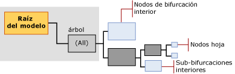

# Contenido del modelo de minería de datos para los modelos de árboles de decisión (Analysis Services - Minería de datos)
  En este tema se describe el contenido del modelo de minería de datos específico de los modelos que utilizan el algoritmo de árboles de decisión de [!INCLUDE[msCoName](../../includes/msconame-md.md)] . Para obtener una explicación general sobre el contenido del modelo de minería de datos para todos los tipos de modelo, vea [Contenido del modelo de minería de datos &#40;Analysis Services - Minería de datos&#41;](../../analysis-services/data-mining/mining-model-content-analysis-services-data-mining.md). Es importante recordar que el algoritmo de árboles de decisión de Microsoft es un algoritmo híbrido que puede crear modelos con funciones muy diferentes: un árbol de decisión puede representar asociaciones, reglas o incluso una regresión lineal. La estructura del árbol es básicamente la misma, pero la forma en la que se interpretará la información dependerá del propósito para el que creó el modelo.  
  
##   Descripción de la estructura de un modelo de árboles de decisión  
 Un modelo de árboles de decisión tiene un nodo primario único que representa el modelo y sus metadatos. Debajo del nodo primario aparecen árboles independientes que representan los atributos de predicción que se seleccionan. Por ejemplo, si configura su modelo de árboles de decisión para predecir si los clientes comprarán algo y, a continuación, proporciona entradas para el género y los ingresos, el modelo creará un árbol único para el atributo de compra, con muchas bifurcaciones que se dividen en función de condiciones relacionadas con el género y los ingresos.  
  
 Sin embargo, si después agrega un atributo de predicción independiente para la participación en un programa de premios para los clientes, el algoritmo creará dos árboles independientes bajo el nodo primario. Un árbol contendrá el análisis para las compras, y el otro el análisis correspondiente al programa de premios para los clientes.  Si usa el algoritmo de árboles de decisión para crear un modelo de asociación, el algoritmo crea un árbol independiente para cada producto que se predice, y dicho árbol contiene las demás combinaciones de productos que contribuyen a la selección del atributo de destino.  
  
> [!NOTE]  
>  Si el modelo incluye varios árboles, solo podrá ver un árbol cada vez en el **Visor de árboles de Microsoft**. Sin embargo, en el **Visor de árbol de contenido genérico** se muestran de forma simultánea todos los árboles del mismo modelo.  
  
   
  
 El árbol para cada atributo de predicción contiene información que describe cómo afectan las columnas de entrada elegidas al resultado de ese atributo de predicción concreto. Cada árbol está encabezado por un nodo (NODE_TYPE = 9) que contiene el atributo de predicción, seguido de una serie de nodos (NODE_TYPE = 10) que representan los atributos de entrada. Un atributo corresponde a una columna de nivel de caso o a valores de columnas de tabla anidada, que generalmente son los valores que aparecen en la columna **Key** de la tabla anidada.  
  
 Los nodos interiores y los nodos hoja representan las condiciones de división. Un árbol se puede dividir varias veces por el mismo atributo. Por ejemplo, el modelo **TM_DecisionTree** se puede dividir por [Yearly Income] y [Number of Children] y, después, dividirse de nuevo por [Yearly Income] más abajo en el árbol.  
  
 El algoritmo de árboles de decisión de Microsoft también puede contener regresiones lineales en todo el árbol o en parte de éste. Si el atributo que está modelando es un tipo de datos numéricos continuo, el modelo puede crear un nodo de árbol de regresión (NODE_TYPE = 25) en el que la relación entre los atributos se puede modelar linealmente. En este caso, el nodo contiene una fórmula de regresión.  
  
 Sin embargo, si el atributo de predicción tiene valores discretos, o si se ha realizado el depósito de los valores numéricos o se han discretizado, el modelo siempre crea un árbol de clasificación (NODE_TYPE = 2). Un árbol de clasificación puede tener varias bifurcaciones o nodos de árbol interiores (NODE_TYPE = 3) para cada valor del atributo. Sin embargo, la división no se realiza necesariamente en cada valor del atributo.  
  
 El algoritmo de árboles de decisión de Microsoft no admite tipos de datos continuos como entradas; por lo tanto, si alguna columna tiene un tipo de datos numérico continuo, los valores se discretizan. El algoritmo realiza su propia discretización en el punto de una división para todos los atributos continuos.  
  
> [!NOTE]  
>  [!INCLUDE[ssASnoversion](../../includes/ssasnoversion-md.md)]elige automáticamente un método de creación de depósitos de los atributos continuos. Sin embargo, puede controlar los valores de forma continuos de las entradas se discretizan estableciendo el tipo de contenido de la columna de estructura de minería de datos para **Discretized** y, a continuación, establecer el <xref:Microsoft.AnalysisServices.ScalarMiningStructureColumn.DiscretizationBucketCount%2A> o <xref:Microsoft.AnalysisServices.ScalarMiningStructureColumn.DiscretizationMethod%2A> propiedad.  
  
 [Superior](#bkmk_Top)  
  
##   Contenido del modelo para un modelo de árboles de decisión  
 En esta sección solo se proporcionan detalles y ejemplos de las columnas del contenido del modelo de minería de datos que tienen una relevancia especial para los modelos de árboles de decisión. Para obtener información sobre las columnas de uso general en el conjunto de filas de esquema y para obtener una explicación de la terminología del modelo de minería de datos, vea [Contenido del modelo de minería de datos &#40;Analysis Services - Minería de datos&#41;](../../analysis-services/data-mining/mining-model-content-analysis-services-data-mining.md).  
  
 MODEL_CATALOG  
 Nombre de la base de datos en la que se almacena el modelo.  
  
 MODEL_NAME  
 Nombre del modelo.  
  
 ATTRIBUTE_NAME  
 Nombre del atributo que corresponde a este nodo.  
  
 NODE_NAME  
 Siempre lo mismo que NODE_UNIQUE_NAME.  
  
 NODE_UNIQUE_NAME  
 Identificador único para el nodo dentro del modelo. Este valor no puede modificarse.  
  
 En los modelos de árboles de decisión, los nombres únicos siguen la convención indicada a continuación, que no se aplica a todos los algoritmos:  
  
 todos los nodos secundarios de cualquier nodo determinado tendrán el mismo prefijo hexadecimal, seguido por otro número hexadecimal que representa la secuencia del nodo secundario dentro del nodo primario. Puede usar los prefijos para deducir una ruta de acceso.  
  
 NODE_TYPE  
 En los modelos de árboles de decisión, se crean los tipos de nodos siguientes:  
  
|Tipo de nodo|Description|  
|---------------|-----------------|  
|1 (Modelo)|Nodo raíz para el modelo.|  
|2 (árbol)|Nodo primario para los árboles de clasificación del modelo. Se etiqueta como **"Todos"**.|  
|3 (interior)|Encabezado de la bifurcación interior, que se encuentra dentro de un árbol de clasificación o de regresión.|  
|4 (distribución)|Nodo hoja, que se encuentra dentro de un árbol de clasificación o de regresión.|  
|25 (árbol de regresión)|Nodo primario para el árbol de regresión dentro del modelo. Se etiqueta como **"Todos"**.|  
  
 NODE_CAPTION  
 Nombre descriptivo que se utiliza para la visualización.  
  
 Cuando se crea un modelo, el valor de NODE_UNIQUE_NAME se utiliza automáticamente como título. Sin embargo, se puede cambiar el valor de NODE_CAPTION y actualizar el nombre para mostrar del clúster, ya sea mediante programación o utilizando el visor. El modelo genera automáticamente el título. El contenido del título depende del tipo de modelo y el tipo de nodo.  
  
 En un modelo de árboles de decisión, NODE_CAPTION y NODE_DESCRIPTION tienen información diferente, dependiendo del nivel del árbol. Para obtener más información y ejemplos, vea [Título y descripción del nodo](#NodeCaption).  
  
 CHILDREN_CARDINALITY  
 Cálculo del número de elementos secundarios que tiene el nodo.  
  
 **Nodo primario** : indica el número de atributos de predicción que se modelaron. Se crea un árbol para cada atributo de predicción.  
  
 **Nodo de árbol** : el nodo **Todos** para cada árbol indica cuántos valores se usaron para el atributo de destino.  
  
-   Si el atributo de destino es discreto, el valor es igual al número de valores distintos más 1 para el estado **Missing** .  
  
-   Si el atributo de predicción es continuo, el valor indica cuántos cubos se usaron para modelar el atributo continuo.  
  
 **Nodos hoja** : siempre 0.  
  
 PARENT_UNIQUE_NAME  
 Nombre único del nodo primario del nodo. Se devuelve NULL para todos los nodos del nivel raíz.  
  
 NODE_DESCRIPTION  
 Descripción del nodo.  
  
 En un modelo de árboles de decisión, NODE_CAPTION y NODE_DESCRIPTION tienen información diferente, dependiendo del nivel del árbol.  
  
 Para obtener más información y ejemplos, vea [Título y descripción del nodo](#NodeCaption).  
  
 NODE_RULE  
 Descripción XML de la regla que describe la ruta de acceso al nodo actual desde su nodo primario inmediato.  
  
 Para obtener más información y ejemplos, vea [Regla de nodo y regla marginal](#NodeRule).  
  
 MARGINAL_RULE  
 Una descripción XML de la regla que describe la ruta de acceso desde el nodo primario del modelo al nodo actual.  
  
 Para obtener más información, vea [Regla de nodo y regla marginal](#NodeRule).  
  
 NODE_PROBABILITY  
 Probabilidad asociada a este nodo.  
  
 Para obtener más información, vea [Probabilidad](#bkmk_NodeDist_Discrete).  
  
 MARGINAL_PROBABILITY  
 Probabilidad de alcanzar el nodo desde el nodo primario.  
  
 Para obtener más información, vea [Probabilidad](#bkmk_NodeDist_Discrete).  
  
 NODE_DISTRIBUTION  
 Tabla que contiene el histograma de probabilidad del nodo. La información de esta tabla varía dependiendo de si el atributo de predicción es una variable continua o discreta.  
  
 **Nodo raíz del modelo** : esta tabla está vacía.  
  
 **Nodo (Todos)** : contiene un resumen del modelo en su conjunto.  
  
 **Nodo interior** : contiene estadísticas acumuladas para sus nodos hoja.  
  
 **Nodo hoja** : contiene soporte y probabilidad para los resultados predichos dadas todas las condiciones en la ruta de acceso que lleva al nodo hoja actual.  
  
 **Nodo de regresión** : contiene la fórmula de regresión que representa la relación entre las entradas y el atributo de predicción.  
  
 Para obtener más información, vea [Distribución de nodos para los atributos discretos](#bkmk_NodeDist_Discrete) y [Distribución de nodos para los atributos continuos](#bkmk_RegressionNodes).  
  
 NODE_SUPPORT  
 Número de casos que admiten este nodo.  
  
 MSOLAP_MODEL_COLUMN  
 Indica la columna que contiene el atributo de predicción.  
  
 MSOLAP_NODE_SCORE  
 Muestra una puntuación asociada al nodo. Para obtener más información, vea [Puntuación del nodo](#NodeScore).  
  
 MSOLAP_NODE_SHORT_CAPTION  
 Etiqueta que se utiliza para la visualización.  
  
## Comentarios  
 Un modelo de árboles de decisión no dispone de un nodo independiente que almacena estadísticas para todo el modelo, a diferencia del nodo de estadísticas marginales que se puede encontrar en un modelo Bayes naive o en un modelo de red neuronal. En su lugar, el modelo crea un árbol independiente para cada atributo de predicción, con un nodo (Todos) en la parte superior de dicho árbol. Cada uno de los árboles es independiente de los demás. Si su modelo solo contiene un atributo de predicción, solo hay un árbol y, por lo tanto, solo un nodo (Todos).  
  
 Cada árbol que representa un atributo de salida se subdivide además en bifurcaciones interiores (NODE_TYPE = 3) que representan divisiones. Cada uno de estos árboles contiene estadísticas sobre la distribución del atributo de destino. Además, cada nodo hoja (NODE_TYPE = 4) contiene estadísticas que describen los atributos de entrada y sus valores, junto con el número de casos de soporte de cada par atributo-valor. Por lo tanto, puede ver fácilmente las probabilidades o la distribución de los datos en cualquier bifurcación de un árbol de decisión sin necesidad de consultar los datos de origen. Cada nivel del árbol representa necesariamente la suma de sus nodos secundarios inmediatos.  
  
 Para obtener ejemplos de cómo recuperar estas estadísticas, vea [Ejemplos de consultas de modelos de árboles de decisión](../../analysis-services/data-mining/decision-trees-model-query-examples.md).  
  
 [Superior](#bkmk_Top)  
  
## Ejemplo de estructura de árbol de decisión  
 Para entender el funcionamiento de un árbol de decisión, considere un ejemplo, como el escenario del comprador de bicicletas de AdventureWorks. Suponiendo que el atributo de predicción lo constituyen las compras de los clientes, el algoritmo de árboles de decisión intenta encontrar una columna de datos, entre todas las entradas proporcionadas, que detecte de forma eficaz qué clientes es probable que adquieran una bicicleta y qué clientes es probable que no lo hagan. Por ejemplo, el modelo podría descubrir que la edad es el mejor indicador de los hábitos de compra. En concreto, que es muy probable que los clientes con más de 30 años compren una bicicleta, y que es improbable que el resto de los clientes lo hagan. En este escenario, el modelo crea una *división* en el atributo Age. Eso significa que el árbol se divide en dos bifurcaciones, una que contiene los clientes con más de 30 años, y otra con los clientes que tienen menos de 30 años. Las nuevas bifurcaciones se representan en la estructura del modelo como dos nuevos árboles interiores (NODE_TYPE = 3).  
  
 Para cada bifurcación, el modelo continúa buscando atributos adicionales para usarlos en la diferenciación de los clientes. Si no hay evidencia suficiente en los datos para seguir creando subgrupos de clientes, el modelo deja de generar el árbol. El modelo también dejará de generar el árbol siempre que el número de casos del nodo sea demasiado pequeño para continuar, sin tener en cuenta la calidad de la división, ni si el valor es nulo o está ausente. De este modo, se evitará que el modelo realice un entrenamiento demasiado ajustado a un conjunto determinado de datos.  
  
 Cada nodo de árbol interior contiene nodos hoja que proporcionan un análisis de los resultados dados los resultados de clasificación actuales. Por ejemplo, podría tener un nodo interior que represente Age >= 30 y Gender = Male. El nodo para este grupo le muestra cuántos clientes de esta categoría han comprado o no han comprado algo. Por ejemplo, la clasificación podría contener las divisiones del árbol siguientes:  
  
|Árbol interior|división|  
|-------------------|-----------|  
|Age >= 30|Age >= 30 y Gender = Male|  
||Age >= 30 y Gender = Female|  
|Age < 30|Age < 30 y Gender = Male|  
||Age < 30 y Gender = Female|  
  
 Cuando se usa un modelo de árboles de decisión para la predicción, el modelo toma los atributos proporcionados como argumentos y sigue la ruta de acceso de los atributos hacia abajo por el árbol. En general, todas las predicciones van a una hoja y los nodos interiores solo se usan para la clasificación.  
  
 Un nodo hoja siempre tiene un valor NODE_TYPE de 4 (distribución) y contiene un histograma que indica la probabilidad de cada resultado (compra o no compra) dados los atributos proporcionados. Por ejemplo, si solicita una predicción para un nuevo cliente que es un varón de más de 60 años, el modelo buscará el nodo correspondiente (Age > 30 y Gender = Male) y, a continuación, devolverá la probabilidad del resultado especificado. Estas probabilidades se almacenan en la tabla [NODE_DISTRIBUTION](#bkmk_NodeDist_Discrete) del nodo.  
  
 Si el atributo de predicción es un número continuo, el algoritmo intenta crear una fórmula de regresión que modele la relación entre dicho atributo y las entradas.  
  
 [Superior](#bkmk_Top)  
  
###   Título y descripción del nodo  
 En un modelo de árboles de decisión, el título y la descripción del nodo contienen información similar. Sin embargo, la descripción del nodo es más completa y contiene más información a medida que nos acercamos a los nodos hoja. Tanto el título como la descripción del nodo son cadenas traducidas.  
  
|||  
|-|-|  
|**NODE_CAPTION**|Muestra el atributo que distingue ese nodo concreto respecto al nodo primario. El título del nodo define un subsegmento del rellenado en función de la condición de división. Por ejemplo, si la división se realizó por [Age] y fue una división en tres partes, los títulos de nodo para los tres nodos secundarios podrían ser "[Age] < 40", "40 <= [Age] < 50", "[Age] >= 50".|  
|**NODE_DESCRIPTION**|Contiene una lista completa de los atributos que distinguen ese nodo de otros nodos, empezando por el nodo primario del modelo. Por ejemplo, Nombre de producto = Manzana y Color = Rojo.|  
  
 [Superior](#bkmk_Top)  
  
###   Regla de nodo y regla marginal  
 Las columnas NODE_RULE y MARGINAL_RULE contienen la misma información que las columnas NODE_CAPTION y NODE_DESCRIPTION, pero la representan como fragmentos XML. La regla de nodo es una versión XML de la ruta de acceso completa, mientras que la regla marginal indica la división más reciente.  
  
 El atributo representado por el fragmento XML puede ser simple o complejo. Un atributo simple contiene el nombre de la columna del modelo y el valor del atributo. Si la columna del modelo contiene una tabla anidada, el atributo de tabla anidada se representa como una concatenación del nombre de tabla, el valor de clave y el atributo.  
  
> [!NOTE]  
>  [!INCLUDE[ssNoVersion](../../includes/ssnoversion-md.md)][!INCLUDE[ssASnoversion](../../includes/ssasnoversion-md.md)] es compatible con la versión 2.0 del estándar PMML, con extensiones para admitir el uso de la tabla anidada. Si los datos contienen tablas anidadas y genera una versión PMML del modelo, todos los elementos del modelo que incluyen los predicados se marcan como una extensión.  
  
 [Superior](#bkmk_Top)  
  
###   Distribución de nodos para los atributos discretos  
 En un modelo de árboles de decisión, la tabla NODE_DISTRIBUTION contiene estadísticas útiles. Sin embargo, el tipo de estadísticas depende de si el árbol predice un atributo discreto o un atributo continuo. En esta sección se describe el significado de las estadísticas de distribución de nodos para los atributos discretos.  
  
#### Nombre y valor del atributo  
 En un árbol de clasificación, el nombre del atributo contiene siempre el nombre de la columna de predicción. Este valor le indica lo que predice el árbol. Dado que un único árbol siempre representa un único atributo de predicción, este valor se repite a lo largo del árbol.  
  
 En el caso de un tipo de datos discreto, el campo de valor de atributo incluye los valores posibles de la columna de predicción, más el valor **Missing** .  
  
#### Soporte técnico  
 El valor de soporte para cada nodo le indica cuántos casos incluye este nodo. En el nivel (Todos), debería ver el recuento completo de casos que se usaron para entrenar el modelo. Para cada división del árbol, el valor de soporte es el recuento de casos que se agruparon en ese nodo del árbol. La suma de casos en los nodos hoja es necesariamente igual al recuento de casos en el nodo primario del árbol.  
  
 Para los nodos que representan atributos continuos, la presencia de valores NULL en los datos podría conducir a resultados poco intuitivos. Por ejemplo, si hay m casos, un valor medio se calcularía como suma(todos los casos)/n, donde n es un número menor que m y m-n indica el recuento de casos con valores ausentes. El soporte también se representa como n.  
  
#### Probabilidad  
 La probabilidad asociada a cada nodo indica la probabilidad de que un caso del conjunto de datos completo termine en este nodo concreto. Las puntuaciones de probabilidad se calculan tanto para el árbol en su conjunto como para la división inmediata.  
  
 Por ejemplo, la tabla siguiente muestra un modelo muy simple, con 100 casos.  
  
|Árbol interior|Casos|Nodo hoja|Casos|Probabilidad relativa al nodo primario|Probabilidad relativa al nodo superior|  
|-------------------|-----------|---------------|-----------|-----------------------------------------|--------------------------------------|  
|Age >= 30|60|Age >= 30 y Gender = Male|50|50/60 = .83|50/100 = .5|  
|||Age >= 30 y Gender = Female|10|10/60 = .16|10/100 = .10|  
|Age < 30|40|Age < 30 y Gender = Male|30|30/40 = .75|30/100 = .30|  
|||Age < 30 y Gender = Female|10|10/40 = .25|10/100 = .10|  
  
 Se realiza un pequeño ajuste en todos los modelos para representar los posibles valores ausentes. Para los atributos continuos, cada valor o intervalo de valores está representado como un estado (por ejemplo, Age \<30, Age = 30 y Age > 30) y las probabilidades se calculan como se indica a continuación: estado existe (valor = 1), existe otro estado (valor = 0), estado es  **Falta**. Para obtener más información sobre cómo se ajustan las probabilidades para representar valores ausentes, vea [Valores ausentes &#40;Analysis Services - Minería de datos&#41;](../../analysis-services/data-mining/missing-values-analysis-services-data-mining.md).  
  
 Las probabilidades para cada nodo se calculan casi directamente a partir de la distribución, de la siguiente manera:  
  
 Probabilidad = (soporte para el estado + soporte para el estado anterior) / (soporte del nodo más el soporte del nodo anterior)  
  
 [!INCLUDE[ssASnoversion](../../includes/ssasnoversion-md.md)] usa probabilidades para cada nodo para comparar la probabilidad almacenada con la probabilidad anterior y determinar si la ruta de acceso desde el nodo primario al nodo secundario indica una inferencia fuerte.  
  
 Al realizar predicciones, la probabilidad de la distribución debe estar equilibrada con la probabilidad del nodo para facilitar las probabilidades. Por ejemplo, si una división en el árbol separa los casos mediante una proporción de 9000/1000, el árbol está muy desequilibrado. Como resultado, una predicción que provenga de la bifurcación pequeña no debería llevar el mismo peso que una que provenga de una bifurcación con muchos casos.  
  
#### Variance  
 La varianza es una medida de la dispersión de los valores de un ejemplo, dada una distribución esperada. Para los valores discretos, la varianza es 0 por definición.  
  
 Para obtener información sobre cómo se calcula la varianza para los valores continuos, vea [Contenido del modelo de minería de datos para los modelos de regresión lineal &#40;Analysis Services - Minería de datos&#41;](../../analysis-services/data-mining/mining-model-content-for-linear-regression-models-analysis-services-data-mining.md).  
  
#### Tipo de valor  
 La columna de tipo de valor proporciona información sobre el significado del valor numérico incluido en las otras columnas de la tabla NODE_DISTRIBUTION. Puede usar el tipo de valor en consultas para recuperar filas concretas de las tablas anidadas. Para obtener ejemplos, vea [Ejemplos de consultas de modelos de árboles de decisión](../../analysis-services/data-mining/decision-trees-model-query-examples.md).  
  
 De los tipos incluidos en la enumeración <xref:Microsoft.AnalysisServices.AdomdClient.MiningValueType> , se usan los siguientes en los árboles de clasificación.  
  
|Tipo de valor|Description|  
|----------------|-----------------|  
|1 (ausente)|Indica un recuento, una probabilidad u otra estadística relacionada con valores ausentes.|  
|4 (Discreto)|Indica un recuento, una probabilidad u otra estadística relacionada con un valor discreto o de datos discretos.|  
  
 Si el modelo incluye un atributo de predicción continuo, el árbol también podría contener tipos de valores que son únicos de las fórmulas de regresión. Para obtener una lista de los tipos de valores usados en los árboles de regresión, vea [Contenido del modelo de minería de datos para los modelos de regresión lineal &#40;Analysis Services - Minería de datos&#41;](../../analysis-services/data-mining/mining-model-content-for-linear-regression-models-analysis-services-data-mining.md).  
  
###   Puntuación del nodo  
 La puntuación del nodo representa información ligeramente distinta en cada nivel del árbol. En general, la puntuación es un valor numérico que le indica la calidad con la que se ha realizado una división basándose en la condición. El valor se representa como un tipo de datos Double, donde un valor mayor es mejor.  
  
 Por definición, el nodo del modelo y todos los nodos hoja tienen una puntuación de nodo de 0.  
  
 Para el nodo (Todos) que representa la parte superior de cada árbol, la columna MSOLAP_NODE_SCORE contiene el mejor resultado de división de todo el árbol.  
  
 Para el resto de los nodos del árbol (excepto los nodos hoja), la puntuación para cada nodo representa el mejor resultado de división para el nodo actual, menos el resultado de división para el nodo primario. Normalmente, el resultado de división para un nodo primario siempre debería ser mejor que el de cualquiera de sus nodos secundarios. Esto se debe a que, teóricamente, un modelo de árboles de decisión se divide primero en los atributos más importantes.  
  
 Hay muchas maneras de calcular una puntuación para una división, dependiendo del parámetro de algoritmo que se elija. La explicación de cómo se calculan las puntuaciones para cada uno de los métodos de puntuación queda fuera del ámbito de este tema. Para obtener más información, vea "[Descripción de las redes Bayesianas: combinación de conocimiento y datos estadísticos](http://research.microsoft.com/en-us/um/people/heckerman/hgc94uai.pdf)", en el sitio web de [!INCLUDE[msCoName](../../includes/msconame-md.md)] Research.  
  
> [!NOTE]  
>  Si crea un modelo de árboles de decisión que tenga atributos de predicción continuos y discretos, verá puntuaciones completamente diferentes en los nodos (Todos) que representan cada tipo de árbol. Cada modelo se debería considerar de forma individual, ya que los métodos usados para puntuar la regresión son completamente diferentes de los usados para puntuar la clasificación. Los valores de puntuación de nodo no se pueden comparar.  
  
 [Superior](#bkmk_Top)  
  
##   Nodos de regresión dentro de un modelo de árboles de decisión  
 Si un modelo de árboles de decisión contiene un atributo de predicción con datos numéricos continuos, el algoritmo de árboles de decisión de Microsoft busca áreas en los datos donde la relación entre el estado predicho y las variables de entrada sea lineal. Si el algoritmo es capaz de encontrar una relación lineal, crea un árbol especial (NODE_TYPE = 25) que representa una regresión lineal. Estos nodos de árbol de regresión son más complejos que los nodos que representan valores discretos.  
  
 En general, una regresión asigna los cambios en el dependiente continuo (variable de predicción) como una función de los cambios en las entradas. Si la variable dependiente tiene entradas continuas, y la relación entre la entrada y el valor de predicción es lo suficientemente estable para calcularse como un gráfico de líneas, el nodo para la regresión contiene una fórmula.  
  
 Sin embargo, si la relación entre la entrada y el valor de predicción es *no lineal*, se crea una división, como en un árbol de decisión estándar. Por ejemplo, suponga que A es el atributo de predicción, y B y C son las entradas, donde C es un tipo de valor continuo. Si la relación entre A y C es bastante estable en ciertas partes de los datos, pero inestable en otras, el algoritmo creará divisiones para representar las áreas diferentes de los datos.  
  
|Condición de división|Resultado en el nodo|  
|---------------------|--------------------|  
|si n < 5|La relación se puede expresar como ecuación 1|  
|si n está entre 5 y 10|Ninguna ecuación|  
|si n > 10|La relación se puede expresar como ecuación 2|  
  
 Para obtener más información sobre los nodos de regresión, vea [Contenido del modelo de minería de datos para los modelos de regresión lineal &#40;Analysis Services - Minería de datos&#41;](../../analysis-services/data-mining/mining-model-content-for-linear-regression-models-analysis-services-data-mining.md).  
  
## Vea también  
 [Contenido del modelo de minería de datos &#40;Analysis Services - Minería de datos&#41;](../../analysis-services/data-mining/mining-model-content-analysis-services-data-mining.md)   
 [Visores de modelos de minería de datos](../../analysis-services/data-mining/data-mining-model-viewers.md)   
 [Consultas de minería de datos](../../analysis-services/data-mining/data-mining-queries.md)   
 [Algoritmo de árboles de decisión de Microsoft](../../analysis-services/data-mining/microsoft-decision-trees-algorithm.md)  
  
  

