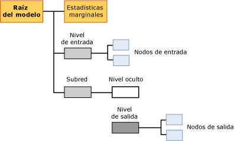

# Contenido del modelo de minería de datos para los modelos de regresión logística
  En este tema se describe el contenido del modelo de minería de datos específico de los modelos que utilizan el algoritmo de regresión logística de Microsoft. Para obtener una explicación de cómo interpretar las estadísticas y la estructura compartidas por todos los tipos de modelos, así como las definiciones generales de términos relacionados con el contenido del modelo de minería de datos, vea [Contenido del modelo de minería de datos &#40;Analysis Services - Minería de datos&#41;](../../analysis-services/data-mining/mining-model-content-analysis-services-data-mining.md).  
  
## Descripción de la estructura de un modelo de regresión logística  
 Un modelo de regresión logística se crea utilizando el algoritmo de red neuronal de Microsoft con parámetros que restringen el modelo para eliminar el nodo oculto. Por consiguiente, la estructura global de un modelo de regresión logística es casi idéntica a la de una red neuronal: cada modelo tiene un único nodo primario que representa el modelo y sus metadatos, y un nodo de estadísticas marginal especial (NODE_TYPE = 24) que proporciona estadísticas descriptivas sobre las entradas que se usan en el modelo.  
  
 Además, el modelo contiene una subred (NODE_TYPE = 17) para cada atributo de predicción. Al igual que en un modelo de red neuronal, cada subred siempre contiene dos bifurcaciones: una para el nivel de entrada y otra que contiene el nivel oculto (NODE_TYPE = 19) y el nivel de salida (NODE_TYPE = 20) para la red. La misma subred se puede utilizar para varios atributos si se especifican como de solo predicción. Los atributos de predicción que también sean entradas pueden no aparecer en la misma subred.  
  
 Sin embargo, en un modelo de regresión logística, el nodo que representa el nivel oculto está vacío y no tiene ningún elemento secundario. Por consiguiente, el modelo contiene nodos que representan salidas individuales (NODE_TYPE = 23) y entradas individuales (NODE_TYPE = 21) pero ningún nodo oculto individual.  
  
   
  
 De forma predeterminada, un modelo de regresión logística se muestra en el **Visor de redes neuronales de Microsoft**. Con este visor personalizado, puede filtrar los atributos de entrada y sus valores, y ver gráficamente cómo afectan a las salidas. La información sobre herramientas del visor muestra la probabilidad y la mejora respecto al modelo de predicción asociados a cada par de valores de entrada y de salida. Para más información, vea [Examinar un modelo usando el Visor de redes neuronales de Microsoft](../../analysis-services/data-mining/browse-a-model-using-the-microsoft-neural-network-viewer.md).  
  
 Para explorar la estructura de entradas y subredes, y ver estadísticas detalladas, puede utilizar el Visor de árbol de contenido genérico de Microsoft. Puede hacer clic en cualquier nodo para expandirlo y ver los nodos secundarios, o ver los pesos y otras estadísticas contenidas en el nodo.  
  
## Contenido del modelo de minería de datos para un modelo de regresión logística  
 En esta sección solo se proporcionan detalles y ejemplos de las columnas del contenido del modelo de minería de datos que tienen una relevancia especial para la regresión logística. El contenido del modelo es casi idéntico al de un modelo de red neuronal, pero las descripciones que se aplican a los modelos de red neuronal se pueden repetir en esta tabla por comodidad.  
  
 Para más información sobre las columnas de uso general en el conjunto de filas de esquema, como MODEL_CATALOG y MODEL_NAME (que no se describen aquí), o para obtener una explicación de la terminología del modelo de minería de datos, vea [Contenido del modelo de minería de datos &#40;Analysis Services - Minería de datos&#41;](../../analysis-services/data-mining/mining-model-content-analysis-services-data-mining.md).  
  
 MODEL_CATALOG  
 Nombre de la base de datos en la que se almacena el modelo.  
  
 MODEL_NAME  
 Nombre del modelo.  
  
 ATTRIBUTE_NAME  
 Nombres de los atributos que corresponden a este nodo.  
  
|Nodo|Contenido|  
|----------|-------------|  
|Raíz del modelo|En blanco|  
|Estadísticas marginales|En blanco|  
|Nivel de entrada|En blanco|  
|Nodo de entrada|Nombre del atributo de entrada|  
|nivel oculto|En blanco|  
|Nivel de salida|En blanco|  
|Nodo de salida|Nombre del atributo de salida|  
  
 NODE_NAME  
 Nombre del nodo. Actualmente, esta columna contiene el mismo valor que NODE_UNIQUE_NAME, aunque esto podría cambiar en versiones futuras.  
  
 NODE_UNIQUE_NAME  
 Nombre único del nodo.  
  
 Para obtener más información sobre cómo proporcionan los nombres e identificadores información estructural sobre el modelo, consulte la sección [Usar nombres de nodo e identificadores](#bkmk_NodeIDs).  
  
 NODE_TYPE  
 Un modelo de regresión logística genera los tipos de nodos siguientes:  
  
|Identificador del tipo de nodo|Description|  
|------------------|-----------------|  
|1|Modelo.|  
|17|Nodo de organizador para la subred.|  
|18|Nodo de organizador para el nivel de entrada.|  
|19|Nodo de organizador para el nivel oculto. El nivel oculto está vacío.|  
|20|Nodo de organizador para el nivel de salida.|  
|21|Nombre del atributo de entrada.|  
|23|Nodo del atributo de salida.|  
|24|Nodo de estadísticas marginales.|  
  
 NODE_CAPTION  
 Etiqueta o título asociado al nodo. En modelos de regresión logística, siempre está en blanco.  
  
 CHILDREN_CARDINALITY  
 Cálculo del número de elementos secundarios que tiene el nodo.  
  
|Nodo|Contenido|  
|----------|-------------|  
|Raíz del modelo|Indica el recuento de nodos secundarios, que incluye por lo menos una red, un nodo marginal necesario y un nivel de entrada necesaria. Por ejemplo, si el valor es 5, hay tres subredes.|  
|Estadísticas marginales|Siempre es 0.|  
|Nivel de entrada|Indica el número de pares de valores y atributos de entrada que usó el modelo.|  
|Nodo de entrada|Siempre es 0.|  
|Nivel oculto|En un modelo de regresión logística, siempre es 0.|  
|Nivel de salida|Indica el número de valores de salida.|  
|Nodo de salida|Siempre es 0.|  
  
 PARENT_UNIQUE_NAME  
 Nombre único del nodo primario del nodo. Se devuelve NULL para todos los nodos del nivel raíz.  
  
 Para obtener más información sobre cómo proporcionan los nombres e identificadores información estructural sobre el modelo, consulte la sección [Usar nombres de nodo e identificadores](#bkmk_NodeIDs).  
  
 NODE_DESCRIPTION  
 Descripción fácil de comprender del nodo.  
  
|Nodo|Contenido|  
|----------|-------------|  
|Raíz del modelo|En blanco|  
|Estadísticas marginales|En blanco|  
|Nivel de entrada|En blanco|  
|Nodo de entrada|Nombre del atributo de entrada|  
|nivel oculto|En blanco|  
|Nivel de salida|En blanco|  
|Nodo de salida|Si el atributo de salida es continuo, contiene su nombre.   Si el atributo de salida es discreto o discretizado, contiene el nombre del atributo y el valor.|  
  
 NODE_RULE  
 Descripción XML de la regla que está incrustada en el nodo.  
  
|Nodo|Contenido|  
|----------|-------------|  
|Raíz del modelo|En blanco|  
|Estadísticas marginales|En blanco|  
|Nivel de entrada|En blanco|  
|Nodo de entrada|Fragmento XML que contiene la misma información que la columna NODE_DESCRIPTION.|  
|Nivel oculto|En blanco|  
|Nivel de salida|En blanco|  
|Nodo de salida|Fragmento XML que contiene la misma información que la columna NODE_DESCRIPTION.|  
  
 MARGINAL_RULE  
 En los modelos de regresión logística, siempre está en blanco.  
  
 NODE_PROBABILITY  
 Probabilidad asociada a este nodo. En los modelos de regresión logística, siempre es 0.  
  
 MARGINAL_PROBABILITY  
 Probabilidad de alcanzar el nodo desde el nodo primario. En los modelos de regresión logística, siempre es 0.  
  
 NODE_DISTRIBUTION  
 Tabla anidada que contiene la información estadística para el nodo. Para más información sobre el contenido de esta tabla para cada tipo de nodo, vea la sección Interpretar la información de la tabla NODE_DISTRIBUTION en [Contenido del modelo de minería de datos para los modelos de red neuronal &#40;Analysis Services - Minería de datos&#41;](../../analysis-services/data-mining/mining-model-content-for-neural-network-models-analysis-services-data-mining.md).  
  
 NODE_SUPPORT  
 En los modelos de regresión logística, siempre es 0.  
  
> [!NOTE]  
>  Las probabilidades de compatibilidad siempre son 0 porque la salida de este tipo de modelo no es probabilística. Lo único significativo para el algoritmo son los pesos; por consiguiente, el algoritmo no calcula la probabilidad, la compatibilidad ni la varianza.  
  
 Para obtener información sobre la compatibilidad en los casos de entrenamiento para valores concretos, vea el nodo de estadísticas marginales.  
  
 MSOLAP_MODEL_COLUMN  
 |Nodo|Contenido|  
|----------|-------------|  
|Raíz del modelo|En blanco|  
|Estadísticas marginales|En blanco|  
|Nivel de entrada|En blanco|  
|Nodo de entrada|Nombre del atributo de entrada.|  
|nivel oculto|En blanco|  
|Nivel de salida|En blanco|  
|Nodo de salida|Nombre del atributo de entrada.|  
  
 MSOLAP_NODE_SCORE  
 En los modelos de regresión logística, siempre es 0.  
  
 MSOLAP_NODE_SHORT_CAPTION  
 En modelos de regresión logística, siempre está en blanco.  
  
##   Usar nombres de nodo e identificadores  
 La denominación de los nodos en un modelo de regresión logística proporciona información adicional sobre las relaciones entre los nodos del modelo. En la tabla siguiente se muestran las convenciones para los identificadores que están asignados a los nodos de cada nivel.  
  
|Tipo de nodo|Convención para el identificador de nodo|  
|---------------|----------------------------|  
|Raíz del modelo (1)|00000000000000000.|  
|Nodo de estadísticas marginales (24)|10000000000000000|  
|Nivel de entrada (18)|30000000000000000|  
|Nodo de entrada (21)|Comienza en 60000000000000000|  
|Subred (17)|20000000000000000|  
|Nivel oculto (19)|40000000000000000|  
|Nivel de salida (20)|50000000000000000|  
|Nodo de salida (23)|Comienza en 80000000000000000|  
  
 Puede utilizar estos identificadores para determinar cómo se relacionan los atributos de salida con atributos concretos del nivel de entrada, viendo la tabla NODE_DISTRIBUTION del nodo de salida. Cada fila de esa tabla contiene un identificador que apunta a un nodo de atributo de entrada concreto. La tabla NODE_DISTRIBUTION también contiene el coeficiente para ese par de entrada-salida.  
  
## Vea también  
 [Algoritmo de regresión logística de Microsoft](../../analysis-services/data-mining/microsoft-logistic-regression-algorithm.md)   
 [Contenido del modelo de minería de datos para los modelos de red neuronal &#40; Analysis Services: minería de datos &#41;](../../analysis-services/data-mining/mining-model-content-for-neural-network-models-analysis-services-data-mining.md)   
 [Ejemplos de consultas de modelo de regresión logística](../../analysis-services/data-mining/logistic-regression-model-query-examples.md)   
 [Referencia técnica del algoritmo de regresión logística de Microsoft](../../analysis-services/data-mining/microsoft-logistic-regression-algorithm-technical-reference.md)  
  
  
