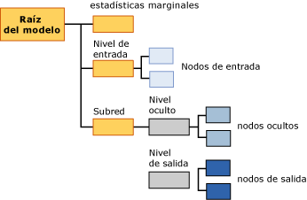

# Contenido del modelo de minería de datos para los modelos de red neuronal (Analysis Services - Minería de datos)
[!INCLUDE[ssas-appliesto-sqlas](../../includes/ssas-appliesto-sqlas.md)]
  En este tema se describe el contenido del modelo de minería de datos específico de los modelos que utilizan el algoritmo de red neuronal de Microsoft. Para obtener una explicación de cómo interpretar las estadísticas y la estructura compartidas por todos los tipos de modelos, así como las definiciones generales de términos relacionados con el contenido del modelo de minería de datos, vea [Contenido del modelo de minería de datos &#40;Analysis Services - Minería de datos&#41;](../../analysis-services/data-mining/mining-model-content-analysis-services-data-mining.md).  
  
## Descripción de la estructura de un modelo de red neuronal  
 Cada modelo de red neuronal tiene un nodo primario único que representa el modelo y sus metadatos, y un nodo de estadísticas marginal (NODE_TYPE = 24) que proporciona estadísticas descriptivas sobre los atributos de entrada. El nodo de estadísticas marginal es útil porque resume información sobre las entradas, de modo que no necesite consultar los datos de los nodos individuales.  
  
 Debajo de estos dos nodos hay al menos dos nodos más y podría haber muchos más, en función de cuántos atributos de predicción tenga el modelo.  
  
-   El primer nodo (NODE_TYPE = 18) siempre representa el nodo superior del nivel de entrada. Bajo este nodo superior, puede encontrar los nodos de entrada (NODE_TYPE = 21) que contienen los atributos de entrada reales y sus valores.  
  
-   Cada nodo sucesivo contiene una *subred* diferente (NODE_TYPE = 17). Cada subred siempre contiene un nivel oculto (NODE_TYPE = 19) y un nivel de salida (NODE_TYPE = 20) para esa subred.  
  
   
  
 La información del nivel de entrada es simple: el nodo superior de cada nivel de entrada (NODE_TYPE = 18) actúa como un organizador para una colección de nodos de entrada (NODE_TYPE = 21). El contenido de los nodos de entrada se describe en la tabla siguiente.  
  
 Cada subred (NODE_TYPE = 17) representa el análisis de la influencia del nivel de entrada en un atributo de predicción determinado. Si hay varias salidas de predicción, hay varias subredes. El nivel oculto de cada subred contiene varios nodos ocultos (NODE_TYPE = 22) que contienen los detalles sobre los pesos de cada transición que finaliza en ese nodo oculto en especial.  
  
 El nivel de salida (NODE_TYPE = 20) contiene los nodos de salida (NODE_TYPE = 23) que contiene cada uno valores distintos del atributo de predicción. Si el atributo de predicción es un tipo de datos numéricos continuo, solo hay un nodo de salida para el atributo.  
  
> [!NOTE]  
>  El algoritmo de regresión logística utiliza un caso especial de red neuronal que tiene solo un resultado de predicción y potencialmente muchas entradas. La regresión logística no utiliza un nivel oculto.  
  
 La manera más fácil de explorar la estructura de las entradas y subredes consiste en usar el **Visor de árbol de contenido genérico de Microsoft**. Puede hacer clic en cualquier nodo para expandirlo y ver los nodos secundarios, o ver los pesos y otras estadísticas que contiene el nodo.  
  
 Para trabajar con los datos y ver cómo pone en correlación el modelo las entradas y las salidas, puede usar el **Visor de redes neuronales de Microsoft**. Con este visor personalizado, puede filtrar los atributos de entrada y sus valores, y ver gráficamente cómo afectan a las salidas. La información sobre herramientas del visor muestra la probabilidad y la mejora respecto al modelo de predicción asociados a cada par de valores de entrada y de salida. Para más información, vea [Examinar un modelo usando el Visor de redes neuronales de Microsoft](../../analysis-services/data-mining/browse-a-model-using-the-microsoft-neural-network-viewer.md).  
  
## Contenido de un modelo de red neuronal  
 En esta sección solo se proporcionan detalles y ejemplos de las columnas del contenido del modelo de minería de datos que tienen una relevancia especial para las redes neuronales. Para más información sobre las columnas de uso general en el conjunto de filas de esquema, como MODEL_CATALOG y MODEL_NAME (que no se describen aquí), o para obtener una explicación de la terminología del modelo de minería de datos, vea [Contenido del modelo de minería de datos &#40;Analysis Services - Minería de datos&#41;](../../analysis-services/data-mining/mining-model-content-analysis-services-data-mining.md).  
  
 MODEL_CATALOG  
 Nombre de la base de datos en la que se almacena el modelo.  
  
 MODEL_NAME  
 Nombre del modelo.  
  
 ATTRIBUTE_NAME  
 Nombres de los atributos que corresponden a este nodo.  
  
|Nodo|Contenido|  
|----------|-------------|  
|Raíz del modelo|En blanco|  
|Estadísticas marginales|En blanco|  
|Nivel de entrada|En blanco|  
|Nodo de entrada|Nombre del atributo de entrada|  
|nivel oculto|En blanco|  
|Nodo oculto|En blanco|  
|Nivel de salida|En blanco|  
|Nodo de salida|Nombre del atributo de salida|  
  
 NODE_NAME  
 Nombre del nodo. Esta columna contiene el mismo valor que NODE_UNIQUE_NAME.  
  
 NODE_UNIQUE_NAME  
 Nombre único del nodo.  
  
 Para obtener más información sobre cómo proporcionan los nombres e identificadores información estructural sobre el modelo, consulte la sección [Usar nombres de nodo e identificadores](#bkmk_NodeIDs).  
  
 NODE_TYPE  
 Un modelo de red neuronal genera únicamente los tipos de nodos siguientes:  
  
|Identificador del tipo de nodo|Description|  
|------------------|-----------------|  
|1|Modelo.|  
|17|Nodo de organizador para la subred.|  
|18|Nodo de organizador para el nivel de entrada.|  
|19|Nodo de organizador para el nivel oculto.|  
|20|Nodo de organizador para el nivel de salida.|  
|21|Nombre del atributo de entrada.|  
|22|Nodo del nivel oculto|  
|23|Nodo del atributo de salida.|  
|24|Nodo de estadísticas marginales.|  
  
 NODE_CAPTION  
 Etiqueta o título asociado al nodo. En los modelos de red neuronal, siempre está en blanco.  
  
 CHILDREN_CARDINALITY  
 Cálculo del número de elementos secundarios que tiene el nodo.  
  
|Nodo|Contenido|  
|----------|-------------|  
|Raíz del modelo|Indica el recuento de nodos secundarios, que incluye por lo menos una red, un nodo marginal necesario y un nivel de entrada necesaria. Por ejemplo, si el valor es 5, hay tres subredes.|  
|Estadísticas marginales|Siempre es 0.|  
|Nivel de entrada|Indica el número de pares de valores y atributos de entrada que usó el modelo.|  
|Nodo de entrada|Siempre es 0.|  
|nivel oculto|Indica el número de nodos ocultos que fueron creados por el modelo.|  
|Nodo oculto|Siempre es 0.|  
|Nivel de salida|Indica el número de valores de salida.|  
|Nodo de salida|Siempre es 0.|  
  
 PARENT_UNIQUE_NAME  
 Nombre único del nodo primario del nodo. Se devuelve NULL para todos los nodos del nivel raíz.  
  
 Para obtener más información sobre cómo proporcionan los nombres e identificadores información estructural sobre el modelo, consulte la sección [Usar nombres de nodo e identificadores](#bkmk_NodeIDs).  
  
 NODE_DESCRIPTION  
 Descripción fácil de comprender del nodo.  
  
|Nodo|Contenido|  
|----------|-------------|  
|Raíz del modelo|En blanco|  
|Estadísticas marginales|En blanco|  
|Nivel de entrada|En blanco|  
|Nodo de entrada|Nombre del atributo de entrada|  
|nivel oculto|En blanco|  
|Nodo oculto|Entero que indica la secuencia del nodo oculto en la lista de nodos ocultos.|  
|Nivel de salida|En blanco|  
|Nodo de salida|Si el atributo de salida es continuo, contiene su nombre.   Si el atributo de salida es discreto o discretizado, contiene el nombre del atributo y el valor.|  
  
 NODE_RULE  
 Descripción XML de la regla que está incrustada en el nodo.  
  
|Nodo|Contenido|  
|----------|-------------|  
|Raíz del modelo|En blanco|  
|Estadísticas marginales|En blanco|  
|Nivel de entrada|En blanco|  
|Nodo de entrada|Fragmento XML que contiene la misma información que la columna NODE_DESCRIPTION.|  
|nivel oculto|En blanco|  
|Nodo oculto|Entero que indica la secuencia del nodo oculto en la lista de nodos ocultos.|  
|Nivel de salida|En blanco|  
|Nodo de salida|Fragmento XML que contiene la misma información que la columna NODE_DESCRIPTION.|  
  
 MARGINAL_RULE  
 En los modelos de red neuronal, siempre está en blanco.  
  
 NODE_PROBABILITY  
 Probabilidad asociada a este nodo. En los modelos de red neuronal, siempre es 0.  
  
 MARGINAL_PROBABILITY  
 Probabilidad de alcanzar el nodo desde el nodo primario. En los modelos de red neuronal, siempre es 0.  
  
 NODE_DISTRIBUTION  
 Tabla anidada que contiene la información estadística para el nodo. Para más información sobre el contenido de esta tabla para cada tipo de nodo, vea la sección [Descripción de la tabla NODE_DISTRIBUTION](#bkmk_NodeDistTable).  
  
 NODE_SUPPORT  
 En los modelos de red neuronal, siempre es 0.  
  
> [!NOTE]  
>  Las probabilidades de compatibilidad siempre son 0 porque la salida de este tipo de modelo no es probabilística. Lo único significativo para el algoritmo son los pesos; por consiguiente, el algoritmo no calcula la probabilidad, la compatibilidad ni la varianza.  
  
 Para obtener información sobre la compatibilidad en los casos de entrenamiento para valores concretos, vea el nodo de estadísticas marginales.  
  
 MSOLAP_MODEL_COLUMN  
 |Nodo|Contenido|  
|----------|-------------|  
|Raíz del modelo|En blanco|  
|Estadísticas marginales|En blanco|  
|Nivel de entrada|En blanco|  
|Nodo de entrada|Nombre del atributo de entrada.|  
|nivel oculto|En blanco|  
|Nodo oculto|En blanco|  
|Nivel de salida|En blanco|  
|Nodo de salida|Nombre del atributo de entrada.|  
  
 MSOLAP_NODE_SCORE  
 En un modelo de red neuronal, siempre es 0.  
  
 MSOLAP_NODE_SHORT_CAPTION  
 En los modelos de red neuronal, siempre está en blanco.  
  
## Comentarios  
 El propósito de entrenar un modelo de red neuronal es determinar los pesos que están asociados a cada transición de una entrada a un punto medio y de un punto medio a un extremo. Por consiguiente, el nivel de entrada del modelo existe principalmente para almacenar los valores reales que se usaron para generarlo. El nivel oculto almacena los pesos que se calcularon y proporciona punteros a los atributos de entrada. El nivel de salida almacena los valores de predicción y también proporciona punteros a los puntos medios en el nivel oculto.  
  
##   Usar nombres de nodo e identificadores  
 La denominación de los nodos de un modelo de red neuronal proporciona información adicional sobre el tipo de nodo, para facilitar relacionar el nivel oculto con el nivel de entrada y el nivel de salida con el nivel oculto. En la tabla siguiente se muestra la convención para los identificadores que están asignados a los nodos de cada nivel.  
  
|Tipo de nodo|Convención para el identificador de nodo|  
|---------------|----------------------------|  
|Raíz del modelo (1)|00000000000000000.|  
|Nodo de estadísticas marginales (24)|10000000000000000|  
|Nivel de entrada (18)|30000000000000000|  
|Nodo de entrada (21)|Comienza en 60000000000000000|  
|Subred (17)|20000000000000000|  
|Nivel oculto (19)|40000000000000000|  
|Nodo oculto (22)|Comienza en 70000000000000000|  
|Nivel de salida (20)|50000000000000000|  
|Nodo de salida (23)|Comienza en 80000000000000000|  
  
 Puede determinar qué atributos de entrada se relacionan con un nodo de nivel oculto concreto viendo la tabla NODE_DISTRIBUTION en el nodo oculto (NODE_TYPE = 22). Cada fila de la tabla NODE_DISTRIBUTION contiene el identificador de un nodo de atributo de entrada.  
  
 De igual forma, puede determinar qué niveles ocultos se relacionan con un atributo de salida viendo la tabla NODE_DISTRIBUTION en el nodo de salida (NODE_TYPE = 23). Cada fila de la tabla NODE_DISTRIBUTION contiene el identificador de un nodo del nivel oculto, junto con el coeficiente relacionado.  
  
##   Interpretar la información de la tabla NODE_DISTRIBUTION  
 La tabla NODE_DISTRIBUTION puede estar vacía en algunos nodos. Sin embargo, para los nodos de entrada, los nodos del nivel oculto y los nodos de salida, la tabla NODE_DISTRIBUTION almacena información importante e interesante sobre el modelo. Como ayuda para interpretar esta información, la tabla NODE_DISTRIBUTION contiene una columna VALUETYPE para cada fila que indica si el valor de la columna ATTRIBUTE_VALUE es Discreto (4), Discretizado (5) o Continuo (3).  
  
### Nodos de entrada  
 El nivel de entrada contiene un nodo para cada valor del atributo que se utilizó en el modelo.  
  
 **Atributo discreto:** el nodo de entrada solo almacena el nombre del atributo y su valor en las columnas ATTRIBUTE_NAME y ATTRIBUTE_VALUE. Por ejemplo, si [Work Shift] es la columna, se crea un nodo independiente para cada valor de esa columna que se utilizó en el modelo, como AM y PM. La tabla NODE_DISTRIBUTION para cada nodo muestra solo el valor actual del atributo.  
  
 **Atributo numérico de datos discretos:** el nodo de entrada almacena el nombre del atributo y el valor, que puede ser un intervalo o un valor concreto. Las expresiones, como '77.4 - 87.4' o ' < 64.0', representan todos los valores para el valor de [Time Per Issue]. La tabla NODE_DISTRIBUTION para cada nodo muestra solo el valor actual del atributo.  
  
 **Atributo continuo:** el nodo de entrada almacena el valor medio del atributo. La tabla NODE_DISTRIBUTION para cada nodo muestra solo el valor actual del atributo.  
  
### Nodos del nivel oculto  
 El nivel oculto contiene un número variable de nodos. En cada uno, la tabla NODE_DISTRIBUTION contiene las asignaciones del nivel oculto a los nodos del nivel de entrada. La columna ATTRIBUTE_NAME contiene un identificador de nodo que corresponde a un nodo del nivel de entrada. La columna ATTRIBUTE_VALUE contiene el peso asociado a esa combinación de nodo de entrada y nodo de nivel oculto. La última fila de la tabla contiene un coeficiente que representa el peso de ese nodo oculto en el nivel oculto.  
  
### Nodos de salida  
 El nivel de salida contiene un nodo de salida para cada valor de salida que se utilizó en el modelo. En cada nodo, la tabla NODE_DISTRIBUTION contiene las asignaciones del nivel de salida a los nodos del nivel oculto. La columna ATTRIBUTE_NAME contiene un identificador de nodo que corresponde a un nodo del nivel oculto. La columna ATTRIBUTE_VALUE contiene el peso asociado a esa combinación de nodo de salida y nodo de nivel oculto.  
  
 La tabla NODE_DISTRIBUTION tiene la información adicional siguiente, en función de si el tipo del atributo es:  
  
 **Atributo discreto:** las dos filas finales de la tabla NODE_DISTRIBUTION contienen un coeficiente para el nodo en conjunto y el valor actual del atributo.  
  
 **Un atributo numérico de datos discretos:** idéntico a los atributos discretos, solo que el valor del atributo es un intervalo de valores.  
  
 **Atributo continuo:** las dos filas finales de la tabla NODE_DISTRIBUTION contienen la media del atributo, el coeficiente para el nodo en conjunto y la varianza del coeficiente.  
  
## Vea también  
 [Algoritmo de red neuronal de Microsoft](../../analysis-services/data-mining/microsoft-neural-network-algorithm.md)   
 [Referencia técnica del algoritmo de red neuronal de Microsoft](../../analysis-services/data-mining/microsoft-neural-network-algorithm-technical-reference.md)   
 [Ejemplos de consultas de modelo de red neuronal](../../analysis-services/data-mining/neural-network-model-query-examples.md)  
  
  
