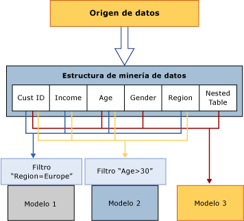

# Estructuras de minería de datos (Analysis Services - Minería de datos)
  La estructura de minería de datos define los datos a partir de los cuales se generan los modelos de minería de datos: especifica la vista de datos de origen, el número y el tipo de columnas, y una partición opcional en conjuntos de entrenamiento y de pruebas. Una misma estructura de minería de datos puede admitir varios modelos de minería de datos que comparten el mismo dominio. En el diagrama siguiente, se muestra la relación de la estructura de minería de datos con el origen de datos y con los modelos de minería de datos que la componen.  
  
   
  
 La estructura de minería de datos del diagrama está basada en un origen de datos que contiene varias tablas o vistas, combinadas en el campo CustomerID. Una tabla contiene información sobre los clientes, como la región geográfica, la edad, los ingresos y el sexo, mientras que la tabla anidada relacionada contiene varias filas de información adicional sobre cada cliente, como los productos que ha adquirido. En el diagrama, se muestra que se pueden generar varios modelos de minería de datos a partir de una misma estructura de minería de datos, y que los modelos pueden usar columnas de la estructura diferentes.  
  
 **Modelo 1** : usa CustomerID, Income, Age, Region y filtra los datos de Region.  
  
 **Modelo 2** : usa CustomerID, Income, Age, Region y filtra los datos de Age.  
  
 **Modelo 3** : usa CustomerID, Age, Gender y la tabla anidada, sin filtros.  
  
 Dado que los modelos usan columnas diferentes para la entrada, y dado que dos de los modelos, además, restringen sus datos mediante la aplicación de un filtro, los modelos pueden tener resultados muy diferentes aunque estén basados en los mismos datos. Observe que la columna CustomerID es obligatoria en todos los modelos porque es la única columna disponible que se puede usar como clave de caso.  
  
 En esta sección se explica la arquitectura básica de las estructuras de minería de datos: cómo se define una estructura de minería de datos, cómo se rellena con datos y cómo se usa para crear modelos. Para obtener más información sobre cómo administrar o exportar estructuras de minería de datos existentes, vea [Administración de las soluciones y los objetos de minería de datos](../../analysis-services/data-mining/management-of-data-mining-solutions-and-objects.md).  
  
## Definir una estructura de minería de datos  
 La configuración de una estructura de minería de datos consta de los pasos siguientes:  
  
-   Definir un origen de datos.  
  
-   Seleccionar las columnas de datos que se van a incluir en la estructura (no es necesario agregar todas las columnas al modelo) y definir una clave.  
  
-   Definir una clave para la estructura, incluyendo la clave de la tabla anidada, si procede.  
  
-   Especificar si los datos de origen se deben separar en un conjunto de entrenamiento y en un conjunto de prueba. Este paso es opcional.  
  
-   Procesar la estructura.  
  
 En las secciones siguientes se describen estos pasos de forma más detallada.  
  
### Orígenes de datos para estructuras de minería de datos  
 Cuando se define una estructura de minería de datos, se usan columnas que están disponibles en una vista del origen de datos existente. Una vista del origen de datos es un objeto compartido que permite combinar varios orígenes de datos y usarlos como un origen único. Los orígenes de datos originales no son visibles para las aplicaciones cliente, y puede usar las propiedades de la vista del origen de datos para modificar tipos de datos, crear agregaciones o asignar alias a las columnas.  
  
 Si genera varios modelos de minería de datos a partir de la misma estructura de minería de datos, los modelos pueden usar columnas diferentes de la estructura. Por ejemplo, puede crear una estructura única y, a continuación, generar modelos independientes de árbol de decisiones o de agrupación en clústeres a partir de ella, donde cada uno de ellos pueda usar columnas diferentes y predecir atributos distintos.  
  
 Además, cada modelo puede usar las columnas de la estructura de distintas maneras. Por ejemplo, una vista del origen de datos puede incluir una columna Ingresos, que puede enlazarse de diferentes formas para los distintos modelos.  
  
 La estructura de minería de datos almacena la definición del origen de datos y las columnas de este en forma de *enlaces* al origen de datos. Para obtener más información sobre los enlaces de origen de datos, vea [Orígenes de datos y enlaces &#40;SSAS Multidimensional&#41;](../../analysis-services/multidimensional-models/data-sources-and-bindings-ssas-multidimensional.md). En cambio, tenga en cuenta que también puede crear una estructura de minería de datos sin enlazarla a un origen de datos concreto; para ello, debe usar la instrucción DMX [CREATE MINING STRUCTURE &#40;DMX&#41;](../../dmx/create-mining-structure-dmx.md).  
  
### Columnas de la estructura de minería de datos  
 Las unidades de creación de la estructura de minería de datos son las columnas de la estructura de minería de datos, que describen los datos que contiene el origen de datos. Estas columnas contienen información como el tipo de datos, el tipo de contenido y el modo en que se distribuyen los datos. La estructura de minería de datos no contiene información sobre el modo en que las columnas se utilizan para un modelo de minería de datos concreto, ni sobre el tipo de algoritmo que se utiliza para generarlo; esta información se define en el propio modelo de minería de datos.  
  
 Una estructura de minería de datos también puede contener tablas anidadas. Una tabla anidada representa una relación de uno a varios entre la entidad de un caso y sus atributos relacionados. Por ejemplo, si la información que describe al cliente se encuentra en una tabla y las compras del cliente en otra, puede utilizar tablas anidadas para combinar la información en un único caso. El identificador del cliente es la entidad y las compras son los atributos relacionados. Para obtener más información sobre cuándo usar las tablas anidadas, vea [Tablas anidadas &#40;Analysis Services - Minería de datos&#41;](../../analysis-services/data-mining/nested-tables-analysis-services-data-mining.md).  
  
 Para crear un modelo de minería de datos en [!INCLUDE[ssBIDevStudioFull](../../includes/ssbidevstudiofull-md.md)], primero debe crear una estructura de minería de datos. El Asistente para minería de datos le guiará en el proceso de crear una estructura de minería de datos, elegir los datos y agregar un modelo de minería de datos.  
  
 Si crea un modelo de minería de datos con el lenguaje Extensiones de Minería de Datos (DMX), puede especificar el modelo y las columnas existentes en él; DMX creará automáticamente la estructura de minería de datos necesaria. Para obtener más información,vea [CREATE MINING MODEL &#40;DMX&#41;](../../dmx/create-mining-model-dmx.md).  
  
 Para más información, consulte [Mining Structure Columns](../../analysis-services/data-mining/mining-structure-columns.md).  
  
### Dividir los datos en conjuntos de entrenamiento y de prueba  
 Cuando se definen los datos para la estructura de minería de datos, también es posible especificar que algunos de los datos se usen para entrenamiento y otros para pruebas. Por consiguiente, ya no es necesario separar los datos antes de crear una estructura de minería de datos. En su lugar, mientras crea el modelo, puede especificar que determinado porcentaje de los datos se reserven para pruebas y que el resto se use para entrenamiento, o puede especificar un número específico de casos para que se usen como conjunto de datos de pruebas. La información sobre los conjuntos de datos de pruebas y de entrenamiento se almacena en la memoria caché con la estructura de minería de datos; por consiguiente, el mismo conjunto de pruebas puede usarse con todos los modelos que están basados en esa estructura.  
  
 Para más información, consulte [Training and Testing Data Sets](../../analysis-services/data-mining/training-and-testing-data-sets.md).  
  
### Habilitar la obtención de detalles  
 Puede agregar columnas a la estructura de minería de datos aunque no piense usarlas en un modelo de minería de datos concreto. Esto es útil si, por ejemplo, desea recuperar las direcciones de correo electrónico de los clientes de un modelo de agrupación en clústeres, aunque no vaya a usarlas durante el proceso de análisis. Si desea omitir una columna durante la fase de análisis y predicción, agréguela a la estructura pero no especifique un uso para ella, o establezca la marca de uso en Omitir. Los datos marcados de esta forma se pueden seguir usando en las consultas si se ha habilitado la obtención de detalles en el modelo de minería de datos y tiene los permisos adecuados. Por ejemplo, puede revisar los clústeres resultantes del análisis de todos los clientes, y luego usar una consulta de obtención de detalles para obtener los nombres y direcciones de correo electrónico de los clientes de un clúster determinado, aunque esas columnas de datos no se hayan usado para generar el modelo.  
  
 Para obtener más información, vea [Consultas de obtención de detalles &#40;minería de datos&#41;](../../analysis-services/data-mining/drillthrough-queries-data-mining.md).  
  
### Procesar estructuras de minería de datos  
 Una estructura de minería de datos no es más que un contenedor de metadatos hasta que se procesa. Al procesar una estructura de minería de datos, [!INCLUDE[ssASnoversion](../../includes/ssasnoversion-md.md)] crea una caché que almacena estadísticas sobre los datos, información sobre cómo se convierten en datos discretos los atributos continuos e información que usarán los modelos de minería de datos posteriormente. Por sí mismo, el modelo de minería de datos no almacena esta información de resumen, sino que hace referencia a la información almacenada en la memoria caché cuando se procesó la estructura de minería de datos. Por consiguiente, no es necesario volver a procesar la estructura cada vez que se agrega un nuevo modelo a una estructura existente; se puede procesar solamente el modelo.  
  
 También puede descartar la memoria caché después del procesamiento, si esta es muy grande o desea quitar los datos detallados. Si no desea almacenar los datos en la memoria caché, puede cambiar la propiedad **CacheMode** de la estructura de minería de datos a **ClearAfterProcessing**. Esto destruirá la caché una vez procesados los modelos. Al establecer la propiedad **CacheMode** en **ClearAfterProcessing** , se deshabilita la obtención de detalles del modelo de minería de datos.  
  
 Sin embargo, una vez destruida la memoria caché, no podrá agregar nuevos modelos a la estructura de minería de datos. Si agrega un nuevo modelo de minería de datos a la estructura, o cambia las propiedades de los modelos existentes, primero deberá volver a procesar la estructura de minería de datos. Para obtener más información, vea [Requisitos y consideraciones de procesamiento &#40;minería de datos&#41;](../../analysis-services/data-mining/processing-requirements-and-considerations-data-mining.md).  
  
### Ver estructuras de minería de datos  
 No se pueden usar los visores para examinar los datos de una estructura de minería de datos. Sin embargo, en [!INCLUDE[ssBIDevStudioFull](../../includes/ssbidevstudiofull-md.md)], es posible utilizar la pestaña **Estructura de minería de datos** del Diseñador de minería de datos para ver las columnas de estructura y sus definiciones. Para más información, consulte [Data Mining Designer](../../analysis-services/data-mining/data-mining-designer.md).  
  
 Si desea revisar los datos de la estructura de minería de datos, puede crear consultas mediante el lenguaje Extensiones de minería de datos (DMX). Por ejemplo, la instrucción `SELECT * FROM <structure>.CASES` devuelve todos los datos de la estructura de minería de datos. Para recuperar esta información, la estructura de minería de datos se debe haber procesado y los resultados de dicho procesamiento deben estar almacenados en la caché.  
  
 La instrucción `SELECT * FROM <model>.CASES` devuelve las mismas columnas, pero solo para los casos de ese modelo concreto. Para obtener más información, vea [SELECT FROM &#60;estructura&#62;.CASES](../../dmx/select-from-structure-cases.md) y [SELECT FROM &#60;model&#62;.CASES &#40;DMX&#41;](../../dmx/select-from-model-cases-dmx.md).  
  
## Utilizar modelos de minería de datos con estructuras de minería de datos  
 Un modelo de minería de datos aplica un algoritmo de modelo de minería a los datos que se representan en una estructura de minería de datos. Un modelo de minería de datos es un objeto que pertenece a una determinada estructura de minería de datos; el modelo hereda todos los valores de las propiedades que están definidas en la estructura de minería de datos. El modelo puede utilizar todas las columnas que contiene la estructura de minería de datos o un subconjunto de las columnas. Es posible agregar varias copias de una columna de estructura a una estructura. También se pueden agregar varias copias de una columna de estructura a un modelo y, a continuación, asignar nombres diferentes, o *alias*, a cada columna de estructura del modelo. Para obtener más información sobre cómo crear alias para las columnas de estructura, vea [Crear un alias para una columna de modelo](../../analysis-services/data-mining/create-an-alias-for-a-model-column.md) y [Propiedades del modelo de minería de datos](../../analysis-services/data-mining/mining-model-properties.md).  
  
 Para obtener más información sobre la arquitectura de los modelos de minería de datos, vea [Modelos de minería de datos &#40;Analysis Services - Minería de datos&#41;](../../analysis-services/data-mining/mining-models-analysis-services-data-mining.md).  
  
## Tareas relacionadas  
 Use los vínculos proporcionados a continuación para obtener más información sobre cómo definir, administrar y usar las estructuras de minería de datos.  
  
|Tareas|Vínculos|  
|-----------|-----------|  
|Trabajar con estructuras de minería de datos relacionales|[Crear una estructura de minería de datos relacional](../../analysis-services/data-mining/create-a-new-relational-mining-structure.md)   [Agregar una tabla anidada a una estructura de minería de datos](../../analysis-services/data-mining/add-a-nested-table-to-a-mining-structure.md)|  
|Trabajar con estructuras de minería de datos basadas en cubos OLAP|[Crear una estructura de minería de datos OLAP](../../analysis-services/data-mining/create-a-new-olap-mining-structure.md)|  
|Trabajar con las columnas de una estructura de minería de datos|[Agregar columnas a una estructura de minería de datos](../../analysis-services/data-mining/add-columns-to-a-mining-structure.md)   [Quitar columnas de una estructura de minería de datos](../../analysis-services/data-mining/remove-columns-from-a-mining-structure.md)|  
|Cambiar o consultar las propiedades y los datos de la estructura de minería de datos|[Cambiar las propiedades de una estructura de minería de datos](../../analysis-services/data-mining/change-the-properties-of-a-mining-structure.md)|  
|Trabajar con los orígenes de datos subyacentes y actualizar los datos de origen|[Modifique la vista del origen de datos utilizada para una estructura de minería de datos](../../analysis-services/data-mining/edit-the-data-source-view-used-for-a-mining-structure.md)   [Procesar una estructura de minería de datos](../../analysis-services/data-mining/process-a-mining-structure.md)|  
  
## Vea también  
 [Objetos de base de datos &#40;Analysis Services - Datos multidimensionales&#41;](../../analysis-services/multidimensional-models/olap-logical/database-objects-analysis-services-multidimensional-data.md)   
 [Modelos de minería de datos &#40;Analysis Services - Minería de datos&#41;](../../analysis-services/data-mining/mining-models-analysis-services-data-mining.md)  
  
  
