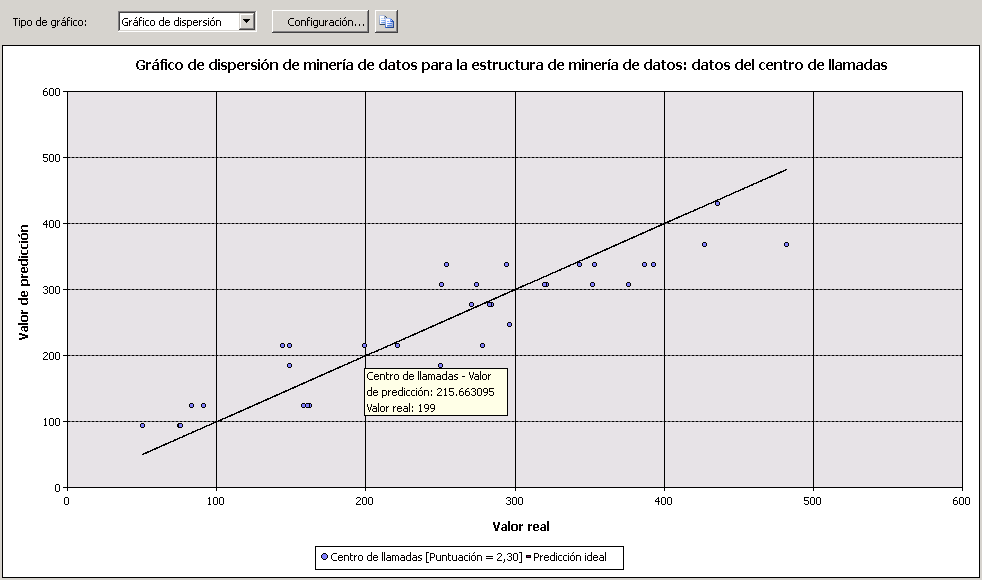

# Gráfico de dispersión (Analysis Services - Minería de datos)
[!INCLUDE[ssas-appliesto-sqlas](../../includes/ssas-appliesto-sqlas.md)]
  Un *gráfico de dispersión* representa los valores reales de los datos con respecto a los valores previstos por el modelo. El gráfico de dispersión presenta los valores reales en el eje X y los valores previstos en el eje Y. También presenta una línea que ilustra la predicción perfecta, en la que el valor previsto coincide exactamente con el valor real. La distancia de un punto desde esta línea ideal que forma un ángulo de 45 grados indica el grado de acierto con que se realizó la predicción.  
  
## Descripción del gráfico de dispersión  
 Considere un modelo en el que el departamento de marketing predice las ventas diarias en función del número de clics en un vínculo enviado en un mensaje de correo electrónico promocional. Dado que tanto el número de clics como la cantidad de ventas son valores numéricos continuos, puede representar gráficamente el número de clics como variable independiente y las ventas como variable dependiente. Cuando se hace así, la línea recta muestra la relación lineal esperada y los puntos dispersos en torno a esa línea muestran la divergencia entre los datos reales y los esperados. Este análisis indica a simple vista la precisión de la correlación de un conjunto de resultados con una entrada determinada, y la magnitud de la variación con respecto al modelo ideal  
  
## Interpretación de los resultados  
 En el diagrama siguiente se muestra un ejemplo de gráfico de dispersión, creado para el escenario que se acaba de describir.  
  
   
  
 Puede detener el mouse sobre cualquier punto disperso en torno a la línea para ver los valores reales y los valores previstos en una información sobre herramientas. No hay ninguna **Leyenda de minería de datos** para un gráfico de dispersión; sin embargo, el propio gráfico contiene una leyenda que muestra la puntuación asociada al modelo. Para más información sobre cómo interpretar la puntuación, vea [Contenido del modelo de minería de datos para los modelos de regresión lineal &#40;Analysis Services - Minería de datos&#41;](../../analysis-services/data-mining/mining-model-content-for-linear-regression-models-analysis-services-data-mining.md).  
  
 Puede copiar la representación visual del gráfico en el Portapapeles, pero no los datos subyacentes ni la fórmula. Si desea ver la fórmula de regresión para la línea, puede crear una consulta de contenido frente el modelo. Para más información, vea [Ejemplos de consultas de modelos de regresión lineal](../../analysis-services/data-mining/linear-regression-model-query-examples.md).  
  
## Restricciones en los gráficos de dispersión  
 Un gráfico de dispersión se puede crear solo si el modelo que elija en la pestaña **Selección de entrada** contiene un atributo predecible continuo. No es necesario realizar ninguna selecciones adicional; el tipo de gráfico de dispersión muestra automáticamente en la pestaña **Gráfico de elevación** según el modelo y el tipo de atributo.  
  
 Aunque los modelos de serie temporal predicen números continuos, no puede medir la exactitud de un modelo de serie temporal utilizando un gráfico de dispersión. Hay otros métodos que puede utilizar, como reservar una parte de los datos históricos. Para más información, vea [Ejemplos de consultas de modelo de serie de tiempo](../../analysis-services/data-mining/time-series-model-query-examples.md).  
  
## Contenido relacionado  
 Los temas siguientes contienen más información acerca de cómo puede crear y usar gráficos de dispersión y de precisión relacionados.  
  
|Temas|Vínculos|  
|------------|-----------|  
|Incluye una visita guiada que explica cómo se crea un gráfico de mejora respecto al modelo predictivo para el modelo de distribución de correo directo.|[Tutorial de minería de datos básicos](http://msdn.microsoft.com/library/6602edb6-d160-43fb-83c8-9df5dddfeb9c)   [Probar la exactitud con gráficos de elevación & #40; Tutorial de minería de datos básicos & #41;](http://msdn.microsoft.com/library/822d414b-4a39-473f-80c3-53476e30655a)|  
|Explica los tipos de gráficos relacionados.|[Gráfico de elevación & #40; Analysis Services: minería de datos & #41;](../../analysis-services/data-mining/lift-chart-analysis-services-data-mining.md)   [Gráfico de beneficios & #40; Analysis Services: minería de datos & #41;](../../analysis-services/data-mining/profit-chart-analysis-services-data-mining.md)   [Matriz de clasificación & #40; Analysis Services: minería de datos & #41;](../../analysis-services/data-mining/classification-matrix-analysis-services-data-mining.md)|  
|Describe los usos de la validación cruzada en los modelos y estructuras de minería de datos.|[La validación cruzada & #40; Analysis Services: minería de datos & #41;](../../analysis-services/data-mining/cross-validation-analysis-services-data-mining.md)|  
|Describe los pasos necesarios para crear gráficos de mejora respecto al modelo predictivo y otros gráficos de precisión.|[Pruebas y las tareas de validación y procedimientos & #40; minería de datos & #41;](../../analysis-services/data-mining/testing-and-validation-tasks-and-how-tos-data-mining.md)|  
  
## Vea también  
 [Prueba y validación & #40; minería de datos & #41;](../../analysis-services/data-mining/testing-and-validation-data-mining.md)  
  
  
