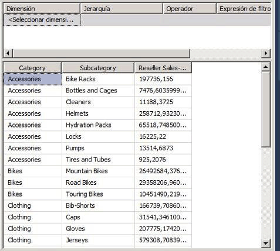
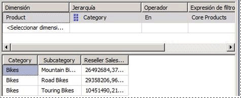

# Definir conjuntos con nombre
Un conjunto con nombre es una expresión de Expresiones multidimensionales (MDX) que devuelve un conjunto de miembros de dimensión. Puede definir conjuntos con nombre y guardarlos como parte de la definición del cubo; también puede crear conjuntos con nombre en aplicaciones cliente. Puede crear conjuntos con nombre combinando datos del cubo, operadores aritméticos, números y funciones. Los usuarios pueden usar los conjuntos con nombre en consultas MDX en aplicaciones cliente y también pueden usarse para definir conjuntos en subcubos. Un subcubo es una colección de conjuntos unidos de forma cruzada que restringe el espacio del cubo al subespacio definido para instrucciones posteriores. La definición de un espacio del cubo restringido es un concepto fundamental para el scripting de MDX.  
  
Los conjuntos con nombre simplifican las consultas MDX y ofrecen alias útiles para expresiones de conjunto complejas utilizadas con normalidad. Por ejemplo, puede definir un conjunto con nombre denominado Large Resellers que contenga el conjunto de miembros de dimensión Reseller que tenga la mayoría de los empleados. Los usuarios finales podrían entonces utilizar el conjunto con nombre Large Resellers en consultas, o utilizar el conjunto con nombre para definir un conjunto en un subcubo. Las definiciones de los conjuntos con nombre se almacenan, pero sus valores solo existen en la memoria. Para crear un conjunto con nombre, utilice el comando **Nuevo conjunto con nombre** en la pestaña **Cálculos** del Diseñador de cubos. Para obtener más información, consulte [Cálculos](../analysis-services/multidimensional-models-olap-logical-cube-objects/calculations.md), [Crear conjuntos con nombre](../analysis-services/multidimensional-models/create-named-sets.md).  
  
En las tareas de este tema, definirá dos conjuntos con nombre: un conjunto con nombre Core Products y un conjunto con nombre Large Resellers.  
  
## Definir un conjunto con nombre Core Products  
  
1.  Cambie a la pestaña **Cálculos** del Diseñador de cubos para el cubo Tutorial de [!INCLUDE[ssASnoversion](../includes/ssasnoversion-md.md)] y, a continuación, haga clic en **Vista de formulario** en la barra de herramientas.  
  
2.  Haga clic en **[Total Sales Ratio to All Products]** en el panel **Organizador de scripts** y, después, haga clic en **Nuevo conjunto con nombre** en la barra de herramientas de la pestaña **Cálculos**.  
  
    Al definir un nuevo cálculo en la pestaña **Cálculos** , recuerde que los cálculos se resuelven en el orden en el que aparecen en el panel **Organizador de script** . Su enfoque en dicho panel al crear un nuevo cálculo determinará el orden de la ejecución del cálculo; un nuevo cálculo se define inmediatamente después del cálculo especificado.  
  
3.  En el cuadro **Nombre**, cambie el nombre del nuevo conjunto con nombre por **[Core Products]**.  
  
    En el panel **Organizador de script** , observe el icono único que diferencia un conjunto con nombre de un comando de script o de un miembro calculado.  
  
4.  En la pestaña **Metadatos** del panel **Herramientas de cálculo** , expanda **Producto**, **Categoría**, **Miembros**y **All Products**.  
  
    > [!NOTE]  
    > Si no puede ver los metadatos en el panel **Herramientas de cálculo** , haga clic en **Volver a conectar** en la barra de herramientas. Si esto no funciona, puede que tenga que procesar el cubo o iniciar la instancia de [!INCLUDE[ssASnoversion](../includes/ssasnoversion-md.md)].  
  
5.  Arrastre **Bikes** al cuadro **Expresión** .  
  
    Ahora ha creado una expresión de conjunto que devolverá el conjunto de miembros que esté en la categoría Bike de la dimensión Product.  
  
## Definir un conjunto con nombre Large Resellers  
  
1.  Haga clic con el botón derecho en **[Core Products]** en el panel **Organizador de scripts** y, después, haga clic en **Nuevo conjunto con nombre**.  
  
2.  En el cuadro **Nombre**, cambie el nombre de este conjunto con nombre por **[Large Resellers]**.  
  
3.  En el cuadro **Expresión**, escriba **Exists()**.  
  
    Usará la función Exists para devolver el conjunto de miembros de la jerarquía de atributo Reseller Name que forma intersección con el conjunto de miembros de la jerarquía de atributo Number of Employees que tiene el mayor número de empleados.  
  
4.  En la pestaña **Metadatos** del panel **Herramientas de cálculo** , expanda la dimensión **Reseller** y, a continuación, expanda la jerarquía de atributo **Reseller Name** .  
  
5.  Arrastre el nivel **Reseller Name** hasta el paréntesis para la expresión de conjunto Exists.  
  
    Usará la función Members para devolver todos los miembros de este conjunto. Para obtener más información, consulte [Members &#40;Set&#41; &#40;MDX&#41;](../mdx/members-set-mdx.md).  
  
6.  Después de la expresión de conjunto parcial, escriba un punto y, después, agregue la función Members. La expresión tendrá el siguiente aspecto:  
  
    ```  
    Exists([Reseller].[Reseller Name].[Reseller Name].Members)  
    ```  
  
    Ahora que ha definido el primer conjunto para la expresión de conjunto Exists, estará listo para agregar el segundo conjunto: el conjunto de miembros de dimensión Reseller que contiene el mayor número de empleados.  
  
7.  En la pestaña **Metadatos** del panel **Herramientas de cálculo** , expanda **Número de empleados** en la dimensión Reseller, expanda **Miembros**y luego **All Resellers**.  
  
    Observe que los miembros de esta jerarquía de atributo no están agrupados.  
  
8.  Abra el Diseñador de dimensiones para la dimensión **Reseller** y, a continuación, haga clic en **Number of Employees** en el panel **Atributos** .  
  
9. En la ventana Propiedades, cambie la propiedad **DiscretizationMethod** a **Automatic**y, a continuación, cambie la propiedad **DiscretizationBucketCount** a **5**. Para más información, vea [Agrupar miembros de atributos &#40;Discretización&#41;](../analysis-services/multidimensional-models/group-attribute-members-discretization.md).  
  
10. En el menú **Generar** de [!INCLUDE[ssBIDevStudioFull](../includes/ssbidevstudiofull-md.md)], haga clic en **Implementar Tutorial de Analysis Services**.  
  
11. Cuando la implementación haya finalizado correctamente, vaya al Diseñador de cubos del cubo [!INCLUDE[ssASnoversion](../includes/ssasnoversion-md.md)] Tutorial y, a continuación, haga clic en **Volver a conectar** en la barra de herramientas de la pestaña **Cálculos** .  
  
12. En la pestaña **Metadatos** del panel **Herramientas de cálculo** , expanda **Número de empleados** en la dimensión **Reseller** , expanda **Miembros**y luego **All Resellers**.  
  
    Observe que los miembros de esta jerarquía de atributos están contenidos ahora en cinco grupos, numerados de 0 a 4. Para ver el número de un grupo, pause el puntero sobre ese grupo para ver un recuadro informativo. Para el intervalo `2 -17`, el recuadro informativo debe contener `[Reseller].[Number of Employees].&[0]`.  
  
    Los miembros de esta jerarquía de atributo están agrupados porque la propiedad DiscretizationBucketCount está establecida en **5** y la propiedad DiscretizationMethod está establecida en **Automatic**.  
  
13. En el cuadro **Expresión**, agregue una coma a la expresión de conjunto Exists después de la función Members y antes del paréntesis de cierre y, luego, arrastre **83 - 100** desde el panel **Metadatos** y colóquelo detrás de la coma.  
  
    Ahora ha completado la expresión de conjunto Exists que devolverá el conjunto de miembros que forma intersección con estos dos conjuntos especificados, el conjunto de todos los distribuidores y el conjunto de los distribuidores que tengan de 83 a 100 empleados, cuando el conjunto con nombre Large Resellers se coloca en un eje.  
  
    La siguiente imagen muestra el panel **Expresiones de cálculo** para el conjunto con nombre **[Large Resellers]**.  
  
    ![Panel de expresiones de cálculo para [Large Resellers]](../analysis-services/media/l6-named-set-02.gif "Panel de expresiones de cálculo para [Large Resellers]")  
  
14. En la barra de herramientas de la pestaña **Cálculos** , haga clic en **Vista de script**y, a continuación, revise los dos conjuntos con nombre que acaba de agregar al script de cálculo.  
  
15. Agregue una nueva línea al script de cálculo inmediatamente anterior al primer comando CREATE SET y, a continuación, agregue el siguiente texto al script en su propia línea:  
  
    ```  
    /* named sets */  
    ```  
  
    Ahora ha definido dos conjuntos con nombre y ambos son visibles en el panel **Organizador de script** . Ya puede implementar estos conjuntos con nombre y examinar estas medidas en el cubo Tutorial de [!INCLUDE[ssASnoversion](../includes/ssasnoversion-md.md)] .  
  
## Examinar el cubo mediante los nuevos conjuntos con nombre  
  
1.  En el menú **Generar** de [!INCLUDE[ssBIDevStudio](../includes/ssbidevstudio-md.md)], haga clic en **Implementar Tutorial de Analysis Services**.  
  
2.  Cuando la implementación se haya completado correctamente, haga clic en la pestaña **Explorador** y, a continuación, haga clic en **Volver a conectar**.  
  
3.  Borre la cuadrícula del panel de datos.  
  
4.  Agregue la medida **Reseller Sales-Sales Amount** al área de datos.  
  
5.  Expanda la dimensión Product y, a continuación, agregue Category y Subcategory al área de fila, como se muestra en la ilustración siguiente.  
  
      
  
6.  En el panel **Metadatos** , en la dimensión **Product** , arrastre **Core Products** el área de filtro.  
  
    Observe que solo el miembro **Bike** del atributo **Category** y los miembros de las subcategorías **Bike** permanecen en el cubo. Esto se debe a que se usa el conjunto con nombre **Core Products** para definir un subcubo. Este subcubo limita los miembros del atributo **Category** en la dimensión **Product** del subcubo a los miembros del conjunto con nombre **Core Products** , tal como se muestra en la ilustración siguiente.  
  
      
  
7.  En el panel **Metadatos** , expanda **Distribuidor**y agregue **Grandes distribuidores** al área de filtro.  
  
    Observe que la medida Importe de datos del distribuidor del panel Datos solo muestra importes de venta para los grandes distribuidores de bicicletas. Observe también que el panel Filtro muestra ahora los dos conjuntos con nombre que se utilizan para definir este subcubo en particular, tal como muestra la siguiente imagen.  
  
      
  
## Lección siguiente  
[Lección 7: Definir indicadores clave de rendimiento &#40;KPI&#41;](../analysis-services/lesson-7-defining-key-performance-indicators-kpis.md)  
  
## Vea también  
[Cálculos](../analysis-services/multidimensional-models-olap-logical-cube-objects/calculations.md)  
[Crear conjuntos con nombre](../analysis-services/multidimensional-models/create-named-sets.md)  
  
  
  
