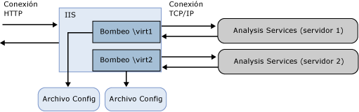

# <a name="configure-http-access-to-analysis-services-on-iis-80"></a>Configurar el acceso HTTP a Analysis Services en IIS 8.0
  En este artículo se explica cómo configurar un extremo HTTP para acceder a una instancia de Analysis Services. Puede habilitar el acceso HTTP configurando MSMDPUMP.dll, una extensión ISAPI que se ejecuta en Internet Information Services (IIS) y transfiere datos entre las aplicaciones cliente y un servidor de Analysis Services. Este método proporciona una alternativa para conectarse a Analysis Services cuando una solución BI necesita las capacidades siguientes:  
  
-   El acceso de cliente se realiza a través de conexiones de una extranet o Internet, con restricciones en los puertos que se pueden habilitar.  
  
-   Las conexiones de cliente provienen de dominios que no son de confianza en la misma red.  
  
-   La aplicación cliente se ejecuta en un entorno que permite conexiones HTTP pero no TCP/IP.  
  
-   Las aplicaciones cliente no pueden usar las bibliotecas de cliente de Analysis Services (por ejemplo, una aplicación Java que se ejecuta en un servidor UNIX). Si no puede usar las bibliotecas de cliente de Analysis Services para el acceso de datos, use SOAP y XML/A a través de una conexión HTTP directa a una instancia de Analysis Services.  
  
-   Se requieren métodos de autenticación diferentes a la seguridad integrada de Windows. Específicamente, puede utilizar conexiones anónimas y la autenticación básica al configurar Analysis Services para el acceso HTTP. La autenticación Digest, Formularios y ASP.NET no se admite. Un requisito de autenticación básica es una de las razones principales para habilitar el acceso HTTP. Para obtener más información, vea [Autenticación y delegación de identidad de Microsoft BI](http://go.microsoft.com/fwlink/?LinkId=286576).  
  
 Puede configurar el acceso HTTP para cualquier versión o edición compatible de Analysis Services que se ejecute tanto en modo tabular como multidimensional. Los cubos locales son una excepción. No se puede conectar a un cubo local a través de un extremo HTTP.  
  
 La configuración del acceso HTTP es una tarea posterior a la instalación. Analysis Services debe estar instalado antes de poder configurarlo para el acceso HTTP. Como administrador de Analysis Services, deberá conceder permisos a cuentas de Windows antes de que sea posible el acceso HTTP. Además, es recomendable en primer lugar validar la instalación y asegurarse de que esté totalmente operativa antes de proseguir con la configuración del servidor. Una vez configurado el acceso HTTP puede utilizar tanto el nombre del extremo HTTP como el nombre de red normal del servidor sobre TCP/IP. La configuración del acceso HTTP no invalida otros métodos de acceso a datos.  
  
 A medida que avanza en la configuración de MSMDPUMP, recuerde que se deben tener en cuenta dos conexiones: cliente a IIS, IIS a SSAS. Este artículo da instrucciones sobre la conexión IIS a SSAS. La aplicación cliente podría requerir configuración adicional antes de poder conectar a IIS. Algunas decisiones, como si se debe utilizar SSL o cómo configurar enlaces, están fuera del ámbito de este artículo. Consulte [Servidor Web (IIS)](http://technet.microsoft.com/library/hh831725.aspx) para obtener más información acerca de IIS.  
  
 En este tema se incluyen las secciones siguientes:  
  
-   [Información general](#bkmk_overview)  
  
-   [Requisitos previos](#bkmk_prereq)  
  
-   [Copiar MSMDPUMP.dll en una carpeta del servidor web](#bkmk_copy)  
  
-   [Crear un grupo de aplicaciones y un directorio virtual en IIS](#bkmk_appPool)  
  
-   [Configurar la autenticación IIS y agregar la extensión](#bkmk_auth)  
  
-   [Modificar el archivo MSMDPUMP.INI para establecer el servidor de destino](#bkmk_edit)  
  
-   [Probar la configuración](#bkmk_test)  
  
##  <a name="bkmk_overview"></a> Información general  
 MSMDPUMP es una extensión ISAPI que se carga en IIS y permite la redirección a una instancia de Analysis Services local o remota. Al configurar esta extensión ISAPI, crea un extremo HTTP a una instancia de Analysis Services.  
  
 Debe crear y configurar un directorio virtual para cada extremo HTTP. Cada extremo tendrá su propio conjunto de archivos MSMDPUMP para cada instancia de Analysis Services a la que desee conectarse. Un archivo de configuración en este conjunto de archivos especifica el nombre de la instancia de Analysis Services que se usa para cada extremo HTTP.  
  
 En IIS, MSMDPUMP se conecta a Analysis Services con el proveedor OLE DB de Analysis Services a través de TCP/IP. Aunque las solicitudes de cliente pueden originarse fuera de la confianza del dominio, Analysis Services e IIS deben estar en el mismo dominio o en dominios de confianza para que la conexión nativa sea correcta.  
  
 Cuando MSMDPUMP se conecta a Analysis Services, lo hace con una identidad de usuario Windows. Esta cuenta será la cuenta anónima, si configuró el directorio virtual para las conexiones anónimas, o una cuenta de usuario Windows. La cuenta debe tener los permisos de acceso de datos apropiados en la base de datos y el servidor Analysis Services.  
  
   
  
 En la siguiente tabla se enumeran consideraciones adicionales que se aplican al habilitar el acceso HTTP en diferentes escenarios.  
  
|Escenario|Configuración|  
|--------------|-------------------|  
|IIS y Analysis Services en el mismo equipo|Se trata de la configuración más sencilla porque permite usar la configuración predeterminada (en la que el nombre de servidor es localhost), el proveedor OLE DB local de Analysis Services y la seguridad de Windows integrada con NTLM. Suponiendo que el cliente también esté en el mismo dominio, la autenticación es transparente para el usuario y no le requiere ningún esfuerzo.|  
|IIS y Analysis Services en equipos diferentes|En esta topología, debe instalar el proveedor OLE DB para Analysis Services en el servidor web. También debe modificar el archivo msmdpump.ini para especificar la ubicación de la instancia de Analysis Services en el equipo remoto.<br /><br /> Esta topología agrega un paso de autenticación de doble salto, en el que las credenciales deben fluir del cliente al servidor web y en el servidor back-end de Analysis Services. Si especifica las credenciales de Windows y NTLM, obtendrá un error porque NTLM no permite la delegación de las credenciales de cliente en un segundo servidor. La solución más habitual es usar la autenticación básica con Capa de sockets seguros (SSL), pero esto requerirá que los usuarios proporcionen un nombre de usuario y una contraseña al acceder al directorio virtual de MSMDPUMP. Un método más sencillo podría ser habilitar Kerberos y configurar la delegación restringida de Analysis Services para que los usuarios puedan acceder a Analysis Services de un modo transparente. Para obtener información detallada, vea [Configure Analysis Services for Kerberos constrained delegation](../../analysis-services/instances/configure-analysis-services-for-kerberos-constrained-delegation.md) .<br /><br /> Considere qué puertos desbloquear en Firewall de Windows. Tendrá que desbloquear los puertos en ambos servidores para permitir el acceso a la aplicación web en IIS y a Analysis Services en un servidor remoto.|  
|Las conexiones de cliente provienen de un dominio que no es de confianza o de una conexión de la extranet|Las conexiones de cliente que provienen de un dominio que no es de confianza imponen mayores restricciones en la autenticación. De forma predeterminada, Analysis Services usa la autenticación integrada de Windows, que requiere que los usuarios estén en el mismo dominio que el servidor. Si tiene usuarios de la extranet que se conectan a IIS desde fuera del dominio, recibirán un error de conexión si el servidor está configurado para usar la configuración predeterminada.<br /><br /> Como solución alternativa, puede hacer que los usuarios de la extranet se conecten a través de una VPN con las credenciales del dominio. Sin embargo, sería mejor solución habilitar la autenticación básica y SSL en el sitio web de IIS.|  
  
##  <a name="bkmk_prereq"></a> Requisitos previos  
 Las instrucciones de este artículo suponen que IIS ya está configurado y que ya está instalado Analysis Services. Windows Server 2012 se suministra con IIS 8.x como rol de servidor que se puede habilitar en el sistema.  
  
 **Configuración adicional de IIS 8.0**  
  
 A la configuración predeterminada de IIS 8.0 le faltan componentes necesarios para el acceso HTTP a Analysis Services. Estos componentes, que se encuentran en las áreas de funciones **Seguridad** y **desarrollo de aplicaciones** del rol **servidor Web (IIS)** , incluyen los siguientes:  
  
-   **Seguridad** | **Autenticación de Windows**o **Autenticación básica**, y otras características de seguridad necesarias para su escenario de acceso a datos.  
  
-   **Desarrollo de aplicaciones** | **CGI**  
  
-   **Desarrollo de aplicaciones** | **Extensiones ISAPI**  
  
 Para comprobar o agregar estos componentes, use **Administrador del servidor** | **Administrar** | **Agregar roles y funciones**. Siga los pasos del asistente hasta llegar a **Roles de servidor**. Desplácese hacia abajo hasta encontrar **Servidor Web (IIS)**.  
  
1.  Abra **Servidor web** | **Seguridad** y elija los métodos de autenticación.  
  
2.  Abra **Servidor web** | **Desarrollo de aplicaciones** y elija **CGI** y **Extensiones ISAPI**.  
  
       
  
 **Cuando IIS está en un servidor remoto**  
  
 Una conexión remota entre IIS y Analysis Services requiere que instale el proveedor OLE DB de Analysis Services (MSOLAP) en el servidor Windows que ejecuta IIS.  
  
1.  Vaya a la página de descarga de [Feature Pack de SQL Server 2014](http://www.microsoft.com/download/details.aspx?id=42295)  
  
2.  Haga clic en el botón rojo Descargar.  
  
3.  Desplácese hacia abajo hasta encontrar ENU\x64\SQL_AS_OLEDB.msi  
  
4.  Siga las instrucciones del asistente para completar la instalación.  
  
> [!NOTE]  
>  No olvide desbloquear los puertos en Firewall de Windows para permitir las conexiones cliente a un servidor Analysis Services remoto. Para obtener más información, consulte [Configure the Windows Firewall to Allow Analysis Services Access](../../analysis-services/instances/configure-the-windows-firewall-to-allow-analysis-services-access.md).  
  
##  <a name="bkmk_copy"></a> Paso 1: copiar los archivos MSMDPUMP en una carpeta del servidor Web  
 Cada extremo HTTP que cree debería tener su propio conjunto de archivos MSMDPUMP. En este paso, copie el ejecutable MSMDPUMP, el archivo de configuración y la carpeta de recursos de las carpetas de programas de Analysis Services a una nueva carpeta del directorio virtual que creará en el sistema de archivos del equipo que ejecuta IIS.  
  
 La unidad debe tener el formato del sistema de archivos NTFS. La ruta de acceso a la carpeta que cree no debe contener ningún espacio.  
  
1.  Copie los archivos siguientes, que se encuentra en \<unidad >: \Program SQL Server\\< instancia\>\OLAP\bin\isapi: MSMDPUMP. DLL, MSMDPUMP. INI y una carpeta de recursos.  
  
       
  
2.  En el servidor web, cree una nueva carpeta: \<unidad >: \inetpub\wwwroot\\**OLAP**  
  
3.  Pegue los archivos que copió anteriormente en esta nueva carpeta.  
  
4.  Compruebe que la carpeta \inetpub\wwwroot\OLAP del servidor Web contiene lo siguiente: MSMDPUMP.DLL, MSMDPUMP.INI y una carpeta Resources. La estructura de carpetas debe tener una apariencia como esta:  
  
    -   \<unidad >: \inetpub\wwwroot\OLAP\MSMDPUMP.dll  
  
    -   \<unidad >: \inetpub\wwwroot\OLAP\MSMDPUMP.ini  
  
    -   \<unidad >: \inetpub\wwwroot\OLAP\Resources  
  
##  <a name="bkmk_appPool"></a> Paso 2: crear un grupo de aplicaciones y un directorio virtual en IIS  
 A continuación, cree un grupo de aplicaciones y un extremo al bombeo.  
  
#### <a name="create-an-application-pool"></a>Crear un grupo de aplicaciones  
  
1.  Inicie el Administrador de IIS.  
  
2.  Abra la carpeta del servidor, haga clic con el botón derecho en **Grupos de aplicaciones** y haga clic en **Agregar grupo de aplicaciones**. Cree un grupo de aplicaciones denominado **OLAP**, con .NET Framework, con el modo de canalización administrada establecido en **Clásico**.  
  
       
  
3.  De forma predeterminada, IIS crea grupos de aplicaciones con **ApplicationPoolIdentity** como identidad de seguridad, que es una opción válida para el acceso HTTP a Analysis Services. Si tiene motivos concretos para cambiar la identidad, haga clic con el botón derecho en **OLAP**y seleccione **Configuración avanzada**. Seleccione **ApplicationPoolIdentity**. Haga clic en el botón **Cambiar** para que esta propiedad reemplace la cuenta integrada con la cuenta personalizada que desea usar.  
  
       
  
4.  De manera predeterminada, en un sistema operativo de 64 bits, IIS establece la propiedad **Habilitar aplicaciones de 32 bits** en **false**. Si copió el archivo msmdpump.dll de una instalación de 64 bits de Analysis Services, es la opción correcta para la extensión MSMDPUMP en un servidor IIS de 64 bits. Si copió los archivos binarios de MSMDPUMP de una instalación de 32 bits, establézcala en **true**. Compruebe esta propiedad ahora en **Configuración avanzada** para asegurarse de que se ha establecido correctamente.  
  
#### <a name="create-an-application"></a>Crear una aplicación  
  
1.  En el Administrador de IIS, abra **Sitios**y abra **Sitio web predeterminado**. Debe ver una carpeta denominada **Olap**. Se trata de una referencia a la carpeta OLAP que creó en \inetpub\wwwroot.  
  
       
  
2.  Haga clic con el botón derecho en la carpeta y seleccione **Convertir en aplicación**.  
  
3.  En Agregar aplicación, escriba **OLAP** como alias. Haga clic en **Seleccionar** para elegir el grupo de aplicaciones de OLAP. La ruta de acceso física se debe establecer en C:\inetpub\wwwroot\OLAP  
  
       
  
4.  Haga clic en **Aceptar**. Actualice el sitio web y observe que la carpeta OLAP es ahora una aplicación en el sitio web predeterminado. Ahora se establece la ruta de acceso virtual al archivo MSMDPUMP.  
  
       
  
> [!NOTE]  
>  Las versiones anteriores de estas instrucciones incluyen pasos para crear un directorio virtual. Esa operación ya no es necesaria.  
  
##  <a name="bkmk_auth"></a> Paso 3: configurar la autenticación IIS y agregar la extensión  
 En este paso, seguirá configurando el directorio virtual SSAS recién creado. Especificará un método de autenticación y después agregará una asignación de script. Algunos métodos de autenticación admitidos para Analysis Services sobre HTTP son los siguientes:  
  
-   Autenticación de Windows (Kerberos o NTLM)  
  
-   Autenticación básica  
  
-   Autenticación anónima  
  
 La**autenticación de Windows** se considera la más segura y aprovecha la infraestructura existente para las redes que utilizan Active Directory. Para utilizar la autenticación de Windows con eficacia, todos los exploradores, aplicaciones cliente y aplicaciones de servidor deben admitirla. Es el modo más seguro y recomendado, pero requiere que IIS pueda tener acceso a un controlador de dominio de Windows que pueda autenticar la identidad del usuario que solicita una conexión.  
  
 Para las topologías que colocan a Analysis Services e IIS en equipos diferentes, deberá resolver los problemas del doble salto que surgen cuando una identidad de usuario tiene que delegarse a un segundo servicio en un equipo remoto, normalmente habilitando Analysis Services para la delegación restringida de Kerberos. Para obtener más información, vea [Configure Analysis Services for Kerberos constrained delegation](../../analysis-services/instances/configure-analysis-services-for-kerberos-constrained-delegation.md).  
  
 La**autenticación básica** se usa cuando se tienen identidades de Windows pero las conexiones de usuario son de dominios que no son de confianza, lo que prohíbe el uso de conexiones suplantadas o delegadas. La autenticación básica le permite especificar una identidad y una contraseña en una cadena de conexión. En lugar de utilizar el contexto de seguridad del usuario actual, las credenciales de la cadena de conexión se utilizan para conectarse a Analysis Services. Dado que Analysis Services solo admite la autenticación de Windows, las credenciales que se le pasan deben ser un usuario o un grupo de Windows que sea miembro del dominio en el que Analysis Services se hospeda.  
  
 La**autenticación anónima** se suele utilizar durante las pruebas inicial debido a que su facilidad de configuración ayuda a validar rápidamente la conectividad HTTP a Analysis Services. En unos pocos pasos, puede asignar una cuenta de usuario único como identidad, conceder a esa cuenta permisos en Analysis Services, utilizar la cuenta para comprobar el acceso a los datos en una aplicación cliente y, después, deshabilitar la autenticación anónima cuando se complete la prueba.  
  
 También puede utilizar la autenticación anónima en un entorno de producción si los usuarios no tienen cuentas de usuario de Windows pero seguir las prácticas recomendadas bloqueando los permisos del sistema host, como se explica en este artículo: [Habilitar la autenticación anónima (IIS 7)](http://technet.microsoft.com/library/cc731244\(v=ws.10\).aspx). Asegúrese de que la autenticación se establece en el directorio virtual y no en el sitio Web primario, para reducir aún más el nivel de acceso de la cuenta.  
  
 Cuando se habilita la autenticación anónima, cualquier conexión de usuario al extremo HTTP se permite como usuario anónimo. No podrá auditar conexiones de usuario individuales, ni utilizar la identidad de usuario para seleccionar datos de un modelo. Como puede ver, el uso de la autenticación anónima afecta a todo, desde el diseño del modelo a la actualización y el acceso a los datos. Sin embargo, si los usuarios no tienen un inicio de sesión de usuario de Windows con el que empezar, el uso de la cuenta anónima podría ser la única opción.  
  
#### <a name="set-the-authentication-type-and-add-a-script-map"></a>Establecer el tipo de autenticación y el mapa de script  
  
1.  En el Administrador de IIS, abra **Sitios**, abra **Sitio web predeterminado**y seleccione el directorio virtual **OLAP** .  
  
2.  Haga doble clic en **Autenticación** en la sección de IIS de la página principal.  
  
       
  
3.  Si está usando la seguridad integrada de Windows, habilite **Autenticación de Windows** .  
  
       
  
4.  También puede habilitar la **autenticación básica** si las aplicaciones cliente y servidor están en dominios diferentes. Este modo requiere que el usuario escriba un nombre de usuario y una contraseña. El nombre de usuario y la contraseña se transmiten a través de la conexión HTTP a IIS. IIS intentará suplantar al usuario utilizando las credenciales proporcionadas al conectarse a MSMDPUMP, pero las credenciales no se delegarán a Analysis Services. En su lugar, deberá pasar un nombre de usuario y una contraseña válidos en una conexión, como se describe en el paso 6 de este documento.  
  
    > [!IMPORTANT]  
    >  Tenga en cuenta que es imprescindible siempre que se crea un sistema en el que la contraseña se transmita disponer de métodos para proteger el canal de comunicaciones. IIS proporciona un conjunto de herramientas que le ayudan a proteger el canal. Para obtener más información, vea [Configurar SSL en IIS 7](http://go.microsoft.com/fwlink/?LinkId=207562).  
  
5.  Deshabilite la **Autenticación anónima** si está utilizando la autenticación básica o la autenticación de Windows. Cuando se habilita la autenticación anónima, IIS siempre la usará primero, incluso si se habilitan otros métodos de autenticación.  
  
     En la autenticación anónima, el bombeo (msmdpump.dll) se ejecuta como la cuenta de usuario que estableció para el usuario anónimo. No hay distinción entre el usuario que se conecta a IIS y el usuario que se conecta a Analysis Services. De forma predeterminada, IIS usa la cuenta IUSR, pero puede cambiarla a una cuenta de usuario de dominio que tenga permisos de red. Necesitará esta capacidad si IIS y Analysis Services están en equipos diferentes.  
  
     Para obtener instrucciones sobre cómo configurar las credenciales para la autenticación anónima, vea [Autenticación anónima](http://www.iis.net/configreference/system.webserver/security/authentication/anonymousauthentication).  
  
    > [!IMPORTANT]  
    >  La autenticación anónima es más probable que se encuentre en un entorno sumamente controlado, donde a los usuarios se les da o se les deniega el acceso mediante listas de control de acceso en el sistema de archivos. Para las prácticas recomendadas, vea [Habilitar la autenticación anónima (IIS 7)](http://technet.microsoft.com/library/cc731244\(v=ws.10\).aspx).  
  
6.  Haga clic en el directorio virtual **OLAP** para abrir la página principal. Haga doble clic en **Asignaciones de controlador**.  
  
       
  
7.  Haga clic con el botón secundario en cualquier lugar de la página y seleccione **Agregar asignación de script**. En el cuadro de diálogo Agregar asignación de script, especifique **\*.dll** como la ruta de acceso de la solicitud, especifique c:\inetpub\wwwroot\olap\msmdpump.dll como el ejecutable y escriba **OLAP** como nombre. Mantenga todas las restricciones predeterminadas asociadas con esta asignación de script.  
  
       
  
8.  Cuando se le solicite que permita la extensión ISAPI, haga clic en **Sí**.  
  
       
  
##  <a name="bkmk_edit"></a> Paso 4: modificar el archivo MSMDPUMP.INI para establecer el servidor de destino  
 El archivo MSMDPUMP.INI especifica la instancia de Analysis Services a la que se conecta MSMDPUMP.DLL. Esta instancia puede ser local o remota, instalarse como la predeterminada o como una instancia con nombre.  
  
 Abra el archivo msmdpump.ini que se encuentra en la carpeta C:\inetpub\wwwroot\OLAP y examine el contenido de este archivo. Debería ser similar al siguiente:  
  
```  
<ConfigurationSettings>  
<ServerName>localhost</ServerName>  
<SessionTimeout>3600</SessionTimeout>  
<ConnectionPoolSize>100</ConnectionPoolSize>  
</ConfigurationSettings>  
  
```  
  
 Si la instancia de Analysis Services para la que está configurando el acceso HTTP se encuentra en el equipo local y se instala como una instancia predeterminada, no hay ninguna razón para cambiar este valor. En caso contrario, debe especificar el nombre del servidor (por ejemplo, \<ServerName > ADWRKS-SRV01\</ServerName >). Para un servidor que se instala como una instancia con nombre, asegúrese de anexar el nombre de instancia (por ejemplo, \<ServerName > ADWRKS-SRV01\Tabular\</ServerName >).  
  
 De forma predeterminada, Analysis Services escucha en el puerto TCP/IP 2383. Si ha instalado Analysis Services como instancia predeterminada, no es necesario especificar ningún puerto en \<ServerName > porque Analysis Services sabe cómo escuchar en el puerto 2383 automáticamente. Sin embargo, no necesita permitir las conexiones de entrada en ese puerto en Firewall de Windows. Para obtener más información, consulte [Configure the Windows Firewall to Allow Analysis Services Access](../../analysis-services/instances/configure-the-windows-firewall-to-allow-analysis-services-access.md).  
  
 Si se configura un conjunto con nombre o predeterminada de la instancia de Analysis Services para que escuche en un puerto fijo, debe agregar el número de puerto al nombre del servidor (por ejemplo, \<nombreDeServidor > AW-SRV01:55555\</ServerName >) y debe permitir entrantes conexiones a ese puerto en Firewall de Windows.  
  
## <a name="step-5-grant-data-access-permissions"></a>Paso 5: otorgar permisos de acceso a datos  
 Como se indicó anteriormente, deberá conceder permisos en la instancia de Analysis Services. Cada objeto de base de datos tendrá roles que proporcionan un nivel determinado de permisos (lectura o lectura/escritura), y cada rol tendrá miembros que constan de identidades de usuario de Windows.  
  
 Para establecer los permisos puede utilizar SQL Server Management Studio. En la carpeta **Base de datos** | **Roles** , puede crear roles, especificar permisos de base de datos, asignar la pertenencia a las cuentas de grupo o de usuario de Windows y, a continuación, conceder permisos de lectura o escritura en objetos específicos. Normalmente, los permisos de **Lectura** en un cubo son suficientes para las conexiones de cliente que utilizan, pero no actualizan, los datos del modelo.  
  
 La asignación de roles varía en función de cómo configuró la autenticación.  
  
|||  
|-|-|  
|Anónimo|Agregar a la lista de miembros la cuenta especificada en **Editar las credenciales de autenticación anónima** en IIS. Para obtener más información, vea [Autenticación anónima](http://www.iis.net/configreference/system.webserver/security/authentication/anonymousauthentication).|  
|Autenticación de Windows|Agregue a la lista de miembros las cuentas de usuario o grupo de Windows que solicitan datos de Analysis Services a través de la suplantación y la delegación.<br /><br /> Suponiendo que se usa la delegación restringida de Kerberos, las únicas cuentas que necesitan permisos son las cuentas de grupo y usuario de Windows que solicitan acceso. No son necesarios permisos para la identidad del grupo de aplicaciones.|  
|Autenticación básica|Agregue a la lista de miembros las cuentas de usuario o de grupo de Windows que se pasarán en la cadena de conexión.<br /><br /> Además, si se pasan credenciales a través de **EffectiveUserName** en la cadena de conexión, la identidad del grupo de aplicaciones deberá tener derechos de administrador en la instancia de Analysis Services. En SSMS, haga clic en la instancia de &#124; **Propiedades** &#124; **Seguridad** &#124; **Agregar**. Especifique la identidad del grupo de aplicaciones. Si utiliza la identidad predeterminada integrada, la cuenta se especifica como **IIS AppPool\DefaultAppPool**.<br /><br /> |  
  
 Para obtener más información sobre los permisos de configuración, vea [Cómo autorizar el acceso a objetos y operaciones &#40;Analysis Services&#41;](../../analysis-services/multidimensional-models/authorizing-access-to-objects-and-operations-analysis-services.md).  
  
##  <a name="bkmk_test"></a> Paso 6: probar la configuración  
 La sintaxis de la cadena de conexión para MSMDPUMP es la dirección URL del archivo MSMDPUMP.dll.  
  
 Si la aplicación web está escuchando en un puerto fijo, anexe el número de puerto para el nombre del servidor o dirección IP (por ejemplo, `http://my-web-srv01:8080/OLAP/msmdpump.dll` o `http://123.456.789.012:8080/OLAP/msmdpump.dll`.  
  
 Para probar rápidamente la conexión, puede abrir una conexión utilizando Internet Explorer, Microsoft Excel o SQL Server Management Studio.  
  
 **Solución de problemas de conexiones mediante Internet Explorer**  
  
 Una solicitud de conexión que finaliza con este error podría no proporcionarle muchas alternativas: "no se puede realizar una conexión a '\<nombre del servidor >', o Analysis Services no se está ejecutando en el servidor".  
  
 Para obtener un error más informativo, realice lo siguiente:  
  
1.  En **Internet Explorer** > **Opciones de Internet** > **Opciones Avanzadas**, desactive la casilla **Mostrar mensajes de error HTTP descriptivos**.  
  
2.  Vuelva a intentar la conexión (por ejemplo, `http://my-web-srv01:8080/OLAP/msmdpump.dll`)  
  
 Si aparece un XML de ERROR en la ventana del explorador, puede eliminar MSMDPUMP como la causa posible y centrarse en el certificado.  
  
 **Probar las conexiones con SQL Server Management Studio**  
  
1.  En Management Studio, en el cuadro de diálogo Conectar al servidor, seleccione **Analysis Services** como tipo de servidor. En Nombre de servidor, escriba la dirección HTTP de la extensión msmdpump: `http://my-web-srv01/OLAP/msmdpump.dll`.  
  
     Explorador de objetos muestra la conexión HTTP:  
  
       
  
2.  La autenticación debe ser la de Windows y la persona que usa Management Studio debe ser un administrador de Analysis Services. Un administrador puede conceder más permisos para permitir el acceso a otros usuarios.  
  
 **Probar las conexiones con Excel**  
  
1.  En la pestaña Datos de Excel, en Obtener datos externos, haga clic en **Desde otras fuentes**y, a continuación, elija **Desde el Asistente para la conexión de datos** para iniciar el asistente.  
  
2.  En Nombre de servidor, escriba la dirección HTTP de la extensión msmdpump: `http://my-web-srv01/OLAP/msmdpump.dll`.  
  
3.  Para las credenciales de inicio de sesión, elija **Usar la autenticación de Windows** si utiliza la seguridad integrada de Windows o NTLM, o el usuario anónimo.  
  
     Para la autenticación básica, elija **Usar el nombre de usuario y la contraseña siguientes**y después especifique las credenciales que se utilizan para iniciar sesión. Las credenciales que proporcione se pasarán en la cadena de conexión a Analysis Services.  
  
 **Probar las conexiones con AMO**  
  
 Puede probar el acceso HTTP mediante programación utilizando AMO, sustituyendo la dirección URL del extremo para el nombre del servidor. Para obtener información detallada, vea [Exposición en el foro (Cómo sincronizar las bases de datos SSAS 2008 R2 mediante HTTPS a través de los límites de dominio y bosque y de firewall)](http://social.msdn.microsoft.com/Forums/en/sqlanalysisservices/thread/c4249d55-914d-4c81-9980-44d0b8df9c3e).  
  
 Una cadena de conexión de ejemplo que muestra la sintaxis del acceso HTTP con la autenticación básica:  
  
 `Data Source=https://<servername>/olap/msmdpump.dll; Initial Catalog=AdventureWorksDW2012; Integrated Security=Basic; User ID=XXXX; Password=XXXXX;`  
  
 Para obtener más información acerca de la configuración de la conexión mediante programación, vea [Establishing Secure Connections in ADOMD.NET](../../analysis-services/multidimensional-models-adomd-net-client/connections-in-adomd-net-establishing-secure-connections.md).  
  
 Como paso final, asegúrese de realizar las pruebas de forma más rigurosa con un equipo cliente que se ejecute en el entorno de red desde el que se vayan a originar las conexiones.  
  
## <a name="see-also"></a>Vea también  
 [Publicación del foro (acceso de http con msmdpump y la autenticación básica)](http://social.msdn.microsoft.com/Forums/en/sqlanalysisservices/thread/79d2f225-df35-46da-aa22-d06e98f7d658)   
 [Configurar el Firewall de Windows para permitir el acceso a Analysis Services](../../analysis-services/instances/configure-the-windows-firewall-to-allow-analysis-services-access.md)   
 [Cómo autorizar el acceso a objetos y operaciones &#40;Analysis Services&#41;](../../analysis-services/multidimensional-models/authorizing-access-to-objects-and-operations-analysis-services.md)   
 [Métodos de autenticación de IIS](http://go.microsoft.com/fwlink/?LinkdID=208461)   
 [Cómo configurar SSL en IIS 7](http://go.microsoft.com/fwlink/?LinkId=207562)  
  
  

