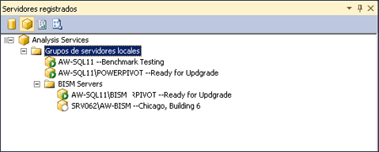

# Registrar una instancia de Analysis Services en un grupo de servidores
[!INCLUDE[ssas-appliesto-sqlas](../../includes/ssas-appliesto-sqlas.md)]Si tiene un gran número de instancias de servidor de Analysis Services, puede crear grupos de servidores en Management Studio para facilitar la administración de servidor. El objetivo de un grupo de servidores es proporcionar proximidad entre un grupo de servidores relacionados dentro del área de trabajo administrativo. Por ejemplo, suponga que se le encarga la tarea de administrar diez instancias independientes de Analysis Services. Agrupándolas según los criterios de tiempo de actividad y modo de servidor, o por departamento o región podría ver y conectarse a instancias que compartan las mismas características más fácilmente. También puede agregar información descriptiva que ayude a recordar cómo se utiliza el servidor.  
  
   
  
 Los grupos de servidores pueden crearse en una estructura jerárquica. El grupo de servidores locales es el nodo raíz. Siempre contiene las instancias de Analysis Services que se ejecutan en el equipo local. Puede agregar servidores remotos a un grupo, incluyendo el grupo local.  
  
 Después de crear un grupo de servidores, debe usar el panel Servidores registrados para ver los servidores miembro y conectarse a ellos. El panel filtra las instancias de SQL Server según el tipo de servidor (motor de base de datos, Analysis Services, Reporting Services e Integration Services). Haga clic en un tipo de servidor para ver los grupos de servidores creados para él. Para conectarse a un servidor concreto dentro del grupo, puede hacer doble clic en un servidor del grupo.  
  
 La información de conexión que se define para el servidor, incluido el nombre del servidor, se mantiene con el registro del servidor. No puede modificar la información de conexión ni usar el nombre registrado al conectarse al servidor con otras herramientas.  
  
## Crear un grupo de servidores y agregar servidores registrados  
  
1.  En Management Studio, haga clic en Servidores registrados en el menú Ver para abrir el panel Servidores registrados en el área de trabajo. De forma predeterminada, ya se crea un grupo de servidores locales. Todas las instancias de Analysis Services que se ejecutan en el servidor local son miembros.  
  
2.  Haga clic con el botón secundario en Grupo de servidores locales, seleccione Nuevo grupo de servidores y proporcione un nombre al grupo.  
  
3.  Haga clic con el botón secundario en el grupo de servidores y seleccione Nuevo registro de servidor. Escriba el nombre de red de una instancia local o un servidor remoto, incluido el nombre de instancia si el servidor se instaló como una instancia con nombre. Opcionalmente, puede proporcionar un nombre de servidor registrado que aparezca en Servidores registrados. Este nombre se usa solo en Servidores registrados. No puede usarlo para cambiar el nombre de un servidor, ni en una cadena de conexión. Un nombre de servidor registrado puede ser más descriptivo que el nombre de servidor real o incluir otras características de identificación que ayuden a distinguir este servidor de otros.  
  
  
