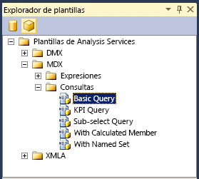

# <a name="use-analysis-services-templates-in-sql-server-management-studio"></a>Usar las plantillas de Analysis Services en SQL Server Management Studio
[!INCLUDE[ssas-appliesto-sqlas-all-aas](../../includes/ssas-appliesto-sqlas-all-aas.md)]

  [!INCLUDE[ssManStudioFull](../../includes/ssmanstudiofull-md.md)] proporciona un conjunto de plantillas para ayudarle a crear scripts XMLA, DMX o consultas MDX; para crear KPI en un cubo o un modelo tabular; incluir en scripts las operaciones de copia de seguridad y restauración; y otras muchas tareas. Las plantillas se encuentran en el **Explorador de plantillas** en [!INCLUDE[ssManStudio](../../includes/ssmanstudio-md.md)].  
  
 Este tema incluye una lista de las plantillas para los modelos multidimensionales y los modelos tabulares, y proporciona ejemplos del modo de crear una consulta MDX y una instrucción XMLA mediante el Explorador de metadatos y el Explorador de plantillas.  
  
 En este tema no se tratan las plantillas DMX. Para consultar ejemplos sobre cómo crear consultas de minería de datos con las plantillas, vea [Crear una consulta DMX en SQL Server Management Studio](../../analysis-services/data-mining/create-a-dmx-query-in-sql-server-management-studio.md) o [Crear una consulta de predicción singleton desde una plantilla](../../analysis-services/data-mining/create-a-singleton-prediction-query-from-a-template.md).  
  
##  <a name="bkmk_usingTE"></a> Abrir una plantilla de Analysis Services  
 Todas las plantillas para las consultas del motor de base de datos y las consultas y los comandos de Analysis Services están disponibles en el Explorador de plantillas.  
  
 Para abrir el **Explorador de plantillas**, selecciónelo en el menú **Ver** . Después, haga clic en el icono de cubo para ver una lista de las plantillas disponibles para [!INCLUDE[ssASnoversion](../../includes/ssasnoversion-md.md)].  
  
   
  
 Para abrir una plantilla, haga clic con el botón derecho en el nombre de la plantilla y seleccione **Abrir**, o bien arrastre la plantilla hasta una ventana de consulta que ya esté abierta. Cuando se abra la ventana de consulta, puede usar los comandos de la barra de herramientas o el menú Consulta de ayudar a generar las instrucciones:  
  
-   Para comprobar la sintaxis de una consulta, haga clic en **Analizar**.  
  
-   Para ejecutar una consulta, haga clic en **Ejecutar**.  
  
     Para detener una consulta que se está ejecutando, haga clic en **Cancelar ejecución de la consulta**.  
  
-   Vea los resultados de una consulta en la pestaña **Resultados** situada en la parte inferior de la pantalla.  
  
     Cambie a la pestaña **Mensajes** para ver el número de registros devueltos, los errores, las instrucciones de consulta y cualquier otro mensaje que esté asociado a la ejecución de la consulta. Por ejemplo, si ejecuta una instrucción DAX con un modelo que se ejecuta en modo de consulta directa, puede ver la instrucción de Transact-SQL que el motor analítico en memoria xVelocity (VertiPaq) genera.  
  
##  <a name="BKMK_Building_Queries"></a> Compilar y ejecutar una consulta MDX en un modelo tabular usando una plantilla  
 Este ejemplo muestra cómo crear una consulta MDX en SQL Server Management Studio, con una base de datos de modelo tabular como origen de datos. Para repetir este ejemplo en el equipo, puede [descargar el proyecto de ejemplo de modelo tabular de Adventureworks](http://go.microsoft.com/fwlink/?LinkId=231183).  
  
> [!WARNING]  
>  No puede utilizar consultas MDX en modelos tabulares que se hayan implementado en el modo de consulta directa. Sin embargo, puede enviar consultas equivalentes usando consultas de la tabla DAX con el comando EVALUATE. Para más información, consulte [Parámetros para las consultas DAX](http://msdn.microsoft.com/en-us/c5841b4e-3395-4237-815b-9822a691e544).  
  
#### <a name="create-an-mdx-query-from-a-template"></a>Crear una consulta MDX a partir de una plantilla  
  
1.  En [!INCLUDE[ssManStudioFull](../../includes/ssmanstudiofull-md.md)], abra la instancia que contiene el modelo tabular que desea consultar. Haga clic con el botón derecho en el icono de base de datos, seleccione **Nueva consulta**y, después, seleccione **MDX**.  
  
2.  En el Explorador de plantillas, en Plantillas de Analysis Services, abra **MDX**y, a continuación abra **Consultas**. Arrastre **Consulta básica** a la ventana de consulta.  
  
3.  Mediante el **Explorador de metadatos**, arrastre los campos y las medidas siguientes en la plantilla de consulta:  
  
    1.  Reemplace \<row_axis, mdx_set > con **[Product Category]. [ Nombre de categoría de producto]**.  
  
    2.  Reemplace \<column_axis, mdx_set > con **[Date]. [ Año natural]. [Año]** .  
  
    3.  Reemplace \<from_clause, mdx_name > con **[Internet Sales]**.  
  
    4.  Reemplace \<where_clause, mdx_set > con **[Measures]. [ Ventas totales por Internet]**.  
  
4.  Puede ejecutar la consulta tal cual, pero probablemente deseará hacer algunos cambios, como agregar una función para devolver miembros concretos. Por ejemplo, escriba **.members** después de **[Categoría de producto]. [Nombre de categoría de producto]**. Para más información, vea [Using Member Expressions](../../mdx/using-member-expressions.md).  
  
##  <a name="bkmk_backup"></a> Crear un script XMLA a partir de una plantilla  
 Las plantillas de comandos XMLA que se proporcionan en el Explorador de plantillas se pueden utilizar para crear scripts que permitan supervisar y actualizar los objetos de [!INCLUDE[ssASnoversion](../../includes/ssasnoversion-md.md)] , independientemente de si la instancia está en modo multidimensional y minería de datos, o en el modo tabular. Las plantillas **XMLA** incluyen ejemplos de los siguientes tipos de scripts:  
  
-   Operaciones de copia de seguridad, restauración y sincronización  
  
-   Cancelar el comando o el proceso especificado  
  
-   Procesar un objeto  
  
-   Detectar conjuntos de filas de esquema  
  
-   Supervisar el estado del servidor, incluidos los trabajos, las conexiones, las transacciones, la memoria y los contadores de rendimiento  
  
#### <a name="create-a-backup-command-script-from-a-template"></a>Crear un script de comandos de copia de seguridad a partir de una plantilla  
  
1.  En [!INCLUDE[ssManStudioFull](../../includes/ssmanstudiofull-md.md)], abra la instancia que contenga la base de datos que desea consultar. Haga clic con el botón derecho en el icono de base de datos, seleccione **Nueva consulta**y, después, seleccione **XMLA**.  
  
    > [!WARNING]  
    >  No puede establecer el contexto de una consulta XMLA cambiando la lista de restricciones o especificando una base de datos en el cuadro de diálogo de conexión. Debe abrir la ventana de consulta XMLA desde la base de datos que desee consultar.  
  
2.  Arrastre la plantilla **Copia de seguridad** en la ventana de consulta vacía.  
  
3.  Haga doble clic en el texto dentro de la \<DatabaseID > elemento.  
  
4.  En el Explorador de objetos, seleccione la base de datos de la que desee hacer una copia de seguridad y arrastre y coloque la base de datos entre corchetes del elemento DatabaseID.  
  
5.  Haga doble clic en el texto dentro de la \<archivo > elemento. Escriba el nombre del archivo de copia de seguridad, incluida la extensión de archivo .abf. Especifique la ruta de acceso completa si no usa la ubicación predeterminada de copia de seguridad. Para más información, vea [Restaurar, sincronizar y realizar copias de seguridad de bases de datos &#40;XMLA&#41;](../../analysis-services/multidimensional-models-scripting-language-assl-xmla/backing-up-restoring-and-synchronizing-databases-xmla.md).  
  
##  <a name="bkmk_schemarowset"></a> Generar una consulta de conjunto de filas de esquema usando una plantilla XMLA  
 El **Explorador de plantillas** contiene solo una plantilla para las consultas de conjunto de filas de esquema. Para usar esta plantilla, debe conocer los requisitos del conjunto de filas de esquema individual que desea utilizar, incluido cualquier elemento necesario, y las columnas que se pueden usa como restricciones. Para más información, vea [Conjuntos de filas de esquema de Analysis Services](../../analysis-services/schema-rowsets/analysis-services-schema-rowsets.md).  
  
 Tenga en cuenta que muchos de los conjuntos de filas de esquema también se han expuesto como vistas de administración dinámica (DMV) por simplicidad. Mediante la DMV correspondiente, puede consultar el conjunto de filas de esquema con una sintaxis similar a la de Transact-SQL. Por ejemplo, las siguientes consultas devuelven los mismos resultados, pero uno está en formato XML y otro en formato tabular. Para más información sobre las DMV, vea [Usar vistas de administración dinámica &#40;DMV&#41; para supervisar Analysis Services](../../analysis-services/instances/use-dynamic-management-views-dmvs-to-monitor-analysis-services.md).  
  
 DMV que devuelve una lista de todos los conjuntos de filas de esquema disponibles como DMV:  
  
```  
SELECT * FROM $system.DISCOVER_SCHEMA_ROWSETS  
```  
  
 Comando XMLA que enumera la lista de los conjuntos de filas de esquema disponibles:  
  
```  
<Discover xmlns="urn:schemas-microsoft-com:xml-analysis">  
<RequestType>DISCOVER_SCHEMA_ROWSETS</RequestType>  
    <Restrictions>  
<RestrictionList>  
</RestrictionList>  
</Restrictions>  
    <Properties>  
<PropertyList>  
   </PropertyList>  
</Properties>  
</Discover>  
```  
  
#### <a name="get-a-list-of-data-sources-for-a-tabular-model-using-a-schema-rowset-query"></a>Obtener una lista de orígenes de datos para un modelo tabular con una consulta del conjunto de filas de esquema  
  
1.  En [!INCLUDE[ssManStudioFull](../../includes/ssmanstudiofull-md.md)], abra la instancia que contenga la base de datos que desea consultar. Haga clic con el botón derecho en el icono de base de datos, seleccione **Nueva consulta**y, después, seleccione **XMLA**.  
  
    > [!WARNING]  
    >  No puede establecer el contexto de una consulta XMLA cambiando la lista de restricciones o especificando una base de datos en el cuadro de diálogo de conexión. Debe abrir la ventana de consulta XMLA desde la base de datos que desee consultar.  
  
2.  Abra **Explorador de plantillas**y arrastre la plantilla **Detectar conjuntos de filas de esquema**, en la ventana de consulta en blanco.  
  
3.  En la plantilla, reemplace la [elemento RequestType &#40;XMLA&#41; ](../../analysis-services/xmla/xml-elements-properties/requesttype-element-xmla.md) elemento con el texto siguiente: `<RequestType>MDSCHEMA_INPUT_DATASOURCES</RequestType>`  
  
4.  Haga clic en **Ejecutar**.  
  
     Resultados esperados:  
  
    ```  
    <CATALOG_NAME>AW Internet Sales Tabular Model_ 24715b71-ea74-4828-aefc-d4c12c15db64</CATALOG_NAME>   
    <DATASOURCE_NAME>SqlServer localhost AdventureWorksDW2012</DATASOURCE_NAME>   
    <DATASOURCE_TYPE>Relational</DATASOURCE_TYPE>   
    <CREATED_ON>2011-10-12T20:27:05.196667</CREATED_ON>   
    <LAST_SCHEMA_UPDATE>2011-10-12T20:27:05.196667</LAST_SCHEMA_UPDATE>   
    <DESCRIPTION />   
    <TIMEOUT>0</TIMEOUT>   
    <DBMS_NAME>Microsoft SQL Server</DBMS_NAME>   
    <DBMS_VERSION>11.00.1724</DBMS_VERSION>  
  
    ```  
  
##  <a name="bkmk_Ref"></a> Referencia de las plantillas de Analysis Services  
 Las plantillas siguientes se proporcionan para trabajar con bases de datos de Analysis Services y los objetos de la base de datos, incluidas las restricciones de minería de datos y los modelos de minería de datos, los cubos y los modelos tabulares:  
  
|Categoría|Plantilla de elementos|Description|  
|--------------|-------------------|-----------------|  
|DMX\Contenido del modelo|Content Query|Muestra cómo utilizar el DMX SELECT FROM  *\<modelo >*. Instrucción contenido que se va a recuperar el contenido de conjunto de filas del esquema de modelo de minería de datos para un modelo de minería de datos especificado.|  
||Continuous Column Values|Muestra cómo utilizar el DMX SELECT DISTINCT FROM  *\<modelo >* instrucción con DMX **RangeMin** y **RangeMax** funciones para recuperar un conjunto de valores en un intervalo especificado de las columnas continuas en un modelo de minería de datos especificado.|  
||Discrete Column Values|Muestra cómo utilizar el DMX SELECT DISTINCT FROM  *\<modelo >* instrucción recuperar un conjunto completo de valores de las columnas discretas de un modelo de minería de datos especificado.|  
||Drillthrough Query|Muestra cómo usar la instrucción DMX SELECT * FROM Model.CASES con la función DMX IsInNode para llevar a cabo una consulta de obtención de detalles.|  
||Model Attributes|Muestra cómo usar la función DMX System.GetModelAttributes para obtener la lista de los atributos utilizados por un modelo.|  
||PMML Content|Muestra cómo utilizar la instrucción SELECT de DMX \* FROM  *\<modelo >*. Instrucción de PMML que se va a recuperar la representación del lenguaje de marcado de modelos de predicción (PMML) del modelo de minería de datos, en los algoritmos que admiten esta funcionalidad.|  
|DMX\Administración de modelos|Add Model|Muestra cómo usar la instrucción DMX ALTER MINING MODEL STRUCTURE para agregar un modelo de minería de datos.|  
||Clear Model|Muestra cómo usar la instrucción DMX DELETE * FROM MINING MODEL para eliminar el contenido de un modelo de minería de datos especificado.|  
||Clear Structure Cases|Muestra cómo usar la instrucción DMX DELETE FROM MINING STRUCTURE para borrar casos de estructura de modelo de minería de datos.|  
||Clear Structure|Muestra cómo usar la instrucción DMX DELETE FROM MINING STRUCTURE para borrar una estructura de modelo de minería de datos.|  
||Create from PMML|Muestra cómo usar la instrucción DMX CREATE MINING MODEL con la cláusula FROM PMML para crear un modelo de minería de datos desde una representación PMML.|  
||Create Structure Nested|Muestra cómo usar la instrucción DMX CREATE MINING STRUCTURE con una lista de definición de columna anidada para crear un modelo de minería de datos con columnas anidadas.|  
||Create Structure|Muestra cómo usar la instrucción DMX CREATE MINING STRUCTURE para crear un modelo de minería de datos.|  
||Drop Model|Muestra cómo usar la instrucción DMX DROP MINING MODEL para eliminar un modelo de minería de datos existente.|  
||Drop Structure|Muestra cómo usar la instrucción DMX DROP MINING STRUCTURE para eliminar una estructura de minería de datos existente.|  
||Export Model|Muestra cómo usar la instrucción DMX EXPORT MINING MODEL con las cláusulas WITH DEPENDENCIES y PASSWORD para exportar a un archivo un modelo de minería de datos, incluyendo el origen de datos y la vista del origen de datos de la que depende el modelo.|  
||Export Structure|Muestra cómo usar la instrucción DMX EXPORT MINING STRUCTURE con la cláusula WITH DEPENDENCIES para exportar a un archivo una estructura de minería de datos, incluyendo todos los modelos de minería de datos que contiene la estructura, el origen de datos y la vista del origen de datos de la que depende la estructura.|  
||Importar|Muestra cómo usar la instrucción DMX IMPORT FROM con la cláusula WITH PASSWORD para llevar a cabo una importación.|  
||Rename Model|Muestra cómo usar la instrucción DMX RENAME MINING MODEL para cambiar el nombre de un modelo de minería de datos existente.|  
||Rename Structure|Muestra cómo usar la instrucción DMX RENAME MINING STRUCTRE para cambiar el nombre de una estructura de minería de datos existente.|  
||Train Model|Muestra cómo usar la instrucción DMX INSERT INTO MINING MODEL para entrenar un modelo de minería de datos en una estructura ya entrenada.|  
||Train Nested Structure|Muestra cómo combinar la instrucción DMX INSERT INTO MINING STRUCTURE con la consulta de datos de origen SHAPE para entrenar un modelo de minería de datos que contiene columnas anidadas con datos que contienen tablas anidadas, recuperadas mediante una consulta, de un origen de datos existente.|  
||Train Structure|Muestra cómo combinar la instrucción DMX INSERT INTO MINING STRUCTURE con la consulta de datos de origen OPENQUERY para entrenar una estructura de minería de datos.|  
|DMX\Consultas de predicción|Base Prediction|Muestra cómo combinar DMX SELECT FROM  *\<modelo >* instrucción PREDICTION JOIN con la consulta de datos de origen OPENQUERY para ejecutar una consulta de predicción en un modelo de minería de datos con datos, recuperados mediante una consulta de un origen de datos existente.|  
||Nested Prediction|Muestra cómo combinar DMX SELECT FROM  *\<modelo >* instrucción PREDICTION JOIN con las consultas de datos de origen SHAPE y OPENQUERY para ejecutar una consulta de predicción en un modelo de minería de datos con los datos que contienen anidados tablas, recuperadas mediante una consulta de un origen de datos existente.|  
||Nested Singleton Prediction|Muestra cómo utilizar DMX SELECT FROM  *\<modelo >* cláusula NATURAL PREDICTION JOIN para ejecutar una consulta de predicción en un modelo de minería de datos con un valor único, que se especifica explícitamente en la consulta de predicción, en una columna cuyo nombre coincida con una columna en el modelo de minería de datos y que contiene un conjunto de valores en una tabla anidada creada mediante una instrucción UNION cuyos nombres coincidan con también a las columnas anidadas del modelo de minería de datos.|  
||Singleton Prediction|Muestra cómo utilizar DMX SELECT FROM \<modelo > NATURAL PREDICTION JOIN, instrucción para ejecutar una consulta de predicción en un modelo de minería de datos con un valor único, que se especifica explícitamente en la consulta de predicción, en una columna cuyo nombre coincida con una columna de el modelo de minería de datos.|  
||Stored Procedure Call|Muestra cómo usar la instrucción DMX CALL para llamar a un procedimiento almacenado.|  
|MDX\Expresiones|Moving Average-Fixed|Muestra cómo usar las funciones MDX **ParallelPeriod** y **CurrentMember** con un conjunto ordenado de forma natural para crear una medida calculada que proporcione una media móvil de una medida a lo largo de un número fijo de períodos de tiempo incluidos en una jerarquía de una dimensión temporal.|  
||Moving Average-Variable|Muestra cómo usar la instrucción MDX **CASE** dentro de la función **Avg** para crear una medida calculada que proporcione una media móvil de una medida a lo largo de un número variable de períodos de tiempo incluidos en una jerarquía de una dimensión temporal.|  
||Periods to Date|Muestra cómo usar la función MDX **PeriodsToDate** en un miembro calculado.|  
||Ratio to Parent|Muestra cómo usar la función MDX **Parent** para crear una medida calculada que representa un porcentaje de relación de una medida por cada miembro secundario de un miembro primario de una jerarquía especificada.|  
||Ratio to Total|Muestra cómo usar el miembro All para crear una medida calculada que representa un porcentaje de relación de una medida por cada miembro de una jerarquía especificada.|  
|MDX\Consultas|Consulta básica|Muestra una instrucción básica MDX SELECT a partir de la cual puede generar una consulta MDX.|  
||KPI Query|Muestra cómo usar las funciones MDX **KPIValue** y **KPIGoal** para recuperar información de indicador clave de rendimiento (KPI) en una consulta MDX.|  
||Sub-select Query|Muestra cómo crear una instrucción MDX SELECT que recupere información de un subcubo definido por otra instrucción SELECT.|  
||With Calculated Member|Muestra cómo usar la cláusula MDX WITH en una instrucción SELECT para definir un miembro calculado en una consulta MDX.|  
||With Named Set|Muestra cómo usar la cláusula MDX WITH en una instrucción SELECT para definir un conjunto con nombre en una consulta MDX.|  
|XMLA\Administración|Copia de seguridad|Muestra cómo usar el comando XMLA **Copia de seguridad** para hacer una copia de seguridad de una base de datos de [!INCLUDE[ssASnoversion](../../includes/ssasnoversion-md.md)] en un archivo.|  
||Cancelar|Muestra cómo usar el comando XMLA **Cancel** para cancelar todas las operaciones que se están ejecutando en la sesión actual (para los usuarios que no sean administradores o administradores de servidor), en las bases de datos (para los administradores) o en la instancia (para los administradores de servidor).|  
||Create Remote Partition Database|Muestra cómo usar el comando XMLA **Crear** con el elemento de base de datos ASSL (Lenguaje de scripting de [!INCLUDE[ssASnoversion](../../includes/ssasnoversion-md.md)] ) para crear una base de datos de [!INCLUDE[ssASnoversion](../../includes/ssasnoversion-md.md)] y un origen de datos para el almacenamiento de particiones remotas.|  
||Delete|Muestra cómo usar el comando XMLA **Delete** para eliminar una base de datos de [!INCLUDE[ssASnoversion](../../includes/ssasnoversion-md.md)] existente.|  
||Process Dimension|Muestra cómo usar el comando XMLA **Batch** , combinado con el elemento **Parallel** y el comando **Process** , para actualizar los atributos de una dimensión utilizando una operación por lotes paralela.|  
||Process Partition|Muestra cómo usar el comando XMLA **Batch** , combinado con el elemento **Parallel** y el comando **Process** , para procesar completamente una partición utilizando una operación por lotes paralela.|  
||Restore|Muestra cómo usar el comando XMLA **Restore** para restaurar una base de datos de [!INCLUDE[ssASnoversion](../../includes/ssasnoversion-md.md)] desde un archivo de copia de seguridad existente.|  
||Sincronizar|Muestra cómo usar el comando XMLA **Sincronizar** para sincronizar otra base de datos de [!INCLUDE[ssASnoversion](../../includes/ssasnoversion-md.md)] con la base de datos actual de [!INCLUDE[ssASnoversion](../../includes/ssasnoversion-md.md)] database using the SkipMembership option for the SincronizarSecurity tag.|  
|XMLA\Conjuntos de filas de esquema|Detectar conjuntos de filas de esquema|Muestra cómo usar el método XMLA **Discover** para recuperar el contenido del conjunto de filas de esquema DISCOVER_SCHEMA_ROWSETS.|  
|XMLA\Estado del servidor|Conexiones|Muestra cómo usar el método XMLA **Discover** para recuperar el contenido del conjunto de filas de esquema DISCOVER_CONNECTIONS.|  
||Jobs|Muestra cómo usar el método XMLA **Discover** para recuperar el contenido del conjunto de filas de esquema DISCOVER_JOBS.|  
||Ubicaciones|Muestra cómo usar el método XMLA **Discover** para recuperar el contenido del conjunto de filas de esquema DISCOVER_LOCATIONS al especificar la ruta de los archivos de copia de seguridad de la ubicación.|  
||Bloqueos|Muestra cómo usar el método XMLA **Discover** para recuperar el contenido del conjunto de filas de esquema DISCOVER_LOCKS.|  
||Memory Grant|Muestra cómo usar el método XMLA **Discover** para recuperar el contenido del conjunto de filas de esquema DISCOVER_MEMORYGRANT.|  
||Contadores de rendimiento|Muestra cómo usar el método XMLA **Discover** para recuperar el contenido del conjunto de filas de esquema DISCOVER_PERFORMANCE_COUNTERS.|  
||Sesiones|Muestra cómo usar el método XMLA **Discover** para recuperar el contenido del conjunto de filas de esquema DISCOVER_SESSIONS.|  
||Traces|Muestra cómo usar el método XMLA **Discover** para recuperar el contenido del conjunto de filas de esquema DISCOVER_TRACES.|  
||Transactions|Muestra cómo usar el método XMLA **Discover** para recuperar el contenido del conjunto de filas de esquema DISCOVER_TRANSACTIONS.|  
  
## <a name="see-also"></a>Vea también  
 [Referencia de expresiones multidimensionales &#40;MDX&#41;](../../mdx/multidimensional-expressions-mdx-reference.md)   
 [Extensiones de minería de datos & #40; DMX & #41; Referencia](../../dmx/data-mining-extensions-dmx-reference.md)   
 [Referencia de Analysis Services Scripting Language &#40;ASSL para XMLA&#41;](../../analysis-services/scripting/analysis-services-scripting-language-assl-for-xmla.md)   
 [Lenguaje de Scripting de Analysis Services &#40;ASSL para XMLA&#41;](../../analysis-services/scripting/analysis-services-scripting-language-assl-for-xmla.md)  
  
  
