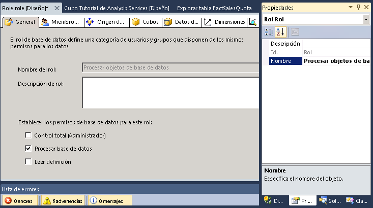
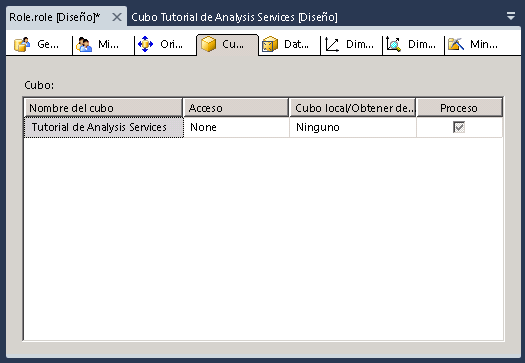

# Lección 10 - conceder permisos de base de datos de proceso
[!INCLUDE[ssas-appliesto-sqlas](../includes/ssas-appliesto-sqlas.md)]Después de instalar una instancia de [!INCLUDE[ssASnoversion](../includes/ssasnoversion-md.md)], todos los miembros de la [!INCLUDE[ssASnoversion](../includes/ssasnoversion-md.md)] rol de administrador de servidor en esa instancia de tiene permisos de todo el servidor para realizar cualquier tarea dentro de la instancia de [!INCLUDE[ssASnoversion](../includes/ssasnoversion-md.md)]. De manera predeterminada, ningún otro usuario tiene permiso para administrar o ver objetos en la instancia de [!INCLUDE[ssASnoversion](../includes/ssasnoversion-md.md)].  
  
Un miembro del rol de administrador de servidor puede conceder a los usuarios acceso administrativo en un servidor si los convierte en miembros del rol. Un miembro del rol de administrador de servidor puede conceder también a los usuarios acceso de forma más limitada concediéndoles permisos administrativos o de acceso limitados o completos en el nivel de base de datos. Los permisos administrativos limitados incluyen permisos Procesar o Leer definición en el nivel de base de datos, cubo o dimensión.  
  
En las tareas de este tema definirá un rol de seguridad Procesar objetos de base de datos que conceda a los miembros del rol permiso para procesar todos los objetos de la base de datos, pero ningún permiso para ver datos de la base de datos.  
  
## Definir un rol de seguridad Procesar objetos de base de datos  
  
1.  En el Explorador de soluciones, haga clic con el botón derecho en **Roles** y, después, haga clic en **Nuevo rol** para abrir el Diseñador de roles.  
  
2.  Haga clic en la casilla **Procesar base de datos** .  
  
3.  En la ventana Propiedades, cambie la propiedad **Nombre** de este nuevo rol a **Rol Procesar objetos de base de datos**.  
  
      
  
4.  Vaya a la pestaña **Pertenencia** del Diseñador de roles y haga clic en **Agregar**.  
  
5.  Especifique las cuentas de los usuarios o grupos de dominios de Windows que sean miembros de este rol. Haga clic en **Comprobar nombres** para comprobar la información de la cuenta y haga clic en **Aceptar**.  
  
6.  Vaya a la pestaña **Cubos** del Diseñador de roles.  
  
    Observe que los miembros de este rol tienen permisos para procesar esta base de datos, pero no tienen permiso para obtener acceso a los datos del cubo [!INCLUDE[ssASnoversion](../includes/ssasnoversion-md.md)] Tutorial y no tienen acceso a obtención de detalles o cubo local, como se muestra en la siguiente imagen.  
  
      
  
7.  Vaya a la pestaña **Dimensiones** del Diseñador de roles.  
  
    Observe que los miembros de este rol tienen permisos para procesar todos los objetos de dimensión de esta base de datos y que, de manera predeterminada, tienen permisos de lectura para tener acceso a cada objeto de dimensión de la base de datos del Tutorial de [!INCLUDE[ssASnoversion](../includes/ssasnoversion-md.md)] :  
  
8.  En el menú **Compilar** , haga clic en **Tutorial de Implementar Analysis Services**.  
  
    Acaba de definir e implementar correctamente el rol de seguridad Procesar objetos de base de datos. Después de que el cubo se implemente en el entorno de producción, los administradores del cubo implementado podrán agregar usuarios a este rol según vayan necesitando delegar responsabilidades de procesamiento en usuarios específicos.  
  
> [!NOTE]  
> Para disponer de un proyecto completado de la Lección 10, descargue e instale los ejemplos. Para más información, consulte [Instalar los datos y proyectos de ejemplo para el tutorial de modelado multidimensional de Analysis Services](../analysis-services/install-sample-data-and-projects.md).  
  
## Vea también  
[Roles y permisos &#40;Analysis Services&#41;](../analysis-services/multidimensional-models/roles-and-permissions-analysis-services.md)  
  
  
  
