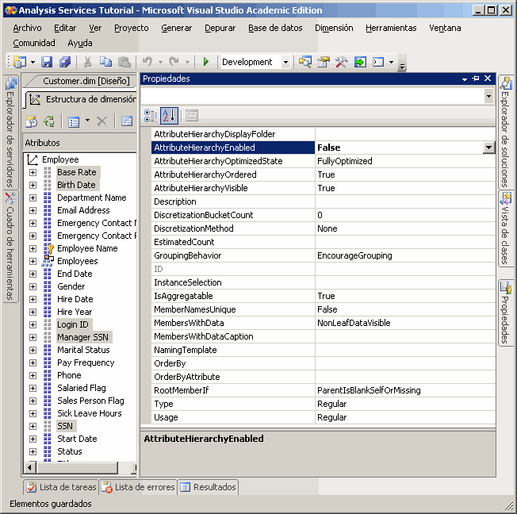
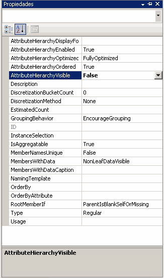

# Lección 4-4-ocultar y deshabilitar jerarquías de atributo
De forma predeterminada, se crea una jerarquía de atributo para cada uno de los atributos de una dimensión, y cada jerarquía está disponible para los datos de hechos de dimensionamiento. Esta jerarquía consta de un nivel "Todos" y un nivel de detalle que contiene todos los miembros de la jerarquía. Como ha aprendido, puede organizar los atributos en jerarquías definidas por el usuario para proporcionar rutas de navegación en un cubo. En determinadas circunstancias, le interesará deshabilitar u ocultar algunos atributos y sus jerarquías. Por ejemplo, determinados atributos, como los números de seguridad social o números de identificación nacional, sueldos, las fechas de nacimiento e información sobre el inicio de sesión, no son atributos que los usuarios vayan a utilizar para dimensionar la información del cubo. En lugar de ello, generalmente esta información solo se visualiza como detalles de un miembro de atributo en concreto. Puede ocultar estas jerarquías de atributo, dejando los atributos visibles solo como propiedades de miembro de un atributo específico. También puede hacer que los miembros de otros atributos, como los nombres de cliente o los códigos postales, solo estén visibles cuando se visualizan a través de una jerarquía de usuario en lugar de visualizarse de forma independiente a través de una jerarquía de atributo. Un motivo para hacerlo puede ser el número total de miembros distintos de la jerarquía de atributo. Por último, para mejorar el rendimiento del procesamiento, debe deshabilitar las jerarquías de atributos que los usuarios no utilizarán para examinar.  
  
El valor de la propiedad **AttributeHierarchyEnabled** determina si se ha creado una jerarquía de atributo. Si esta propiedad se establece en **False**, la jerarquía de atributo no se crea y el atributo no puede utilizarse como nivel en una jerarquía de usuario; la jerarquía de atributo solo existe como propiedad de miembro. No obstante, una jerarquía de atributo deshabilitada puede utilizarse para ordenar los miembros de otro atributo. Si el valor de la propiedad **AttributeHierarchyEnabled** se establece en **True**, el valor de la propiedad **AttributeHierarchyVisible** determina si la jerarquía de atributo es visible independientemente de su uso en una jerarquía definida por el usuario.  
  
Cuando una jerarquía de atributo está habilitada, puede especificar valores para las tres propiedades adicionales siguientes:  
  
-   **IsAggregatable**  
  
    De forma predeterminada se define un nivel (Todos) para todas las jerarquías de atributo. Para deshabilitar el nivel (Todos) de una jerarquía de atributo habilitada, establezca el valor de esta propiedad en **False**.  
  
    > [!NOTE]  
    > Un atributo que tiene su propiedad **IsAggregatable** establecida en False solamente puede usarse como la raíz de una jerarquía definida por el usuario y debe tener un miembro predeterminado especificado (en caso contrario, el motor de [!INCLUDE[ssASnoversion](../includes/ssasnoversion-md.md)] elegirá uno).  
  
-   **AttributeHierarchyOrdered**  
  
    De forma predeterminada, [!INCLUDE[ssASnoversion](../includes/ssasnoversion-md.md)] ordena los miembros de las jerarquías de atributo habilitadas durante el procesamiento y luego almacena los miembros según el valor de la propiedad **OrderBy** , como Nombre o Clave. Si el orden no le importa, puede incrementar el rendimiento del procesamiento estableciendo el valor de esta propiedad en **False**.  
  
-   **AttributeHierarchyOptimizedState**  
  
    De forma predeterminada, y con el objeto de mejorar el rendimiento de las consultas, [!INCLUDE[ssASnoversion](../includes/ssasnoversion-md.md)] crea durante el procesamiento un índice para cada jerarquía de atributo habilitada. Si no tiene previsto utilizar una jerarquía de atributo para explorar, puede incrementar el rendimiento del procesamiento estableciendo el valor de esta propiedad en **NotOptimized**. No obstante, si utiliza una jerarquía oculta como atributo clave para la dimensión, el rendimiento también mejorará si crea un índice de los miembros del atributo.  
  
Estas propiedades no se aplican si la jerarquía de atributo está deshabilitada.  
  
En las tareas de este tema, deshabilitará los números de seguridad social y otros atributos en la dimensión Employee que no se utilizarán para examinar. Luego ocultará las jerarquías de atributo de nombre de cliente y código postal en la dimensión Customer. Debido al elevado número de miembros de atributo de estas jerarquías, examinarlas será un proceso muy lento, independientemente de la jerarquía de usuario que utilice.  
  
## Establecer las propiedades de la jerarquía de atributo en la dimensión Employee  
  
1.  Cambie al Diseñador de dimensiones para la dimensión Employee y haga clic en la pestaña **Explorador** .  
  
2.  Compruebe que las jerarquías de atributo siguientes aparecen en la lista **Jerarquía** :  
  
    -   **Base Rate**  
  
    -   **Fecha de nacimiento**  
  
    -   **Id. de inicio de sesión**  
  
    -   **Número de seguridad social del director**  
  
    -   **SSN**  
  
3.  Vaya a la pestaña **Estructura de dimensión** y seleccione los atributos siguientes en el panel **Atributos** . Para seleccionar varias medidas, haga clic en cada una de ellas mientras mantiene presionada la tecla CTRL:  
  
    -   **Base Rate**  
  
    -   **Fecha de nacimiento**  
  
    -   **Id. de inicio de sesión**  
  
    -   **Número de seguridad social del director**  
  
    -   **SSN**  
  
4.  En la ventana Propiedades, establezca el valor de la propiedad **AttributeHierarchyEnabled** en **False** para los atributos seleccionados.  
  
    Observe que, en el panel **Atributos** , el icono de cada atributo ha cambiado para indicar que el atributo no está habilitado.  
  
    En la imagen siguiente se muestra la propiedad **AttributeHierarchyEnabled** establecida en False para los atributos seleccionados.  
  
      
  
5.  En el menú **Compilar** , haga clic en **Tutorial de Implementar Analysis Services**.  
  
6.  Cuando el proceso haya finalizado correctamente, diríjase a la pestaña **Explorador** , haga clic en **Volver a conectar**y, a continuación, intente examinar las jerarquías de atributo modificadas.  
  
    Observe que los miembros de los atributos modificados no están disponibles para examinar como jerarquías de atributo en la lista **Jerarquía** . Si intenta agregar una de las jerarquías de atributo deshabilitadas como nivel en una jerarquía de usuario, recibirá un error en el que se le notificará que debe habilitar la jerarquía de atributo para que ésta pueda participar en una jerarquía definida por el usuario.  
  
## Establecer las propiedades de la jerarquía de atributo en la dimensión Customer  
  
1.  Cambie al Diseñador de dimensiones para la dimensión Customer y haga clic en la pestaña **Explorador** .  
  
2.  Compruebe que las jerarquías de atributo siguientes aparecen en la lista **Jerarquía** :  
  
    -   **Nombre completo**  
  
    -   **Código postal**  
  
3.  Cambie a la pestaña **Estructura de dimensión** y seleccione los atributos siguientes en el panel **Atributos** (utilice la tecla CTRL si desea seleccionar varios atributos al mismo tiempo):  
  
    -   **Nombre completo**  
  
    -   **Código postal**  
  
4.  En la ventana Propiedades, establezca el valor de la propiedad **AttributeHierarchyVisible** en **False** para los atributos seleccionados.  
  
    Puesto que los miembros de estas jerarquías de atributo se utilizarán para dimensionar datos de hechos, si ordena y optimiza dichos miembros, mejorará el rendimiento. Por consiguiente, las propiedades de estos atributos no deben cambiarse.  
  
    En la imagen siguiente se muestra la propiedad **AttributeHierarchyVisible** establecida en False.  
  
      
  
5.  Arrastre el atributo **Postal Code** del panel **Atributos** a la jerarquía de usuario **Customer Geography** en el panel **Jerarquías y niveles** que se encuentra justo en el nivel **City** .  
  
    Observe que el atributo oculto puede seguir convirtiéndose en un nivel de una jerarquía de usuario.  
  
6.  En el menú **Compilar** , haga clic en **Tutorial de Implementar Analysis Services**.  
  
7.  Cuando la implementación haya finalizado correctamente, vaya a la pestaña **Explorador** de la dimensión Customer y haga clic en **Volver a conectar**.  
  
8.  Intente seleccionar cualquiera de las jerarquías de atributo modificadas en la lista **Jerarquía** .  
  
    Observe que ninguna de las jerarquías de atributo modificadas aparece en la lista **Jerarquía** .  
  
9. En la lista **Jerarquía** , seleccione **Customer Geography**y examine cada nivel del panel del explorador.  
  
    Observe que los niveles ocultos, **Código postal** y **Nombre completo**, están visibles en la jerarquía definida por el usuario.  
  
## Siguiente tarea de la lección  
[Ordenar los miembros de atributo en función de un atributo secundario](../analysis-services/lesson-4-5-sorting-attribute-members-based-on-a-secondary-attribute.md)  
  
  
  

