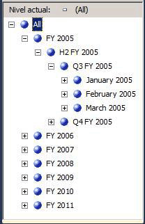
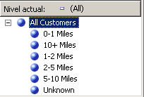
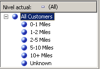

# Lección 4-5 - Ordenar miembros del atributo en función de un atributo secundario
[!INCLUDE[ssas-appliesto-sqlas](../includes/ssas-appliesto-sqlas.md)]En la lección 3, aprendió a ordenar a los miembros de atributo en función de su nombre o el valor de clave. También aprendió a utilizar una clave de miembro compuesta que afectaba a todos los miembros de atributo y al criterio de ordenación. Para obtener más información, consulte [Modificar la dimensión Date](../analysis-services/lesson-3-4-modifying-the-date-dimension.md). Sin embargo, si ni el nombre ni la clave del atributo ofrecen el orden que desea, puede usar un atributo secundario para conseguir el criterio de ordenación deseado. Definir una relación entre los atributos, puede usar el segundo atributo para ordenar los miembros del primer atributo.  
  
Las relaciones de atributo definen las relaciones o dependencias que existen entre los atributos. En una dimensión que se basa en una única tabla relacional, todos los atributos están generalmente relacionados entre sí a través del atributo de clave. Esto es así porque todos los atributos de una dimensión proporcionan información sobre los miembros vinculados por el atributo de clave de la dimensión a los hechos de la tabla de hechos de cada grupo de medida relacionado. En una dimensión que se basa en varias tablas, los atributos generalmente están vinculados en función de la clave de combinación entre las tablas. Si los datos subyacentes lo permiten, los atributos relacionados se pueden utilizar para especificar un criterio de ordenación. Por ejemplo, puede crear un nuevo atributo que proporciona la lógica de ordenación para un atributo relacionado.  
  
El Diseñador de dimensiones permite definir relaciones adicionales entre atributos o cambiar las relaciones predeterminadas para incrementar el rendimiento. La limitación principal que existe al crear una relación de atributo es asegurarse de que el atributo al que se hace referencia no tiene más de un valor para ningún miembro del atributo con el que está relacionado. Cuando se define una relación entre dos atributos, se puede definir la relación como rígida o flexible, en función de si las relaciones entre los miembros cambiarán con el tiempo. Por ejemplo, un empleado podría cambiar de región de venta, pero una ciudad nunca pasará a formar parte de una provincia distinta. Si se define una relación como rígida, las agregaciones de atributos no se calculan de nuevo cada vez que se procesa la dimensión de forma incremental. No obstante, si la relación entre los miembros cambia, la dimensión debe procesarse por completo. Para obtener más información, consulte [Relaciones de atributo](../analysis-services/multidimensional-models-olap-logical-dimension-objects/attribute-relationships.md), [Definir relaciones de atributo](../analysis-services/multidimensional-models/attribute-relationships-define.md), [Configurar propiedades de relación de los atributos](../analysis-services/multidimensional-models/attribute-relationships-configure-attribute-properties.md)y [Especificar relaciones de atributo entre los atributos de una jerarquía definida por el usuario](../analysis-services/4-6-specifying-attribute-relationships-in-user-defined-hierarchy.md).  
  
En las tareas de este tema, definirá un atributo nuevo en la dimensión **Date** basado en una columna existente de la tabla de dimensiones subyacente. Utilizará este atributo nuevo para ordenar los miembros del mes natural cronológicamente en lugar de ordenarlos alfabéticamente. También definirá un atributo nuevo en la dimensión **Customer** basado en el cálculo con nombre que usará para ordenar los miembros del atributo **Commute Distance** . En las tareas del tema siguiente, aprenderá a utilizar las relaciones de atributo para incrementar el rendimiento de las consultas.  
  
## Definir una relación de atributo y el criterio de ordenación en la dimensión Date  
  
1.  Abra el Diseñador de dimensiones para la dimensión **Date** y revise la propiedad **OrderBy** del atributo **Month Name** en la ventana Propiedades.  
  
    Observe que los miembros del atributo **Month Name** están ordenados por sus valores de clave.  
  
2.  Cambie a la pestaña **Explorador** , compruebe que **Calendar Date** está seleccionado en la lista **Jerarquía** y, después, expanda los niveles de la jerarquía definida por el usuario para revisar el criterio de ordenación de los meses naturales.  
  
    Observe que los miembros de la jerarquía de atributo están ordenados en función de los valores ASCII de las claves de sus miembros, que son el mes y el año. En este caso, si se ordena por el nombre o la clave del atributo, los meses naturales no se ordenan cronológicamente. Para resolver este problema, ordenará los miembros de la jerarquía de atributos en función de un atributo nuevo, el atributo **MonthNumberOfYear** . Creará este atributo tomando como base una columna que ya existe en la tabla de dimensiones **Date** .  
  
3.  Cambie a la pestaña **Estructura de dimensión** de la dimensión Date, haga clic con el botón secundario en **MonthNumberOfYear** en el panel **Vista del origen de datos** y, después, haga clic en **Nuevo atributo de columna**.  
  
4.  En el panel **Atributos** , seleccione **Month Number Of Year**y, después, establezca la propiedad **AttributeHierarchyEnabled** en **False** en la ventana Propiedades, la propiedad **AttributeHierarchyOptimizedState** en **NotOptimized**y la propiedad **AttributeHierarchyOrdered** en **False**.  
  
    Estos parámetros ocultarán el atributo ante los usuarios y mejorarán el tiempo de procesamiento. Este atributo no se usará para examinar. Solo se utilizará para ordenar los miembros de otro atributo.  
  
    > [!NOTE]  
    > Al ordenar alfabéticamente las propiedades de la ventana Propiedades se simplificará esta tarea ya que las tres propiedades aparecerán una al lado de la otra.  
  
5.  Haga clic en la pestaña **Relación de atributo** .  
  
    Observe que todos los atributos de la dimensión **Date** están relacionados directamente con el atributo **Date** , que es el miembro de clave que relaciona los miembros de dimensión con los hechos de los grupos de medida relacionados. No hay ninguna relación definida entre el atributo **Month Name** y el atributo **Month Number Of Year** .  
  
6.  En el diagrama, haga clic con el botón secundario en el atributo **Month Name** y seleccione **Nueva relación de atributo**.  
  
7.  En el cuadro de diálogo **Crear relación de atributo** , el **Atributo de origen** es **Month Name**. Establezca el **Atributo relacionado** en **Month Number Of Year**.  
  
8.  En la lista **Tipo de relación** , establezca el tipo de relación en **Rígida**.  
  
    Las relaciones entre los miembros del atributo **Month Name** y del atributo **Month Number Of Year** no cambiarán con el tiempo. Como resultado, Analysis Services no quitará las agregaciones de esta relación durante el procesamiento incremental. Si se produce un cambio, el procesamiento generará un error durante el procesamiento incremental y tendrá que realizar el proceso completo de la dimensión. Ahora ya puede establecer el criterio de ordenación de los miembros de **Month Name**.  
  
9. [!INCLUDE[clickOK](../includes/clickok-md.md)]  
  
10. Haga clic en la pestaña **Estructura de dimensión** .  
  
11. Seleccione **Month Name** en el panel **Atributos** y, después, cambie el valor de la propiedad **OrderBy** de la ventana Propiedades por **AttributeKey** y el valor de la propiedad **OrderByAttribute** por **Month Number Of Year**.  
  
12. En el menú **Compilar** , haga clic en **Tutorial de Implementar Analysis Services**.  
  
13. Cuando la implementación se haya completado correctamente, cambie a la pestaña **Explorador** de la dimensión Date, haga clic en **Volver a conectar**y, después, examine las jerarquías de usuario **Calendar Date** y **Fiscal Date** para comprobar que los meses ahora están ordenados cronológicamente.  
  
    Observe que los meses ahora aparecen en orden cronológico, como se muestra en la imagen siguiente.  
  
      
  
## Definir las relaciones de atributo y el criterio de ordenación en la dimensión Customer  
  
1.  Cambie a la pestaña **Explorador** del Diseñador de dimensiones para la dimensión Customer y, después, examine los miembros de la jerarquía del atributo **Commute Distance** .  
  
    Observe que los miembros de la jerarquía de atributo están ordenados en función de los valores ASCII de la clave de miembro. En este caso, si se ordena por el nombre o la clave del atributo, las distancias para ir al trabajo no se ordenan de menor a mayor. En esta tarea, debe ordenar los miembros de la jerarquía de atributo en función del cálculo con nombre **CommuteDistanceSort** que atribuye el número de orden apropiado a cada valor distinto de la columna. Para ahorrar tiempo, este cálculo con nombre ya se ha agregado a la tabla **Customer** de la vista del origen de datos [!INCLUDE[ssSampleDBCoShort](../includes/sssampledbcoshort-md.md)] DW. Puede cambiar a esta vista del origen de datos para ver el script SQL que se usa en este cálculo con nombre. Para más información, vea [Definir cálculos con nombre en una vista del origen de datos &#40;Analysis Services&#41;](../analysis-services/multidimensional-models/define-named-calculations-in-a-data-source-view-analysis-services.md).  
  
    En la imagen siguiente se muestran los miembros de la jerarquía de atributo **Commute Distance** , ordenados según los valores ASCII de la clave de miembro.  
  
      
  
2.  Cambie a la pestaña **Estructura de dimensión** del Diseñador de dimensiones de la dimensión Customer, haga clic con el botón secundario en **CommuteDistanceSort** en la tabla **Customer** del panel **Vista del origen de datos** y, después, haga clic en **Nuevo atributo de columna**.  
  
3.  En el panel **Atributos** , seleccione **Commute Distance Sort**y, después, establezca la propiedad **AttributeHierarchyEnabled** en **False** en la ventana Propiedades, la propiedad **AttributeHierarchyOptimizedState** en **NotOptimized**y la propiedad **AttributeHierarchyOrdered** en **False**.  
  
    Estos parámetros ocultarán el atributo ante los usuarios y mejorarán el tiempo de procesamiento. Este atributo no se usará para examinar. Solo se utilizará para ordenar los miembros de otro atributo.  
  
4.  Seleccione **Geography**y, después, establezca su propiedad **AttributeHierarchyVisible** en **False** en la ventana Propiedades, la propiedad **AttributeHierarchyOptimizedState** en **NotOptimized**y la propiedad **AttributeHierarchyOrdered** en **False**.  
  
    Estos parámetros ocultarán el atributo ante los usuarios y mejorarán el tiempo de procesamiento. Este atributo no se usará para examinar. Solo se usará para ordenar los miembros de otro atributo. Como **Geography** tiene propiedades de miembro, su propiedad **AttributeHierarchyEnabled** debe establecerse en **True**. Por lo tanto, para ocultar el atributo, se debe establecer la propiedad **AttributeHierarchyVisible** en **False**.  
  
5.  Haga clic en la pestaña **Relación de atributo** .  
  
6.  En la lista de atributos, haga clic con el botón secundario en el atributo **Commute Distance** y, después, seleccione **Nueva relación de atributo**.  
  
7.  En el cuadro de diálogo **Crear relación de atributo** , el **Atributo de origen** es **Commute Distance**. Establezca el **Atributo relacionado** en **Commute Distance Sort**.  
  
8.  En la lista **Tipo de relación** , establezca el tipo de relación en **Rígida**.  
  
    La relación entre los miembros del atributo **Commute Distance** y del atributo **Commute Distance Sort** no cambiará con el tiempo.  
  
9. [!INCLUDE[clickOK](../includes/clickok-md.md)]  
  
    Ahora ya puede establecer el criterio de ordenación del atributo **Commute Distance** .  
  
10. Haga clic en la pestaña **Estructura de dimensión** .  
  
11. En el panel **Atributos** , seleccione **Commute Distance**y cambie el valor de la propiedad **OrderBy** en la ventana Propiedades por **AttributeKey**, y el valor de la propiedad **OrderByAttribute** por **Commute Distance Sort**.  
  
12. En el menú **Compilar** , haga clic en **Tutorial de Implementar Analysis Services**.  
  
13. Cuando la implementación haya finalizado correctamente, cambie a la pestaña **Explorador** del Diseñador de dimensiones de la dimensión Customer, haga clic en **Volver a conectar**y examine la jerarquía de atributo **Commute Distance** .  
  
    Observe que los miembros de la jerarquía de atributo ahora están clasificados en un orden lógico en función de una distancia cada vez mayor, como es muestra en la imagen siguiente.  
  
      
  
## Siguiente tarea de la lección  
[Especificar relaciones de atributo entre los atributos de una jerarquía definida por el usuario](../analysis-services/4-6-specifying-attribute-relationships-in-user-defined-hierarchy.md)  
  
  
  
