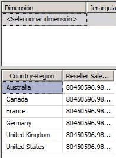
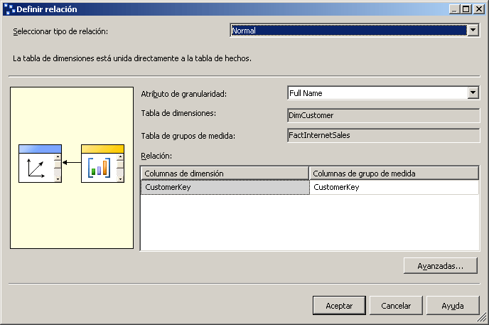
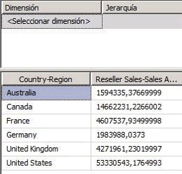

# Lección 5-1: definir una relación referenciada
[!INCLUDE[ssas-appliesto-sqlas](../includes/ssas-appliesto-sqlas.md)]

Hasta este punto del tutorial, cada dimensión de cubo que definió se basaba en una tabla que estaba directamente vinculada a la tabla de hechos para un grupo de medida a través de una relación de clave principal a clave externa. En las tareas de este tema, debe vincular la dimensión **Geography** a la tabla de hechos de ventas por distribuidor a través de la dimensión **Reseller** , denominada *dimensión de referencia*. Esto permite a los usuarios dimensionar las ventas de distribuidor por geografía. Para obtener más información, consulte [Definir relaciones referenciadas y propiedades de las relaciones referenciadas](../analysis-services/multidimensional-models/define-a-referenced-relationship-and-referenced-relationship-properties.md).  
  
## Dimensionar las ventas de distribuidor por geografía  
  
1.  En el Explorador de soluciones, haga clic con el botón secundario en **Analysis Services Tutorial** en la carpeta **Cubos** y, después, haga clic en **Examinar**.  
  
2.  Quite todas las jerarquías del panel de datos y compruebe que la medida **Reseller Sales-Sales Amount** aparece en el área de datos de ese panel. Agréguela al panel de datos si no aparece.  
  
3.  Desde la dimensión **Geography** del panel de metadatos, arrastre la jerarquía definida por el usuario **Geographies** hasta el área **Coloque campos de fila aquí** del panel de datos.  
  
    Observe que la medida **Reseller Sales-Sales Amount** no está bien dimensionada por los miembros del atributo **Country-Region** de la jerarquía **Regions** . El valor de **Reseller Sales-Sales Amount** se repite para cada miembro de atributo **Country-Region** .  
  
      
  
4.  Abra el Diseñador de vistas del origen de datos para la vista del origen de datos **Adventure Works DW 2012** .  
  
5.  En el panel **Organizador de diagramas** , vea la relación entre las tablas **Geography** y **ResellerSales** .  
  
    Observe que no hay ningún vínculo directo entre estas tablas. Pero existe un vínculo indirecto entre estas tablas a través de la tabla **Reseller** o de la tabla **SalesTerritory** .  
  
6.  Haga doble clic en la flecha que representa la relación entre las tablas **Geography** y **Reseller** .  
  
    En el cuadro de diálogo **Editar relación** , observe que la columna **GeographyKey** es la clave principal en la tabla **Geography** y la clave externa en la tabla **Reseller** .  
  
7.  Haga clic en **Cancelar**, cambie al Diseñador de cubos para el cubo Tutorial de [!INCLUDE[ssASnoversion](../includes/ssasnoversion-md.md)] y, después, haga clic en la pestaña **Uso de dimensiones** .  
  
    Observe que la dimensión del cubo **Geography** actualmente no tiene ninguna relación con el grupo de medida **Internet Sales** ni con el grupo de medida **Reseller Sales** .  
  
8.  Haga clic en el botón de puntos suspensivos (**…**) de la celda **Full Name** de la intersección de la dimensión **Customer** y el grupo de medida **Internet Sales** .  
  
    En el cuadro de diálogo **Definir relación** , observe que hay una relación **Regular** definida entre la tabla de la dimensión **DimCustomer** y la tabla del grupo de medida **FactInternetSales** basada en la columna **CustomerKey** de cada una de estas tablas. Todas las demás relaciones que ha definido en este tutorial hasta este punto han sido relaciones regulares.  
  
    En la imagen siguiente se muestra el cuadro de diálogo **Definir relación** con una relación regular entre la tabla de la dimensión **DimCustomer** y la tabla del grupo de medida **FactInternetSales** .  
  
      
  
9. Haga clic en **Cancelar**.  
  
10. Haga clic en el botón de puntos suspensivos (**…**) de la celda sin nombre que se encuentra en la intersección de la dimensión **Geography** y el grupo de medida **Reseller Sales** .  
  
    En el cuadro de diálogo **Definir relación** , observe que actualmente no hay ninguna relación definida entre la dimensión del cubo Geography y el grupo de medida Reseller Sales. No se puede definir una relación regular porque no existe ninguna relación directa entre la tabla de dimensiones de la dimensión Geography y la tabla de hechos del grupo de medida Reseller Sales.  
  
11. En la lista **Seleccionar tipo de relación** , seleccione **Referenciada**.  
  
    Para definir una relación referenciada, debe especificar una dimensión que esté conectada directamente con la tabla del grupo de medida, denominada *dimensión intermedia*, que [!INCLUDE[ssASnoversion](../includes/ssasnoversion-md.md)] pueda usar para vincular la dimensión de referencia a la tabla de hechos. Luego debe especificar el atributo que vincula la dimensión de referencia a la dimensión intermedia.  
  
12. En la lista **Dimensión intermedia** , seleccione **Reseller**.  
  
    La tabla subyacente para la dimensión Geography está vinculada a la tabla de hechos a través de la tabla subyacente para la dimensión Reseller.  
  
13. En la lista **Atributo de dimensión de referencia** , seleccione **Geography Key**y, luego, intente seleccionar **Geography Key** en la lista **Atributo de dimensión intermedia** .  
  
    Observe que **Geography Key** no aparece en la lista **Atributo de dimensión intermedia** . Se debe a que la columna **GeographyKey** no está definida como atributo en la dimensión **Reseller** .  
  
14. Haga clic en **Cancelar**.  
  
En la tarea siguiente, resolverá este problema definiendo un atributo que se basa en la columna GeographyKey de la dimensión Reseller.  
  
## Definir el atributo de la dimensión intermedia y la relación de la dimensión referenciada  
  
1.  Abra el Diseñador de dimensiones para la dimensión **Reseller** y vea las columnas de la tabla **Reseller** del panel **Vista del origen de datos** y los atributos definidos en la dimensión **Reseller** del panel **Atributos** .  
  
    Observe que, aunque GeographyKey está definida como columna en la tabla Reseller, no se ha definido ningún atributo en la dimensión Reseller basado en esta columna. Geography se ha definido como atributo de dimensión en la dimensión Geography porque es la columna de clave que vincula la tabla subyacente para dicha dimensión a la tabla de hechos.  
  
2.  Para agregar un atributo **Geography Key** a la dimensión **Reseller** , haga clic con el botón secundario en **GeographyKey** en el panel **Vista del origen de datos** y, después, haga clic en **Nuevo atributo de columna**.  
  
3.  En el panel **Atributos** , seleccione **Geography Key**y, después, en la ventana Propiedades, establezca la propiedad **AttributeHierarchyOptimizedState** en **NotOptimized**, la propiedad **AttributeHierarchyOrdered** en **False**y la propiedad **AttributeHierarchyVisible** en **False.**  
  
    El atributo Geography Key de la dimensión Reseller solamente se utilizará para vincular la dimensión Geography a la tabla de hechos Reseller Sales. Puesto que no se utilizará para examinar, definir esta jerarquía de atributo como visible no aporta ningún valor. Además, ordenar y optimizar la jerarquía de atributo solo afectaría negativamente al proceso. No obstante, el atributo debe estar habilitado para poder servir como vínculo entre las dos dimensiones.  
  
4.  Cambie al Diseñador de cubos para el cubo Tutorial de [!INCLUDE[ssASnoversion](../includes/ssasnoversion-md.md)] , haga clic en la pestaña **Uso de dimensiones** y, después, haga clic en el botón de puntos suspensivos (**…**) que se encuentra en la intersección del grupo de medida **Reseller Sales** y la dimensión de cubo **Geography** .  
  
5.  En la lista **Seleccionar tipo de relación** , seleccione **Referenciada**.  
  
6.  En la lista **Dimensión intermedia** , seleccione **Reseller**.  
  
7.  En la lista **Atributo de dimensión de referencia** , seleccione **Geography Key**y, después, seleccione **Geography Key** en la lista **Atributo de dimensión intermedia** .  
  
    Observe que la casilla **Materializar** está activada. Ésta es la configuración predeterminada de las dimensiones MOLAP. Materializar el vínculo del atributo de la dimensión hace que, durante el proceso, el valor del vínculo entre la tabla de hechos y la dimensión de referencia de cada fila se materialice, o almacene, en la estructura MOLAP de la dimensión. Esto tendrá un efecto menor en el rendimiento del proceso y en los requisitos de almacenamiento, pero aumentará el rendimiento de la consulta (en ocasiones de forma significativa).  
  
8.  Haga clic en **Aceptar**.  
  
    Observe que la dimensión de cubo **Geography** ahora está vinculada al grupo de medida **Reseller Sales** . El icono indica que la relación es una relación de dimensión referenciada.  
  
9. En la lista **Dimensiones** de la pestaña **Uso de dimensiones** , haga clic con el botón secundario en **Geography**y, después, haga clic en **Rename**.  
  
10. Cambie el nombre de esta dimensión de cubo por **Reseller Geography**.  
  
    Como esta dimensión de cubo ahora está vinculada al grupo de medida **Reseller Sales** , los usuarios se beneficiarán de definir explícitamente su uso en el cubo, con el fin de evitar una posible confusión de los usuarios.  
  
## Dimensionar correctamente las ventas de distribuidor por geografía  
  
1.  En el menú **Compilar** , haga clic en **Tutorial de Implementar Analysis Services**.  
  
2.  Cuando la implementación se haya completado correctamente, haga clic en la pestaña **Explorador** del Diseñador de cubos para el cubo Tutorial de [!INCLUDE[ssASnoversion](../includes/ssasnoversion-md.md)] y, a continuación, haga clic en el botón **Volver a conectar** .  
  
3.  En el panel de metadatos, expanda **Reseller Geography**, haga clic con el botón secundario en **Geographies**y, después, haga clic en **Agregar a área de fila**.  
  
    Observe que la medida **Reseller Sales-Sales Amount** no aparece bien dimensionada por el atributo **Country-Region** de la jerarquía definida por el usuario **Geographies** , como se muestra en la imagen siguiente.  
  
      
  
## Siguiente tarea de la lección  
[Definir una relación de hechos](../analysis-services/lesson-5-2-defining-a-fact-relationship.md)  
  
## Vea también  
[Relaciones de atributo](../analysis-services/multidimensional-models-olap-logical-dimension-objects/attribute-relationships.md)  
[Definir relaciones referenciadas y propiedades de las relaciones referenciadas](../analysis-services/multidimensional-models/define-a-referenced-relationship-and-referenced-relationship-properties.md)  
  
  
  
