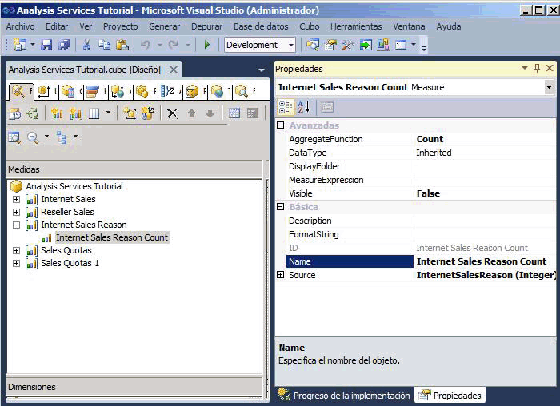
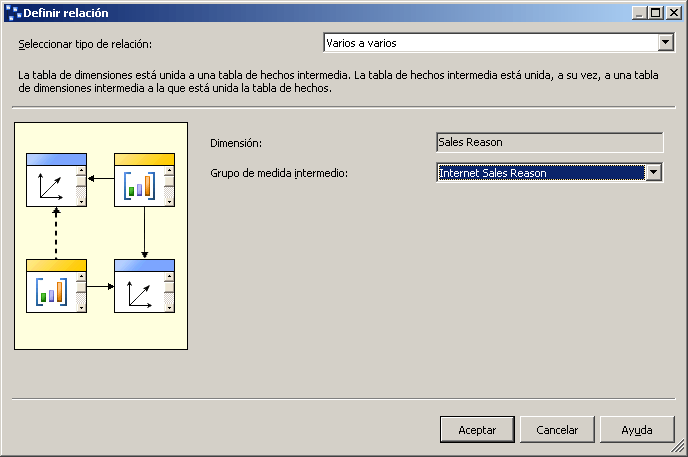
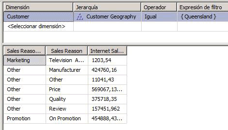

# Lección 5-3: definir una relación varios a varios
[!INCLUDE[ssas-appliesto-sqlas](../includes/ssas-appliesto-sqlas.md)]

Generalmente, cuando se define una dimensión cada hecho se combina con un único miembro de dimensión, mientras que un mismo miembro puede estar asociado a varios hechos distintos. Por ejemplo, cada cliente puede tener varios pedidos, pero cada pedido pertenece a un solo cliente. En terminología de bases de datos relacionales, esto se conoce como *relación uno a varios*. No obstante, algunas veces un único hecho puede combinarse con varios miembros de dimensión. En terminología de bases de datos relacionales, esto se conoce como *relación de varios a varios*. Por ejemplo, un cliente puede tener varios motivos para realizar una compra, y un motivo de compra puede estar asociado a varias compras. Para definir los motivos de venta que se relacionan con cada compra, se utiliza una tabla de combinación. Una dimensión de motivo de venta creada a partir de relaciones de este tipo tendría varios miembros que estarían relacionados a una única transacción de venta. Las dimensiones de varios a varios amplían el modelo dimensional más allá del esquema de estrella y admiten análisis complejos cuando las dimensiones no están directamente relacionadas con una tabla de hechos.  
  
En [!INCLUDE[ssASnoversion](../includes/ssasnoversion-md.md)], para definir una relación de varios a varios entre una dimensión y un grupo de medida se especifica una tabla de hechos intermedia que está combinada con la tabla de dimensiones. Una tabla de hechos intermedia, a su vez, se combina con una tabla de dimensiones intermedia con la que la tabla de hechos está combinada. Las relaciones de varios a varios entre la tabla de hechos intermedia y las tablas de dimensiones de la relación y la dimensión intermedia crean las relaciones de varios a varios entre los miembros de dimensión primaria y las medidas del grupo de medida especificado por la relación. Para definir una relación de varios a varios entre una dimensión y un grupo de medida a través de un grupo de medida intermedio, el grupo de medida intermedio debe compartir una o varias dimensiones con el grupo de medida original.  
  
Con una dimensión de varios a varios, los valores distintos se suman, lo que significa que no se agregan más de una vez al miembro Todos.  
  
> [!NOTE]  
> Para admitir una relación de dimensión varios a varios, debe definirse una relación de clave externa para la clave principal en la vista del origen de datos entre todas las tablas que están implicados. De lo contrario, no podrá seleccionar el grupo de medida intermedio correcto cuando establezca la relación en la pestaña **Uso de dimensiones** del Diseñador de cubos.  
  
Para obtener más información, consulte [Relaciones de dimensión](../analysis-services/multidimensional-models-olap-logical-cube-objects/dimension-relationships.md)y [Definir una relación de varios a varios y las propiedades de las relaciones de varios a varios](../analysis-services/multidimensional-models/define-a-many-to-many-relationship-and-many-to-many-relationship-properties.md).  
  
En las tareas de este tema, debe definir la dimensión Sales Reasons y el grupo de medida Sales Reasons, y definir una relación de varios a varios entre la dimensión Sales Reasons y el grupo de medida Internet Sales a través del grupo de medida Sales Reasons.  
  
## Agregar tablas necesarias a la vista del origen de datos  
  
1.  Abra el Diseñador de vistas del origen de datos para la vista del origen de datos **Adventure Works DW 2012** .  
  
2.  Haga clic con el botón derecho en cualquier lugar del panel **Organizador de diagramas** , haga clic en **Nuevo diagrama**y especifique **Internet Sales Order Reasons** como nombre de este nuevo diagrama.  
  
3.  Arrastre la tabla **InternetSales** al panel **Diagrama** desde el panel **Tablas** .  
  
4.  Haga clic con el botón derecho en cualquier punto del panel **Diagrama** y luego haga clic en **Agregar o quitar tablas**.  
  
5.  En el cuadro de diálogo **Agregar o quitar tablas** , agregue la tabla **DimSalesReason** y la tabla **FactInternetSalesReason** a la lista **Objetos incluidos** y haga clic en **Aceptar**.  
  
    Tenga en cuenta que las relaciones de clave externa para la clave principales entre las tablas implicadas se establecen automáticamente porque esas relaciones se definen en la base de datos relacional subyacente. Si dichas relaciones no se hubiesen definido en la base de datos relacional subyacente, tendría que definirlas en la vista del origen de datos.  
  
6.  En el menú **Formato** , seleccione **Diseño automático**y haga clic en **Diagrama**.  
  
7.  En la ventana Propiedades, cambie la propiedad **FriendlyName** de la tabla **DimSalesReason** por **SalesReason**y, a continuación, cambie la propiedad **FriendlyName** de la tabla **FactInternetSalesReason** por **InternetSalesReason**.  
  
8.  En el panel **Tablas** , expanda **InternetSalesReason (dbo.FactInternetSalesReason)**, haga clic en **SalesOrderNumber**y luego revise la propiedad **DataType** para esta columna de datos en la ventana Propiedades.  
  
    Observe que el tipo de datos para la columna **SalesOrderNumber** es un tipo de datos de cadena.  
  
9. Revise los tipos de datos de las demás columnas de la tabla **InternetSalesReason** .  
  
    Observe que los datos de las otras dos columnas de esta tabla son de tipo numérico.  
  
10. En el panel **Tablas** , haga clic con el botón derecho en **InternetSalesReason (dbo.FactInternetSalesReason)** y seleccione **Explorar datos**.  
  
    Observe que, para cada número de línea de cada pedido, un valor clave identifica el motivo de venta para la compra del artículo de la línea, como se muestra en la imagen siguiente.  
  
      
  
## Definir el grupo de medida intermedio  
  
1.  Cambie al Diseñador de cubos para el cubo Tutorial de [!INCLUDE[ssASnoversion](../includes/ssasnoversion-md.md)] y haga clic en la pestaña **Estructura de cubo** .  
  
2.  Haga clic con el botón derecho en cualquier punto del panel **Medidas** y, después, haga clic en **Nuevo grupo de medida**. Para obtener más información, consulte [Crear medidas y grupos de medida en modelos multidimensionales](../analysis-services/multidimensional-models/create-measures-and-measure-groups-in-multidimensional-models.md).  
  
3.  En el cuadro de diálogo **Nuevo grupo de medida** , seleccione **InternetSalesReason** en la lista **Seleccione una tabla en la vista del origen de datos** y haga clic en **Aceptar**.  
  
    Observe que el grupo de medida **Internet Sales Reason** ahora aparece en el panel **Medidas** .  
  
4.  Expanda el grupo de medida **Internet Sales Reason** .  
  
    Como puede observar, solo hay una medida definida para este nuevo grupo de medida, la medida **Internet Sales Reason Count** .  
  
5.  Seleccione **Internet Sales Reason Count** y revise las propiedades de esta medida en la ventana Propiedades.  
  
    Observe que la propiedad **AggregateFunction** para esta medida está definida como **Recuento** en lugar de como **Suma**. [!INCLUDE[ssASnoversion](../includes/ssasnoversion-md.md)] seleccionó **Recuento** porque el tipo de datos subyacente es un tipo de datos de cadena. Las otras dos columnas de la tabla de hechos subyacente no estaban seleccionadas como medias porque [!INCLUDE[ssASnoversion](../includes/ssasnoversion-md.md)] las detectó como claves numéricas y no como medidas reales. Para obtener más información, consulte [Definir el comportamiento de suma parcial](../analysis-services/multidimensional-models/define-semiadditive-behavior.md).  
  
6.  En la ventana Propiedades, cambie la propiedad **Visible** de la medida **Internet Sales Reason Count** a **False**.  
  
    Esta medida solo podrá utilizarse para combinar la dimensión Sales Reason que definirá junto al grupo de medida Internet Sales. Los usuarios no examinarán esta medida directamente.  
  
    En la ilustración siguiente se muestran las propiedades de la medida **Internet Sales Reason Count** .  
  
      
  
## Definir la dimensión de varios a varios  
  
1.  En el Explorador de soluciones, haga clic con el botón derecho en **Dimensiones**y, después, haga clic en **Nueva dimensión**.  
  
2.  En la página **Asistente para dimensiones** , haga clic en **Siguiente**.  
  
3.  En la página **Seleccionar método de creación** , compruebe que la opción **Usar una tabla existente** está seleccionada y, a continuación, haga clic en **Siguiente**.  
  
4.  En la página **Especificar información de origen** , compruebe que la vista del origen de datos [!INCLUDE[ssSampleDBCoShort](../includes/sssampledbcoshort-md.md)] DW 2012 está seleccionada.  
  
5.  En la lista **Tabla principal** , seleccione **SalesReason**.  
  
6.  En la lista **Columnas de clave** , compruebe que aparece **SalesReasonKey** .  
  
7.  En la lista **Columna de nombre** , seleccione **SalesReasonName**.  
  
8.  Haga clic en **Siguiente**.  
  
9. En la página **Seleccionar los atributos de la dimensión** , el atributo **Sales Reason Key** se selecciona automáticamente porque es el atributo clave. Active la casilla situada junto al atributo **Sales Reason Reason Type** , cambie su nombre por **Sales Reason Type**y, a continuación, haga clic en **Siguiente**.  
  
10. En la página **Finalización del asistente** , haga clic en **Finalizar** para crear la dimensión Sales Reason.  
  
11. En el menú **Archivo** , haga clic en **Guardar todo**.  
  
12. En el panel **Atributos** del Diseñador de dimensiones para la dimensión **Sales Reason** , seleccione **Sales Reason Key**y, a continuación, cambie la propiedad **Nombre** de la ventana Propiedades por **Sales Reason.**  
  
13. En el panel **Jerarquías** del Diseñador de dimensiones, cree una jerarquía de usuario denominada **Sales Reasons** que contenga el nivel **Sales Reason Type** y el nivel **Sales Reason** , en este orden.  
  
14. En la ventana Propiedades, defina **All Sales Reasons** como valor de la propiedad **AllMemberName** de la jerarquía Sales Reasons.  
  
15. Defina **All Sales Reasons** como valor de la propiedad **AttributeAllMemberName** de la dimensión Sales Reason.  
  
16. Para agregar la dimensión que acaba de crear al cubo Tutorial de [!INCLUDE[ssASnoversion](../includes/ssasnoversion-md.md)] como una dimensión de cubo, cambie al **Diseñador de cubos**. En la pestaña **Estructura de cubo** , haga clic con el botón derecho en el panel **Dimensiones** y seleccione **Agregar dimensión de cubo**.  
  
17. En el cuadro de diálogo **Agregar dimensión de cubo** , seleccione **Sales Reason** y, a continuación, haga clic en **Aceptar**.  
  
18. En el menú **Archivo** , haga clic en **Guardar todo**.  
  
## Definir la relación de varios a varios  
  
1.  Cambie al Diseñador de cubos para el cubo Tutorial de [!INCLUDE[ssASnoversion](../includes/ssasnoversion-md.md)] y haga clic en la pestaña **Uso de dimensiones** .  
  
    Observe que la dimensión **Sales Reason** tiene una relación regular definida con el grupo de medida **Internet Sales Reason** , pero no tiene ninguna relación definida con los grupos de medida **Internet Sales** ni **Reseller Sales** . Observe también que la dimensión **Internet Sales Order Details** tiene una relación normal definida con la dimensión **Internet Sales Reason** , que a su vez tiene una **relación de hechos** con el grupo de medida **Internet Sales** . Si esta dimensión no estaba presente (u otra dimensión con una relación con **Internet Sales Reason** y el grupo de medida **Internet Sales** no estaban presentes), no se podría definir la relación de varios a varios.  
  
2.  Haga clic en la celda en la intersección del grupo de medida **Internet Sales** y la dimensión **Sales Reasons** y, después, haga clic en el botón Examinar (**…**).  
  
3.  En el cuadro de diálogo **Definir relación** , seleccione **Varios a varios** en la lista **Seleccionar tipo de relación** .  
  
    Debe definir el grupo de medida intermedio que conecta la dimensión Sales Reason al grupo de medida Internet Sales.  
  
4.  En la lista **Grupo de medida intermedio** , seleccione **Internet Sales Reason**.  
  
    En la imagen siguiente se muestran los cambios realizados en el cuadro de diálogo **Definir relación** .  
  
      
  
5.  Haga clic en **Aceptar**.  
  
    Observe el icono de varios a varios que representa la relación existente entre la dimensión Sales Reason y el grupo de medida Internet Sales.  
  
## Examinar el cubo y la dimensión de varios a varios  
  
1.  En el menú **Compilar** , haga clic en **Tutorial de Implementar Analysis Services**.  
  
2.  Cuando la implementación se haya completado correctamente, cambie a la pestaña **Explorador** del Diseñador de cubos para el cubo Tutorial de [!INCLUDE[ssASnoversion](../includes/ssasnoversion-md.md)] y, a continuación, haga clic en **Volver a conectar**.  
  
3.  Agregue la medida **Internet Sales-Sales Amount** al área de datos del panel de datos.  
  
4.  Agregue la jerarquía definida por el usuario **Sales Reason** de la dimensión **Sales Reason** al área de filas del panel de datos.  
  
5.  En el panel de metadatos, expanda sucesivamente **Customer**, **Location**, **Customer Geography**, **Members**, **All Customers**y **Australia**, haga clic con el botón derecho en **Queensland**y, después, haga clic en **Agregar a filtro**.  
  
6.  Expanda cada miembro del nivel **Sales Reason Type** para revisar los valores en dólares que están asociados a cada razón que un cliente de Queensland indicó para su compra de un producto de [!INCLUDE[ssSampleDBCoShort](../includes/sssampledbcoshort-md.md)] a través de Internet.  
  
    Observe que los totales que están asociados con cada motivo de ventas se suman y dan lugar a un valor superior a las ventas totales. Esto es así porque algunos clientes citaron varios motivos para su compra.  
  
    En la imagen siguiente se muestran los paneles **Filtro** y **Datos** del Diseñador de cubos.  
  
      
  
## Siguiente tarea de la lección  
[Definir la granularidad de las dimensiones en un grupo de medida](../analysis-services/lesson-5-4-defining-dimension-granularity-within-a-measure-group.md)  
  
## Vea también  
[Trabajar con diagramas en el Diseñador de vistas del origen de datos &#40;Analysis Services&#41;](../analysis-services/multidimensional-models/work-with-diagrams-in-data-source-view-designer-analysis-services.md)  
[Relaciones de dimensión](../analysis-services/multidimensional-models-olap-logical-cube-objects/dimension-relationships.md)  
[Definir una relación de varios a varios y las propiedades de las relaciones de varios a varios](../analysis-services/multidimensional-models/define-a-many-to-many-relationship-and-many-to-many-relationship-properties.md)  
  
  
  
