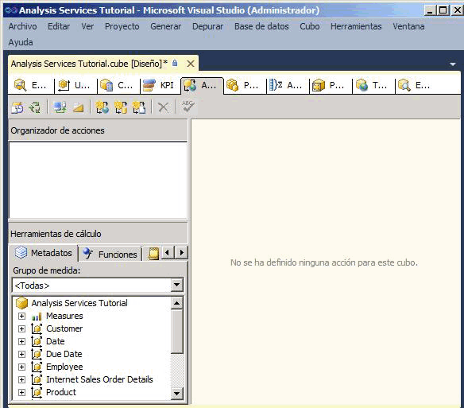
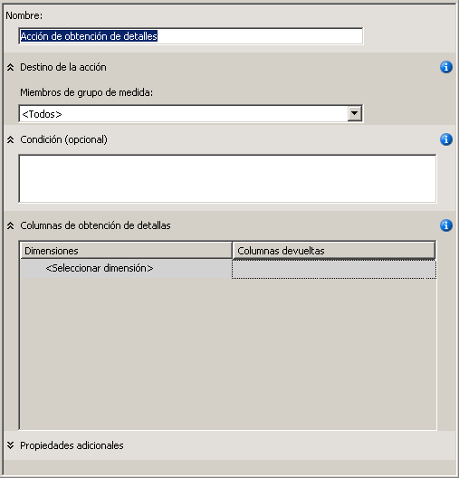
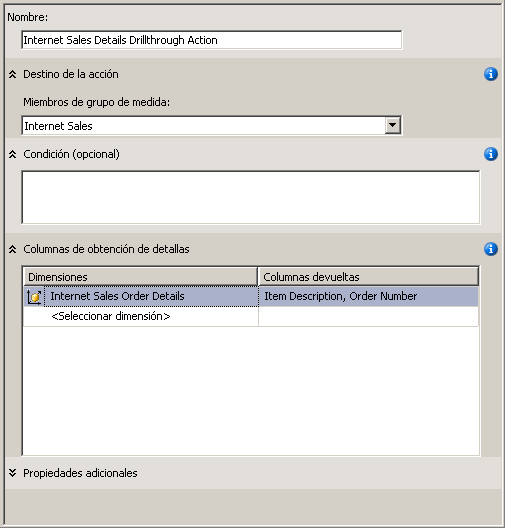
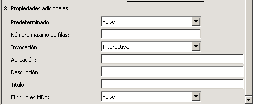
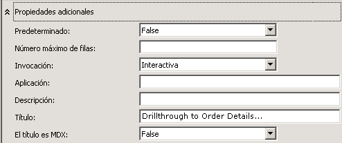
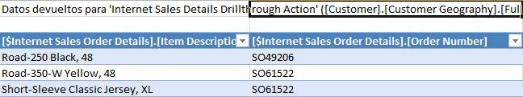
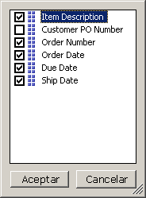
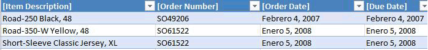

# Lección 8-1: definir y usar una acción de obtención de detalles
[!INCLUDE[ssas-appliesto-sqlas](../includes/ssas-appliesto-sqlas.md)]Los datos de hechos mediante una dimensión de hechos de dimensionamiento sin filtrar correctamente los datos que devuelve la consulta puede provocar un rendimiento lento de las consultas. Para evitarlo, puede definir una acción de obtención de detalles que restrinja el número total de filas que se devuelven. Esto mejorará significativamente el rendimiento de las consultas.  
  
En las tareas de este tema, definirá una acción de obtención de detalles para devolver información detallada de pedidos para las ventas a clientes a través de Internet.  
  
## Definir las propiedades de la acción de obtención de detalles  
  
1.  En el Diseñador de cubos del cubo Tutorial de [!INCLUDE[ssASnoversion](../includes/ssasnoversion-md.md)] , haga clic en la pestaña **Acciones** .  
  
    La pestaña **Acciones** incluye varios paneles. En la parte izquierda de la pestaña están el panel **Organizador de acciones** y el panel **Herramientas de cálculo** . El panel situado a la derecha de los dos paneles es el panel **Mostrar** , que contiene los detalles de la acción que está seleccionada en el panel **Organizador de acciones** .  
  
    La siguiente imagen muestra la pestaña **Acciones** del Diseñador de cubos.  
  
      
  
2.  En la barra de herramientas de la pestaña **Acciones** , haga clic en el botón **Nueva acción de obtención de detalles** .  
  
    Aparecerá una plantilla de Acción en blanco en el panel de información.  
  
      
  
3.  En el cuadro **Nombre** , cambie el nombre de esta acción por **Internet Sales Details Drillthrough Action**.  
  
4.  En la lista **Miembros de grupo de medida** , seleccione **Internet Sales**.  
  
5.  En el cuadro **Columnas de obtención de detalles** , seleccione **Internet Sales Order Details** en la lista **Dimensiones** .  
  
6.  En la lista **Columnas devueltas** , active las casillas **Item Description** y **Order Number** y, después, haga clic en **Aceptar**. La siguiente imagen muestra la plantilla de Acción con el aspecto que debería tener en este punto del procedimiento.  
  
      
  
7.  Expanda el cuadro **Propiedades adicionales** , como en la siguiente imagen.  
  
      
  
8.  En el cuadro **Número máximo de filas** , escriba **10**.  
  
9. En el cuadro **Título** , escriba **Drillthrough to Order Details…**.  
  
    Esta configuración limita el número de filas devueltas y especifica el título que aparece en el menú de la aplicación cliente. En la ilustración siguiente se muestra esta configuración en el cuadro **Propiedades adicionales** .  
  
      
  
## Usar la acción de obtención de detalles  
  
1.  En el menú **Compilar** , haga clic en **Tutorial de Implementar Analysis Services**.  
  
2.  Cuando la implementación se haya completado correctamente, haga clic en la pestaña **Explorador** del Diseñador de cubos para el cubo Tutorial de [!INCLUDE[ssASnoversion](../includes/ssasnoversion-md.md)] y, a continuación, haga clic en el botón **Volver a conectar** .  
  
3.  Inicie Excel.  
  
4.  Agregue la medida **Internet Sales-Sales Amount** al área Valores.  
  
5.  Agregue la jerarquía definida por el usuario **Customer Geography** desde la carpeta **Location** de la dimensión **Customer** al panel **Filtro de informe** .  
  
6.  En la tabla dinámica, en **Customer Geography**, agregue un filtro que seleccione un solo cliente. Expanda sucesivamente **All Customers**, **Australia**, **Queensland**, **Brisbane**y **4000**, active la casilla correspondiente a **Adam Powell**y, después, haga clic en **Aceptar**.  
  
    Las ventas totales de productos de [!INCLUDE[ssSampleDBCoFull](../includes/sssampledbcofull-md.md)] a Adam Powell aparecerán en el área de datos.  
  
7.  Haga clic con el botón derecho en el importe de venta, seleccione **Acciones adicionales**y, después, haga clic en **Drillthrough to Order Details**.  
  
    La información detallada de los pedidos enviados a Adam Powell aparecerá en el **Visor de muestras de datos**, como se muestra en la ilustración siguiente. Sin embargo, algunos detalles adicionales podrían ser igualmente útiles, caso de la fecha del pedido, la fecha de vencimiento y la fecha de envío. En el siguiente procedimiento, agregará estos detalles adicionales.  
  
      
  
8.  Cerrar Excel/  
  
## Modificar la acción de obtención de detalles  
  
1.  Abra el Diseñador de dimensiones para la dimensión **Internet Sales Order Details** .  
  
    Observe que solo se han definido tres atributos para esta dimensión.  
  
2.  En el panel **Vista del origen de datos** , haga clic con el botón derecho en un área abierta y, después, haga clic en **Mostrar todas las tablas**.  
  
3.  En el menú **Formato** , elija **Diseño automático** y haga clic en **Diagrama**.  
  
4.  Busque la tabla **InternetSales (dbo.FactInternetSales)** haciendo clic con el botón derecho en un área abierta del panel **Vista del origen de datos** . Después, haga clic en **Buscar tabla,** en **InternetSales,** y, por último, en **Aceptar**.  
  
5.  Cree nuevos atributos basados en las siguientes columnas:  
  
    -   OrderDateKey  
  
    -   DueDateKey  
  
    -   ShipDateKey  
  
6.  Cambie la propiedad **Nombre** del atributo **Order Date Key** por **Order Date** . Después, haga clic en el botón Examinar de la propiedad **Columna de nombre** y, en el cuadro de diálogo **Columna de nombre** , seleccione **Date** como tabla de origen y SimpleDate como columna de origen. [!INCLUDE[clickOK](../includes/clickok-md.md)]  
  
7.  Cambie la propiedad **Nombre** del atributo **Due Date Key** por **Due Date**y, después, usando el mismo método que en el caso del atributo **Order Date Key** , cambie la propiedad **Columna de nombre** de este atributo por **Date.SimpleDate (WChar)**.  
  
8.  Cambie la propiedad **Nombre** del atributo **Ship Date Key** por **Ship Date**y, después, cambie la propiedad **Columna de nombre** de este atributo por **Date.SimpleDate (WChar)**.  
  
9. Cambie a la pestaña **Acciones** del Diseñador de cubos para el cubo Tutorial de [!INCLUDE[ssASnoversion](../includes/ssasnoversion-md.md)] .  
  
10. En el cuadro **Columnas de obtención de detalles** , active las casillas para agregar las siguientes columnas a la lista **Columnas devueltas** y, después, haga clic en **Aceptar**:  
  
    -   Order Date  
  
    -   Due Date  
  
    -   Ship Date  
  
    La siguiente imagen muestra estas columnas seleccionadas.  
  
      
  
## Revisar la acción de obtención de detalles modificada  
  
1.  En el menú **Compilar** , haga clic en **Tutorial de Implementar Analysis Services**.  
  
2.  Cuando la implementación se haya completado correctamente, cambie a la pestaña **Explorador** del Diseñador de cubos para el cubo Tutorial de [!INCLUDE[ssASnoversion](../includes/ssasnoversion-md.md)] y haga clic en el botón **Volver a conectar** .  
  
3.  Inicie Excel.  
  
4.  Vuelva a crear la tabla dinámica usando **Internet Sales-Sales Amount** en el área Valores y **Geografía del cliente** en el Filtro de informe.  
  
    Agregue un filtro que seleccione **All Customers**, **Australia**, **Queensland**, **Brisbane**, **4000**, **Adam Powell**.  
  
5.  Haga clic en la celda de datos de **Internet Sales-Sales Amount** , seleccione **Acciones adicionales**y, después, haga clic en **Drillthrough to Order Details**.  
  
    La información detallada de estos pedidos enviados a Adam Powell aparecerá en una hoja de cálculo temporal. Dicha información incluye la descripción de los artículos, el número y la fecha de pedido, la fecha de vencimiento y la fecha de envío, como se muestra en la ilustración siguiente.  
  
      
  
## Lección siguiente  
[Lección 9: Definir perspectivas y traducciones](../analysis-services/lesson-9-defining-perspectives-and-translations.md)  
  
## Vea también  
[Acciones &#40;Analysis Services - Datos multidimensionales&#41;](../analysis-services/multidimensional-models/actions-analysis-services-multidimensional-data.md)  
[Acciones en modelos multidimensionales](../analysis-services/multidimensional-models/actions-in-multidimensional-models.md)  
[Relaciones de dimensión](../analysis-services/multidimensional-models-olap-logical-cube-objects/dimension-relationships.md)  
[Definir una relación de hechos](../analysis-services/lesson-5-2-defining-a-fact-relationship.md)  
[Definir relaciones de hechos y propiedades de las relaciones de hechos](../analysis-services/multidimensional-models/define-a-fact-relationship-and-fact-relationship-properties.md)  
  
  
  
