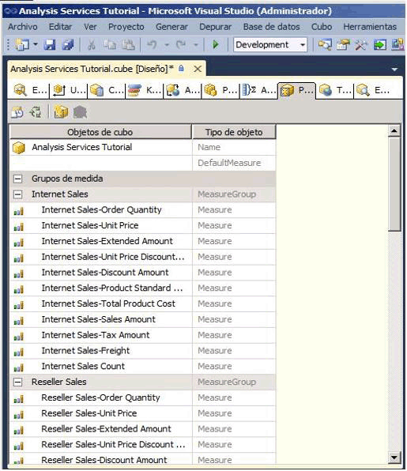
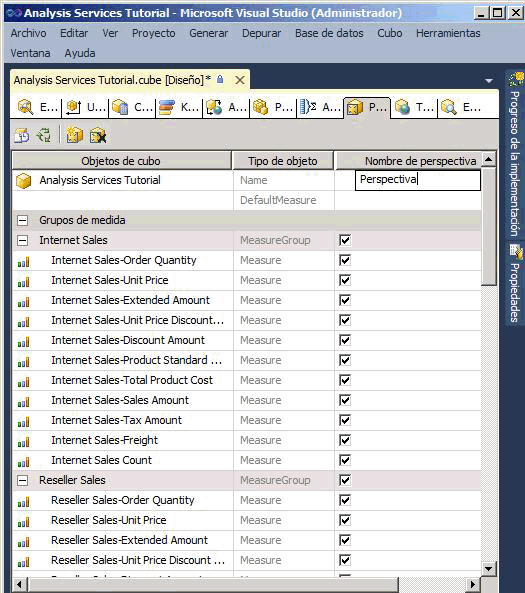
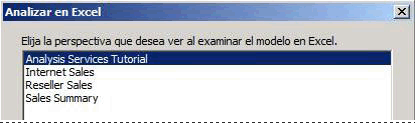
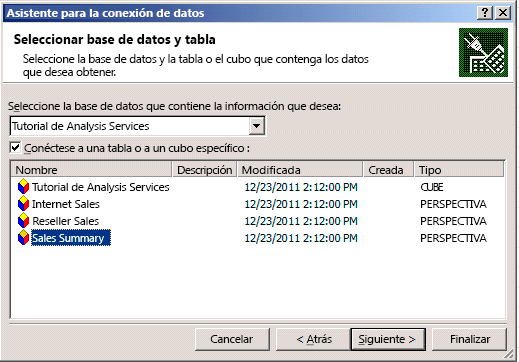
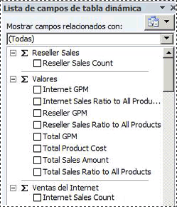

# Lección 9-1: definir y examinar perspectivas
[!INCLUDE[ssas-appliesto-sqlas](../includes/ssas-appliesto-sqlas.md)]

Una perspectiva puede simplificar la vista de un cubo para fines específicos. De manera predeterminada, los usuarios pueden ver todos los elementos de un cubo para los que tengan permisos. Lo que observan los usuarios cuando ven un cubo [!INCLUDE[ssASnoversion](../includes/ssasnoversion-md.md)] entero es la perspectiva predeterminada del cubo. Una vista de todo el cubo puede resultar muy compleja para que los usuarios naveguen por ella, en especial aquellos usuarios que solo necesitan interactuar con una pequeña parte del cubo a fin de satisfacer sus requisitos de informes e inteligencia empresarial.  
  
Para reducir la aparente complejidad de un cubo, puede crear subconjuntos visibles del cubo, denominados *perspectivas*, que solo muestran a los usuarios una parte de los grupos de medida, medidas, dimensiones, atributos, jerarquías, indicadores clave de rendimiento (KPI), acciones y miembros calculados del cubo. Esto puede ser especialmente útil para trabajar con aplicaciones cliente que se escribieron para una versión anterior de [!INCLUDE[ssASnoversion](../includes/ssasnoversion-md.md)]. Estos clientes, por ejemplo, no tienen el concepto de carpetas o perspectivas para mostrar, pero aparece una perspectiva para los clientes antiguos como si fuera un cubo. Para obtener más información, vea [Perspectivas](../analysis-services/multidimensional-models-olap-logical-cube-objects/perspectives.md)y [Perspectivas de modelos multidimensionales](../analysis-services/multidimensional-models/perspectives-in-multidimensional-models.md).  
  
> [!NOTE]  
> Una perspectiva no es un mecanismo de seguridad sino, más bien, una herramienta para proporcionar una mejor experiencia del usuario. Toda la seguridad de una perspectiva se hereda del cubo subyacente.  
  
En las tareas de este tema, definirá varias perspectivas diferentes y, a continuación, examinará el cubo a través de cada una de estas nuevas perspectivas.  
  
## Definir una perspectiva Internet Sales  
  
1.  Abra el Diseñador de cubos para el cubo Tutorial de [!INCLUDE[ssASnoversion](../includes/ssasnoversion-md.md)] y, después, haga clic en la pestaña **Perspectivas** .  
  
    Todos los objetos y sus tipos de objeto aparecen en el panel **Perspectivas** , como se muestra en la siguiente imagen.  
  
      
  
2.  En la barra de herramientas de la pestaña **Perspectivas** , haga clic en el botón **Nueva perspectiva** .  
  
    Una nueva perspectiva aparece en la columna **Nombre de perspectiva** con el nombre predeterminado de **Perspectiva**, como se muestra en la siguiente imagen. Observe que la casilla de cada objeto está seleccionada; hasta que no desactive la casilla de un objeto, esta perspectiva será idéntica a la perspectiva predeterminada de este cubo.  
  
      
  
3.  Cambie el nombre de perspectiva a **Internet Sales**.  
  
4.  En la fila siguiente, establezca DefaultMeasure en **Internet Sales-Sales Amount**.  
  
    Cuando los usuarios examinen el cubo mediante esta perspectiva, esta será la medida que los usuarios verán a menos que especifiquen alguna otra medida.  
  
    > [!NOTE]  
    > También puede establecer la medida predeterminada para todo el cubo Tutorial de [!INCLUDE[ssASnoversion](../includes/ssasnoversion-md.md)] en la ventana Propiedades de la pestaña **Estructura de cubo** del cubo.  
  
5.  Desactive la casilla de los siguientes objetos:  
  
    -   Grupo de medida**Reseller Sales**   
  
    -   Grupo de medida**Sales Quotas**   
  
    -   Grupo de medida**Sales Quotas 1**   
  
    -   Dimensión de cubo**Reseller**   
  
    -   Dimensión de cubo**Reseller Geography**   
  
    -   Dimensión del cubo**Sales Territory**   
  
    -   Dimensión de cubo**Employee**   
  
    -   Dimensión de cubo**Promotion**   
  
    -   **Reseller Revenue**   
  
    -   Conjunto con nombre**Large Resellers**   
  
    -   Miembro calculado**Total Sales Amount**   
  
    -   Miembro calculado**Total Product Cost**   
  
    -   Miembro calculado**Reseller GPM**   
  
    -   Miembro calculado**Total GPM**   
  
    -   Miembro calculado**Reseller Sales Ratio to All Products**   
  
    -   Miembro calculado**Total Sales Ratio to All Products**   
  
    Estos objetos no tienen relación con Internet Sales.  
  
    > [!NOTE]  
    > Dentro de cada dimensión, también puede seleccionar individualmente las jerarquías definidas por el usuario y los atributos que desee que aparezcan en una perspectiva.  
  
## Definir una perspectiva Reseller Sales  
  
1.  En la barra de herramientas de la pestaña **Perspectivas** , haga clic en el botón **Nueva perspectiva** .  
  
2.  Cambie el nombre de la nueva perspectiva a **Reseller Sales**.  
  
3.  Establezca **Reseller Sales-Sales Amount** como medida predeterminada.  
  
    Cuando los usuarios examinen el cubo mediante esta perspectiva, esta medida será la medida que los usuarios verán a menos que especifiquen alguna otra medida.  
  
4.  Desactive la casilla de los siguientes objetos:  
  
    -   Grupo de medida**Internet Sales**   
  
    -   Grupo de medida**Internet Sales Reason**   
  
    -   Dimensión de cubo**Customer**   
  
    -   Dimensión de cubo**Internet Sales Order Details**   
  
    -   Dimensión de cubo**Sales Reason**   
  
    -   Acción de obtención de detalles**Internet Sales Details Drillthrough Action**   
  
    -   Miembro calculado**Total Sales Amount**   
  
    -   Miembro calculado**Total Product Cost**   
  
    -   Miembro calculado**Internet GPM**   
  
    -   Miembro calculado**Total GPM**   
  
    -   Miembro calculado**Internet Sales Ratio to All Products**   
  
    -   Miembro calculado**Total Sales Ratio to All Products**   
  
    Estos objetos no tienen relación con Resellers Sales.  
  
## Definir una perspectiva Sales Summary  
  
1.  En la barra de herramientas de la pestaña **Perspectivas** , haga clic en el botón **Nueva perspectiva** .  
  
2.  Cambie el nombre de la nueva perspectiva a **Sales Summary**.  
  
    > [!NOTE]  
    > No puede especificar una medida calculada como medida predeterminada.  
  
3.  Desactive la casilla de los siguientes objetos:  
  
    -   Grupo de medida**Internet Sales**   
  
    -   Grupo de medida**Reseller Sales**   
  
    -   Grupo de medida**Internet Sales Reason**   
  
    -   Grupo de medida**Sales Quotas**   
  
    -   Grupo de medida**Sales Quotas1**   
  
    -   Dimensión de cubo**Internet Sales Order Details**   
  
    -   Dimensión de cubo**Sales Reason**   
  
    -   Acción de obtención de detalles**Internet Sales Details Drillthrough Action**   
  
4.  Active la casilla de los siguientes objetos:  
  
    -   Medida**Internet Sales Count**   
  
    -   Medida**Reseller Sales Count**   
  
## Examinar el cubo a través de cada perspectiva  
  
1.  En el menú **Compilar** , haga clic en **Tutorial de Implementar Analysis Services**.  
  
2.  Cuando la implementación se haya completado correctamente, vaya a la pestaña **Explorador** y, después, haga clic en el botón **Volver a conectar** .  
  
3.  Inicie Excel.  
  
4.  Analizar en Excel le pedirá que elija qué perspectiva desea usar al examinar el modelo en Excel, como se muestra en la ilustración siguiente.  
  
      
  
5.  Como alternativa, puede iniciar Excel en el menú Inicio de Windows, definir una conexión a la base de datos Tutorial de Analysis Services en localhost y elegir una perspectiva en el Asistente para la conexión de datos, como se muestra en la ilustración siguiente.  
  
      
  
6.  Seleccione **Internet Sales** en la lista **Perspectiva** y, después, examine las medidas y dimensiones en el panel de metadatos.  
  
    Observe que solo aparecen aquellos objetos especificados para la perspectiva Internet Sales.  
  
7.  En el panel de metadatos, expanda **Medidas**.  
  
    Observe que solo aparece el grupo de medida **Internet Sales** , junto con los miembros calculados **Internet GPM** e **Internet Sales Ratio to All Products** .  
  
8.  En el modelo, seleccione Excel de nuevo. Seleccione **Sales Summary**.  
  
    Observe que en cada uno de estos grupos de medida, solo aparece una única medida, tal como se muestra en la siguiente imagen.  
  
      
  
## Siguiente tarea de la lección  
[Definir y examinar traducciones](../analysis-services/lesson-9-2-defining-and-browsing-translations.md)  
  
## Vea también  
[Perspectives](../analysis-services/multidimensional-models-olap-logical-cube-objects/perspectives.md)  
[Perspectivas de modelos multidimensionales](../analysis-services/multidimensional-models/perspectives-in-multidimensional-models.md)  
  
  
  
