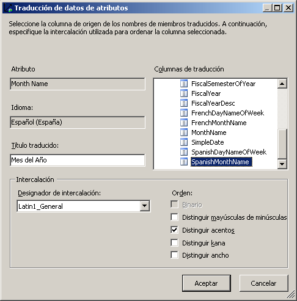
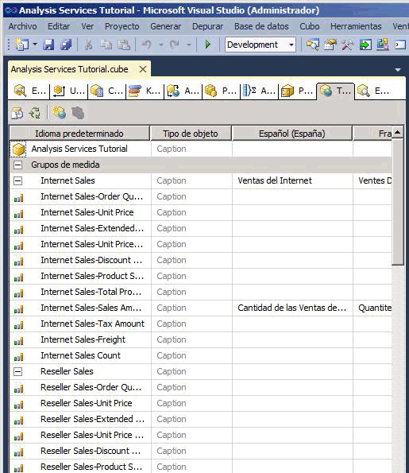

# Lección 9-2: definir y examinar traducciones
[!INCLUDE[ssas-appliesto-sqlas](../includes/ssas-appliesto-sqlas.md)]

Una traducción es una representación de los nombres de objetos de [!INCLUDE[ssASnoversion](../includes/ssasnoversion-md.md)] en un idioma específico. Entre estos objetos se incluyen grupos de medida, medidas, dimensiones, atributos, jerarquías, KPI, acciones y miembros calculados. Las traducciones ofrecen compatibilidad de servidor para aplicaciones cliente que admitan varios idiomas. Mediante el uso de dicho cliente, éste pasa el identificador local (LCID) a la instancia de [!INCLUDE[ssASnoversion](../includes/ssasnoversion-md.md)], que utiliza el LCID para determinar el conjunto de traducciones que se va a utilizar al proporcionar metadatos para los objetos de [!INCLUDE[ssASnoversion](../includes/ssasnoversion-md.md)] . Si un objeto de [!INCLUDE[ssASnoversion](../includes/ssasnoversion-md.md)] no contiene una traducción para ese idioma o no contiene una traducción para un objeto determinado, al devolver los metadatos de objeto al cliente se usa el idioma predeterminado. Por ejemplo, si un usuario corporativo de Francia tiene acceso a un cubo de una estación de trabajo con configuración regional francesa, el usuario corporativo verá los títulos y valores de propiedades de miembro en francés si existe una traducción al francés. Sin embargo, si un usuario corporativo de Alemania tiene acceso al mismo cubo desde una estación de trabajo con una configuración regional alemana, verá los títulos y los valores de propiedades de miembro en alemán. Para obtener más información, vea [Traducciones de dimensiones](../analysis-services/multidimensional-models-olap-logical-dimension-objects/dimension-translations.md), [Traducciones de cubos](../analysis-services/multidimensional-models-olap-logical-cube-objects/cube-translations.md)y [Compatibilidad con traducción en Analysis Services](../analysis-services/translation-support-in-analysis-services.md).  
  
En las tareas de este tema, se definen las traducciones de metadatos de un conjunto limitado de objetos de dimensión de la dimensión Date y de objetos de cubo del cubo [!INCLUDE[ssASnoversion](../includes/ssasnoversion-md.md)] Tutorial. Entonces podrá buscar entre estos objetos de dimensión y de cubo para examinar las traducciones de metadatos.  
  
## Especificar traducciones para los metadatos de la dimensión Date  
  
1.  Abra el Diseñador de dimensiones para la dimensión **Date** y, después, haga clic en la pestaña **Traducciones** .  
  
    Aparecen los metadatos en el idioma predeterminado de dicho objeto de dimensión. El idioma predeterminado en el cubo [!INCLUDE[ssASnoversion](../includes/ssasnoversion-md.md)] Tutorial es el inglés.  
  
2.  En la barra de herramientas de la pestaña **Traducciones** , haga clic en el botón **Nueva traducción** .  
  
    Aparecerá una lista de idiomas en el cuadro de diálogo **Seleccionar idioma** .  
  
3.  Haga clic en **Español (España)** y, después, en **Aceptar**.  
  
    Aparecerá una nueva columna en la que podrá definir las traducciones españolas para los objetos de metadatos que desee traducir. En este tutorial, solo traduciremos un pequeño número de objetos para ilustrar el proceso.  
  
4.  En la barra de herramientas de la pestaña **Traducciones** , haga clic en el botón **Nueva traducción** , en **Francés (Francia)** en el cuadro de diálogo **Seleccionar idioma** y, después, haga clic en **Aceptar**.  
  
    Aparecerá otra columna de idioma en la que definirá las traducciones de francés.  
  
5.  En la fila del objeto **Caption** de la dimensión **Date**, escriba **Fecha** en la columna de traducción **Español (España)** y **Temps** en la columna de traducción **Francés (Francia)**.  
  
6.  En la fila para el objeto **Caption** del atributo **Month Name** , escriba **Mes del año** en la columna de traducción **Español (España)** y **Mois d'Année** en la columna de traducción **Francés (Francia)** .  
  
    Observe que, al escribir estas traducciones, aparecen puntos suspensivos (**…**). Si hace clic en estos puntos suspensivos podrá especificar una columna en la tabla subyacente que proporciona traducciones para cada miembro de la jerarquía de atributo.  
  
7.  Haga clic en los puntos suspensivos (**…**) de la traducción **Español (España)** del atributo **Month Name** .  
  
    Aparecerá el cuadro de diálogo **Traducción de datos de atributos** .  
  
8.  En la lista **Columnas de traducción** , seleccione **SpanishMonthName**, tal como se muestra en la siguiente imagen.  
  
      
  
9. Haga clic en **Aceptar**y, después, en los puntos suspensivos (**…**) de la traducción **Francés (Francia)** del atributo **Month Name** .  
  
10. En la lista **Columnas de traducción** , seleccione **FrenchMonthName**y, después, haga clic en **Aceptar**.  
  
    Los pasos de este procedimiento ilustran el proceso de definición de traducciones de metadatos para miembros y objetos de dimensiones.  
  
## Especificar traducciones para los metadatos del cubo Tutorial de Analysis Services  
  
1.  Cambie al Diseñador de cubos para el cubo Tutorial de [!INCLUDE[ssASnoversion](../includes/ssasnoversion-md.md)] y, después, cambie a la pestaña **Traducciones** .  
  
    Los metadatos en el idioma predeterminado de dicho objeto de cubo aparecen tal como se muestran en la siguiente imagen. El idioma predeterminado en el cubo [!INCLUDE[ssASnoversion](../includes/ssasnoversion-md.md)] Tutorial es el inglés.  
  
      
  
2.  En la barra de herramientas de la pestaña **Traducciones** , haga clic en el botón **Nueva traducción** .  
  
    Aparecerá una lista de idiomas en el cuadro de diálogo **Seleccionar idioma**.  
  
3.  Seleccione **Español (España)** y, después, haga clic en **Aceptar**.  
  
    Aparecerá una nueva columna en la que podrá definir las traducciones españolas para los objetos de metadatos que desee traducir. En este tutorial, solo traduciremos un pequeño número de objetos para ilustrar el proceso.  
  
4.  En la barra de herramientas de la pestaña **Traducciones** , haga clic en el botón **Nueva traducción** , seleccione **Francés (Francia)** en el cuadro de diálogo **Seleccionar idioma** y, después, haga clic en **Aceptar**.  
  
    Aparecerá otra columna de idioma en la que definirá las traducciones de francés.  
  
5.  En la fila del objeto **Caption** de la dimensión **Date** , escriba **Fecha** en la columna de traducción **Español (España)** y **Temps** en la columna de traducción **Francés (Francia)** .  
  
6.  En la fila del objeto **Caption** del grupo de medida **Internet Sales** , escriba **Venta por Internet** en la columna de traducción **Español (España)** y **Ventes D'Internet** en la columna **Francés (Francia)** .  
  
7.  En la fila del objeto **Caption** de la medida Internet Sales-Sales Amount, escriba **Importe de venta por Internet** en la columna de traducción **Español (España)** y **Quantité de Ventes d'Internet** en la columna de traducción **Francés (Francia)** .  
  
    Los pasos de este procedimiento ilustran el proceso de definición de traducciones de metadatos para objetos de cubos.  
  
## Examinar el cubo utilizando traducciones  
  
1.  En el menú **Compilar** , haga clic en **Tutorial de Implementar Analysis Services**.  
  
2.  Cuando la implementación se haya completado correctamente, vaya a la pestaña **Explorador** y, después, haga clic en **Volver a conectar**.  
  
3.  Quite todas las jerarquías y medidas del panel **Datos** y seleccione Tutorial de [!INCLUDE[ssASnoversion](../includes/ssasnoversion-md.md)] en la lista **Perspectivas** .  
  
4.  En el panel de metadatos, expanda **Medidas** y, después, **Venta por Internet**.  
  
    Observe que la medida **Internet Sales-Sales Amount** aparece en inglés en este grupo de medida.  
  
5.  En la barra de herramientas, seleccione **Español (España)** en la lista **Idioma** .  
  
    Observe que los elementos del panel de metadatos se vuelven a rellenar. Una vez que los elementos del panel de metadatos se vuelvan a rellenar, observe cómo la medida Internet Sales-Sales Amount ya no aparece en la carpeta para mostrar Venta por Internet. En su lugar, aparecerá en español en una nueva carpeta para mostrar denominada **Venta por Internet**, tal como se muestra en la siguiente imagen.  
  
      
  
6.  En el panel de metadatos, haga clic con el botón derecho en **Importe de venta por Internet** y seleccione **Agregar a consulta**.  
  
7.  En el panel de metadatos, expanda **Fecha**y **Fecha.Calendar Date**, haga clic con el botón derecho en **Fecha.Calendar Date**y, después, seleccione **Agregar a filtro**.  
  
8.  En el panel **Filtro** , seleccione **CY 2007** como expresión de filtro.  
  
9. En el panel de metadatos, haga clic con el botón derecho en **Mes del año** y seleccione **Agregar a consulta**.  
  
    Observe que los nombres de los meses aparecen en español, tal como se muestra en la siguiente imagen.  
  
      
  
10. En la barra de herramientas, seleccione **Francés (Francia)** en la lista **Idioma** .  
  
    Observe que los nombres de los meses aparecen ahora en francés y que el nombre de la medida aparece ahora también en francés.  
  
## Lección siguiente  
[Lección 10: Definir Roles administrativos](../analysis-services/lesson-10-defining-administrative-roles.md)  
  
## Vea también  
[Traducciones de dimensiones](../analysis-services/multidimensional-models-olap-logical-dimension-objects/dimension-translations.md)  
[Traducciones de cubo](../analysis-services/multidimensional-models-olap-logical-cube-objects/cube-translations.md)  
[Compatibilidad con traducción en Analysis Services](../analysis-services/translation-support-in-analysis-services.md)  
  
  
  
