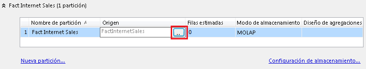

# Crear y administrar una partición local (Analysis Services)
  Puede crear particiones adicionales para un grupo de medida con el fin de mejorar el rendimiento de procesamiento. Tener varias particiones permite asignar datos de hechos en un número correspondiente de archivos de datos físicos tanto en servidores locales como en servidores remotos. En Analysis Services, las particiones se pueden procesar independientemente y en paralelo, lo que permite tener más control sobre las cargas de trabajo de procesamiento del servidor.  
  
 Las particiones se pueden crear en [!INCLUDE[ssBIDevStudio](../../includes/ssbidevstudio-md.md)] durante el diseño del modelo o una vez implementada la solución mediante [!INCLUDE[ssManStudioFull](../../includes/ssmanstudiofull-md.md)] o XMLA. Se recomienda elegir un enfoque solamente. Si alterna entre las herramientas, puede que los cambios realizados en una base de datos implementada en [!INCLUDE[ssManStudioFull](../../includes/ssmanstudiofull-md.md)] se sobrescriban al volver a implementar la solución posteriormente desde [!INCLUDE[ssBIDevStudio](../../includes/ssbidevstudio-md.md)].  
  
## Antes de empezar  
 Compruebe si tiene la edición Business Intelligence o Enterprise. La edición Standard no admite varias particiones. Para comprobar la edición, haga clic con el botón derecho en el nodo de servidor en [!INCLUDE[ssManStudioFull](../../includes/ssmanstudiofull-md.md)] y elija **Informes** | **General**. Para más información sobre la disponibilidad de características, vea [Características compatibles con las ediciones de SQL Server 2016](../../analysis-services/analysis-services-features-supported-by-the-editions-of-sql-server-2016.md).  
  
 Desde el principio, es importante entender que las particiones deben compartir el mismo diseño de agregaciones si se desea mezclarlas posteriormente. Solo se pueden mezclar particiones si tienen diseños de agregaciones y modos de almacenamiento idénticos.  
  
> [!TIP]  
>  Explore los datos en la vista del origen de datos (DSV) para entender el intervalo y la profundidad de los datos para los que va a crear particiones. Por ejemplo, si va a crear particiones por fecha, puede ordenar por una columna de fecha para determinar los límites superior e inferior de cada partición.  
  
## Elegir un método  
 La consideración más importante a la hora de crear particiones es segmentar los datos de modo que no haya filas duplicadas. Los datos se deben almacenar en una, y solo una, partición para evitar que se dupliquen las filas. Por tanto, es frecuente crear particiones por fecha de modo que se puedan definir límites claros entre cada partición.  
  
 Puede emplear cualquier técnica para distribuir los datos de hechos en varias particiones. Se pueden emplear las técnicas siguientes para segmentar los datos.  
  
|Técnica|Recomendaciones|  
|---------------|---------------------|  
|Usar consultas SQL para segmentar datos de hechos|Las particiones pueden proceder de consultas SQL. Durante el procesamiento, la consulta SQL sirve para recuperar los datos. La cláusula WHERE de la consulta proporciona el filtro que segmenta los datos para cada partición. Analysis Services genera la consulta automáticamente, pero usted debe completar la cláusula WHERE para segmentar los datos correctamente.   La ventaja principal de este enfoque es la facilidad con la que se pueden crear particiones de los datos a partir de una única tabla de origen. Si todos los datos de origen proceden de una tabla de hechos grande, puede generar consultas que filtren los datos en particiones discretas, sin tener que crear estructuras de datos adicionales en la vista del origen de datos (DSV).   Una desventaja es que el uso de consultas interrumpirá el enlace entre la partición y la DSV. Si más tarde actualiza la DSV en el proyecto de Analysis Services, por ejemplo si agrega columnas a la tabla de hechos, debe editar manualmente las consultas para cada partición de manera que incluyan la nueva columna. El segundo método, que se describe más adelante, no presenta este inconveniente.|  
|Usar tablas en la DSV para segmenta datos de hechos|Puede enlazar una partición a una tabla, consulta con nombre o vista en la DSV. Como base de una partición, las tres son funcionalmente equivalentes. Toda la tabla, la consulta con nombre o la vista proporciona todos los datos para una sola partición.   El uso de una tabla, vista o consulta con nombre pone toda la lógica de selección de los datos en la DSV, lo que puede ser más fácil de administrar y mantener con el tiempo. Una ventaja importante de este método es que los enlaces de tabla se conservan. Si actualiza la tabla de origen más adelante, no es necesario modificar las particiones que la usan. En segundo lugar, todas las tablas, consultas con nombre y vistas existen en un espacio de trabajo común, por lo que es más cómodo realizar actualizaciones: no es necesario abrir y editar consultas de partición individualmente.|  
  
## Opción 1: filtrar una tabla de hechos para varias particiones  
 Para crear varias particiones, empiece modificando la propiedad **Origen** de la partición predeterminada. De forma predeterminada, un grupo de medida se crea con una sola partición que está enlazada a una única tabla en la DSV. Antes de poder agregar más particiones, debe modificar primero la partición original para que solo contenga una parte de los datos de hechos. Después puede crear particiones adicionales para almacenar los datos restantes.  
  
 Cree los filtros de forma que los datos no estén duplicados entre las particiones. Un filtro de partición especifica qué datos de la tabla de hechos se utilizarán en la partición. Es importante que los filtros de todas las particiones de un cubo extraigan de la tabla de hechos conjuntos de datos que se excluyan mutuamente. Los mismos datos de hechos pueden estar duplicados si aparecen en varias particiones.  
  
1.  En [!INCLUDE[ssBIDevStudio](../../includes/ssbidevstudio-md.md)], en el Explorador de soluciones, haga doble clic en el cubo para abrirlo en el Diseñador de cubos y, después, haga clic en la pestaña **Particiones** .  
  
2.  Expanda el grupo de medida para el que va a agregar particiones. De forma predeterminada, cada grupo de medida tiene una partición, enlazada a una tabla de hechos en la DSV.  
  
3.  En la columna Origen, haga clic en el botón Examinar (. para abrir el cuadro de diálogo Origen de la partición.  
  
       
  
4.  En Tipo de enlace, seleccione **Enlace de consultas**. La consulta SQL que selecciona los datos aparece automáticamente.  
  
5.  En la cláusula WHERE de la parte inferior, agregue un filtro que segmente los datos para esta partición.  
  
     Algunos ejemplos de sintaxis de la cláusula WHERE incluyen `WHERE OrderDateKey >= '20060101'` o `WHERE OrderDateKey BETWEEN '20051001' AND '20051201'`. Para obtener otros ejemplos, vea [WHERE &#40;Transact-SQL&#41;](../../t-sql/queries/where-transact-sql.md).  
  
     Tenga en cuenta que los filtros siguientes son mutuamente excluyentes dentro de cada conjunto:  
  
    |||  
    |-|-|  
    |Conjunto 1:|"SaleYear" = 2012   "SaleYear" = 2013|  
    |Conjunto 2:|"Continent" = 'NorthAmerica'   "Continent" = 'Europe'   "Continent" = 'SouthAmerica'|  
    |Conjunto 3:|"Country" = 'USA'   "Country" = 'Mexico'   ("Country" <> 'USA' AND "Country" <> 'Mexico')|  
  
6.  Haga clic en **Comprobar** para comprobar si hay errores de sintaxis y, a continuación, haga clic en **Aceptar**.  
  
7.  Repita los pasos anteriores para crear las particiones restantes, modificando la cláusula WHERE cada vez para seleccionar el segmento de datos siguiente.  
  
8.  Implemente la solución o procese la partición para cargar los datos. Asegúrese de procesar todas las particiones.  
  
9. Examine el cubo para comprobar que se devuelven los datos correctos.  
  
 Cuando tenga un grupo de medida que use varios grupos de medida, puede crear particiones adicionales en [!INCLUDE[ssManStudioFull](../../includes/ssmanstudiofull-md.md)]. En un grupo de medida, haga clic con el botón derecho en la carpeta de particiones y seleccione **Nuevas particiones** para iniciar el asistente.  
  
> [!NOTE]  
>  En lugar de filtrar datos en una partición, puede usar la misma consulta para crear una consulta con nombre en la DSV y después basar la partición en esa consulta.  
  
## Opción 2: usar tablas, vistas o consultas con nombre  
 Si la DSV ya organiza los hechos en tablas individuales (por ejemplo, por año o trimestre), puede crear particiones basadas en una tabla individual, donde cada partición tiene su propia tabla de origen de datos. Básicamente así es como se crean particiones para los grupos de medida de forma predeterminada, pero en el caso de varias particiones se divide la partición original en varias particiones y se asigna cada partición nueva a la tabla de origen de datos que proporciona los datos.  
  
 Las vistas y las consultas con nombre son equivalentes funcionalmente a las tablas en el sentido de que los tres objetos se definen en la DSV y se enlazan a una partición mediante la opción Enlace de tablas del cuadro de diálogo Origen de la partición. Puede crear una vista o una consulta con nombre para generar el segmento de datos necesario para cada partición. Para más información, vea [Definir consultas con nombre en una vista del origen de datos &#40;Analysis Services&#41;](../../analysis-services/multidimensional-models/define-named-queries-in-a-data-source-view-analysis-services.md).  
  
> [!IMPORTANT]  
>  Cuando se crean consultas con nombre mutuamente excluyentes para particiones de una DSV, debe asegurarse de que los datos combinados de las particiones incluyen todos los datos de un grupo de medida que desea incluir en el cubo. Asegúrese de no dejar una partición predeterminada basada en toda la tabla del grupo de medida; en caso contrario, cualquier partición basada en consulta se superpondrá a la consulta basada en la tabla completa.  
  
1.  Cree una o varias consultas con nombre para usar como origen de la partición. Para más información, vea [Definir consultas con nombre en una vista del origen de datos &#40;Analysis Services&#41;](../../analysis-services/multidimensional-models/define-named-queries-in-a-data-source-view-analysis-services.md).  
  
     La consulta con nombre debe basarse en la tabla de hechos asociada al grupo de medida. Por ejemplo, si va a crear particiones del grupo de medida FactInternetSales, las consultas con nombre de la DSV deben especificar la tabla FactInternetSales en la instrucción FROM.  
  
2.  En [!INCLUDE[ssBIDevStudio](../../includes/ssbidevstudio-md.md)], en el Explorador de soluciones, haga doble clic en el cubo para abrirlo en el Diseñador de cubos y, después, haga clic en la pestaña **Particiones** .  
  
3.  Expanda el grupo de medida para el que va a agregar particiones.  
  
4.  Haga clic en **Nueva partición** con el fin de iniciar el Asistente para particiones. Si creó las consultas con nombre con la tabla de hechos enlazada al grupo de medida, debe ver todas las consultas con nombre creadas en el paso anterior.  
  
5.  En Especificar información de origen, elija una de las consultas con nombre que creó en un paso anterior. Si no ve ninguna consulta con nombre, vuelva a la DSV y compruebe la instrucción FROM.  
  
6.  Haga clic en **Siguiente** para aceptar los valores predeterminados de todas las páginas posteriores.  
  
7.  En la última página, Finalización del asistente, asigne un nombre descriptivo a la partición.  
  
8.  Haga clic en **Finalizar**.  
  
9. Repita los pasos anteriores para crear las particiones restantes, eligiendo una consulta con nombre diferente cada vez para seleccionar el segmento de datos siguiente.  
  
10. Implemente la solución o procese la partición para cargar los datos. Asegúrese de procesar todas las particiones.  
  
11. Examine el cubo para comprobar que se devuelven los datos correctos.  
  
## Paso siguiente  
 Cuando cree consultas mutuamente excluyentes para particiones, debe asegurarse de que la combinación de los datos de particiones contiene todos los datos que desea incluir en el cubo.  
  
 Como último paso, normalmente deseará quitar la partición predeterminada basada en la propia tabla (si todavía existe); de lo contrario, las particiones basadas en consultas se superpondrán a la consulta basada en la tabla completa.  
  
## Vea también  
 [Particiones &#40;Analysis Services - Datos multidimensionales&#41;](../../analysis-services/multidimensional-models-olap-logical-cube-objects/partitions-analysis-services-multidimensional-data.md)   
 [Particiones remotas](../../analysis-services/multidimensional-models-olap-logical-cube-objects/partitions-remote-partitions.md)   
 [Mezclar particiones en Analysis Services &#40;SSAS - Multidimensional&#41;](../../analysis-services/multidimensional-models/merge-partitions-in-analysis-services-ssas-multidimensional.md)  
  
  
