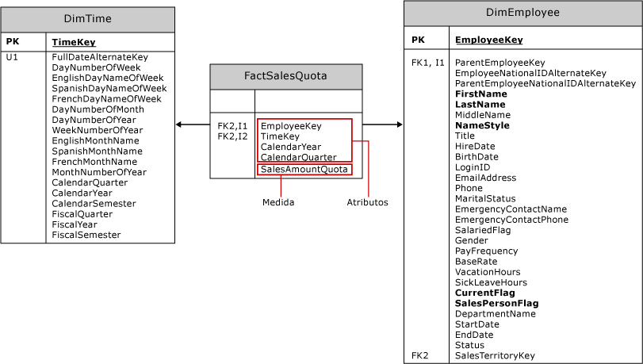

# Crear medidas y grupos de medida en modelos multidimensionales
  Una *medida* es una agregación de valores de datos numéricos, como una suma, un recuento, un mínimo, un máximo, un promedio o una expresión MDX personalizada que usted crea. Un *grupo de medida* es un contenedor para una o más medidas. Todas las medidas existen en un grupo de medida, incluso si solo hay una medida. Un cubo debe tener al menos una medida y un grupo de medida.  
  
 En este tema se incluyen las secciones siguientes:  
  
-   [Enfoques para crear medidas](#bkmk_create)  
  
-   [Componentes de una medida](#bkmk_comps)  
  
-   [Modelado de medidas y grupos de medida de hechos y tablas de hechos](#bkmk_modeling)  
  
-   [Granularidad de un grupo de medida](#bkmk_grain)  
  
##   Enfoques para crear medidas  
 Las medidas pueden ser un elemento estático del cubo, que se crean en tiempo de diseño y están siempre presentes cada vez que se tiene acceso al cubo. Sin embargo, también puede definirse una medida como un *miembro calculado* mediante MDX para proporcionar un valor calculado para una medida en función de otras medidas del cubo. Un miembro calculado se puede aplicar al ámbito de la sesión o el usuario.  
  
 Para crear una medida o un grupo de medida, use uno de los siguientes enfoques:  
  
|||  
|-|-|  
|Asistente para cubos|ejecute el Asistente para cubos en [!INCLUDE[ssBIDevStudioFull](../../includes/ssbidevstudiofull-md.md)] para crear un cubo.   En el Explorador de soluciones, haga clic con el botón derecho en **Cubos** y elija **Nuevo cubo**. Vea [Modelado multidimensional &#40;tutorial de Adventure Works&#41;](../../analysis-services/multidimensional-modeling-adventure-works-tutorial.md) si necesita ayuda con estos pasos.   Cuando se crea un cubo basado en las tablas de un almacén de datos existente, las definiciones para las medidas y para el grupo de medida se materializan como parte del proceso de creación del cubo. En el asistente, podrá elegir qué hechos y tablas de hechos usar como base para la medida y el grupo de medida de los objetos en su cubo.|  
|Nuevo cuadro de diálogo de medida|Si supone que el cubo ya existe en [!INCLUDE[ssBIDevStudioFull](../../includes/ssbidevstudiofull-md.md)], haga doble clic en el nombre del cubo en el Explorador de soluciones para abrirlo en el Diseñador de cubos. En el panel de medidas, haga clic con el botón secundario en el nodo superior para crear un nuevo grupo de medida, o medidas nuevas, al especificar una tabla de origen, la columna y el tipo de agregación. El uso de este enfoque requiere que elija el método de agregación de una lista fija de funciones predeterminadas. Vea [Use Aggregate Functions](../../analysis-services/multidimensional-models/use-aggregate-functions.md) para obtener una explicación de las agregaciones que se usan con más frecuencia.|  
|miembro calculado|Los miembros calculados agregan flexibilidad y capacidad de análisis a un cubo en [!INCLUDE[ssASnoversion](../../includes/ssasnoversion-md.md)] porque se puede controlar cuándo y cómo se crean. A veces, solo necesita una medida temporalmente, para la duración de una sesión de usuario o en Management Studio como parte de una investigación.   En [!INCLUDE[ssBIDevStudioFull](../../includes/ssbidevstudiofull-md.md)], abra la pestaña Cálculos para crear un nuevo miembro calculado.   Elija este método cuando se base una medida en una expresión MDX. Vea estos temas para más información: [Generar medidas en MDX cálculos](../../analysis-services/multidimensional-models/mdx/mdx-building-measures.md), [Cálculos](../../analysis-services/multidimensional-models-olap-logical-cube-objects/calculations.md), [Cálculos en modelos multidimensionales](../../analysis-services/multidimensional-models/calculations-in-multidimensional-models.md) y [Aspectos básicos de scripting MDX &#40;Analysis Services&#41;](../../analysis-services/multidimensional-models/mdx/mdx-scripting-fundamentals-analysis-services.md).|  
|MDX o XMLA|En SQL Server Management Studio, puede ejecutar MDX o XMLA para modificar una base de datos y así incluir una nueva medida calculada. Este método es útil para pruebas de datos ad hoc, después de implementar la solución en un servidor. Consulte [Document and Script an Analysis Services Database](../../analysis-services/multidimensional-models/document-and-script-an-analysis-services-database.md).|  
  
##   Componentes de una medida  
 Una medida es un objeto con propiedades. Además de su nombre, una medida debe tener un tipo de agregación y una columna de origen o una expresión que se usa para cargar la medida con los datos. Se puede modificar la definición de la medida al establecer sus propiedades.  
  
|||  
|-|-|  
|**origen**|La mayoría de las medidas se derivan de las columnas numéricas de tablas de hechos en un almacén de datos externo, como la columna Sales Amount de las tablas Internet Sales y Reseller Sales del almacenamiento de datos AdventureWorks, pero también puede crear nuevas medidas que se basen completamente en los cálculos que usted defina.   Las columnas de atributo de las tablas de dimensiones pueden utilizarse para definir medidas, pero generalmente son de suma parcial o no aditivas en términos de comportamiento de agregación. Para más información sobre el comportamiento de suma parcial, vea [Definir el comportamiento de suma parcial](../../analysis-services/multidimensional-models/define-semiadditive-behavior.md).|  
|**agregación**|De manera predeterminada, las medidas se suman en cada dimensión. Sin embargo, la propiedad **AggregateFunction** permite modificar este comportamiento. Vea [Use Aggregate Functions](../../analysis-services/multidimensional-models/use-aggregate-functions.md) para obtener una lista.|  
|**Propiedades**|Vea [Configure Measure Properties](../../analysis-services/multidimensional-models/configure-measure-properties.md) para obtener descripciones de propiedad adicionales.|  
  
##   Modelado de medidas y grupos de medida de hechos y tablas de hechos  
 Antes de ejecutar un asistente, es útil entender los principios de modelado detrás de la definición de medida.  
  
 Las medidas y grupos de medida son los objetos multidimensionales que representan los hechos y las tablas de hechos en un almacén de datos externo. En la mayoría de los casos, las medidas y grupos de medida se basarán en los objetos de una vista del origen de datos, que, a su vez, se crearán desde el almacén de datos subyacente.  
  
 En el siguiente diagrama se representa la tabla de hechos **FactSalesQuota** y las dos tablas de dimensiones asociadas a ella: **DimTime** y **DimEmployee**. En el cubo de ejemplo Adventure Works, estas tablas se usan como base del grupo de medida Sales Quotas y las dimensiones Time y Employee.  
  
   
  
 La tabla de hechos contiene dos tipos de columnas básicos: las columnas de atributo y las columnas de medida.  
  
-   Las columnas de atributo se utilizan para crear relaciones de clave externa con tablas de dimensión, de forma que los datos cuantificables de las columnas de medida pueden organizarse por los datos contenidos en las tablas de dimensión. Las columnas de atributo también se utilizan para definir la granularidad de una tabla de hechos y su grupo de medida.  
  
-   Las columnas de medida definen las medidas contenidas en un grupo de medida.  
  
 Al ejecutar el Asistente para cubos, las claves externas se filtran. En la lista de columnas restantes para elegir, verá las columnas de medida, además de las columnas de atributos que no se identifican como clave externa. En el ejemplo **FactSalesQuote** , el asistente ofrecerá **CalendarYear** y **CalendarQuarter** , además de **SalesAmountQuota**. Solo la columna de medida **SalesAmountQuota** dará como resultado una medida aplicable para el modelo multidimensional. Las otras columnas de fecha existen para calificar cada importe de cuota. Es necesario excluir las otras columnas ( **CalendarYear** y **CalendarQuarter**) de la lista de medidas del Asistente para cubos (o quitarlas del grupo de medida más adelante en el diseñador).  
  
 El punto de esta explicación es que no todas las columnas que ofrece el asistente son útiles como medida. Confíe en su conocimiento de los datos y cómo lo usará al decidir qué columnas usar como medidas. Recuerde que puede hacer clic con el botón secundario en una tabla de la vista de origen de datos para explorar los datos, que pueden ayudarlo a identificar las columnas que quiere usar como medidas. Para más información, vea [Explorar datos en una vista del origen de datos &#40;Analysis Services&#41;](../../analysis-services/multidimensional-models/explore-data-in-a-data-source-view-analysis-services.md).  
  
> [!NOTE]  
>  No todas las medidas se derivan directamente de un valor almacenado en una columna de la tabla de hechos. Por ejemplo, la medida **Sales Person Count** definida en el grupo de medida **Sales Quota** del cubo de ejemplo de Adventure Works se basa en realidad en el recuento de valores únicos (o recuento distintivo) de la columna **EmployeeKey** de la tabla de hechos **FactSalesQuota** .  
  
##   Granularidad de un grupo de medida  
 Los grupos de medida tienen una granularidad asociada que hace referencia al nivel de detalle admitido en una tabla de hechos. La granularidad se establece a través de la relación de clave externa con una dimensión.  
  
 Por ejemplo, la tabla de hechos **FactSalesQuota** tiene una relación de clave externa con la tabla **DimEmployee** y cada registro de la tabla **FactSalesQuota** se relaciona con un único empleado, por lo que la granularidad del grupo de medida tal como se ve desde la dimensión Employee se encuentra en el nivel de un empleado individual.  
  
 La granularidad de un grupo de medida no puede ser más concreta que el nivel inferior de la dimensión desde la que se ve el grupo de medida, pero la granularidad puede hacerse más general mediante atributos adicionales. Por ejemplo, la tabla de hechos **FactSalesQuota** utiliza tres columnas, **TimeKey**, **CalendarYear**y **CalendarQuarter**, para establecer la granularidad de la relación con la tabla **DimTime** . En consecuencia, la granularidad del grupo de medida tal como se ve desde la dimensión Time es por trimestre natural, no por día, que es el nivel inferior de la dimensión Time.  
  
 Puede especificarse la granularidad de un grupo de medida con respecto a determinada dimensión mediante la pestaña **Uso de dimensiones** del Diseñador de cubos. Para obtener más información acerca de las relaciones de dimensiones, vea [Dimension Relationships](../../analysis-services/multidimensional-models-olap-logical-cube-objects/dimension-relationships.md).  
  
## Vea también  
 [Cubos en modelos multidimensionales](../../analysis-services/multidimensional-models/cubes-in-multidimensional-models.md)   
 [Medidas y grupos de medida](../../analysis-services/multidimensional-models/measures-and-measure-groups.md)  
  
  
