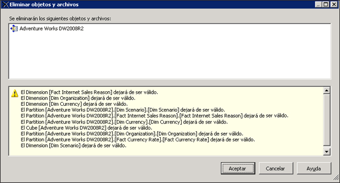

# Eliminar una vista del origen de datos (Analysis Services)
  Si ha dejado de usar una vista del origen de datos (DSV) en un proyecto de OLAP, puede eliminarla del proyecto en [!INCLUDE[ssBIDevStudioFull](../../includes/ssbidevstudiofull-md.md)].  
  
 La eliminación de una DSV es permanente. No es posible restaurar una DSV eliminada en un proyecto o base de datos de [!INCLUDE[ssASnoversion](../../includes/ssasnoversion-md.md)] .  
  
 No se pueden eliminar las DSV de las que dependen otros objetos desde una base de datos de [!INCLUDE[ssASnoversion](../../includes/ssasnoversion-md.md)] abierta por [!INCLUDE[ssBIDevStudioFull](../../includes/ssbidevstudiofull-md.md)] en el modo en línea. Para eliminar una DSV desde un proyecto que está conectado a una base de datos que se ejecuta en un servidor, primero debe eliminar todos los objetos de la base de datos de [!INCLUDE[ssASnoversion](../../includes/ssasnoversion-md.md)] que dependen de esa DSV antes de eliminar la DSV.  
  
 Si elimina una DSV, invalidará otros objetos de [!INCLUDE[ssASnoversion](../../includes/ssasnoversion-md.md)] que dependen de ella, de modo que, antes de eliminar la DSV, verá la lista de objetos que quedarían invalidados cuando se quite la DSV. Revise esta lista con atención para asegurarse de que no contiene objetos que todavía espera usar.  
  
   
  
## Vea también  
 [Vistas del origen de datos en modelos multidimensionales](../../analysis-services/multidimensional-models/data-source-views-in-multidimensional-models.md)   
 [Cambiar las propiedades de una vista del origen de datos &#40;Analysis Services&#41;](../../analysis-services/multidimensional-models/change-properties-in-a-data-source-view-analysis-services.md)  
  
  
