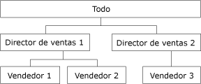

# Atributos de dimensión de elementos primarios y secundarios
[!INCLUDE[ssas-appliesto-sqlas](../../includes/ssas-appliesto-sqlas.md)]
En [!INCLUDE[msCoName](../../includes/msconame-md.md)] [!INCLUDE[ssNoVersion](../../includes/ssnoversion-md.md)] [!INCLUDE[ssASnoversion](../../includes/ssasnoversion-md.md)], se realiza normalmente una suposición general sobre el contenido de los miembros de una dimensión. Los miembros hoja contienen datos derivados directamente de los orígenes de datos subyacentes; los miembros no hoja contienen datos derivados de agregaciones realizadas en miembros secundarios.  
  
 No obstante, en una jerarquía de elementos primarios y secundarios, algunos miembros no hoja también pueden tener datos derivados de orígenes de datos subyacentes, además de los datos agregados de miembros secundarios. Para estos miembros no hoja de una jerarquía de elementos primarios y secundarios, se pueden crear miembros secundarios especiales generados por el sistema que contengan los datos de la tabla de hechos subyacente. Denominados *miembros de datos*, contienen un valor asociado directamente a un miembro no hoja que es independiente del valor de resumen calculado a partir de los descendientes del miembro no hoja.  
  
 Los miembros de datos se encuentran disponibles solo en dimensiones con jerarquías de elementos primarios y secundarios, y solo son visibles si lo tienen permitido por su atributo primario. Se puede utilizar el Diseñador de dimensiones para controlar la visibilidad de los miembros de datos. Para exponer los miembros de datos, establezca la propiedad **MembersWithData** del atributo primario en **NonLeafDataVisible**. Para ocultar los miembros de datos contenidos en el atributo primario, establezca la propiedad **MembersWithData** del atributo primario en **NonLeafDataHidden**.  
  
 Este valor no reemplaza el comportamiento de agregación normal para los miembros no hoja; el miembro de datos siempre se incluye como miembro secundario para fines de agregación. Sin embargo, se puede utilizar una fórmula de resumen personalizado para reemplazar el comportamiento normal de agregación. La función [DataMember](../../mdx/datamember-mdx.md) de expresiones multidimensionales (MDX) ofrece la posibilidad de tener acceso al valor del miembro de datos asociado independientemente del valor de la propiedad **MembersWithData** .  
  
 La propiedad **MembersWithDataCaption** del atributo primario ofrece a [!INCLUDE[ssASnoversion](../../includes/ssasnoversion-md.md)] la plantilla de nomenclatura usada para generar nombres de miembro para miembros de datos.  
  
## Usar miembros de datos  
 Los miembros de datos son de utilidad al agregar medidas a dimensiones organizativas que tienen jerarquías de elementos primarios y secundarios. Por ejemplo, en el diagrama siguiente se muestra una dimensión con tres niveles que representa el volumen de ventas brutas de productos. El primer nivel muestra el volumen de ventas brutas de todos los agentes de ventas. El segundo nivel contiene el volumen de ventas brutas de todo el personal de ventas por director de ventas y el tercer nivel contiene el volumen de ventas brutas de todo el personal de ventas por vendedor.  
  
   
  
 Habitualmente, el valor del miembro Sales Manager 1 se deriva al agregar los valores de los miembros Salesperson 1 y Salesperson 2. Sin embargo, como Sales Manager 1 también puede vender productos, este miembro también puede contener datos derivados de la tabla de hechos, ya que puede haber ventas brutas asociadas a Sales Manager 1.  
  
 Además, la comisión individual de cada miembro del personal de ventas puede variar. En este caso, se utilizan dos escalas diferentes para calcular la comisión de las ventas brutas individuales de los directores de ventas, frente a las ventas brutas totales generadas por sus vendedores. Por lo tanto, es importante que los miembros no hoja puedan tener acceso a los datos de la tabla de hechos subyacente. Se puede utilizar la función **DataMember** de MDX para recuperar el volumen de ventas brutas del miembro Sales Manager 1 y una expresión de resumen personalizado para excluir el miembro de datos del valor agregado del miembro Sales Manager 1, lo que proporciona el volumen de ventas brutas de los vendedores asociados a ese miembro.  
  
## Vea también  
 [Referencia de propiedades de atributos de dimensión](../../analysis-services/multidimensional-models/dimension-attribute-properties-reference.md)   
 [Dimensiones de elementos primarios y secundarios](../../analysis-services/multidimensional-models/parent-child-dimension.md)  
  
  
