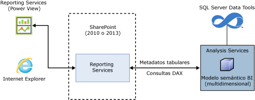
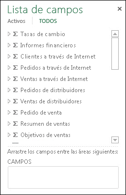
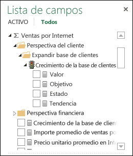
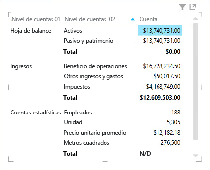
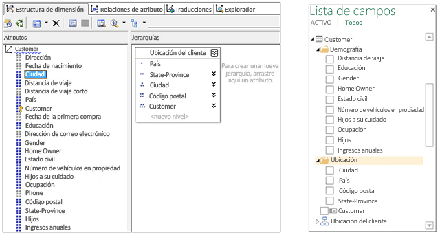
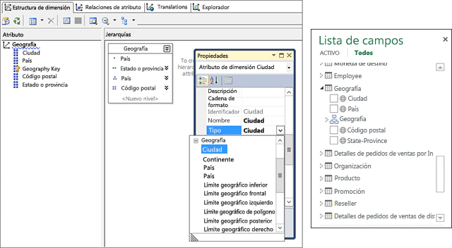
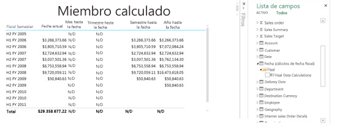
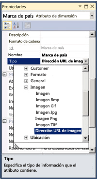
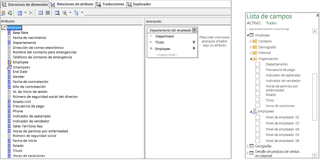
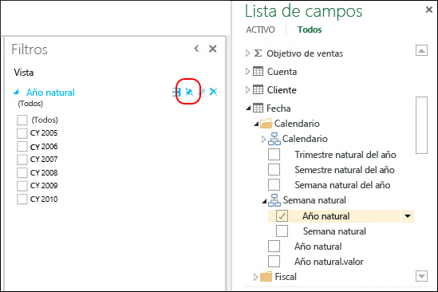

# <a name="understanding-power-view-for-multidimensional-models"></a>Descripción de Power View para modelos multidimensionales
  En este artículo se describe la característica Power View para modelos multidimensionales de SQL Server y se proporciona información importante para los profesionales y los administradores de BI que pretenden implementar Power View para modelos multidimensionales en su organización.  
  
 Los modelos multidimensionales ofrecen soluciones de análisis, almacenamiento y modelado de datos OLAP punteras del sector. Los modelos multidimensionales de SQL Server permiten el análisis de datos, la exploración y la visualización ad hoc mediante Microsoft Power View.  
  
 Power View es un cliente Web ligero que se inicia en el explorador desde un archivo de origen de datos de informe (.rsds) en una biblioteca de SharePoint. El origen de datos de informe actúa como un puente entre el cliente y el origen de datos back-end. El origen de datos back-end puede ser un libro [!INCLUDE[ssGemini](../../includes/ssgemini-md.md)] en SharePoint, un modelo tabular de un servidor de Analysis Services que se ejecute en modo tabular o un modelo multidimensional en un servidor de Analysis Services que se ejecute en modo multidimensional. Los informes de Power View pueden guardarse en una galería o una biblioteca de SharePoint y se comparten con otros miembros de la organización.  
  
 **Arquitectura de Power View para modelos multidimensionales**  
  
   
  
## <a name="prerequisites"></a>Requisitos previos  
 **Requisitos de servidor**  
  
-   Microsoft SQL Server 2016 Analysis Services ejecutándose en modo multidimensional.  
  
-   Complemento Microsoft SQL Server 2016 Reporting Services para Microsoft SharePoint Server 2010 o una versión Enterprise Edition posterior.  
  
 **Requisitos de cliente**  
  
-   La funcionalidad de cliente de Power View requiere Microsoft Silverlight 5. Para más información, vea [Compatibilidad del explorador de Reporting Services y Power View](../../reporting-services/browser-support-for-reporting-services-and-power-view.md).  
  
## <a name="features"></a>Características  
 **Compatibilidad nativa con Power View**  
  
 Con esta versión, los modelos multidimensionales admiten el análisis y la visualización con Power View en el modo SharePoint. No se necesita ninguna configuración especial de los modelos multidimensionales. Sin embargo, hay algunas diferencias en el modo en que los objetos del modelo multidimensional se muestran en Power View en comparación con otras herramientas cliente como Microsoft Excel y Microsoft Performance Point. Esta versión no permite el análisis y la visualización de modelos multidimensionales con Power View en Excel.  
  
 **Compatibilidad nativa con las consultas DAX**  
  
 Con esta versión, los modelos multidimensionales admiten funciones y consultas DAX además de las consultas MDX tradicionales. Algunas funciones DAX, como PATH, no son aplicables en el modelado multidimensional. Para comprender mejor DAX y compararlo con MDX, vea [Expresiones de análisis de datos y MDX](http://msdn.microsoft.com/library/ff487170\(SQL.105\).aspx).  
  
## <a name="multidimensional-to-tabular-object-mapping"></a>Asignación de objetos multidimensional o tabular  
 Analysis Services proporciona una representación de metadatos del modelo tabular de un modelo multidimensional. Los objetos de un modelo multidimensional se representan como objetos tabulares en Power View y en CSDL sin anotaciones BI.  
  
 **Resumen de la asignación de objetos**  
  
|Objeto multidimensional|Objeto tabular|  
|-----------------------------|--------------------|  
|Cubo|Modelo|  
|Dimensión de cubo|Table|  
|Atributos de dimensión (claves, nombre)|Columna|  
|Grupo de medida|Table|  
|Medida|Medida|  
|Medida sin grupo de medida|En una tabla denominada Medidas|  
|Relación de la dimensión del cubo del grupo de medida|Relación|  
|Perspective|Perspective|  
|KPI|KPI|  
|Jerarquías de usuario y elementos primarios y secundarios|Jerarquía|  
|Carpeta para mostrar|Carpeta para mostrar|  
  
## <a name="measures-measure-groups-and-kpis"></a>Medidas, grupos de medida y KPI  
  
> [!NOTE]  
>  Algunas imágenes y texto de este artículo hacen referencia al modelo multidimensional Adventure Works para la base de datos de ejemplo de SQL Server 2012.  
  
 Los grupos de medida de un cubo multidimensional se ven en la lista de campos de Power View como tablas con el signo sigma (∑).  
  
 **Grupos de medida en la lista de campos de Power View**  
  
   
  
 Las medidas dentro de un grupo de medida aparecen como medidas. Si hay medidas calculadas que no tienen un grupo de medida asociado, se agruparán en una tabla especial denominada Medidas.  
  
 Para ayudar a simplificar modelos multidimensionales más complejos, los autores de los modelos pueden definir un conjunto de medidas o KPI en un cubo para que se encuentre dentro de una carpeta de presentación. Power View puede mostrar las carpetas de presentación y las medidas y los KPI en ellas.  
  
 **Medidas y KPI en un grupo de medida**  
  
   
  
### <a name="measures-as-variants"></a>Medidas como variantes  
 Las medidas en los modelos multidimensionales son variantes. Esto significa que las medidas no tienen establecimiento inflexible de tipos y pueden tener tipos de datos diferentes. Por ejemplo, en la imagen siguiente, la medida Amount de la tabla Financial Reporting de forma predeterminada es del tipo de datos Currency pero también tiene un valor de cadena “NA” para el subtotal de “Statistical Accounts”, que es del tipo de datos String. Power View reconoce ciertas medidas como variantes y muestra los valores correctos y el formato en las diferentes visualizaciones.  
  
 **Medida como variante**  
  
   
  
### <a name="implicit-measures"></a>Medidas implícitas  
 Los modelos tabulares proporcionan a los usuarios la posibilidad de crear medidas *implícitas* como recuento, suma o promedio en los campos. En los modelos multidimensionales, dado que los datos de los atributos de dimensión se almacenan de forma diferente, la consulta de medidas implícitas puede tardar mucho. Por ello, las medidas implícitas no están disponibles en Power View.  
  
## <a name="dimensions-attributes-and-hierarchies"></a>Dimensiones, atributos y jerarquías  
 Las dimensiones de cubo se exponen como tablas en los metadatos tabulares. En la lista de campos de Power View, los atributos de dimensión se muestran como columnas dentro de carpetas para mostrar.  Estos atributos tienen establecida en false la propiedad AttributeHierarchyEnabled; por ejemplo, el atributo Birth Date de la dimensión Customer o la propiedad AttributeHierarchyVisible establecida en false no aparecerá en la lista de campos de Power View. Las jerarquías de varios niveles o las jerarquías de usuario, por ejemplo Customer Geography en la dimensión Customer, se exponen como jerarquías en la lista de campos de Power View. Los miembros desconocidos ocultos de un atributo de dimensión se exponen en consultas DAX en Power View.  
  
 **La dimensión, los atributos y las jerarquías de SQL Server Data Tools (SSDT) y la lista de campos de Power View**  
  
   
  
### <a name="dimension-attribute-type"></a>Tipo de atributo de dimensión  
 Los modelos multidimensionales permiten asociar atributos de dimensión con tipos de atributos de dimensión específicos. La imagen siguiente muestra la dimensión Geography, en la que los atributos de dimensión City, State-Province, Country y Postal Code tienen asociados tipos geography. Se exponen en los metadatos tabulares. Power View reconoce los metadatos que permiten que los usuarios creen visualizaciones de mapas. Esto se indica con el icono de mapa situado junto a las columnas City, Country, Postal Code y State-Province en la tabla Geography de la lista de campos de Power View.  
  
 **Tipos geography de atributos de dimensión en SSDT y en la lista de campos de Power View**  
  
   
  
### <a name="dimension-calculated-members"></a>Miembros calculados de dimensión  
 Los modelos multidimensionales admiten miembros calculados para los secundarios de todos con un único miembro real. Las restricciones adicionales al exponer este tipo de miembro calculado son:  
  
-   Debe ser un solo miembro real cuando la dimensión tenga más de un atributo.  
  
-   Un atributo que contenga miembros calculados no puede ser el atributo clave de la dimensión a menos que sea el único.  
  
-   Un atributo que contenga los miembros calculados no puede ser un atributo primario-secundario.  
  
 Los miembros calculados de las jerarquías de usuario no se exponen en Power View; sin embargo, los usuarios finales seguirán pudiendo conectarse a un cubo que contenga miembros calculados en jerarquías de usuario.  
  
 La imagen siguiente muestra un informe de Power View para un cubo que contiene miembros calculados de inteligencia de tiempo en un atributo de dimensión “Fiscal Date Calculations” de la dimensión Date.  
  
 **Informe de Power View con miembros calculados**  
  
   
  
### <a name="default-members"></a>Miembros predeterminados  
 Los modelos multidimensionales admiten miembros predeterminados para los atributos de dimensión. El miembro predeterminado se usa en Analysis Services al agregar datos para una consulta. El miembro predeterminado de un atributo de dimensión se expone como valor predeterminado o filtro para la columna correspondiente en los metadatos tabulares.  
  
 Power View se comporta de forma muy parecida a las tablas dinámicas de Excel cuando se aplican atributos. Cuando un usuario agregue una columna a una visualización de Power View (tabla, matriz o gráfico) que contiene un valor predeterminado, este no se aplicará y se muestran los valores disponibles. Si el usuario agrega la columna a los filtros, se aplicará el valor predeterminado.  
  
### <a name="dimension-security"></a>Seguridad de dimensión  
 Los modelos multidimensionales admiten la seguridad de celdas y dimensiones a través de roles. Un usuario que se conecta a un cubo con Power View se autentica y se evalúa si tiene los permisos apropiados. Cuando se aplica seguridad de dimensiones, el usuario de Power View no verá los miembros de dimensión respectivos; sin embargo, si un usuario tiene un permiso de seguridad de celda definido en el que ciertas celdas están restringidas, ese usuario no puede conectarse al cubo con Power View. En algunos casos, los usuarios pueden agregar datos cuando partes de esos datos se calculan a partir de datos protegidos.  
  
### <a name="non-aggregatable-attributeshierarchies"></a>Atributos y jerarquías no agregables  
 En un modelo multidimensional, los atributos de una dimensión pueden tener la propiedad IsAggregatable establecida en false. Esto significa que el autor del modelo que ha especificado aplicaciones cliente no debe agregar los datos a través de jerarquías (atributo o multinivel) cuando consulten los datos. En Power View, este atributo de dimensión se expone como una columna para los que los subtotales no están disponibles. En la imagen siguiente, puede ver un ejemplo de jerarquía no agregable: Accounts. El nivel superior de la jerarquía primario-secundario Accounts es no agregable mientras que otros niveles son agregables. En una visualización de matriz de la jerarquía Accounts (primeros dos niveles), ve los subtotales para el nivel de cuenta 02 pero no para el nivel superior, el nivel de cuenta 01.  
  
 **Jerarquía no agregable de Power View**  
  
   
  
## <a name="images"></a>Imágenes  
 Power View permite procesar las imágenes. En los modelos multidimensionales, una de las formas en que puede proporcionar las imágenes en Power View es exponer las columnas que contienen las direcciones URL de las imágenes. Con esta versión, Analysis Services permite etiquetar los atributos de dimensión como de tipo ImageURL. Este tipo de datos se proporciona entonces a Power View en los metadatos tabulares. Power View puede entonces descargarlos y mostrar las imágenes especificadas en las direcciones URL dentro de las visualizaciones.  
  
 **Tipo de atributo de dimensión ImageURL en SSDT**  
  
   
  
## <a name="parent-child-hierarchies"></a>Jerarquías de elementos primarios y secundarios  
 Los modelos multidimensionales admiten jerarquías de elementos primarios y secundarios, que se exponen como jerarquía en los metadatos tabulares. Cada nivel de la jerarquía se expone como una columna oculta. El atributo clave de la dimensión primaria-secundaria no se expone en los metadatos tabulares.  
  
 **Jerarquías de elementos primarios y secundarios en Power View**  
  
   
  
## <a name="perspectives-and-translations"></a>Perspectivas y traducciones  
 Las perspectivas son vistas de cubos donde solo ciertas dimensiones o grupos de medida son visibles en las herramientas de cliente. Puede especificar un nombre de perspectiva como valor en la propiedad de la cadena de conexión Cube. Por ejemplo, en la siguiente cadena de conexión, ‘Direct Sales’ es una perspectiva en el modelo multidimensional:  
  
 `Data Source=localost;Initial Catalog=AdventureWorksDW-MD;Cube='Direct Sales'`  
  
 Los cubos pueden tener traducciones de datos y metadatos especificados para varios idiomas dentro del modelo. Para ver las traducciones (datos y metadatos) necesita agregar la propiedad “Identificador regional” a la cadena de conexión en el archivo RSDS según se muestra a continuación.  
  
 `Data Source=localost;Initial Catalog=AdventureWorksDW-MD;Cube='Adventure Works'; Locale Identifier=3084`  
  
 Cuando Power View se conecta a un modelo multidimensional con un archivo .rsds que tiene un identificador regional y si una traducción correspondiente está contenida en el cubo, los usuarios verán las traducciones en Power View.  
  
 Para obtener más información, vea [Create a Report Data Source](../../analysis-services/multidimensional-models/create-a-report-data-source.md).  
  
## <a name="power-view-pinned-filters"></a>Filtros anclados de Power View  
 Los informes de Power View puede contener varias vistas. Con esta versión, la característica *Filtro anclado* tanto para los modelos multidimensionales como para los tabulares permite crear filtros que se aplican a través de todas las vistas de un informe. La imagen siguiente muestra el botón de alternar Filtro anclado para un filtro de vista. De forma predeterminada, un filtro de vista no está anclado y se aplica solo a esa vista. Al anclar un filtro de vista, se aplica a todas las vistas; al desanclarlo, se quita de las otras vistas.  
  
 **Filtros anclados**  
  
   
  
## <a name="unsupported-features"></a>Características no admitidas  
 **Power View en Excel 2013** : no permite conectarse a informes para modelos multidimensionales ni crearlos. Sin embargo, **Power View en Excel 2016** permite conectarse a informes para modelos multidimensionales y crearlos. Para obtener más información, consulte [Power View y OLAP en Excel 2016](https://support.office.com/en-us/article/power-view-and-olap-in-excel-2016-ea5ff7a5-ea5f-48d4-aeb0-98c89ab738ac)  
  
 **Acciones** : no se admiten en informes de Power View ni en consultas DAX con un modelo multidimensional.  
  
 **Conjuntos con nombre** : en los modelos multidimensionales, no se admiten en consultas DAX ni Power View con un modelo multidimensional.  
  
> [!NOTE]  
>  Las acciones y los conjuntos con nombre no admitidos no impiden que los usuarios se conecten a modelos multidimensionales ni los exploren con Power View.  
  
 **Seguridad del nivel de celda** : no se admite en informes de Power View.  
  
## <a name="csdlbi-annotations"></a>Anotaciones CSDLBI  
 Los metadatos de cubos multidimensionales se exponen como un Entity Data Model (EDM) basado en un modelo conceptual según el Lenguaje de definición de esquemas conceptuales con anotaciones Business Intelligence (CSDLBI).  
  
 Los metadatos multidimensionales se representan como un espacio de nombres de modelo tabular en un documento CSDLBI o CSDL, cuando se envía una solicitud DISCOVER_CSDL_METADATA a la instancia de Analysis Services.  
  
 **Solicitud DISCOVER_CSDL_METADATA de ejemplo**  
  
```  
<Envelopexmlns=”http://schemas.xmlsoap.org/soap/envelope/”>  
   <Body>  
      <Discoverxmlns=”urn:schemas-microsoft-com:xml-analysis”>  
         <RequestType>DISCOVER_CSDL_METADATA</RequestType>  
         <Restrictions>  
            <RestrictionList>  
              <CATALOG_NAME>”catalogname”<CATALOG_NAME>  
            </RestrictionList>  
         </Restrictions>  
         <Properties>  
            <PropertyList>  
            </PropertyList>  
         </Properties>  
      </Discover>  
   </Body>  
</Envelope>  
  
```  
  
 La solicitud DISCOVER_CSDL_METADATA tiene las restricciones siguientes:  
  
|Nombre|Necesario|Description|  
|----------|--------------|-----------------|  
|CATALOG_NAME|Sí|El nombre de la base de datos o catálogo.|  
|PERSPECTIVE_NAME|Sí, si el cubo contiene más de una perspectiva. Opcional si hay solo un cubo o una perspectiva predeterminada.|El nombre del cubo o de la perspectiva en la base de datos multidimensional.|  
|VERSION|Sí|Versión CSDL solicitada por el cliente. Las construcciones y características multidimensionales se admiten en la versión 2.0.|  
  
 El documento CSDL out devuelto representa el modelo como un espacio de nombres que contiene entidades, asociaciones y propiedades.  
  
 Para obtener información más detallada sobre las anotaciones CSDLBI para los modelos tabulares, vea [Referencia técnica para las anotaciones de Business Intelligence en CSDL](../../analysis-services/tabular-model-programming-compatibility-levels-1050-1103/conceptual-schema-definition-language-csdl/technical-reference-for-bi-annotations-to-csdl.md) en MSDN y [\[MS-CSDLBI\]: Conceptual Schema Definitions File Format with Business Intelligence Annotations](http://msdn.microsoft.com/library/jj161299\(SQL.105\).aspx)([MS-CSDLBI]: Formato de archivo de definiciones de esquema conceptual con anotaciones de Business Intelligence).  
  
## <a name="client-help-on-officecom"></a>Ayuda de cliente en Office.com  
 Los artículos siguientes se proporcionan en Office.com para ayudar a los usuarios a conocer el modo en que los objetos del modelo multidimensional aparecen en Power View y cómo crear un informe de ejemplo:  
  
 [Descripción de los objetos del modelo multidimensional en Power View](http://office.microsoft.com/en-us/excel-help/understanding-multidimensional-model-objects-in-power-view-HA104018589.aspx)  
  
 [Explorar el modelo multidimensional de Adventure Works con Power View](http://office.microsoft.com/excel-help/explore-the-adventure-works-multidimensional-model-by-using-power-view-HA104046830.aspx)  
  
  
