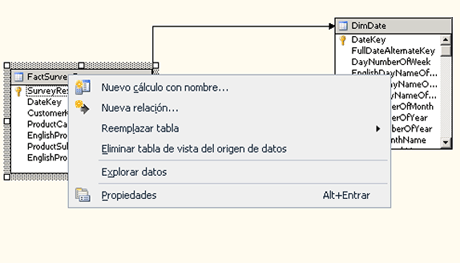

# Trabajar con diagramas en el Diseñador de vistas del origen de datos (Analysis Services)
[!INCLUDE[ssas-appliesto-sqlas](../../includes/ssas-appliesto-sqlas.md)]
  Un diagrama de vista del origen de datos (DSV) es una representación visual de los objetos de una DSV. Puede trabajar con el diagrama de forma interactiva para agregar, ocultar, eliminar o modificar objetos específicos. También puede crear varios diagramas en la misma DSV para resaltar un subconjunto de los objetos.  
  
 Para cambiar el área del diagrama que se muestra en el panel de diagramas, haga clic en la flecha de cuatro puntas de la esquina inferior derecha del panel y, a continuación, arrastre el cuadro de selección sobre el diagrama en miniatura hasta seleccionar el área que desea que aparezca en el panel de diagramas.  
  
 En este tema se incluyen las secciones siguientes:  
  
 [Agregar un diagrama](#bkmk_add)  
  
 [Modificar o eliminar un diagrama](#bkmk_edit)  
  
 [Buscar tablas en un diagrama](#bkmk_findtables)  
  
 [Organizar los objetos de un diagrama](#bkmk_arrangeobjects)  
  
 [Conservar la organización de los objetos](#bkmk_preserve)  
  
##   Agregar un diagrama  
 Los diagramas DSV se crean automáticamente al crear la DSV. Una vez creada la DSV, puede crear diagramas adicionales, quitarlos u ocultar objetos específicos para crear una representación de la DSV más fácil de administrar.  
  
 Para crear un diagrama, haga clic con el botón derecho en cualquier lugar del panel **Organizador de diagramas** y haga clic en **Nuevo diagrama**.  
  
 Al definir inicialmente una vista del origen de datos (DSV) en un proyecto de Analysis Services, todas las tablas y vistas agregadas a la vista del origen de datos se agregan a la \<todas las tablas > diagrama. Este diagrama se muestra en el panel Organizador de diagramas del Diseñador de vistas del origen de datos. Las tablas de este diagrama (así como sus columnas y relaciones) se enumeran en el panel Tablas. Las tablas de este diagrama (así como sus columnas y relaciones) se muestran gráficamente en el panel Esquema. Sin embargo, al agregar tablas, vistas y consultas con nombre para el \<todas las tablas > diagrama, el número total de objetos en este diagrama resulta difícil de visualizar las relaciones, se agregan al diagrama especialmente como varias tablas de hechos y de dimensiones las tablas se relacionan con varias tablas de hechos.  
  
 Para que la visualización resulte más fácil si solo desea ver un subconjunto de las tablas de la vista del origen de datos, puede definir subdiagramas (que se denominan simplemente diagramas), formados por subconjuntos seleccionados de tablas, vistas y consultas con nombre de la vista del origen de datos. Puede utilizar los diagramas para agrupar elementos en la vista del origen de datos en función de sus necesidades empresariales o de soluciones.  
  
 Puede agrupar las tablas y consultas con nombre relacionadas en diagramas separados para fines empresariales y para facilitar la comprensión de una vista del origen de datos que contenga muchas tablas, vistas y consultas con nombre. La misma tabla o consulta con nombre que puede incluirse en varios diagramas excepto la \<todas las tablas > diagrama. En el \<todas las tablas > diagrama, se muestran todos los objetos que se encuentran en la vista del origen de datos una sola vez.  
  
##   Modificar o eliminar un diagrama  
 Cuando trabaje con un diagrama, preste especial atención a los comandos usados para agregar y quitar objetos. Por ejemplo, si elimina un objeto de un diagrama, dicho objeto también se eliminará de la DSV. Si solo desea eliminarlo del diagrama, use **Ocultar tabla** en su lugar.  
  
   
  
 Aunque es posible ocultar objetos individualmente, al mostrarlos de nuevo mediante el comando Mostrar tablas relacionadas volverán a aparecer en el diagrama todos los objetos relacionados. Para controlar qué objetos se devuelven al área de trabajo, arrástrelos desde el panel Tablas.  
  
##   Buscar tablas en un diagrama  
 Si el esquema tiene un gran tamaño, desplazarse hasta una tabla determinada del panel **Diagrama** puede resultar difícil. No obstante, las siguientes herramientas pueden facilitar la búsqueda de una tabla en un diagrama.  
  
-   Desplazarse por la lista de tablas en el panel **Tablas** .  
  
     Para incluir una tabla en el diagrama mostrado actualmente, arrastre la tabla desde el panel **Tablas** hasta el panel del diagrama.  
  
     Para centrar la presentación de una tabla que ya está incluida en el diagrama, seleccione la tabla en el panel **Tablas** .  
  
-   Localizador de tablas del panel **Diagrama** : el localizador de tablas es un icono de flecha de 4 direcciones que se encuentra en la intersección de las barras de desplazamiento horizontal y vertical, en la esquina inferior derecha del panel **Diagrama** . Abre una representación en miniatura del diagrama actual en el panel Diagrama. Puede usar esta miniatura para cambiar la vista del panel Diagrama a cualquier ubicación del diagrama.  
  
-   Use el cuadro de diálogo **Buscar tabla** : haga clic con el botón derecho en un área abierta del panel Diagrama y, después, haga clic en **Buscar tabla**. O bien, haga clic en el comando **Buscar tabla** de la barra de herramientas o del menú **Vista del origen de datos** .  
  
     Puede escribir cadenas y caracteres comodín en el cuadro Filtro para ver subconjuntos de las tablas del diagrama.  
  
##   Organizar los objetos de un diagrama  
 Aunque el Diseñador de vistas del origen de datos puede definir varios diagramas para que una DSV sea más comprensible, los diagramas que contienen docenas de tablas pueden resultar difíciles de leer y la reorganización manual del diseño de la tabla suele ser una tarea tediosa. El Diseñador de vistas del origen de datos puede reorganizar las tablas de forma automática en el diagrama actual usando un diseño rectangular o diagonal que se basa en las relaciones entre las tablas del diagrama.  
  
-   En un diseño rectangular, las líneas de relación se dibujan entre las tablas en lugar de hacerlo entre las columnas. Las líneas de relación se dibujan horizontal y verticalmente entre las tablas.  
  
-   En un diseño diagonal, las líneas de relación se dibujan tan directamente como sea posible entre las columnas relacionadas de las tablas. Una relación con varias columnas se adjunta a la primera columna relacionada de la tabla. Si las columnas de una tabla no son visibles, las líneas se dibujan en la parte superior de la tabla.  
  
##   Conservar la organización de los objetos  
 Una vez organizadas manualmente las tablas de la manera deseada, al agregar más tablas al diagrama se puede producir una actualización del mismo que quite las modificaciones realizadas recientemente a la disposición de los objetos.  
  
 Es más probable que este comportamiento se produzca al agregar una tabla, haciendo que el Organizador de diagramas mueva otras tablas para dar cabida a la nueva. Después vuelve a dibujar el diagrama para asegurarse de que todas las tablas y las líneas de conexión se representan correctamente. En este momento, se puede perder cualquier ajuste manual realizado en la posición de determinados objetos.  
  
 Para evitar este problema, agregue todas las tablas primero, antes de realizar los ajustes finales. Los objetos deben conservar ahora su posición en el diagrama cuando lo abra más adelante.  
  
## Vea también  
 [Vistas del origen de datos en modelos multidimensionales](../../analysis-services/multidimensional-models/data-source-views-in-multidimensional-models.md)   
 [Diseñador de vistas del origen de datos & #40; Analysis Services - datos multidimensionales & #41;](http://msdn.microsoft.com/library/6f40a074-761f-440b-a999-09b755bd86ce)  
  
  
