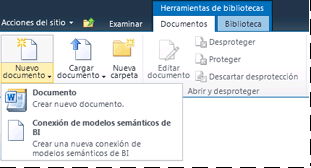

# Agregar tipo de contenido de conexión de modelo semántico de BI a biblioteca
[!INCLUDE[ssas-appliesto-sqlas](../../includes/ssas-appliesto-sqlas.md)]
Se crea una conexión de modelo semántico de BI en SharePoint y proporciona redirección a los datos de modelo semántico de Business Intelligence en un libro de [!INCLUDE[ssGemini](../../includes/ssgemini-md.md)] o una base de datos de modelo tabular de Analysis Services en un servidor de red. Para poder crear una conexión de modelo semántico de BI en SharePoint, debe ampliar una biblioteca de documentos para permitir la creación de un archivo .bism. Solo es necesario realizar este paso una vez para cada biblioteca, pero tendrá que repetirla con cualquier biblioteca a partir de la que desee crear archivos .bism. Es recomendable crear una biblioteca centralizada para almacenar los archivos .bism para poder administrar los permisos en un solo lugar.  
  
> [!NOTE]  
>  Si ya utiliza las bibliotecas de conexiones de datos de SharePoint, el tipo de contenido de conexión de modelo semántico de BI se agregará automáticamente a dicha plantilla de biblioteca. Puede omitir los pasos de esta sección si utiliza una biblioteca de conexiones de datos que ya le permita crear documentos de conexión de modelo semántico de BI.  
  
##   Agregar el tipo de contenido a una biblioteca de documentos  
 Para agregar y configurar un tipo de contenido, debe tener al menos el permiso Administrar listas. Este permiso se integra en el nivel de permisos de diseño y superiores.  
  
 El sitio que contiene la biblioteca de documentos debe tener la activación de características para [!INCLUDE[ssGemini](../../includes/ssgemini-md.md)] para SharePoint. Para más información, consulte [Activar la integración de características de PowerPivot para colecciones de sitios en Administración central](../../analysis-services/power-pivot-sharepoint/activate-power-pivot-integration-for-site-collections-in-ca.md).  
  
1.  Abra la biblioteca de documentos para la que desee habilitar el tipo de contenido Conexión de modelo semántico de BI.  
  
2.  En la cinta de opciones de SharePoint, en Herramientas de biblioteca, haga clic en **Biblioteca**.  
  
3.  Haga clic en **Configuración de la biblioteca**.  
  
4.  En Configuración general, haga clic en **Configuración avanzada**.  
  
5.  En Tipos de contenido, en la sección "¿Desea permitir la administración de tipos de contenido?" haga clic en **Sí**.  
  
6.  Haga clic en **Aceptar**.  
  
7.  En la sección Tipos de contenido, haga clic en **Agregar a partir de tipos de contenido de sitio**. Si no ve esta página, regrese al sitio, haga clic en **Biblioteca** en Herramientas de biblioteca y, a continuación, haga clic en **Configuración de la biblioteca**.  
  
8.  En Tipos de contenido, haga clic en **Agregar a partir de tipos de contenido de sitio**.  
  
9. En Seleccionar tipos de contenido de sitio de:, seleccione **Business Intelligence**.  
  
10. En Tipos de contenido de sitio disponibles, haga clic en **Archivo de conexión de modelo semántico de BI**y, a continuación, haga clic en **Agregar** para mover el tipo de contenido seleccionado a la lista Tipos de contenido que agregar.  
  
11. Haga clic en **Aceptar**.  
  
12. Para comprobar que se ha agregado el tipo de contenido, vuelva a la biblioteca y haga clic en **Nuevo documento** en el área de documentos de la cinta de bibliotecas. En la lista Nuevos documentos, debería ver **Archivo de conexión de modelo semántico de BI** .  
  
       
  
 Después de habilitar el tipo de contenido de conexión de modelo semántico de BI para una biblioteca, puede crear una conexión que proporcione redirección a los datos de modelo semántico empresarial que se pueden usar en Excel o en los informes de [!INCLUDE[ssCrescent](../../includes/sscrescent-md.md)] . Elija uno de los siguientes vínculos para obtener más información acerca de este siguiente paso:  
  
 [Creación de una conexión de modelo semántico de BI a un libro PowerPivot](../../analysis-services/power-pivot-sharepoint/create-a-bi-semantic-model-connection-to-a-power-pivot-workbook.md)  
  
 [Crear una conexión de modelo semántico de BI a una base de datos de modelo tabular](../../analysis-services/power-pivot-sharepoint/create-a-bi-semantic-model-connection-to-a-tabular-model-database.md)  
  
## Vea también  
 [Conexión del modelo semántico de BI de PowerPivot &#40;.bism&#41;](../../analysis-services/power-pivot-sharepoint/power-pivot-bi-semantic-model-connection-bism.md)   
 [Utilizar una conexión de modelo semántico de BI en Excel o Reporting Services](../../analysis-services/power-pivot-sharepoint/use-a-bi-semantic-model-connection-in-excel-or-reporting-services.md)  
  
  
