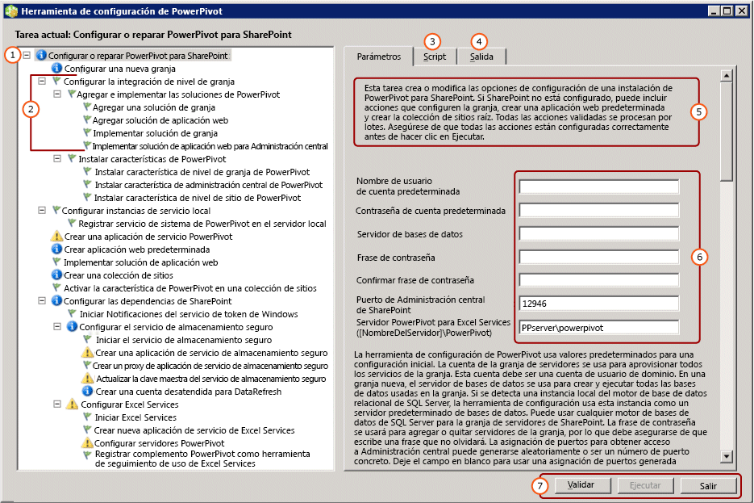

# <a name="configure-or-repair-power-pivot-for-sharepoint-2013"></a>Configurar o reparar PowerPivot para SharePoint 2013
  Para configurar o reparar una instalación de [!INCLUDE[ssCurrent](../../includes/sscurrent-md.md)][!INCLUDE[ssGemini](../../includes/ssgemini-md.md)] para SharePoint 2013, use la Herramienta de configuración de [!INCLUDE[ssGemini](../../includes/ssgemini-md.md)] para SharePoint. La herramienta de configuración comienza examinando el sistema y devuelve una lista de las acciones necesarias para completar o reparar una instalación. El Asistente para la instalación de [!INCLUDE[ssCurrent](../../includes/sscurrent-md.md)] instala la Herramienta de configuración de [!INCLUDE[ssGemini](../../includes/ssgemini-md.md)] para SharePoint 2010 y una Herramienta de configuración de [!INCLUDE[ssGemini](../../includes/ssgemini-md.md)] para SharePoint 2013. En este tema se describe la Herramienta de configuración de [!INCLUDE[ssGemini](../../includes/ssgemini-md.md)] para SharePoint 2013. Para obtener más información sobre SharePoint 2010, vea [Configurar o reparar PowerPivot para SharePoint 2010 (Herramienta de configuración de PowerPivot)](http://msdn.microsoft.com/en-us/d61f49c5-efaa-4455-98f2-8c293fa50046).  
  
 **[!INCLUDE[applies](../../includes/applies-md.md)]**  SharePoint 2013  
  
 **En este tema:**  
  
 [Antes de empezar](#bkmk_before)  
  
 [Para usar la Herramienta de configuración de PowerPivot para SharePoint 2013](#bkmk_using)  
  
 [Pasos de configuración](#bkmk_steps)  
  
 [Valores de entrada utilizados para configurar el servidor](#bkmk_input)  
  
 [Pasos siguientes](#bkmk_nextsteps)  
  
##  <a name="bkmk_before"></a> Antes de empezar  
 La Herramienta de configuración de [!INCLUDE[ssGemini](../../includes/ssgemini-md.md)] para SharePoint 2013 examina los archivos de programa, los valores del Registro y los puertos disponibles. Para sacar el máximo partido de estas herramientas, vea lo siguiente.  
  
-   Requisitos generales para ejecutar la herramienta de configuración en [Herramientas de configuración de Power Pivot](../../analysis-services/power-pivot-sharepoint/power-pivot-configuration-tools.md).  
  
-   [!INCLUDE[ssGemini](../../includes/ssgemini-md.md)] para SharePoint 2013 prefiere que la aplicación web esté configurada para autenticación basada en notificaciones. Si la Herramienta de configuración de [!INCLUDE[ssGemini](../../includes/ssgemini-md.md)] para SharePoint 2013 crea la aplicación por usted, la configura para que use autenticación de Windows basada en notificaciones. Para obtener más información sobre los requisitos de autenticación, vea [Autenticación y autorización de PowerPivot](../../analysis-services/power-pivot-sharepoint/power-pivot-authentication-and-authorization.md).  
  
-   El puerto 80 debe estar disponible para que la Herramienta de configuración de[!INCLUDE[ssGemini](../../includes/ssgemini-md.md)] para SharePoint 2013 cree una aplicación web.  
  
##  <a name="bkmk_using"></a> Para usar la Herramienta de configuración de PowerPivot para SharePoint 2013  
 La primera página de la herramienta proporciona un resumen de los valores de entrada que se usarán para configurar la granja de SharePoint. Además de los valores de entrada que proporcione, se usarán los valores predeterminados para configurar el sistema. Los nombres predeterminados se utilizan con las aplicaciones de servicio, las bases de datos de aplicación de servicio y las propiedades de la aplicación de servicio.  
  
> [!TIP]  
>  Si la herramienta de configuración examina el equipo y devuelve una lista de tareas en blanco en el panel izquierdo, no se ha detectado ninguna característica o valor que necesite configuración. Para modificar la configuración de SharePoint o [!INCLUDE[ssGemini](../../includes/ssgemini-md.md)] , use Windows PowerShell o las páginas de administración de Administración central de SharePoint. Para obtener más información, vea [Administración y configuración del servidor de Power Pivot en Administración central](../../analysis-services/power-pivot-sharepoint/power-pivot-server-administration-and-configuration-in-central-administration.md).  
  
 Los valores de las cuentas de servicio se usan para varios servicios. Por ejemplo, la herramienta de configuración usa la cuenta predeterminada en la primera página para establecer todas las identidades del grupo de aplicaciones. Puede cambiar estas cuentas posteriormente modificando las propiedades de la aplicación de servicio en Administración central.  
  
 La herramienta proporciona una interfaz con pestañas que incluye entradas de parámetros, el script de Windows PowerShell y mensajes de estado.  
  
 La herramienta usa Windows PowerShell para configurar el servidor. Puede hacer clic en la pestaña **Script** para revisar el script de Windows PowerShell que la herramienta emplea para configurar el servidor.  
  
   
  
||Description|  
|-|-----------------|  
|**(1)**|Ventana de lista de tareas.|  
|**(2)**|Acciones individuales.|  
|**(3)**|Scripts de Windows PowerShell creados por la herramienta de configuración.|  
|**(4)**|Mensajes de registro creados al iniciar acciones de validación o ejecución.|  
|**(5)**|Descripción de la página.|  
|**(6)**|Parámetros de entrada|  
|**(7)**|El botón **Ejecutar** se habilita después de validar las acciones.|  
  
##  <a name="bkmk_steps"></a> Pasos de configuración  
 El vínculo a la herramienta de configuración solo está visible cuando [!INCLUDE[ssGemini](../../includes/ssgemini-md.md)] para SharePoint 2013 está instalado en el servidor local.  
  
1.  En el menú **Inicio** , elija **Todos los programas**, haga clic en [!INCLUDE[ssCurrentUI](../../includes/sscurrentui-md.md)], en **Herramientas de configuración**y, después, en **[!INCLUDE[ssGemini](../../includes/ssgemini-md.md)] para SharePoint 2013**.  
  
2.  Haga clic en **Configurar o reparar [!INCLUDE[ssGemini](../../includes/ssgemini-md.md)] para SharePoint**.  
  
3.  Expanda la ventana al tamaño máximo. Aparecerá una barra de botones en la parte inferior de la ventana con los comandos **Validar** **Ejecutar**y **Salir** .  
  
4.  **Cuenta predeterminada** : en la pestaña Parámetros, escriba una cuenta de usuario de dominio para **Nombre de usuario de cuenta predeterminada**. Esta cuenta se usa para aprovisionar servicios esenciales, incluido el grupo de aplicaciones del servicio [!INCLUDE[ssGemini](../../includes/ssgemini-md.md)] . No especifique ninguna cuenta integrada, como Network Service o Local System. La herramienta bloquea las configuraciones que especifican cuentas integradas.  
  
     **Frase de contraseña** : escriba una frase de contraseña. Si la granja de SharePoint es nueva, la frase de contraseña se usa siempre que se agregan nuevos servidores o aplicaciones a la granja de servidores de SharePoint. Si la granja existe, escriba la frase de contraseña que le permite agregar una aplicación o un servidor a la granja.  
  
5.  **Puerto** : opcionalmente, escriba un número de puerto para conectarse a la aplicación web de Administración central o use el número generado aleatoriamente proporcionado. La herramienta de configuración comprueba que el número está disponible antes de ofrecerlo como opción.  
  
6.  En la página principal, escriba el nombre de un servidor [!INCLUDE[ssCurrent](../../includes/sscurrent-md.md)][!INCLUDE[ssGemini](../../includes/ssgemini-md.md)] que se ejecute en modo de SharePoint.  
  
7.  Opcionalmente, revise los valores restantes de entrada utilizados para completar cada acción. Para obtener más información acerca de cada uno de ellos, consulte [Valores de entrada utilizados para configurar el servidor](#bkmk_input) en este tema.  
  
8.  Si lo desea, quite cualquier acción que no desee procesar. Por ejemplo, si desea configurar el Servicio de almacenamiento seguro más adelante, haga clic en **Configurar el servicio de almacenamiento seguro**y, a continuación, desactive la casilla **Incluir esta acción en la lista de tareas**.  
  
9. Haga clic en **Validar** para comprobar si la herramienta tiene suficiente información para procesar las acciones de la lista.  
  
10. Haga clic en **Ejecutar** para procesar todas las acciones de la lista de tareas. El botón **Ejecutar** está disponible después de validar las acciones. Si **Ejecutar** no está habilitado, haga clic en **Validar** primero.  
  
     Si aparece un mensaje de error similar al siguiente, compruebe que la instancia de base de datos de SQL Server se ha iniciado.  
  
    ```  
    Cannot connect to the database server instance  
    ```  
  
11. [Compruebe una instalación de PowerPivot para SharePoint](../../analysis-services/instances/install-windows/verify-a-power-pivot-for-sharepoint-installation.md).  
  
##  <a name="bkmk_input"></a> Valores de entrada utilizados para configurar el servidor  
 La Herramienta de configuración de [!INCLUDE[ssGemini](../../includes/ssgemini-md.md)] usa una combinación de los valores de entrada que escriba el usuario y los valores predeterminados que la herramienta detecte o use automáticamente.  
  
 La lista de acciones que muestra la herramienta de configuración depende de la configuración actual de la granja de SharePoint. Por ejemplo, si la granja de servidores de SharePoint ya está configurada, no ve acciones que configuran la granja o crean una aplicación web. Puede ejecutar la herramienta en cualquier momento para configurar, reparar o detectar errores de configuración. Si en la granja no se ejecutan servicios necesarios como Excel Services o el Servicio de almacenamiento seguro, la herramienta detecta los servicios que faltan y proporciona opciones para habilitarlos. Si no se necesita ninguna acción, la lista de tareas está vacía.  
  
 En la tabla siguiente se describen los valores usados para configurar el servidor.  
  
|Página|Valor de entrada|Source|Description|  
|----------|-----------------|------------|-----------------|  
|**Configurar o reparar [!INCLUDE[ssGemini](../../includes/ssgemini-md.md)] para SharePoint**|Cuenta predeterminada|Usuario actual|La cuenta predeterminada es una cuenta de usuario de Windows de dominio que se emplea para aprovisionar servicios compartidos en la granja. Se usa para aprovisionar lo siguiente:|  
||||-<br />                    [!INCLUDE[ssGemini](../../includes/ssgemini-md.md)] Aplicación de servicio|  
||||- Servicio de almacenamiento seguro|  
||||- Excel Services|  
||||- La identidad del grupo de aplicaciones web|  
||||- El administrador de la colección de sitios|  
||||- La cuenta de la actualización de datos desatendida de [!INCLUDE[ssGemini](../../includes/ssgemini-md.md)] .|  
||||De forma predeterminada, se usa la cuenta de dominio del usuario actual.<br /><br /> Nota: Se recomienda que reemplace el valor predeterminado a menos que esté configurando un servidor con fines de evaluación y no de producción.<br /><br /> Podrá cambiar las identidades de servicio después de la configuración o reparación, utilizando Administración central.<br /><br /> Opcionalmente, en la Herramienta de configuración de [!INCLUDE[ssGemini](../../includes/ssgemini-md.md)] , especifique cuentas dedicadas para lo siguiente:|  
||||- La aplicación web, mediante la página **Crear aplicación web predeterminada** (suponiendo que la herramienta vaya a crear una aplicación web para la granja).|  
||||-<br />                    [!INCLUDE[ssGemini](../../includes/ssgemini-md.md)] mediante la página **Crear cuenta de actualización de datos desatendida** de esta herramienta.|  
||Servidor de bases de datos|Instancia con nombre local de [!INCLUDE[ssGemini](../../includes/ssgemini-md.md)] , si está disponible|Si una instancia del motor de base de datos se ha instalado como una instancia con nombre de [!INCLUDE[ssGemini](../../includes/ssgemini-md.md)] , la herramienta rellena el campo del servidor de bases de datos con este nombre de instancia. Si no ha instalado el motor de base de datos, este campo está vacío.<br /><br /> **Servidor de bases de datos**  es un parámetro necesario. Puede ser cualquier versión o edición de SQL Server que se admita en granjas de servidores de SharePoint.|  
||Frase de contraseña|Datos proporcionados por el usuario|Si va a crear una nueva granja, la frase de contraseña que escriba se usa como frase de contraseña para la granja. Si va a agregar [!INCLUDE[ssGemini](../../includes/ssgemini-md.md)] para SharePoint a una granja existente, escriba la frase de contraseña de la granja existente.|  
||Puerto de Administración central de SharePoint|Valor predeterminado, si es necesario|Si la granja no está configurada, la herramienta proporciona opciones para crearla, incluida la creación de un extremo HTTP en Administración central. Elige un número de puerto generado aleatoriamente que no esté en uso.|  
||[!INCLUDE[ssGemini](../../includes/ssgemini-md.md)] para Excel Services ([NombreDelServidor]\ [!INCLUDE[ssGemini](../../includes/ssgemini-md.md)])|Datos proporcionados por el usuario|Para habilitar las funcionalidades básicas de [!INCLUDE[ssGemini](../../includes/ssgemini-md.md)] se necesita el servidor [!INCLUDE[ssGemini](../../includes/ssgemini-md.md)] para Excel Services. El nombre del servidor que escriba en esta página también se agrega a la lista de la página **Configurar servidores [!INCLUDE[ssGemini](../../includes/ssgemini-md.md)]**.|  
|**Configurar una nueva granja**|Servidor de bases de datos<br /><br /> Cuenta de granja<br /><br /> Frase de contraseña<br /><br /> Puerto de Administración central de SharePoint|Valor predeterminado, si es necesario|Las configuraciones usan como valor predeterminado lo que especificó en la página principal.|  
|**Crear una aplicación de servicio [!INCLUDE[ssGemini](../../includes/ssgemini-md.md)]**|Nombre de la aplicación de servicio|Valor de DB-Library|[!INCLUDE[ssGemini](../../includes/ssgemini-md.md)] Nombre de la aplicación de servicio. El nombre predeterminado es **Valor de DB-Library [!INCLUDE[ssGemini](../../includes/ssgemini-md.md)] Service Application**. Podrá sustituirlo por otro valor de la herramienta.|  
||Servidor de bases de datos|Valor de DB-Library|El servidor de bases de datos que va a hospedar la base de datos de aplicación de servicio [!INCLUDE[ssGemini](../../includes/ssgemini-md.md)] . El nombre del servidor predeterminado es el mismo servidor de bases de datos usado para la granja. Puede sustituir el nombre del servidor predeterminado por un valor diferente.|  
||Nombre de la base de datos|Valor de DB-Library|Nombre de la base de datos que se va a crear para la base de datos de aplicación de servicio [!INCLUDE[ssGemini](../../includes/ssgemini-md.md)] . El nombre predeterminado de la base de datos se basa en el nombre de aplicación de servicio, seguido de un GUID para garantizar un nombre único. Podrá sustituirlo por otro valor de la herramienta.|  
|**Crear aplicación web predeterminada**|Nombre de aplicación web|Valor predeterminado, si es necesario|Si no existe ninguna aplicación web, la herramienta crea una. La aplicación web se configura para la autenticación en modo clásico y escucha en el puerto 80. El tamaño máximo de carga de archivos se establece en 2047, el máximo admitido por SharePoint. El tamaño máximo de carga de archivos es para incluir los archivos grandes de [!INCLUDE[ssGemini](../../includes/ssgemini-md.md)] que se cargarán en el servidor.|  
||Dirección URL|Valor predeterminado, si es necesario|La herramienta crea una dirección URL basada en el nombre del servidor, con las mismas convenciones de nomenclatura de archivos que SharePoint.|  
||Grupo de aplicaciones|Valor predeterminado, si es necesario|La herramienta crea un grupo de aplicaciones predeterminado en IIS.|  
||Cuenta y contraseña del grupo de aplicaciones|Valor predeterminado, si es necesario|La cuenta del grupo de aplicaciones se basa en la cuenta predeterminada, pero puede sustituirla en la herramienta.|  
||Servidor de bases de datos|Valor predeterminado, si es necesario|Se preselecciona la instancia predeterminada de la base de datos para almacenar la base de datos de contenido de la aplicación, pero puede especificar otra instancia de SQL Server en la herramienta.|  
||Nombre de la base de datos|Valor predeterminado, si es necesario|Nombre de la base de datos de aplicación. El nombre de la base de datos se basa en las convenciones de nomenclatura de archivos de SharePoint, pero puede elegir un nombre diferente.|  
|**Implementar solución de aplicación web**|Dirección URL|Valor predeterminado, si es necesario|La dirección URL predeterminada es la de la aplicación web predeterminada.|  
||Tamaño de archivo máximo (en MB)|Valor predeterminado, si es necesario|El valor predeterminado es 2047. Las bibliotecas de documentos de SharePoint también tienen un tamaño máximo y el valor de [!INCLUDE[ssGemini](../../includes/ssgemini-md.md)] no debe superar el valor de la biblioteca de documentos. Para más información, vea [Configuración del tamaño de carga máximo de archivos &#40;PowerPivot para SharePoint&#41;](../../analysis-services/power-pivot-sharepoint/configure-maximum-file-upload-size-power-pivot-for-sharepoint.md).|  
|**Crear una colección de sitios**|Administrador del sitio|Valor predeterminado, si es necesario|La herramienta utiliza la cuenta predeterminada. Puede sustituirlo en la página **Crear colección de sitios** .|  
||Correo electrónico de contacto|Valor predeterminado, si es necesario|Si Microsoft Outlook está configurado en el servidor, la herramienta usará la dirección de correo electrónico del usuario actual. Si no, se utiliza un valor de marcador de posición.|  
||Dirección URL del sitio|Valor predeterminado, si es necesario|La herramienta crea la dirección URL del sitio, utilizando las mismas convenciones de nomenclatura de direcciones URL que SharePoint.|  
||Título del sitio|Valor predeterminado, si es necesario|La herramienta agrega **Sitio de [!INCLUDE[ssGemini](../../includes/ssgemini-md.md)]** como título predeterminado.|  
|**Activar la característica de [!INCLUDE[ssGemini](../../includes/ssgemini-md.md)] en una colección de sitios**|Dirección URL del sitio||Dirección URL de la colección de sitios para la que va a activar las características de [!INCLUDE[ssGemini](../../includes/ssgemini-md.md)] .|  
||Habilitar la característica premium para este sitio||Habilite la característica "PremiumSite" para el sitio de SharePoint.|  
|**Crear una aplicación de servicio de almacenamiento seguro**|Nombre de la aplicación de servicio|Valor predeterminado, si es necesario|Escriba el nombre de la aplicación de servicio de almacenamiento seguro.|  
||Servidor de bases de datos|Datos proporcionados por el usuario|Escriba el nombre del servidor de bases de datos que se usará para la aplicación de servicio de almacenamiento seguro.|  
|**Crear un proxy de aplicación de servicio de almacenamiento seguro**|Nombre de la aplicación de servicio|Valor predeterminado, si es necesario|Escriba el nombre de la aplicación de servicio de almacenamiento seguro que escribió en la página anterior.|  
||Proxy de aplicación de servicio|Valor predeterminado, si es necesario|Escriba el nombre del proxy de aplicación de servicio de almacenamiento seguro. El nombre aparecerá en el grupo de conexiones predeterminado que asocia las aplicaciones con las aplicaciones web de contenido de SharePoint.|  
|**Actualizar la clave maestra del servicio de almacenamiento seguro**|Proxy de aplicación de servicio|Valor predeterminado, si es necesario|Escriba el nombre del proxy de aplicación de servicio de almacenamiento seguro que escribió en la página anterior.|  
||Frase de contraseña|Datos proporcionados por el usuario|Clave maestra usada para el cifrado de datos. De forma predeterminada, la frase de contraseña que se usa para generar la clave es la misma que se usa para aprovisionar servidores nuevos en la granja. Puede reemplazar la frase de contraseña predeterminada con una frase de contraseña única.|  
|**Crear una cuenta desatendida para DataRefresh**|Id. de la aplicación de destino|Valor predeterminado, si es necesario|Cree una aplicación de destino para almacenar las credenciales para la actualización de datos desatendida de [!INCLUDE[ssGemini](../../includes/ssgemini-md.md)] .<br /><br /> El identificador de la aplicación puede ser texto descriptivo.|  
||Nombre descriptivo de la aplicación de destino|Valor predeterminado, si es necesario||  
||Nombre de usuario y contraseña de la cuenta desatendida|Valor predeterminado, si es necesario|Escriba las credenciales de una cuenta de usuario de Windows usada por la aplicación de destino para ejecutar la actualización de datos desatendida. Para obtener más información, vea [Configure Excel Services data refresh by using the unattended service account in SharePoint Server 2013](http://technet.microsoft.com/library/hh525344\(office.15\).aspx) (Configurar la actualización de datos de Servicios de Excel con la cuenta de servicio desatendida en SharePoint Server 2013 [http://technet.microsoft.com/es-es/library/hh525344(office.15).aspx].|  
||Dirección URL del sitio|Valor predeterminado, si es necesario|Escriba la dirección URL de la colección de sitios asociada a la aplicación de destino. Para asociarla a colecciones de sitios adicionales, use Administración central de SharePoint.|  
|**Crear nueva aplicación de servicio de Excel Services**|Nombre de la aplicación de servicio|Valor predeterminado, si es necesario|Escriba un nombre de aplicación de servicio. Se crea una base de datos de aplicación de servicio con el mismo nombre en el servidor de bases de datos de la granja de SharePoint.|  
|**Configurar servidores [!INCLUDE[ssGemini](../../includes/ssgemini-md.md)]**|Nombre de la aplicación de servicio|Valor predeterminado, si es necesario|Nombre de aplicación de servicio que escribió en la página anterior.|  
||[!INCLUDE[ssGemini](../../includes/ssgemini-md.md)] Nombre de servidor||Lista de servidores [!INCLUDE[ssGemini](../../includes/ssgemini-md.md)] registrados.<br /><br /> El nombre de servidor especificado en la página principal se agrega automáticamente a esta página.|  
|**Registrar complemento [!INCLUDE[ssGemini](../../includes/ssgemini-md.md)] como herramienta de seguimiento de uso de Excel Services**|Nombre de la aplicación de servicio||Nombre de aplicación de servicio que escribió en la página anterior.|  
|||||  
  
 Si la herramienta de configuración de [!INCLUDE[ssGemini](../../includes/ssgemini-md.md)] para SharePoint 2013 crea la granja, crea las bases de datos necesarias en el servidor de bases de datos, usando las mismas convenciones de nomenclatura de archivo que SharePoint. No se puede cambiar el nombre de la base de datos de la granja.  
  
 Si la herramienta crea una colección de sitios, crea una base de datos de contenido en el servidor de bases de datos, utilizando las mismas convenciones de nomenclatura de archivos que SharePoint. No se puede cambiar el nombre de la base de datos de contenido.  
  
## <a name="verify-the-configuration"></a>Comprobar la configuración  
 Consulte la sección "Comprobación de la configuración de [!INCLUDE[ssGemini](../../includes/ssgemini-md.md)]" de [Configuración de PowerPivot e implementación de soluciones &#40;SharePoint 2013&#41;](../../analysis-services/instances/install-windows/configure-power-pivot-and-deploy-solutions-sharepoint-2013.md).  
  
##  <a name="bkmk_nextsteps"></a> Pasos siguientes  
 Después de completar la instalación del servidor, hay varias tareas que debería realizar:  
  
-   Conceda permisos de SharePoint a los individuos y a los grupos. Esta tarea es necesaria para permitir el acceso a los sitios y al contenido.  
  
-   Cambie las identidades del grupo de aplicaciones de servicio para que se ejecute en una cuenta diferente. Para que la implementación de SharePoint sea segura, es recomendable especificar identidades diferentes para los servicios y las aplicaciones.  
  
-   Cree sitios de confianza adicionales en Excel Services para que pueda variar los permisos y la configuración que mejor funcionen para el acceso a datos [!INCLUDE[ssGemini](../../includes/ssgemini-md.md)] .  
  
-   Instale los proveedores de datos que se usan normalmente para habilitar la actualización de datos del servidor.  
  
### <a name="grant-sharepoint-permissions-to-workbook-users"></a>Conceder permisos de SharePoint a los usuarios del libro  
 Los usuarios necesitarán permisos de SharePoint para poder publicar o ver los libros. Conceda el permiso **Ver** a los usuarios que necesiten ver los libros publicados y el permiso **Contribuir** a los usuarios que publiquen o administren libros. Debe ser administrador de la colección de sitios para conceder permisos.  
  
1.  En un sitio de SharePoint 2013, haga clic en el icono de configuración  y, a continuación, haga clic en **configuración del sitio**.  
  
2.  Haga clic en **Permisos del sitio** en el grupo **Usuarios y permisos** .  
  
3.  Cree grupos según sea necesario si desea que haya un conjunto de usuarios con permisos **Contribuir** y otro grupo para un conjunto de usuarios que solo tengan permisos **Ver** .  
  
4.  Escriba las cuentas de usuario de dominio o de grupo de Windows que deben tener pertenencia a grupos. En este caso, no use direcciones de correo electrónico ni grupos de distribución si la aplicación está configurada para la autenticación clásica.  
  
### <a name="install-data-providers-used-in-data-refresh-and-check-user-permissions"></a>Proveedores de datos de configuración utilizados en los permisos de actualización de datos y comprobación de usuario  
 La actualización de datos del lado servidor permite a los usuarios reimportar los datos actualizados en sus libros en modo desatendido. Para que la actualización de datos se realice correctamente, el servidor que ejecuta Analysis Services en modo de SharePoint debe tener los mismos proveedores de datos que se usaron para importar originalmente los datos. Además, la cuenta de usuario en la que se ejecuta la actualización de datos requiere a menudo permisos de lectura en los orígenes de datos externos. Asegúrese de comprobar los requisitos para habilitar y configurar la actualización de datos a fin de garantizar que el resultado es correcto. Para obtener más información, consulte [Actualización de datos PowerPivot con SharePoint 2010](http://msdn.microsoft.com/en-us/01b54e6f-66e5-485c-acaa-3f9aa53119c9).  
  
> [!NOTE]  
>  En [!INCLUDE[ssCurrent](../../includes/sscurrent-md.md)][!INCLUDE[ssGemini](../../includes/ssgemini-md.md)] para SharePoint 2013, los proveedores de datos se instalan cuando ejecuta el instalador de **spPowerPivot.msi** y la Herramienta de configuración [!INCLUDE[ssGemini](../../includes/ssgemini-md.md)] para SharePoint 2013. Para obtener más información, vea [Instalar o desinstalar el complemento PowerPivot para SharePoint &#40;SharePoint 2013&#41;](../../analysis-services/instances/install-windows/install-or-uninstall-the-power-pivot-for-sharepoint-add-in-sharepoint-2013.md).  
  
### <a name="change-application-pool-and-service-identities-in-sharepoint"></a>Cambiar el grupo de aplicaciones y las identidades de servicio en SharePoint  
 La Herramienta de configuración de [!INCLUDE[ssGemini](../../includes/ssgemini-md.md)] aprovisiona características de granja, aplicaciones y servicios para que se ejecuten bajo una única cuenta. Así se simplifica la instalación, pero la implementación resultante no cumple los requisitos de seguridad de una granja de SharePoint. Para crear una implementación más sólida, cambie los grupos de aplicaciones y las identidades de servicio de forma que se ejecuten bajo cuentas diferentes cuando la instalación se haya completado. Para obtener más información, vea [Configurar las cuentas de servicio Power Pivot](../../analysis-services/power-pivot-sharepoint/configure-power-pivot-service-accounts.md).  
  
### <a name="create-additional-trusted-sites-in-excel-services"></a>Crear sitios de confianza adicionales en Excel Services  
 Puede agregar sitios de confianza en Excel Services para cambiar los permisos y la configuración de los sitios que proporcionan libros de Excel y datos [!INCLUDE[ssGemini](../../includes/ssgemini-md.md)] . Para más información, vea [Create a trusted location for Power Pivot sites in Central Administration](../../analysis-services/power-pivot-sharepoint/create-a-trusted-location-for-power-pivot-sites-in-central-administration.md).  
  
### <a name="build-a-includessgeminiincludesssgemini-mdmd-workbook"></a>Crear un libro [!INCLUDE[ssGemini](../../includes/ssgemini-md.md)]  
 Una vez instalados los componentes de servidor en una granja, puede crear su primer libro de Excel 2013 que usa datos [!INCLUDE[ssGemini](../../includes/ssgemini-md.md)] incrustados y, a continuación, publicarlo en una biblioteca de SharePoint. O bien, puede cargar o publicar un libro [!INCLUDE[ssGemini](../../includes/ssgemini-md.md)] de ejemplo para comprobar el acceso a datos [!INCLUDE[ssGemini](../../includes/ssgemini-md.md)] en SharePoint. Para obtener más información, vea:  
  
-   [Power Pivot ayuda](https://support.office.com/en-us/article/Power-Pivot-Help-241aac41-92e3-4e46-ae58-2f2cd7dbcf4f) (https://support.office.com/en-us/article/Power-Pivot-Help-241aac41-92e3-4e46-ae58-2f2cd7dbcf4f).  
  
-   [Iniciar el complemento PowerPivot de Excel 2013](http://office.microsoft.com/excel-help/start-powerpivot-in-excel-2013-add-in-HA102837097.aspx?CTT=5&origin=HA102837110) (http://office.microsoft.com/excel-help/start-powerpivot-in-excel-2013-add-in-HA102837097.aspx?CTT=5&origin=HA102837110).  
  
### <a name="add-additional-analysis-services-servers-in-sharepoint-mode"></a>Agregar servidores de Analysis Services adicionales en modo de SharePoint  
 Con el tiempo, si decide que se necesitan mayores capacidades de almacenamiento y procesamiento de datos, puede agregar a la granja servidores adicionales que ejecuten Analysis Service en modo de SharePoint. En [!INCLUDE[ssCurrent](../../includes/sscurrent-md.md)][!INCLUDE[ssGemini](../../includes/ssgemini-md.md)] para SharePoint 2013, instale los nuevos servidores de [!INCLUDE[ssASnoversion](../../includes/ssasnoversion-md.md)] en modo de SharePoint y configure después Excel Services. Para obtener más información, vea la sección "Más allá de la instalación en un solo servidor" de [Instalación de Analysis Services en el modo PowerPivot](../../analysis-services/instances/install-windows/install-analysis-services-in-power-pivot-mode.md).  
  
## <a name="additional-resources"></a>Recursos adicionales  
  [enviar comentarios e información de contacto a través de Microsoft SQL Server Connect](https://connect.microsoft.com/SQLServer/Feedback) (https://connect.microsoft.com/SQLServer/Feedback).  
  
## <a name="see-also"></a>Vea también  
 [Instalar o desinstalar el complemento PowerPivot para SharePoint &#40;SharePoint 2013&#41;](../../analysis-services/instances/install-windows/install-or-uninstall-the-power-pivot-for-sharepoint-add-in-sharepoint-2013.md)   
 [Herramientas de configuración de Power Pivot](../../analysis-services/power-pivot-sharepoint/power-pivot-configuration-tools.md)   
 [Administración y configuración del servidor de Power Pivot en Administración central](../../analysis-services/power-pivot-sharepoint/power-pivot-server-administration-and-configuration-in-central-administration.md)   
 [Actualizar libros y actualización de datos programada &#40;SharePoint 2013&#41;](../../analysis-services/instances/install-windows/upgrade-workbooks-and-scheduled-data-refresh-sharepoint-2013.md)  
  
  

