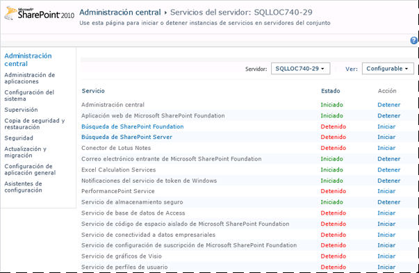
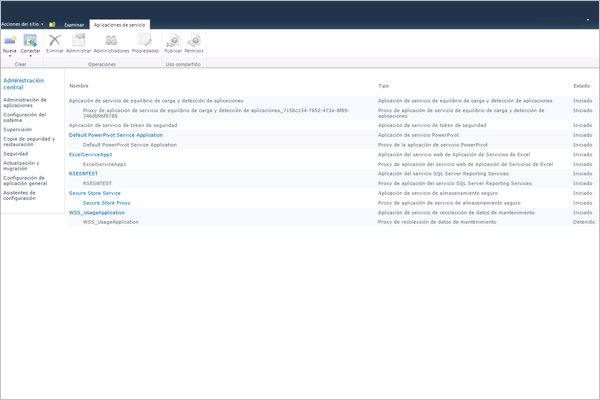
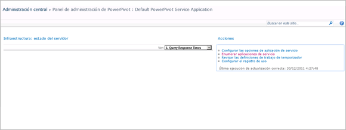

# <a name="configure-power-pivot-health-rules"></a>Configuración de las reglas de mantenimiento de PowerPivot
[!INCLUDE[ssas-appliesto-sqlas](../../includes/ssas-appliesto-sqlas.md)]
[!INCLUDE[ssGemini_md](../../includes/ssgemini-md.md)] para SharePoint incluye reglas de mantenimiento de SharePoint que ayudan a supervisar y remediar problemas de configuración y disponibilidad del servidor. Las reglas de mantenimiento que se aplican a [!INCLUDE[ssGemini_md](../../includes/ssgemini-md.md)] para SharePoint aparecen en la página Revisar las definiciones de la regla.  
  
 Las reglas de estado permiten la detección temprana de problemas del servidor que podrían conducir a la larga a la interrupción del servicio. [!INCLUDE[ssGemini_md](../../includes/ssgemini-md.md)] para SharePoint proporciona varias reglas para ayudarle a identificar y solucionar problemas antes de que afecten a los usuarios. Puede personalizar muchas de estas reglas para adaptarlas a las características únicas de la implementación. Por ejemplo, si desea más tiempo para solucionar las advertencias sobre el espacio en disco, podría subir el porcentaje de espacio en disco disponible desde el 5% hasta el 10% de modo que la advertencia aparezca antes.  
  
 Las reglas que pueden personalizarse son las que notifican sobre el consumo de recursos o la disponibilidad del servidor. La personalización es útil en estas áreas porque la capacidad del sistema subyacente varía en gran medida en las diferentes topologías de implementación y servidores. En cambio, no hay ninguna personalización disponible para las reglas que identifican problemas de seguridad o de configuración del servidor. Estas reglas se han diseñado para aplicarse uniformemente en todas las instalaciones.  
  
||  
|-|  
|**[!INCLUDE[applies](../../includes/applies-md.md)]**  SharePoint 2013 &#124; SharePoint 2010|  
  
 **Nota** : La configuración de reglas de mantenimiento se establece de forma independiente para la instancia de SQL Server Analysis Services y la aplicación de servicio [!INCLUDE[ssGemini_md](../../includes/ssgemini-md.md)] . Siga las instrucciones de este tema para configurar reglas de estado para cada servicio. En una implementación de SharePoint 2013, [!INCLUDE[ssGeminiShort](../../includes/ssgeminishort-md.md)] solo usa la aplicación de servicio. Por tanto, [!INCLUDE[ssGeminiShort](../../includes/ssgeminishort-md.md)] instala distintos conjuntos de reglas de mantenimiento para las diferentes versiones de SharePoint. Vea la columna "versión" en el tema [Referencia de las reglas de estado &#40;PowerPivot para SharePoint&#41;](../../analysis-services/power-pivot-sharepoint/health-rules-reference-power-pivot-for-sharepoint.md), o bien puede ejecutar el siguiente comando de Windows PowerShell para ver las reglas instaladas.  
  
```  
Get-SPHealthAnalysisRule | select name, enabled, summary | where {$_.summary -like “*power*”}  | format-table -property * -autosize | out-default  
```  
  
 **En este tema:**  
  
 [Ver las reglas de mantenimiento de PowerPivot](#bkmk_view)  
  
 [Configurar las reglas de estado que se usan para evaluar la estabilidad del servidor (SQL Server Analysis Services)](#bkmk_HR_SSAS)  
  
 [Configurar las reglas de estado que se usan para evaluar la estabilidad de la aplicación (Aplicación de servicio PowerPivot)](#bkmk_evaluate_application_stability)  
  
## <a name="prerequisites"></a>Requisitos previos  
 Debe ser administrador de la aplicación de servicio para cambiar las propiedades de configuración de la instancia de Analysis Services y de la aplicación de servicio [!INCLUDE[ssGemini_md](../../includes/ssgemini-md.md)] .  
  
##  <a name="bkmk_view"></a> Ver las reglas de mantenimiento de PowerPivot  
  
1.  En Administración central de SharePoint, haga clic en **Supervisión**y, en la sección **Analizador de mantenimiento** , haga clic en **Revisar las definiciones de la regla**.  
  
2.  En la sección Configuración, busque las reglas que tengan el prefijo **[!INCLUDE[ssGemini_md](../../includes/ssgemini-md.md)]:** . Todas las reglas de mantenimiento relacionadas con [!INCLUDE[ssGemini_md](../../includes/ssgemini-md.md)]tienen este prefijo para ayudarle a distinguirlas de las reglas integradas de SharePoint.  
  
 Estas reglas se mostrarán en la página para **revisar los problemas y las soluciones** cuando se detectan problemas.  
  
 Si sospecha que hay un problema que desea investigar inmediatamente, puede ejecutar la comprobación de una regla de modo manual para averiguar si es dicho problema se produce.  
  
 Para ello, haga clic en la regla para abrir su definición y, a continuación, haga clic en **Ejecutar ahora** en la cinta. Haga clic en **Cerrar** para volver a la página **Revisar problemas y soluciones** para ver el informe. Si la regla detectó un problema, en la página se notificará una advertencia o error. En algunos casos, pueden pasar varios minutos hasta que aparezca el error o la advertencia.  
  
##  <a name="bkmk_HR_SSAS"></a> Configurar las reglas de estado que se usan para evaluar la estabilidad del servidor (SQL Server Analysis Services)  
 La instancia de Analysis Services incluye reglas de estado que detectan problemas en el nivel de sistema (CPU, memoria y espacio en disco que se usan para el almacenamiento en caché). Utilice las instrucciones siguientes para modificar los umbrales que desencadenan reglas específicas de estado.  
  
1.  En Administración central de SharePoint, en la sección **Configuración del sistema** , haga clic en **Administrar servicios en el servidor**.  
  
2.  En la parte superior de la página, seleccione el servidor de la granja de SharePoint que tenga una instancia de Analysis Services (en la ilustración siguiente, el nombre del servidor es AW-SRV033). **SQL Server Analysis Services** aparecerá en la lista de servicios.  
  
       
  
3.  Haga clic en **SQL Server Analysis Services**.  
  
4.  En las páginas de propiedades de servicio, en Configuración de reglas de estado, modifique las propiedades siguientes:  
  
     Asignación de recursos de CPU insuficiente (el valor predeterminado es 80%)  
     Se desencadena esta regla de estado si los recursos de CPU que utiliza el proceso de servidor de Analysis Services (msmdsrv.exe) permanecen en el 80% o por encima más de cuatro horas (lo que especifique el valor del intervalo de recopilación de datos).  
  
     Esta opción de configuración corresponde a la definición de la siguiente regla en la página **Revisar los problemas y las soluciones** : **[!INCLUDE[ssGemini_md](../../includes/ssgemini-md.md)]: Analysis Services no tiene suficientes recursos de CPU para realizar las operaciones solicitadas**.  
  
     Recursos de CPU en el sistema insuficientes (el valor predeterminado es 90%)  
     Esta regla de estado se desencadena si los recursos de CPU del servidor permanecen en el 90% o por encima más de cuatro horas (según se especifique en el valor del intervalo de recopilación de datos). La utilización global de la CPU se mide como parte del algoritmo de equilibrio de carga basado en el estado que supervisa el uso de la CPU como medida del estado del servidor.  
  
     Esta opción de configuración corresponde a la definición de la siguiente regla en la página **Revisar los problemas y las soluciones** : **[!INCLUDE[ssGemini_md](../../includes/ssgemini-md.md)]: el uso total de la CPU es demasiado alto**.  
  
     Umbral insuficiente de memoria (el valor predeterminado es 5%)  
     En un servidor de aplicaciones SharePoint, una instancia de SQL Server Analysis Services siempre debe tener una pequeña cantidad de memoria en reserva sin usar. Dado que el servidor está enlazado a memoria en la mayoría de sus operaciones, el servidor se ejecuta mejor si no se ejecuta hasta el final del límite superior. El 5% de la memoria sin usar se calcula como un porcentaje de la memoria asignada a Analysis Services. Por ejemplo, si tiene 200 GB de memoria total y a Analysis Services se le asigna el 80% (o 160 GB), el 5% de la memoria sin usar es el 5% de 160 GB (u 8 GB).  
  
     Esta opción de configuración corresponde a la definición de la siguiente regla en la página **Revisar los problemas y las soluciones** : **[!INCLUDE[ssGemini_md](../../includes/ssgemini-md.md)]: Analysis Services no tiene suficiente memoria para realizar las operaciones solicitadas**.  
  
     Número máximo de conexiones (el valor predeterminado es 100)  
     Esta regla de estado se desencadena si el número de conexiones a la instancia de Analysis Services permanece en 100 conexiones o más durante más de cuatro horas (según especifique el valor del intervalo de recopilación de datos). Este valor predeterminado es arbitrario (no se basa en las especificaciones de hardware del servidor o en la actividad del usuario) de modo que podría elevar o disminuir el valor según la capacidad del servidor y la actividad de los usuarios en el entorno.  
  
     Esta opción de configuración corresponde a la definición de la siguiente regla en la página **Revisar los problemas y las soluciones** : **[!INCLUDE[ssGemini_md](../../includes/ssgemini-md.md)]: el número elevado de conexiones indica que se deben implementar más servidores para tratar la carga actual**.  
  
     Espacio en disco insuficiente (el valor predeterminado es 5%)  
     El espacio en disco se usa para almacenar en caché los datos de [!INCLUDE[ssGemini_md](../../includes/ssgemini-md.md)] cada vez que se solicita una base de datos. Esta regla permite saber cuándo está empezando a quedar poco espacio en disco. De forma predeterminada, esta regla de estado se desencadena cuando el espacio en disco es menor del 5% en la unidad de disco donde se encuentra la carpeta de copia de seguridad. Para obtener más información sobre el uso de disco, vea [Configurar el uso del espacio en disco &#40;Power Pivot para SharePoint&#41;](../../analysis-services/power-pivot-sharepoint/configure-disk-space-usage-power-pivot-for-sharepoint.md).  
  
     Esta opción de configuración corresponde a la definición de la siguiente regla en la página **Revisar los problemas y las soluciones** : **[!INCLUDE[ssGemini_md](../../includes/ssgemini-md.md)]: el espacio en disco está empezando a agotarse en la unidad en la que los datos [!INCLUDE[ssGemini_md](../../includes/ssgemini-md.md)] se almacenan en caché**.  
  
     Intervalo de recopilación de datos (en horas)  
     Puede especificar el período de recopilación de datos utilizado para calcular los números que se usan para desencadenar reglas de estado. Aunque el sistema se supervise constantemente, los umbrales usados para desencadenar advertencias de la regla de estado se calculan con los datos que se generaron en un intervalo predefinido. El intervalo predeterminado es de cuatro horas. El servidor recupera los datos del sistema y de uso durante las cuatro horas anteriores para evaluar el número de conexiones de usuario, el uso de espacio en disco y la tasa de utilización de la CPU y la memoria.  
  
##  <a name="bkmk_evaluate_application_stability"></a> Configurar las reglas de estado que se usan para evaluar la estabilidad de la aplicación (Aplicación de servicio PowerPivot)  
  
1.  En Administración central, en Administración de aplicaciones, haga clic en **Administrar aplicaciones de servicio**.  
  
2.  En la página Aplicaciones de servicio, haga clic en **Default [!INCLUDE[ssGemini_md](../../includes/ssgemini-md.md)] Service Application** (Aplicación de servicio PowerPivot predeterminada).  
  
       
  
3.  Se abre el panel de administración de [!INCLUDE[ssGemini_md](../../includes/ssgemini-md.md)] . Haga clic en **Configurar las opciones de aplicación de servicio** , en la lista **Acciones** para abrir la página de configuración de la aplicación de servicio.  
  
       
  
4.  En Configuración de reglas de estado, modifique los valores siguientes:  
  
     Ratio entre carga y conexión (el valor predeterminado es 20%)  
     Esta regla de estado se desencadena si el número de eventos de carga es alto en relación con el número de eventos de conexión, lo que indica que el servidor podría estar descargando las bases de datos demasiado rápidamente o que la configuración de la reducción de caché es excesiva.  
  
     Esta opción de configuración corresponde a la definición de la siguiente regla en la página **Revisar los problemas y las soluciones** : **[!INCLUDE[ssGemini_md](../../includes/ssgemini-md.md)]: la proporción de eventos de carga y conexiones es demasiado alta**.  
  
     Intervalo de recopilación de datos (el valor predeterminado es 4 horas)  
     Puede especificar el período de recopilación de datos utilizado para calcular los números que se usan para desencadenar reglas de estado. Aunque el sistema se supervise constantemente, los umbrales usados para desencadenar advertencias de la regla de estado se calculan con los datos que se generaron en un intervalo predefinido. El intervalo predeterminado es de cuatro horas. El servidor recupera los datos de uso y del sistema recopilados durante las cuatro horas anteriores para evaluar la proporción entre la carga y la colección.  
  
     Comprobar si hay actualizaciones del archivo [!INCLUDE[ssGemini_md](../../includes/ssgemini-md.md)] Management Dashboard.xlsx (el valor predeterminado es 5 días)  
     El archivo [!INCLUDE[ssGemini_md](../../includes/ssgemini-md.md)] Management Dashboard.xlsx es un origen de datos que usan los informes en el Panel de administración de [!INCLUDE[ssGemini_md](../../includes/ssgemini-md.md)] . En una configuración de servidor predeterminada, el archivo .xlsx se actualiza diariamente, utilizando los datos de uso recopilados por SharePoint y el Servicio de sistema de [!INCLUDE[ssGemini_md](../../includes/ssgemini-md.md)] . En el caso de que el archivo no esté actualizado, una regla de estado lo notifica como problema. De forma predeterminada, la regla se desencadena si la marca de tiempo del archivo no ha cambiado durante 5 días.  
  
     Para obtener más información, vea [Configurar la recolección de datos de uso para &#40;Power Pivot para SharePoint](../../analysis-services/power-pivot-sharepoint/configure-usage-data-collection-for-power-pivot-for-sharepoint.md).  
  
     Esta opción de configuración corresponde a la definición de la siguiente regla en la página **Revisar los problemas y las soluciones** : **[!INCLUDE[ssGemini_md](../../includes/ssgemini-md.md)]: los datos de uso no se actualizan con la frecuencia prevista**.  
  
## <a name="see-also"></a>Vea también  
 [Configurar el uso del espacio en disco &#40;Power Pivot para SharePoint&#41;](../../analysis-services/power-pivot-sharepoint/configure-disk-space-usage-power-pivot-for-sharepoint.md)   
 [Panel de administración de Power Pivot y datos de uso](../../analysis-services/power-pivot-sharepoint/power-pivot-management-dashboard-and-usage-data.md)  
  
  
