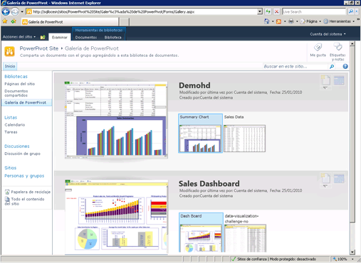

# Creación y personalización de la Galería de PowerPivot
  [!INCLUDE[ssGemini](../../includes/ssgemini-md.md)] es un tipo especial de biblioteca de documentos de SharePoint que permite obtener una eficaz vista previa y administrar los documentos de los libros de Excel publicados y los informes de Reporting Services que contienen datos de [!INCLUDE[ssGemini](../../includes/ssgemini-md.md)] .  
  
##   En este tema  
  
-   [Requisitos previos](#prereq)  
  
-   [Información general](#overview)  
  
-   [Crear la Galería de PowerPivot](#createlib)  
  
-   [Personalizar una biblioteca de la Galería de PowerPivot](#customize)  
  
-   [Deshabilitar u ocultar el botón Actualizar](#bkmk_hide_refresh_button)  
  
-   [Cambiar a la Vista de teatro o a la Vista de galería](#switch)  
  
##   Requisitos previos  
  
-   Debe tener Silverlight. Silverlight se puede descargar e instalar a través de Microsoft Update. Si ve una biblioteca de la Galería de [!INCLUDE[ssGemini](../../includes/ssgemini-md.md)] mediante un explorador que no tenga Silverlight, haga clic en el vínculo de la página para instalarlo. Debe cerrar el explorador y volver a abrirlo tras instalarlo.  
  
    > [!NOTE]  
    >  La Galería de Power Pivot requiere Microsoft Silverlight.  El navegador Microsoft Edge no es compatible con Silverlight.   
    > Para ver el contenido de la biblioteca en Edge, haga clic en la pestaña **Biblioteca** de la Galería de Power Pivot y, luego, cambie la vista de la biblioteca de documentos a **Todos los documentos**.    
    > Para cambiar la vista predeterminada, haga clic en la pestaña **Biblioteca** y, después, en Modificar vista. Haga clic en "Establecer esta vista como predeterminada" y, después, en Aceptar para guardar la vista predeterminada.  
    >  Para obtener más información sobre la compatibilidad de Edge, consulte [A break from the past, part 2: Saying goodbye to ActiveX, VBScript...](https://blogs.windows.com/msedgedev/2015/05/06/a-break-from-the-past-part-2-saying-goodbye-to-activex-vbscript-attachevent/)en el blog de Windows.  
  
-   Debe ser propietario de un sitio para crear una biblioteca.  
  
-   Debe tener permisos para contribuir, como mínimo, si desea publicar o cargar un archivo.  
  
-   [!INCLUDE[ssGemini](../../includes/ssgemini-md.md)] no puede estar en un sitio restringido. El sitio primario que contiene la Galería de [!INCLUDE[ssGemini](../../includes/ssgemini-md.md)] debe agregarse al sitio de confianza o a la zona Intranet local.  
  
-   La solución de aplicación web de [!INCLUDE[ssGemini](../../includes/ssgemini-md.md)] debe haberse implementado para la aplicación y la característica [!INCLUDE[ssGemini](../../includes/ssgemini-md.md)] debe haberse activado para la colección de sitios. Para obtener más información, consulte [Deploy Power Pivot Solutions to SharePoint](../../analysis-services/power-pivot-sharepoint/deploy-power-pivot-solutions-to-sharepoint.md) y[Activate Power Pivot Feature Integration for Site Collections in Central Administration](../../analysis-services/power-pivot-sharepoint/activate-power-pivot-integration-for-site-collections-in-ca.md).  
  
-   Para crear o ver un informe de Reporting Services que se base en un libro de [!INCLUDE[ssGemini](../../includes/ssgemini-md.md)] , el libro y el informe deben estar en la misma Galería de [!INCLUDE[ssGemini](../../includes/ssgemini-md.md)] . El informe debe usar un libro [!INCLUDE[ssGemini](../../includes/ssgemini-md.md)] con datos incrustados o el libro debe contener como máximo un origen de datos externo que sea un libro [!INCLUDE[ssGemini](../../includes/ssgemini-md.md)] .  
  
##   Información general  
 [!INCLUDE[ssGemini](../../includes/ssgemini-md.md)] es una plantilla de biblioteca que está disponible al instalar [!INCLUDE[ssGeminiLong](../../includes/ssgeminilong-md.md)] en un servidor de SharePoint. La Galería de [!INCLUDE[ssGemini](../../includes/ssgemini-md.md)] combina una vista previa precisa del contenido del archivo con información sobre el origen del documento. Puede ver inmediatamente quién creó el documento y cuándo se modificó por última vez. Para crear las imágenes de la vista previa, la Galería de [!INCLUDE[ssGemini](../../includes/ssgemini-md.md)] utiliza un servicio de instantánea que puede leer los libros de [!INCLUDE[ssGemini](../../includes/ssgemini-md.md)] e informes de Reporting Services que contienen los datos [!INCLUDE[ssGemini](../../includes/ssgemini-md.md)] . Si publica un archivo que el servicio de instantánea no puede leer, no habrá ninguna imagen de vista previa disponible para el mismo.  
  
 Las imágenes de vista previa se basan en el modo en que el libro se representa en Excel Services. La representación de la Galería de [!INCLUDE[ssGemini](../../includes/ssgemini-md.md)] debería ser idéntica a lo que se ve en un libro de [!INCLUDE[ssGemini](../../includes/ssgemini-md.md)] con un explorador. Sin embargo, la vista previa tiene un área expuesta limitada. Las partes de un libro o un informe podrían reducirse para ajustarse al espacio disponible. Es posible que tenga que abrir un libro o informe para ver todo el documento.  
  
 La actualización de los datos de libros de [!INCLUDE[ssGemini](../../includes/ssgemini-md.md)] desde orígenes de datos externos se admite totalmente en la Galería de [!INCLUDE[ssGemini](../../includes/ssgemini-md.md)] , pero necesita una configuración adicional. Un administrador de granja o de servicios debe agregar la Galería de [!INCLUDE[ssGemini](../../includes/ssgemini-md.md)] como una ubicación de confianza de Excel Services. Para más información, vea [Create a trusted location for Power Pivot sites in Central Administration](../../analysis-services/power-pivot-sharepoint/create-a-trusted-location-for-power-pivot-sites-in-central-administration.md).  
  
##   Crear la Galería de PowerPivot  
 [!INCLUDE[ssGemini](../../includes/ssgemini-md.md)] se crea automáticamente al instalar [!INCLUDE[ssGeminiLong](../../includes/ssgeminilong-md.md)] mediante la opción de instalación Nuevo servidor. Si agregó [!INCLUDE[ssGeminiShort](../../includes/ssgeminishort-md.md)] a una granja existente o si desea una biblioteca adicional, puede crear una nueva para la aplicación o el sitio.  
  
1.  1.  **SharePoint 2010**: haga clic en **Acciones del sitio** en la esquina superior izquierda de la página principal del sitio.  
  
    2.  Haga clic en **Más opciones**.  
  
    3.  En Bibliotecas, haga clic en **Galería de [!INCLUDE[ssGemini](../../includes/ssgemini-md.md)]**.  
  
    1.  **SharePoint 2013**: haga clic en el icono de configuración . Haga clic en **Contenido del sitio**  
  
    2.  Haga clic en **Agregar una aplicación**.  
  
    3.  Haga clic en **Galería de [!INCLUDE[ssGemini](../../includes/ssgemini-md.md)]**.  
  
2.  Escriba el nombre de la biblioteca. Asegúrese de incluir información descriptiva que sirva de ayuda a los usuarios para identificar esta biblioteca como una eficaz vista previa para los libros [!INCLUDE[ssGemini](../../includes/ssgemini-md.md)] y los informes de Reporting Services.  
  
3.  Haga clic en **Crear**.  
  
4.  Pida al administrador del servicio o la granja que agregue la Galería de [!INCLUDE[ssGemini](../../includes/ssgemini-md.md)] como una ubicación de confianza para Excel Services. Este paso es necesario para evitar errores si un usuario configura un libro para la actualización de datos de [!INCLUDE[ssGemini](../../includes/ssgemini-md.md)] . Para obtener más información, vea [Crear una ubicación de confianza para los sitios PowerPivot en Administración central](../../analysis-services/power-pivot-sharepoint/create-a-trusted-location-for-power-pivot-sites-in-central-administration.md).  
  
 Un vínculo a la biblioteca de la Galería de [!INCLUDE[ssGemini](../../includes/ssgemini-md.md)] aparecerá en el panel Inicio rápido de navegación para el sitio actual.  
  
 Puede crear bibliotecas adicionales de la Galería de [!INCLUDE[ssGemini](../../includes/ssgemini-md.md)] si va a aplicar permisos distintos para diferentes colecciones de sitios o para sitios individuales.  
  
##   Personalizar una biblioteca de la Galería de PowerPivot  
 [!INCLUDE[ssGemini](../../includes/ssgemini-md.md)] es una biblioteca de documentos de SharePoint. Por consiguiente, puede utilizar las herramientas de biblioteca estándar de SharePoint para cambiar la configuración de la biblioteca o trabajar con documentos individuales en la biblioteca. Cada biblioteca que crea se puede personalizar independientemente para utilizar una configuración de la biblioteca o de la vista diferente.  
  
 El criterio de ordenación y los filtros se pueden modificar para cambiar el lugar donde los libros aparecen en la lista. De forma predeterminada, los documentos se enumeran en el orden en el que se agregaron: el último documento publicado aparece en la parte inferior de la lista. Una vez publicado un documento, conserva su lugar en la lista. Al actualizar y volver a publicar las actualizaciones del documento, su lugar se actualiza en la lista.  
  
 No puede habilitar o deshabilitar la vista previa para documentos concretos. El servicio de instantánea generará las imágenes de vista previa para todos los libros [!INCLUDE[ssGemini](../../includes/ssgemini-md.md)] y para los informes de Reporting Services que se basen en los libros [!INCLUDE[ssGemini](../../includes/ssgemini-md.md)] que estén almacenados en la misma biblioteca. Todos los usuarios que tienen los permisos Ver en el documento pueden ver estas imágenes.  
  
 No puede ampliar la Galería de [!INCLUDE[ssGemini](../../includes/ssgemini-md.md)] para proporcionar la vista previa de otros tipos de documento. La vista previa solo se admite para los libros de Excel 2010 o los informes de Reporting Services de SQL Server 2008 R2 que contienen datos de [!INCLUDE[ssGemini](../../includes/ssgemini-md.md)] .  
  
 No puede cambiar la configuración que controla la información del origen del documento. Los hechos que aparecen acerca de los documentos individuales, como quién agregó o modificó el libro por última vez, se determinan mediante un conjunto fijo de columnas que no se pueden modificar.  
  
#### Cambiar el criterio de ordenación, agregar filtros o limitar el número de documentos  
 [!INCLUDE[ssGemini](../../includes/ssgemini-md.md)] siempre muestra los valores 'Última modificación' y 'Creado por'. No puede deshabilitar estas columnas. No puede habilitar otras columnas para la biblioteca. Use las instrucciones siguientes para cambiar el criterio de ordenación, agregar un filtro o limitar el número de documentos que están visibles.  
  
1.  En un sitio de SharePoint, abra la Galería de [!INCLUDE[ssGemini](../../includes/ssgemini-md.md)] .  
  
2.  En la cinta de opciones, haga clic en **Biblioteca**.  
  
3.  **SharePoint 2010** : en Vistas personalizadas, haga clic en **Modificar esta vista**.  
  
     **SharePoint 2013** : en **Administrar vistas**, haga clic en **Modificar vista**.  
  
4.  En Ordenar, especifique los criterios que se utilizarán para determinar cómo aparecen los libros en la lista. De forma predeterminada, los documentos se enumeran en el orden en el que se agregaron.  
  
5.  En Filtro, especifique los criterios que se utilizarán para mostrar u ocultar los libros según los valores condicionales establecidos en las columnas. Por ejemplo, puede que desee ocultar todos los libros creados antes de una cierta fecha.  
  
6.  En Límite del elemento, especifique opciones que sean útiles para las bibliotecas de la Galería de [!INCLUDE[ssGemini](../../includes/ssgemini-md.md)] que contienen un número muy grande de documentos. Puede limitar el número real de elementos que aparecen en la lista o mostrar los elementos en lotes.  
  
7.  Haga clic en **Aceptar** para guardar los cambios.  
  
####   Deshabilitar u ocultar el botón Actualizar  
 No se puede ocultar el botón **Administrar actualización de datos** . Sin embargo, el botón se deshabilita si el usuario no dispone de permisos suficientes.  
  
   
  
 Los propietarios o los autores de los libros deben tener el permiso para **contribuir** si desean programar la actualización de los datos en un libro. Los usuarios que tienen permisos Contribuir pueden abrir y editar la página de configuración de la actualización de datos del libro para especificar las credenciales y la información de programación que se usa para actualizar los datos.  
  
 Los usuarios que solo tengan los niveles de permisos **Ver** o **Leer** no podrán tener acceso al botón para actualizar. El botón para actualizar es visible pero está deshabilitado. Para obtener más información, vea [Permisos de usuario y niveles de permisos en SharePoint 2013](http://technet.microsoft.com/library/cc721640.aspx).  
  
##   Cambiar a la Vista de teatro o a la Vista de galería  
 La vista previa varía según cómo se configura la vista para la biblioteca. En la vista de galería, puede mantener el puntero del mouse sobre cada hoja de cálculo de un libro para poner una hoja en el foco del área de vista previa.  
  
   
  
 En la siguiente tabla se describen los diferentes diseños para presentar dibujos en miniatura de cada página de la que se obtiene la vista previa:  
  
|Ver|Description|  
|----------|-----------------|  
|Vista de la galería (valor predeterminado)|La Vista de la galería es la predeterminada para una Galería de [!INCLUDE[ssGemini](../../includes/ssgemini-md.md)] . La vista previa aparece a la izquierda. Las miniaturas más pequeñas de cada hoja de cálculo aparecen al lado de ella siguiendo un orden secuencial de izquierda a derecha.|  
|Todos los documentos|Este es el diseño estándar para las bibliotecas de documentos. Puede elegir esta vista para administrar documentos individuales o ver el contenido de la biblioteca en un formato de lista.   Utilice esta vista para modificar las propiedades, y eliminar o mover documentos individuales.   Si habilitó el control de versiones, debe utilizar esta vista para proteger o desproteger los documentos en la biblioteca.|  
|Vista de teatro y vista de carrusel|Se trata de vistas especializadas que funcionan mejor si se muestra un número pequeño de documentos relacionados. El giro completo de miniaturas incluye todas las páginas de todos los documentos de la biblioteca. Si tiene un número grande de documentos, estas vistas podrían no ser prácticas para los usuarios que deseen encontrar o abrir un libro de [!INCLUDE[ssGemini](../../includes/ssgemini-md.md)] concreto.   Vista de teatro: el área de vista previa está centrada. Las miniaturas menores de cada hoja de cálculo aparecen más abajo en la página, en uno de los lados.   Vista de carrusel: el área de vista previa está centrada. Las miniaturas que preceden y siguen inmediatamente a la miniatura actual son adyacentes al área de vista previa.|  
  
### Cambiar a una vista diferente  
  
1.  En un sitio de SharePoint, abra la Galería de [!INCLUDE[ssGemini](../../includes/ssgemini-md.md)] .  
  
2.  En la cinta de opciones, haga clic en **Biblioteca**.  
  
3.  En Administrar vistas, en Vista actual, seleccione la vista que desee utilizar en la lista. Las vistas prediseñadas incluyen la Vista de galería, la Vista de teatro y la Vista de carrusel. O bien, puede elegir Todos los documentos si desea mover, eliminar o administrar los documentos de la biblioteca.  
  
## Vea también  
 [Solucionar problemas de una instalación de PowerPivot para SharePoint](../../analysis-services/troubleshoot-a-power-pivot-for-sharepoint-installation.md)   
 [Use la Galería de PowerPivot](../../analysis-services/power-pivot-sharepoint/use-power-pivot-gallery.md)   
 [Create a trusted location for Power Pivot sites in Central Administration](../../analysis-services/power-pivot-sharepoint/create-a-trusted-location-for-power-pivot-sites-in-central-administration.md)   
 [Eliminar Galería de PowerPivot](../../analysis-services/power-pivot-sharepoint/delete-power-pivot-gallery.md)  
  
  

