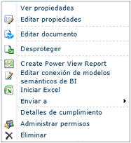
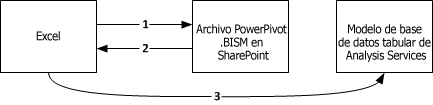
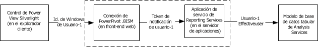

# Conexión del modelo semántico de BI de Power Pivot (.bism)
  Una conexión de modelo semántico de BI (.bism) es una conexión portátil que conecta informes de Excel o Power View a una base de datos de modelo tabular de Analysis Services o a una instancia de Analysis Services en modo multidimensional. Si está familiarizado con los archivos de conexión de datos de office (.odc), observará una similitud en la forma en que se define y se utiliza un archivo de conexión .bism.  
  
 Las conexiones de modelos semánticos de BI se crean y se obtiene acceso a ellas a través de SharePoint. La creación de conexiones de modelo semántico de BI habilita comandos de inicio rápido en una conexión de modelo semántico de BI de una biblioteca. Los comandos de inicio rápido abren un nuevo libro de Excel o las opciones para modificar el archivo de conexión. Si Reporting Services está instalado, también verá un comando para crear un informe de [!INCLUDE[ssCrescent](../../includes/sscrescent-md.md)] .  
  
   
  
##   Bases de datos admitidas  
 Las conexiones del modelo semántico de BI apuntan a datos del modelo tabular. Hay tres orígenes para estos datos:  
  
-   Una base de datos de modelo tabular que se ejecuta en una instancia independiente de Analysis Services en el modo de servidor tabular. Una implementación de una instancia de Analysis Services independiente es externa a la granja. El acceso a orígenes de datos fuera de la granja requiere permisos adicionales, acerca de los cuales puede leer en este tema: [Crear una conexión de modelo semántico de BI a una base de datos de modelo tabular](../../analysis-services/power-pivot-sharepoint/create-a-bi-semantic-model-connection-to-a-tabular-model-database.md).  
  
-   [!INCLUDE[ssGemini](../../includes/ssgemini-md.md)] guardados en SharePoint. Bases de datos incrustadas de [!INCLUDE[ssGemini](../../includes/ssgemini-md.md)] en los libros de Excel son equivalentes a las bases de datos modelo tabulares que se ejecutan en un servidor de modo tabular independiente de Analysis Services. Si ya utiliza [!INCLUDE[ssGemini](../../includes/ssgemini-md.md)] para Excel y [!INCLUDE[ssGemini](../../includes/ssgemini-md.md)] para SharePoint, puede definir una conexión de modelo semántico de BI que apunte a libros de [!INCLUDE[ssGemini](../../includes/ssgemini-md.md)] en una biblioteca de SharePoint y compilar informes de [!INCLUDE[ssCrescent](../../includes/sscrescent-md.md)] mediante los datos de [!INCLUDE[ssGemini](../../includes/ssgemini-md.md)] existentes.  Puede utilizar los libros creados en versiones de SQL Server 2008 R2 o [!INCLUDE[ssSQL11](../../includes/sssql11-md.md)] de [!INCLUDE[ssGemini](../../includes/ssgemini-md.md)] para Excel.  
  
-   Un modelo de datos multidimensionales en una instancia de Analysis Services.  
  
 Para consultar una comparación de los orígenes de datos, vea el contenido de la comunidad [Understanding the SQL Server 2012 BI Semantic Model (BISM)](http://www.mssqltips.com/sqlservertip/2818/understanding-the-sql-server-2012-bi-semantic-model-bism/)(Descripción del modelo semántico de BI [BISM] de SQL Server 2012).  
  
## Descripción de la secuencia de conexión en las conexiones semánticas de BI  
 En esta sección se explica el comportamiento de una conexión entre varias aplicaciones cliente, como la aplicación de escritorio Excel o el cliente de informes de la vista avanzada de SharePoint, y una base de datos modelo tabular que se encuentra dentro o fuera de la granja de servidores de SharePoint.  
  
 Todas las conexiones que tienen como destino una base de datos modelo tabular se establecen con las credenciales del usuario que solicita los datos. Sin embargo, los mecanismos de esa conexión variarán dependiendo de si se trata de una conexión que se establece dentro una granja, si se trata una conexión de uno o dos saltos y si Kerberos está habilitado. Para más información sobre las conexiones autenticadas entre SharePoint y orígenes de datos back-end, vea [Double-hop authentication: Why NTLM fails and Kerberos works](http://go.microsoft.com/fwlink/?LinkId=237137)(Autenticación de salto doble: Por qué NTLM no funciona y Kerberos sí).  
  
 **Establecer conexión desde Excel con datos tabulares de una red**  
  
 Cuando un usuario de Excel especifica una conexión del modelo semántico de BI como origen de datos, la información de conexión incluida en el archivo .bism se descarga en la aplicación cliente, que, a continuación, emite su propia solicitud directa para la base de datos modelo tabular de Analysis Services. Para tener acceso a la conexión de .bism, el usuario de Excel debe ser un usuario de SharePoint con permisos de lectura sobre el archivo de conexión .bism. Una vez que se descarga la información de conexión, todas las conexiones siguientes omiten SharePoint y fluyen directamente desde Excel hacia la base de datos modelo tabular back-end.  
  
 En la siguiente ilustración se muestra esta secuencia de conexión. Comienza con una solicitud de la conexión .bism, seguida de la descarga de la información de conexión en el cliente y, finalmente, la conexión de un solo salto con la base de datos. La conexión se establece utilizando las credenciales de Windows del usuario de Excel, que tiene permisos de lectura en la base de datos de Analysis Services. Se trata de una conexión de un solo salto, de modo que, aunque Kerberos está habilitado, no es necesario en este escenario.  
  
   
  
 **Establecer conexión desde la vista avanzada con los datos tabulares de una red**  
  
 Cuando un usuario de SharePoint hace clic en una conexión semántica de BI de una biblioteca de documentos, la vista avanzada (si está instalada) se inicia inmediatamente y se abre una conexión a la base de datos modelo tabular.  
  
 Las conexiones entre la vista avanzada y una base de datos modelo tabular sigue una secuencia de autenticación de dos saltos, en la que la identidad del usuario se transmite desde el cliente a SharePoint y, a continuación, desde SharePoint a una base de datos modelo de tabular back-end de Analysis Services que se ejecuta fuera de la granja. La biblioteca cliente ADOMD.NET que controla la solicitud de conexión siempre intenta usar Kerberos en el primer intento. Si se configura Kerberos, la identidad del usuario se suplanta en la conexión a la base de datos modelo tabular, y la conexión se realiza correctamente.  
  
 Si no se configura Kerberos y se produce un error en la solicitud, Reporting Services hace un segundo intento. En este escenario, la biblioteca cliente se conecta a Analysis Services utilizando la identidad del servicio de Reporting Services y la autenticación NTLM. La identidad del usuario de la vista avanzada se pasa en la cadena de conexión utilizando el parámetro **effectiveusername** .  
  
 Solo un miembro del rol del administrador del sistema de la instancia de Analysis Services tiene permiso para realizar una conexión con el parámetro de **effectiveusername** y para suplantar a otro usuario en la instancia de servidor. Por esta razón, la cuenta de ejecución del servicio compartido de Reporting Services debe tener derechos administrativos en la instancia de Analysis Services.  Para obtener instrucciones sobre cómo conceder permisos administrativos a la cuenta de servicio, vea el tema [Crear una conexión de modelo semántico de BI a una base de datos de modelo tabular](../../analysis-services/power-pivot-sharepoint/create-a-bi-semantic-model-connection-to-a-tabular-model-database.md).  
  
 En la siguiente ilustración se muestra una secuencia de conexión que usa la misma identidad de usuario de Windows en cada conexión. En la última conexión a Analysis Services, la conexión se realiza mediante la identidad de la aplicación de servicio de Reporting Services, que pasa la identidad del usuario de Windows a través de **effectiveusername**.  
  
   
  
 **Conexión desde Power View a datos de [!INCLUDE[ssGemini](../../includes/ssgemini-md.md)] en SharePoint**  
  
 Cuando un usuario de SharePoint hace clic en una conexión semántica de BI que se resuelve en un libro de [!INCLUDE[ssGemini](../../includes/ssgemini-md.md)] de la misma granja de servidores, las conexiones se establecen en el contexto del entorno de SharePoint. Una aplicación de servicio [!INCLUDE[ssGemini](../../includes/ssgemini-md.md)] administra la solicitud de conexión, que se reenvía a la instancia de Analysis Services del mismo equipo. La instancia de Analysis Services extrae los datos de [!INCLUDE[ssGemini](../../includes/ssgemini-md.md)] del libro y los carga. Todas las sucesivas conexiones las administrarán las aplicaciones de servicio de [!INCLUDE[ssGemini](../../includes/ssgemini-md.md)] de la granja.  
  
 En este escenario, todas las conexiones se establecen en la misma granja, por lo que no son necesarios Kerberos ni la delegación limitada.  
  
##   Tareas relacionadas  
 [Agregar un tipo de contenido de conexión de modelo semántico de BI a una biblioteca &#40;PowerPivot para SharePoint&#41;](../../analysis-services/power-pivot-sharepoint/add-bi-semantic-model-connection-content-type-to-library.md)  
  
 [Crear una conexión de modelo semántico de BI a un libro PowerPivot](../../analysis-services/power-pivot-sharepoint/create-a-bi-semantic-model-connection-to-a-power-pivot-workbook.md)  
  
 [Crear una conexión de modelo semántico de BI a una base de datos de modelo tabular](../../analysis-services/power-pivot-sharepoint/create-a-bi-semantic-model-connection-to-a-tabular-model-database.md)  
  
 [Usar una conexión de modelo semántico de BI en Excel o Reporting Services](../../analysis-services/power-pivot-sharepoint/use-a-bi-semantic-model-connection-in-excel-or-reporting-services.md)  
  
## Vea también  
 [Determinar el modo de servidor de una instancia de Analysis Services](../../analysis-services/instances/determine-the-server-mode-of-an-analysis-services-instance.md)   
 [Conectar a Analysis Services](../../analysis-services/instances/connect-to-analysis-services.md)  
  
  
