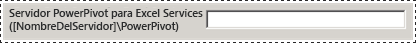
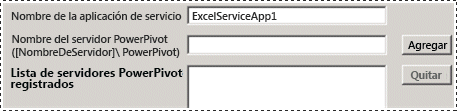
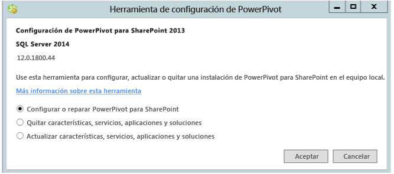

# Power Pivot Configuration Tools
[!INCLUDE[ssas-appliesto-sqlas](../../includes/ssas-appliesto-sqlas.md)]
  Configure, repare o quite [!INCLUDE[ssCurrent](../../includes/sscurrent-md.md)] [!INCLUDE[ssGeminiShort](../../includes/ssgeminishort-md.md)] con las herramientas de configuración de [!INCLUDE[ssGemini](../../includes/ssgemini-md.md)] .  
  
 El Asistente para la instalación de [!INCLUDE[ssCurrent](../../includes/sscurrent-md.md)] no instala herramientas de configuración de [!INCLUDE[ssGemini](../../includes/ssgemini-md.md)] para SharePoint. Las herramientas de configuración estarán disponibles para su descarga en una versión futura de [!INCLUDE[ssCurrent](../../includes/sscurrent-md.md)].  
  
 En este tema se describe el uso general de las herramientas de [!INCLUDE[ssGemini](../../includes/ssgemini-md.md)] y las diferencias que existen entre ellas.  
  
 **[!INCLUDE[applies](../../includes/applies-md.md)]**  SharePoint 2013  
  
 **En este tema:**  
  
-   [Requisitos para usar las herramientas de configuración](#bkmk_requirements)  
  
-   [Dos versiones de la herramienta de configuración](#bkmk_twoversions)  
  
-   [Información general sobre el uso de una herramienta de configuración de Power Pivot](#bkmk_overview)  
  
-   [Iniciar una de las herramientas de configuración de Power Pivot](#bmkm_start_tool)  
  
##   Requisitos para usar las herramientas de configuración  
  
-   Debe ser un administrador de la granja de servidores.  
  
-   Debe ser administrador del servidor en la instancia de Analysis Services (solo SharePoint 2010).  
  
-   Debe ser db_owner en la base de datos de configuración de la granja de servidores.  
  
-   No existen requisitos de puertos TCP/IP para utilizar las herramientas de configuración y, por consiguiente, no debería tener que configurar el firewall para acomodar las herramientas de configuración. La herramienta de configuración espera que las aplicaciones Web y los servicios compartidos estén disponibles como parte de la plataforma de SharePoint. Puede que tenga que configurar el firewall para el servidor de [!INCLUDE[ssASnoversion](../../includes/ssasnoversion-md.md)] . Para obtener más información, consulte [Configure the Windows Firewall to Allow Analysis Services Access](../../analysis-services/instances/configure-the-windows-firewall-to-allow-analysis-services-access.md).  
  
##   Dos versiones de la herramienta de configuración  
 El Asistente para la instalación de [!INCLUDE[ssCurrent](../../includes/sscurrent-md.md)] instala la Herramienta de configuración de [!INCLUDE[ssGemini](../../includes/ssgemini-md.md)] para SharePoint 2010 y una Herramienta de configuración de [!INCLUDE[ssGemini](../../includes/ssgemini-md.md)] para SharePoint 2013.  
  
 Las herramientas solo se pueden usar con una instancia de [!INCLUDE[ssCurrent](../../includes/sscurrent-md.md)] o [!INCLUDE[ssSQL11SP1](../../includes/sssql11sp1-md.md)] de [!INCLUDE[ssGeminiShort](../../includes/ssgeminishort-md.md)]. No las use con instalaciones de [!INCLUDE[ssKilimanjaro](../../includes/sskilimanjaro-md.md)] .  
  
|Nombre|Versión admitida de SharePoint|Configuración detallada|  
|----------|-------------------------------------|----------------------------|  
|[!INCLUDE[ssGemini](../../includes/ssgemini-md.md)] para SharePoint 2013|SharePoint 2013|[Configure or Repair Power Pivot for SharePoint 2013 &#40;Power Pivot Configuration Tool&#41; (Configurar o reparar Power Pivot para SharePoint 2013 &#40;Herramienta de configuración de Power Pivot&#41;)](../../analysis-services/power-pivot-sharepoint/configure-or-repair-power-pivot-for-sharepoint-2013.md)|  
|[!INCLUDE[ssGemini](../../includes/ssgemini-md.md)] Herramienta de configuración|SharePoint 2010 con SharePoint 2010|[Configurar o reparar Power Pivot para SharePoint 2010 (Herramienta de configuración de Power Pivot)](http://msdn.microsoft.com/d61f49c5-efaa-4455-98f2-8c293fa50046)|  
  
###   En qué se diferencian las dos herramientas de configuración  
 Las dos versiones de la herramienta de configuración son similares pero hay algunas diferencias en los pasos de configuración que ejecutan las dos herramientas. Las diferencias se deben a cambios entre SharePoint 2010 y SharePoint 2013, así como a las diferencias de arquitectura entre la versión SQL Server 2012 SP1 de [!INCLUDE[ssGemini](../../includes/ssgemini-md.md)] para SharePoint y las versiones anteriores de [!INCLUDE[ssGemini](../../includes/ssgemini-md.md)] para SharePoint.  
  
 En la tabla siguiente se describen las características nuevas y modificadas de la herramienta de **[!INCLUDE[ssGemini](../../includes/ssgemini-md.md)] para SharePoint 2013** . En la tabla también se describen características de la **[!INCLUDE[ssGemini](../../includes/ssgemini-md.md)]**  que no están incluidas en la herramienta de configuración de [!INCLUDE[ssGemini](../../includes/ssgemini-md.md)] para SharePoint 2013. Las filas de la tabla están en el mismo orden que las pestañas de las herramientas de configuración.  
  
|[!INCLUDE[ssGemini](../../includes/ssgemini-md.md)] para SharePoint 2013|[!INCLUDE[ssGemini](../../includes/ssgemini-md.md)] Herramienta de configuración|  
|--------------------------------------------------------------|-----------------------------------------------|  
|La página principal tiene una opción nueva para **[!INCLUDE[ssGemini](../../includes/ssgemini-md.md)] para Excel Services**. La opción admite la nueva arquitectura con [!INCLUDE[ssASnoversion](../../includes/ssasnoversion-md.md)] que se ejecuta fuera de la granja de SharePoint. Configure Excel Services para usar uno o más servidores de [!INCLUDE[ssASnoversion](../../includes/ssasnoversion-md.md)] que se ejecutan en modo de SharePoint.   ||  
||La herramienta de 2010 incluye la página **Registrar SQL Server Analysis Services ([!INCLUDE[ssGemini](../../includes/ssgemini-md.md)]) en el servidor local** para configurar una instancia local de [!INCLUDE[ssASnoversion](../../includes/ssasnoversion-md.md)]. Esta página no forma parte de la herramienta de 2013 porque no hay ninguna instancia local de [!INCLUDE[ssASnoversion](../../includes/ssasnoversion-md.md)].   |  
||La página **Crear una aplicación de servicio [!INCLUDE[ssGemini](../../includes/ssgemini-md.md)]** tiene una opción adicional **Actualizar libros antes de habilitar la actualización de datos**. Esta opción no está disponible en la herramienta de 2013.   |  
|La herramienta de 2013 tiene una página nueva, **Configurar servidores [!INCLUDE[ssGemini](../../includes/ssgemini-md.md)]**. Esta página admite la nueva arquitectura de [!INCLUDE[ssASnoversion](../../includes/ssasnoversion-md.md)] que se ejecuta fuera de la granja de servidores de SharePoint. De manera predeterminada, el nombre del servidor que se escribió en la página principal, en el cuadro de texto **Servidor [!INCLUDE[ssGemini](../../includes/ssgemini-md.md)] para Excel Services**, también se muestra en **Configurar servidores [!INCLUDE[ssGemini](../../includes/ssgemini-md.md)]**.   ||  
|La herramienta de 2013 tiene una página nueva, **Registrar complemento [!INCLUDE[ssGemini](../../includes/ssgemini-md.md)] como herramienta de seguimiento de uso de Excel Services**. Excel Services de SharePoint 2010 no hace seguimiento de los datos de uso de [!INCLUDE[ssGemini](../../includes/ssgemini-md.md)].||  
||La herramienta de 2010 incluye la página **Agregar MSOLAP.5 como proveedor de confianza** para registrar MSOLAP de forma que Excel Services en SharePoint 2010 pueda cargar modelos de [!INCLUDE[ssGemini](../../includes/ssgemini-md.md)] . Esta página no forma parte de la herramienta de 2013. Excel Services de SharePoint 2013 no usa el proveedor MSOLAP para cargar modelos.|  
  
##   Información general sobre el uso de una herramienta de configuración de Power Pivot  
 Cuando inicia una de las herramientas de configuración de [!INCLUDE[ssGemini](../../includes/ssgemini-md.md)] , la herramienta evalúa la instalación existente para determinar qué operaciones son aplicables. En una instalación nueva, solo está disponible la tarea de configuración. Una vez configurado el servidor, aparece la tarea de quitar. Si empezó con una instancia de [!INCLUDE[ssKilimanjaro](../../includes/sskilimanjaro-md.md)] , la actualización también se habilitará en la lista de tareas disponibles.  
  
 Si no está familiarizado con Administración central o con Windows PowerShell, puede ejecutar la herramienta de configuración como alternativa a completar una instalación de [!INCLUDE[ssGeminiShort](../../includes/ssgeminishort-md.md)] .  
  
 Además, la herramienta puede detectar si la granja está configurada o faltan las características necesarias. Si los archivos de programa de SharePoint están instalados pero la granja no está configurada, la herramienta proporciona las acciones para configurar la granja y la instalación de [!INCLUDE[ssGeminiShort](../../includes/ssgeminishort-md.md)] .  
  
 Puede revisar la pestaña **Script** para aprender y entender cómo configurar [!INCLUDE[ssGemini](../../includes/ssgemini-md.md)] y SharePoint mediante Windows PowerShell. Para obtener más información, vea:  
  
-   [Configuración de Power Pivot mediante Windows PowerShell](../../analysis-services/power-pivot-sharepoint/power-pivot-configuration-using-windows-powershell.md)  
  
-   [Referencia de PowerShell para Power Pivot para SharePoint](../../analysis-services/powershell/powershell-reference-for-power-pivot-for-sharepoint.md)  
  
> [!NOTE]
>  La herramienta no configura Reporting Services. Si va a agregar Reporting Services a su entorno de SharePoint, necesita instalar y configurar Reporting Services por separado. Para obtener más información, vea:  
> 
>  -   [Instalación del primer servidor de informes en modo de SharePoint](../../reporting-services/install-windows/install-the-first-report-server-in-sharepoint-mode.md).  
> -   [Instalar el modo de SharePoint de Reporting Services para SharePoint 2010](http://msdn.microsoft.com/47efa72e-1735-4387-8485-f8994fb08c8c).  
  
##   Iniciar una de las herramientas de configuración de Power Pivot  
  
1.  En la pantalla **Inicio** , escriba **powerpivot**.  
  
     En la pantalla **Iniciar** , escriba **powerpivot** o bien, en el menú **Inicio** , haga clic sucesivamente en **Todos los programas**, [!INCLUDE[ssCurrentUI](../../includes/sscurrentui-md.md)], **Herramientas de configuración**y, luego, haga clic en una de las opciones siguientes:  
  
    -   **[!INCLUDE[ssGemini](../../includes/ssgemini-md.md)] Herramienta de configuración**.  
  
    -   **OR**  
  
    -   **[!INCLUDE[ssGemini](../../includes/ssgemini-md.md)] para SharePoint 2013**.  
  
       
  
     **Nota:** Las herramientas solo están disponibles cuando [!INCLUDE[ssGeminiShort](../../includes/ssgeminishort-md.md)] está instalado en el servidor local.  
  
2.  Al iniciarse, las herramientas de configuración comprueban el estado de la instalación y proporcionan tareas que son válidas para la instalación.  
  
3.  Según el estado actual de la instalación, se pueden realizar una o más de las tareas siguientes:  
  
    1.  Haga clic en **Configurar o reparar [!INCLUDE[ssGemini](../../includes/ssgemini-md.md)] para SharePoint** para completar las tareas posteriores a la instalación o reparar una instalación.  
  
    2.  Haga clic en **Quitar características, servicios, aplicaciones y soluciones** para quitar características y soluciones de la granja.  
  
    3.  Haga clic en **Actualizar características, servicios, aplicaciones y soluciones** para actualizar las características y las soluciones instaladas con una versión anterior de [!INCLUDE[ssGeminiShort](../../includes/ssgeminishort-md.md)].  
  
     Por ejemplo, la imagen muestra la página de inicio de la herramienta de configuración de [!INCLUDE[ssGemini](../../includes/ssgemini-md.md)] para SharePoint 2013.  
  
       
  
 Cada tarea se compone de acciones individuales que abordan algún aspecto de la configuración del servidor. Por ejemplo, la tarea de configuración incluye acciones para implementar soluciones, crear una aplicación de servicio [!INCLUDE[ssGemini](../../includes/ssgemini-md.md)] , activar características y configurar la actualización de datos. La lista de acciones variará en función del estado actual de la instalación. Si una acción no es necesaria, la herramienta la excluye de la lista de tareas.  
  
 Al hacer clic en ejecutar, la herramienta procesa todas las acciones por lotes. Aunque cada acción aparece como un elemento diferente en la lista de tareas, todas las acciones incluidas en la tarea se procesan juntas. Solo se procesan las acciones que superan una comprobación de validación. Puede que tenga que agregar o cambiar algunos de los valores de entrada para superar la comprobación de validación.  
  
## Contenido relacionado  
 [Upgrade Power Pivot for SharePoint](../../database-engine/install-windows/upgrade-power-pivot-for-sharepoint.md) Describe el flujo de trabajo que actualiza una instalación existente que ya está en una granja.  
  
 [Desinstalar Power Pivot para SharePoint](../../sql-server/install/uninstall-power-pivot-for-sharepoint.md) Describe el flujo de trabajo que quita de una granja servicios, soluciones y páginas de aplicación de [!INCLUDE[ssGemini](../../includes/ssgemini-md.md)] para SharePoint.  
  
 [Configuración de Power Pivot mediante Windows PowerShell](../../analysis-services/power-pivot-sharepoint/power-pivot-configuration-using-windows-powershell.md)  
  
 [Administración y configuración del servidor de Power Pivot en Administración central](../../analysis-services/power-pivot-sharepoint/power-pivot-server-administration-and-configuration-in-central-administration.md)  
  
  
