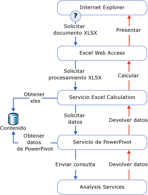

# Acceso a datos PowerPivot
[!INCLUDE[ssas-appliesto-sqlas](../../includes/ssas-appliesto-sqlas.md)]
  En este tema se describen las diferentes formas de recuperar datos de un libro [!INCLUDE[ssGemini](../../includes/ssgemini-md.md)] publicado en una biblioteca de SharePoint.  
  
 [!INCLUDE[ssGemini](../../includes/ssgemini-md.md)] se almacenan en un libro de Excel. La cadena de conexión es una dirección URL de un libro en un sitio de SharePoint.  
  
 [!INCLUDE[ssGemini](../../includes/ssgemini-md.md)] los utiliza frecuentemente el libro que los contiene, como los datos detrás de tablas dinámicas y gráficos dinámicos. Como alternativa, los datos de [!INCLUDE[ssGemini](../../includes/ssgemini-md.md)] también se pueden usar como un origen de datos externo, donde un libro, un panel o un informe se conectan a un archivo independiente de Excel (.xlsx) en SharePoint y recuperan los datos para su uso posterior. Las herramientas cliente que utilizan normalmente datos [!INCLUDE[ssGemini](../../includes/ssgemini-md.md)] son Excel, [!INCLUDE[ssCrescent](../../includes/sscrescent-md.md)], otros informes de Reporting Services y PerformancePoint.  
  
 En el escritorio, el complemento [!INCLUDE[ssGemini](../../includes/ssgemini-md.md)] usa AMO y ADOMD.NET para crear, procesar y ver los datos de [!INCLUDE[ssGemini](../../includes/ssgemini-md.md)] en el área de trabajo del cliente.  
  
 En una granja de servidores de SharePoint, Excel Services utiliza el proveedor OLE DB MSOLAP local para conectarse a datos [!INCLUDE[ssGemini](../../includes/ssgemini-md.md)] . El proveedor envía la solicitud de conexión a un servidor [!INCLUDE[ssGemini](../../includes/ssgemini-md.md)] para SharePoint de la granja. Ese servidor carga los datos, ejecuta la consulta y devuelve el conjunto de resultados.  
  
##   Consultar datos PowerPivot en SharePoint  
 Al ver un libro [!INCLUDE[ssGemini](../../includes/ssgemini-md.md)] de una biblioteca de SharePoint, los datos [!INCLUDE[ssGemini](../../includes/ssgemini-md.md)] que están en el libro se detectan, extraen y procesan de forma independiente en las instancias de servidor de Analysis Services dentro de la granja, mientras Excel Services representa el nivel de presentación. Puede ver el libro procesado totalmente en una ventana del explorador o en una aplicación de escritorio de Excel 2010 que tenga el complemento de [!INCLUDE[ssGemini](../../includes/ssgemini-md.md)] .  
  
 El siguiente diagrama muestra cómo se mueve a través de la granja una solicitud para el procesamiento de las consultas. Dado que los datos de [!INCLUDE[ssGemini](../../includes/ssgemini-md.md)] forman parte de un libro de Excel 2010, cuando un usuario abre un libro de Excel de una biblioteca de SharePoint e interactúa con una tabla dinámica o con un gráfico dinámico que contiene datos de [!INCLUDE[ssGemini](../../includes/ssgemini-md.md)] , se produce una solicitud para el procesamiento de consultas.  
  
   
  
 Los componentes Excel Services y [!INCLUDE[ssGemini](../../includes/ssgemini-md.md)] para SharePoint procesan diferentes partes del mismo archivo de libro (.xlsx). Excel Services detecta los datos de [!INCLUDE[ssGemini](../../includes/ssgemini-md.md)] y solicita el procesamiento de un servidor de [!INCLUDE[ssGemini](../../includes/ssgemini-md.md)] en la granja. El servidor de [!INCLUDE[ssGemini](../../includes/ssgemini-md.md)] asigna la solicitud a una instancia de [!INCLUDE[ssGeminiSrv](../../includes/ssgeminisrv-md.md)] , que extrae los datos del libro en la biblioteca de contenido y los carga. Los datos que están almacenados en memoria se combinan en el libro representado y se devuelven a Excel Web Access para presentarse en una ventana del explorador.  
  
 [!INCLUDE[ssGemini](../../includes/ssgemini-md.md)] para SharePoint no administra todos los datos en un libro [!INCLUDE[ssGemini](../../includes/ssgemini-md.md)] . Excel Services procesa las tablas y los datos de la celda en una hoja de cálculo. [!INCLUDE[ssGemini](../../includes/ssgemini-md.md)] para SharePoint administra únicamente las tablas dinámicas, los gráficos dinámicos y las segmentaciones que tienen que ver con los datos [!INCLUDE[ssGemini](../../includes/ssgemini-md.md)] .  
  
## Vea también  
 [Conectarse a Analysis Services](../../analysis-services/instances/connect-to-analysis-services.md)   
 [Acceso a datos de modelo tabular](../../analysis-services/tabular-models/tabular-model-data-access.md)  
  
  
