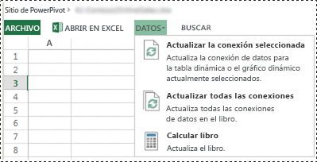
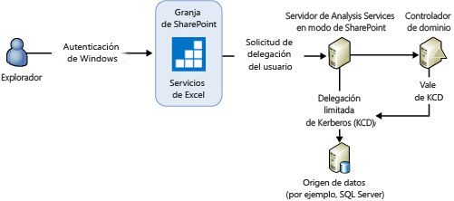
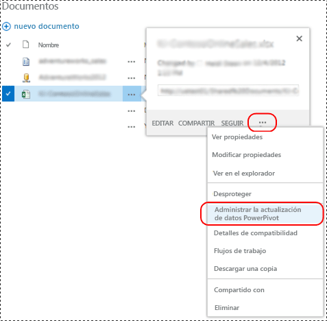
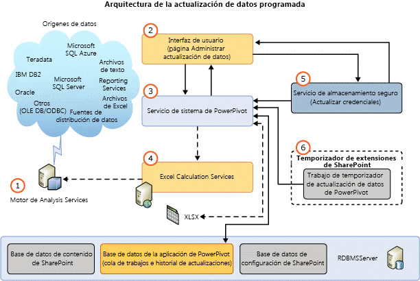
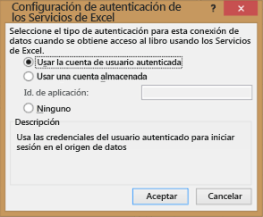

# Actualización de datos Power Pivot con SharePoint 2013
  El diseño de la actualización de modelos de datos de [!INCLUDE[ssGemini](../../includes/ssgemini-md.md)] de SharePoint 2013 emplea Excel Services como componente principal para cargar y actualizar modelos de datos en una instancia de [!INCLUDE[ssCurrent](../../includes/sscurrent-md.md)] [!INCLUDE[ssASnoversion](../../includes/ssasnoversion-md.md)] que se ejecuta en modo de SharePoint. El servidor de [!INCLUDE[ssASnoversion](../../includes/ssasnoversion-md.md)] ejecuta fuera de la granja de servidores de SharePoint. La arquitectura de SharePoint 2013 Excel Services admite tanto la **actualización de datos interactiva** como la **actualización de datos programada**.  
  
 **[!INCLUDE[applies](../../includes/applies-md.md)]**  SharePoint 2013  
  
 **En este tema:**  
  
-   [Interactive Data Refresh](#bkmk_interactive_refresh)  
  
-   [Autenticación de Windows con conexiones de datos de libro y actualización de datos interactiva](#bkmk_windows_auth_interactive_data_refresh)  
  
-   [Scheduled Data Refresh](#bkmk_scheduled_refresh)  
  
-   [Arquitectura de actualización de datos programada de SharePoint 2013](#bkmk_refresh_architecture)  
  
-   [Otras consideraciones sobre la autenticación](#datarefresh_additional_authentication)  
  
-   [Más información](#bkmk_moreinformation)  
  
## Información previa  
 SharePoint Server 2013 Excel Services administra la actualización de datos de los libros de Excel 2013 y desencadena el procesamiento del modelo de datos en un servidor [!INCLUDE[ssCurrent](../../includes/sscurrent-md.md)] [!INCLUDE[ssASnoversion](../../includes/ssasnoversion-md.md)] que se ejecuta en modo de SharePoint. Para los libros de Excel 2010, Excel Services también administra la carga y el almacenamiento de libros y modelos de datos. Sin embargo, Excel Services emplea el servicio de sistema de [!INCLUDE[ssGemini](../../includes/ssgemini-md.md)] para enviar los comandos de procesamiento al modelo de datos. En la tabla siguiente se resumen los componentes que envían comandos de procesamiento para la actualización de datos según la versión del libro. Se supone que se usa un entorno de una granja de SharePoint 2013 configurada para usar un [!INCLUDE[ssCurrent](../../includes/sscurrent-md.md)] Analysis Server en modo de SharePoint.  
  
||||  
|-|-|-|  
||Libros de Excel 2013|Libros de Excel 2010|  
|Desencadenar la actualización de datos|**Interactivo:** Usuario autenticado   **Programada:** [!INCLUDE[ssGemini](../../includes/ssgemini-md.md)] Servicio de sistema|[!INCLUDE[ssGemini](../../includes/ssgemini-md.md)] Servicio de sistema|  
|Cargar el libro desde las bases de datos de contenido|SharePoint 2013 Excel Services|SharePoint 2013 Excel Services|  
|Cargar modelo de datos en la instancia de Analysis Services|SharePoint 2013 Excel Services|SharePoint 2013 Excel Services|  
|Enviar comandos de procesamiento a la instancia de Analysis Services|SharePoint 2013 Excel Services|[!INCLUDE[ssGemini](../../includes/ssgemini-md.md)] Servicio de sistema|  
|Actualizar datos del libro|SharePoint 2013 Excel Services|SharePoint 2013 Excel Services|  
|Guardar el libro y el modelo de datos en la base de datos de contenido|**Interactiva:** N/D   **Programado:** SharePoint 2013 Excel Services|SharePoint 2013 Excel Services|  
  
 En la tabla siguiente se resumen las características de actualización admitidas en una granja de SharePoint 2013 configurada para usar un [!INCLUDE[ssCurrent](../../includes/sscurrent-md.md)] Analysis Server en modo de SharePoint:  
  
|Libro creado en|actualización de datos programada|Actualización interactiva|  
|-------------------------|----------------------------|-------------------------|  
|2008 R2 [!INCLUDE[ssGemini](../../includes/ssgemini-md.md)] para Excel|No compatible. Actualizar el libro **(\*)**|No compatible. Actualizar el libro **(\*)**|  
|2012 [!INCLUDE[ssGemini](../../includes/ssgemini-md.md)] para Excel|Admitida|No compatible. Actualizar el libro **(\*)**|  
|Excel 2013|Admitida|Admitida|  
  
 **(\*)** Para obtener más información sobre actualizaciones de libros, vea [Actualizar libros y actualización de datos programada &#40;SharePoint 2013&#41;](../../analysis-services/instances/install-windows/upgrade-workbooks-and-scheduled-data-refresh-sharepoint-2013.md).  
  
##   Interactive Data Refresh  
 La actualización de datos interactiva, o manual, de SharePoint Server 2013 Excel Services puede actualizar modelos de datos con datos del origen de datos original. La actualización de datos interactiva está disponible después de configurar una aplicación de Excel Services registrando un servidor de [!INCLUDE[ssASnoversion](../../includes/ssasnoversion-md.md)] que se ejecuta en modo de SharePoint. Para obtener más información, vea [Administrar la configuración del modelo de datos de Excel Services (SharePoint Server 2013)](http://technet.microsoft.com/library/jj219780.aspx) (http://technet.microsoft.com/library/jj219780.aspx).  
  
> [!NOTE]  
>  La actualización de datos interactiva solo está disponible para los libros creados en Excel 2013. Si intenta actualizar un libro de Excel 2010, Excel Services mostrará un mensaje de error similar a "Operación de[!INCLUDE[ssGemini](../../includes/ssgemini-md.md)] con errores: el libro se creó con una versión anterior de Excel y [!INCLUDE[ssGemini](../../includes/ssgemini-md.md)] no se puede actualizar hasta que el archivo se actualice". Para obtener más información sobre actualizaciones de libros, vea [Actualizar libros y actualización de datos programada &#40;SharePoint 2013&#41;](../../analysis-services/instances/install-windows/upgrade-workbooks-and-scheduled-data-refresh-sharepoint-2013.md).  
  
 **Punto clave de interés de la actualización interactiva:**  
  
-   La actualización de datos interactiva solo actualiza los datos de la sesión de usuario actual. Los datos no se vuelven a guardar automáticamente en el elemento de libro en la base de datos de contenido de SharePoint.  
  
-   **Credenciales:** la actualización de datos interactiva puede usar la identidad del usuario que ha iniciado sesión como credenciales o credenciales almacenadas para conectarse al origen de datos. Las credenciales empleadas dependen de la configuración de autenticación de Excel Services definida para la conexión del libro al origen de datos externo.  
  
-   **Libros admitidos:**  los libros creados en Excel 2013.  
  
 **Para actualizar datos:**  
  
-   Vea la ilustración que hay a continuación de estos pasos.  
  
1.  En una biblioteca de documentos de SharePoint, abra un libro de [!INCLUDE[ssGemini](../../includes/ssgemini-md.md)] en el explorador.  
  
2.  En la ventana del explorador, haga clic en el menú **Datos** y, a continuación, haga clic en **Actualizar la conexión seleccionada** o en **Actualizar todas las conexiones**.  
  
3.  Excel Services carga la base de datos de [!INCLUDE[ssGemini](../../includes/ssgemini-md.md)] , la procesa y después la consulta para actualizar la caché memoria de libros de Excel.  
  
4.  **Nota:** el libro actualizado no se vuelve a guardar automáticamente en la biblioteca de documentos.  
  
   
  
###   Autenticación de Windows con conexiones de datos de libro y actualización de datos interactiva  
 Excel Services envía al servidor de Analysis Services un comando de proceso que indica al servidor que debe suplantar una cuenta de usuario. Para obtener derechos del sistema suficientes para realizar el proceso de suplantación-delegación de usuario, la cuenta de servicio de Analysis Services necesita el privilegio **Actuar como parte del sistema operativo** en el servidor local. El servidor de Analysis Services también debe poder delegar las credenciales del usuario a orígenes de datos. El resultado de la consulta se envía a Excel Services.  
  
 Experiencia de usuario típica: cuando un cliente selecciona "Actualizar todas las conexiones" en un libro de Excel 2013 que contiene un modelo de [!INCLUDE[ssGemini](../../includes/ssgemini-md.md)] , aparece un mensaje de error similar al siguiente:  
  
-   **Error durante la actualización de los datos externos:** Se produjo un error mientras se trabajaba con el modelo de datos del libro. Inténtelo de nuevo. No se pueden actualizar una o más conexiones de datos del libro.  
  
 Según el proveedor de datos que esté usando, verá mensajes similares a los siguientes en el registro de ULS.  
  
 **Con SQL Native Client:**  
  
-   No se pudo crear una conexión externa ni ejecutar una consulta. Mensaje del proveedor: Se ha especificado el objeto fuera de línea 'DataSource', que hace referencia a los identificadores '20102481-39c8-4d21-bf63-68f583ad22bb', pero no se ha usado.  Error de OLE DB u ODBC: Error relacionado con la red o específico de instancia al establecer conexión con el servidor SQL Server. El servidor no se encuentra o no está accesible. Compruebe si el nombre de la instancia es correcto y si SQL Server está configurado para permitir conexiones remotas. Para obtener más información, vea los Libros en pantalla de SQL Server.; 08001; Proveedor de SSL: El paquete de seguridad solicitado no existe; 08001; El cliente no pudo establecer la conexión; 08001; No se admite el cifrado en el cliente; 08001.  , ConnectionName: ThisWorkbookDataModel, Libro: book1.xlsx.  
  
 **Con el proveedor Microsoft OLE DB para SQL Server:**  
  
-   No se pudo crear una conexión externa ni ejecutar una consulta. Mensaje del proveedor: se ha especificado el objeto fuera de línea 'DataSource', que hace referencia a los identificadores '6e711bfa-b62f-4879-a177-c5dd61d9c242', pero no se ha usado. Error de OLE DB u ODBC. , ConnectionName: ThisWorkbookDataModel, Libro: OLEDB Provider.xlsx.  
  
 **Con el proveedor de datos de .NET Framework para SQL Server:**  
  
-   No se pudo crear una conexión externa ni ejecutar una consulta. Mensaje del proveedor: se ha especificado el objeto fuera de línea 'DataSource', que hace referencia a los identificadores 'f5fb916c-3eac-4d07-a542-531524c0d44a', pero no se ha usado.  Errores del motor relacional de alto nivel. Excepción al utilizar la interfaz administrada IDbConnection: No se puede cargar el archivo o ensamblado 'System.Transactions, Version=4.0.0.0, Culture=neutral, PublicKeyToken=b77a5c561934e089' ni una de sus dependencias. No se ha proporcionado el nivel de representación necesario o el nivel de representación no es válido. (Excepción de HRESULT: 0x80070542).  , ConnectionName: ThisWorkbookDataModel, Libro: NETProvider.xlsx.  
  
 **Resumen de pasos de configuración** Para configurar el privilegio **Actuar como parte del sistema operativo** en el servidor local:  
  
1.  En el servidor de Analysis Services que se ejecuta en modo de SharePoint, agregue la cuenta de servicio de Analysis Services al privilegio "Actuar como parte del sistema operativo":  
  
    1.  Ejecute "`secpol.msc`"  
  
    2.  Haga clic sucesivamente en **Directiva de seguridad local**, **Directivas locales**y **Asignación de derechos de usuario**.  
  
    3.  Agregue la cuenta de servicio.  
  
2.  Reinicie Excel Services y rearranque el servidor de Analysis Services.  
  
3.  No es necesaria la delegación desde la cuenta de servicio de Excel Services o desde el servicio de notificaciones de token de Windows (C2WTS) a la instancia de Analysis Services. Por tanto, no se necesita ninguna configuración para KCD desde Excel Services o C2WTS en el servicio [!INCLUDE[ssGemini](../../includes/ssgemini-md.md)] AS. Si el origen de datos backend está en el mismo servidor que la instancia [!INCLUDE[ssASnoversion](../../includes/ssasnoversion-md.md)] , no se necesita la delegación restringida de Kerberos. Sin embargo, la cuenta de servicio [!INCLUDE[ssASnoversion](../../includes/ssasnoversion-md.md)] requiere el derecho para actuar como parte del sistema operativo.  
  
   
  
 Para obtener más información, vea [Actuar como parte del sistema operativo](http://technet.microsoft.com/library/cc784323\(WS.10\).aspx) (http://technet.microsoft.com/library/cc784323(WS.10).aspx).  
  
##   Scheduled Data Refresh  
 **Puntos clave de interés de la actualización de datos programada:**  
  
-   Necesita la implementación del complemento [!INCLUDE[ssGemini](../../includes/ssgemini-md.md)] para SharePoint. Para obtener más información, vea [Instalar o desinstalar el complemento Power Pivot para SharePoint &#40;SharePoint 2013&#41;](../../analysis-services/instances/install-windows/install-or-uninstall-the-power-pivot-for-sharepoint-add-in-sharepoint-2013.md).  
  
-   Un usuario configura una programación de actualización para un libro. En el momento programado, el servicio de sistema de [!INCLUDE[ssGemini](../../includes/ssgemini-md.md)] envía una solicitud a Excel Services para:  
  
    -   Cargar y procesar la base de datos de [!INCLUDE[ssGemini](../../includes/ssgemini-md.md)] .  
  
    -   Actualizar el libro.  
  
    -   Volver a guardar el libro en la base de datos de contenido.  
  
-   **Credenciales:** usa las credenciales almacenadas. No usa la identidad del usuario actual.  
  
-   **Libros admitidos:** libros creados mediante el complemento [!INCLUDE[ssSQL11](../../includes/sssql11-md.md)][!INCLUDE[ssGemini](../../includes/ssgemini-md.md)] para Excel 2010 o con Excel 2013. No se admiten los libros creados en Excel 2010 con el complemento [!INCLUDE[ssKilimanjaro](../../includes/sskilimanjaro-md.md)][!INCLUDE[ssGemini](../../includes/ssgemini-md.md)] . Actualice el libro como mínimo al formato de [!INCLUDE[ssSQL11](../../includes/sssql11-md.md)][!INCLUDE[ssGemini](../../includes/ssgemini-md.md)] . Para obtener más información sobre actualizaciones de libros, vea [Actualizar libros y actualización de datos programada &#40;SharePoint 2013&#41;](../../analysis-services/instances/install-windows/upgrade-workbooks-and-scheduled-data-refresh-sharepoint-2013.md).  
  
 Para mostrar la página **Administrar actualización de datos** :  
  
-   Vea la ilustración que hay a continuación de estos pasos.  
  
1.  En una biblioteca de documentos de SharePoint, haga clic en el **menú Abrir** (**...**) para un libro [!INCLUDE[ssGemini](../../includes/ssgemini-md.md)].  
  
2.  Haga clic en el segundo **menú Abrir** y después haga clic en **Administrar actualización de datos de [!INCLUDE[ssGemini](../../includes/ssgemini-md.md)]**.  
  
3.  En la página **Administrar actualización de datos** , haga clic en **Habilitar** y configure la programación de actualización.  
  
4.  En el momento especificado, el servicio de sistema de [!INCLUDE[ssGemini](../../includes/ssgemini-md.md)] envía una solicitud a Excel Services para:  
  
    -   Cargar y procesar el modelo de datos de [!INCLUDE[ssGemini](../../includes/ssgemini-md.md)] .  
  
    -   Actualizar el libro.  
  
    -   Volver a guardar el libro en la base de datos de contenido.  
  
   
  
> [!TIP]  
>  Para obtener información sobre cómo actualizar libros desde SharePoint Online, vea [Actualizar libros de Excel con modelos de Power Pivot incrustados de SharePoint Online (notas del producto)](http://technet.microsoft.com/library/jj992650.aspx) (http://technet.microsoft.com/library/jj992650.aspx).  
  
##   Arquitectura de actualización de datos programada de SharePoint 2013  
 En la ilustración siguiente se resume la arquitectura de actualización de datos de SharePoint 2013 y SQL Server 2012 SP1.  
  
   
  
||Description||  
|-|-----------------|-|  
|**(1)**|Motor de Analysis Services|Un servidor de [!INCLUDE[ssCurrent](../../includes/sscurrent-md.md)][!INCLUDE[ssASnoversion](../../includes/ssasnoversion-md.md)] que se ejecuta en modo de SharePoint. El servidor se ejecuta fuera de la granja de servidores de SharePoint.|  
|**(2)**|Interfaz de usuario|La interfaz de usuario consta de dos páginas: una para definir la programación y la segunda para ver el historial de actualización. Las páginas no obtienen acceso directamente a las bases de datos de aplicación de servicio de [!INCLUDE[ssGemini](../../includes/ssgemini-md.md)] , pero usan el servicio de sistema de [!INCLUDE[ssGemini](../../includes/ssgemini-md.md)] para obtener acceso a las bases de datos.|  
|**(3)**|[!INCLUDE[ssGemini](../../includes/ssgemini-md.md)] Servicio de sistema|El servicio se instala al implementar el complemento [!INCLUDE[ssGemini](../../includes/ssgemini-md.md)] para SharePoint.   El servicio se emplea para lo siguiente:|  
|||Este servicio hospeda el motor de programación de actualización, que llama a las API de Excel Services para la actualización de datos de libros de Excel 2013. Para los libros de Excel 2010, el servicio realiza directamente el procesamiento del modelo de datos pero continúa usando Excel Services para cargar el modelo de datos y actualizar el libro.|  
|||Este servicio proporciona métodos para componentes como las páginas de la interfaz de usuario, para comunicarse con el servicio de sistema.|  
|||Administra las solicitudes de acceso externo a libros como origen de datos que se reciben del servicio Web [!INCLUDE[ssGemini](../../includes/ssgemini-md.md)] .|  
|||Administración de solicitudes de actualización de datos programada para los trabajos del temporizador y las páginas de configuración. El servicio administra las solicitudes para leer datos dentro y fuera de la base de datos de aplicaciones de servicio y desencadena la actualización de datos con Excel Services.|  
|||Procesamiento de uso y trabajo de temporizador relacionado.|  
|**(4)**|Excel Calculation Services|Responsable de cargar los modelos de datos.|  
|**(5)**|Servicio de almacenamiento seguro|Si los valores de autenticación del libro están configurados para **Usar la cuenta de usuario autenticada** o **Ninguno**, se usan las credenciales almacenadas en el identificador de la aplicación de destino de almacenamiento seguro para la actualización de datos. Para obtener más información, vea la sección [Otras consideraciones sobre la autenticación](#datarefresh_additional_authentication) en este tema.|  
|**(6)**|[!INCLUDE[ssGemini](../../includes/ssgemini-md.md)] Trabajo del temporizador de actualización de datos|Indica al servicio de sistema de [!INCLUDE[ssGemini](../../includes/ssgemini-md.md)] que se conecte a Excel Services para actualizar los modelos de datos.|  
  
 [!INCLUDE[ssASnoversion](../../includes/ssasnoversion-md.md)] necesita los proveedores de datos y las bibliotecas de cliente adecuados para que el servidor de [!INCLUDE[ssASnoversion](../../includes/ssasnoversion-md.md)] en modo de SharePoint pueda obtener acceso a los orígenes de datos.  
  
> [!NOTE]  
>  Como el servicio de sistema de [!INCLUDE[ssGemini](../../includes/ssgemini-md.md)] ya no carga ni guarda modelos de [!INCLUDE[ssGemini](../../includes/ssgemini-md.md)] , la mayoría de los valores para los modelos de almacenamiento en caché de un servidor de aplicaciones no se aplican a una granja de servidores de SharePoint 2013.  
  
## Datos de registro de actualización de datos  
 **Datos de uso:** puede ver los datos de uso de actualización de datos en el Panel de administración de [!INCLUDE[ssGemini](../../includes/ssgemini-md.md)] . Para ver los datos de uso:  
  
1.  En Administración central de SharePoint, haga clic en **Panel de administración de [!INCLUDE[ssGemini](../../includes/ssgemini-md.md)]** en el grupo **Configuración de aplicación general**.  
  
2.  En la parte inferior del panel, vea **Actualización de datos: actividad reciente** y **Actualización de datos: errores recientes**.  
  
3.  Para obtener más información sobre los datos de uso y cómo habilitarlos, vea [Power Pivot Management Dashboard and Usage Data](../../analysis-services/power-pivot-sharepoint/power-pivot-management-dashboard-and-usage-data.md).  
  
 **Datos del registro de diagnóstico:** puede ver datos de registro de diagnóstico de SharePoint relacionados con la actualización de datos. En primer lugar, compruebe el registro de diagnósticos del **Servicio de[!INCLUDE[ssGemini](../../includes/ssgemini-md.md)]** en la página **Supervisión** de Administración central de SharePoint. Quizás necesite aumentar el nivel de registro para que se registre el "evento menos crítico". Por ejemplo, establezca temporalmente el valor en **Detallado** y vuelva a ejecutar las operaciones de actualización de datos.  
  
 Las entradas del registro contienen:  
  
-   El **Área** de **servicio de [!INCLUDE[ssGemini](../../includes/ssgemini-md.md)]**.  
  
-   La categoría de **Actualización de datos**.  
  
 Examine **Configurar registro de diagnósticos**. Para obtener más información, vea [Configurar y ver archivos de registro de SharePoint y el registro de diagnósticos &#40;Power Pivot para SharePoint&#41;](../../analysis-services/power-pivot-sharepoint/configure-and-view-sharepoint-and-diagnostic-logging.md).
  
##   Otras consideraciones sobre la autenticación  
 Los valores del cuadro de diálogo **Configuración de autenticación de los Servicios de Excel** en Excel 2013 determinan la identidad de Windows que Excel Services y [!INCLUDE[ssASnoversion](../../includes/ssasnoversion-md.md)] emplean para la actualización de datos.  
  
-   **Use la cuenta de usuario autenticado**: Excel Services realiza la actualización de datos con la identidad del usuario que ha iniciado la sesión.  
  
-   **Usar una cuenta almacenada:**presupone un identificador de aplicación de Servicio de almacenamiento seguro de SharePoint, que Excel Services usa para recuperar el nombre de usuario y la contraseña para autenticar la actualización de datos.  
  
-   **Ninguna**: se usa la **Cuenta de servicio desatendida** de Excel Services. La cuenta de servicio se asocia a un proxy de almacenamiento seguro. Configure los valores de la página **Configuración de la aplicación de Excel Services** , en la sección **Datos externos** .  
  
 Para abrir el cuadro de diálogo de configuración de autenticación:  
  
1.  Haga clic en la pestaña **Datos** en Excel 2013.  
  
2.  Haga clic en **Conexiones** en la cinta de opciones.  
  
3.  En el cuadro de diálogo **Conexiones del libro**, seleccione la conexión y haga clic en **Propiedades**.  
  
4.  En el cuadro de diálogo **Propiedades de conexión** , haga clic en **Definición**y, a continuación, haga clic en el botón **Configuración de autenticación…** .  
  
   
  
 Para obtener más información sobre la autenticación de actualización de datos y el uso de credenciales, vea la entrada de blog [Actualizar datos Power Pivot en SharePoint 2013](http://blogs.msdn.com/b/analysisservices/archive/2012/12/21/refreshing-powerpivot-data-in-sharepoint-2013.aspx).  
  
##   Más información  
 [Solución de problemas de actualización de datos Power Pivot](http://social.technet.microsoft.com/wiki/contents/articles/3870.troubleshooting-powerpivot-data-refresh.aspx).  
  
 [Excel Services en SharePoint 2013](http://msdn.microsoft.com/library/sharepoint/jj164076\(v=office.15\)) (http://msdn.microsoft.com/library/sharepoint/jj164076(v=office.15)).  
  
## Vea también  
 [Instalación de Analysis Services en el modo PowerPivot](../../analysis-services/instances/install-windows/install-analysis-services-in-power-pivot-mode.md)  
  
  

