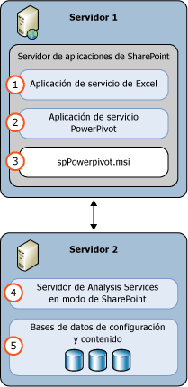

# Power Pivot para SharePoint (SSAS)
[!INCLUDE[ssas-appliesto-sqlas](../../includes/ssas-appliesto-sqlas.md)]
  Un servidor de [!INCLUDE[ssASnoversion](../../includes/ssasnoversion-md.md)] en modo [!INCLUDE[ssGemini](../../includes/ssgemini-md.md)] proporciona hospedaje de servidor de datos de [!INCLUDE[ssGemini](../../includes/ssgemini-md.md)] en una granja de servidores de SharePoint. [!INCLUDE[ssGemini](../../includes/ssgemini-md.md)] son un modelo de datos analíticos que se genera mediante uno de los siguientes procedimientos:  
  
-   El complemento de [!INCLUDE[ssGemini](../../includes/ssgemini-md.md)] para Excel 2010  
  
-   Excel 2013  
  
-   Excel 2016  
  
 **[!INCLUDE[applies](../../includes/applies-md.md)]**  [!INCLUDE[ssGeminiShort](../../includes/ssgeminishort-md.md)] 2016 | [!INCLUDE[ssGeminiShort](../../includes/ssgeminishort-md.md)] 2013  
  
 El hospedaje de servidor de esos datos requiere SharePoint, Excel Services y una instalación de [!INCLUDE[ssGemini](../../includes/ssgemini-md.md)] para SharePoint. Los datos se cargan en las instancias de [!INCLUDE[ssGemini](../../includes/ssgemini-md.md)] para SharePoint donde pueden actualizarse en los intervalos programados mediante la funcionalidad de actualización de datos de [!INCLUDE[ssGemini](../../includes/ssgemini-md.md)] que el servidor proporciona para los libros de Excel 2010 o que [!INCLUDE[ssGemini](../../includes/ssgemini-md.md)] proporciona para los libros de Excel 2013 y 2016.  
  
## Power Pivot para SharePoint 2016  
 [!INCLUDE[ssCurrent](../../includes/sscurrent-md.md)] [!INCLUDE[ssGeminiShort](../../includes/ssgeminishort-md.md)] admite el uso por parte de [!INCLUDE[msCoName](../../includes/msconame-md.md)] SharePoint 2016 y [!INCLUDE[offOnlineServer](../../includes/offonlineserver-md.md)] de libros de Excel que contienen modelos de datos e informes de Power View de [!INCLUDE[ssRSnoversion](../../includes/ssrsnoversion-md.md)] .  
  
 Excel, en [!INCLUDE[offOnlineServer](../../includes/offonlineserver-md.md)] , incluye funcionalidad de modelo de datos para habilitar la interacción con un libro [!INCLUDE[ssGemini](../../includes/ssgemini-md.md)] en el explorador. No es necesario implementar el complemento [!INCLUDE[ssGemini](../../includes/ssgemini-md.md)] para SharePoint 2016 en la granja de servidores. Solo tiene que instalar un servidor de [!INCLUDE[ssASnoversion](../../includes/ssasnoversion-md.md)] en modo [!INCLUDE[ssGemini](../../includes/ssgemini-md.md)] y registrar el servidor en [!INCLUDE[offOnlineServer](../../includes/offonlineserver-md.md)].  
  
 La implementación del complemento [!INCLUDE[ssGemini](../../includes/ssgemini-md.md)] para SharePoint 2016 habilita funcionalidad y características adicionales en la granja de servidores de SharePoint. Entre las características adicionales se incluyen la galería de [!INCLUDE[ssGemini](../../includes/ssgemini-md.md)] y la actualización de datos programada.  
  
   
  
## Power Pivot para SharePoint 2013  
 [!INCLUDE[ssCurrent](../../includes/sscurrent-md.md)] [!INCLUDE[ssGeminiShort](../../includes/ssgeminishort-md.md)] admite el uso por parte de Excel Services de [!INCLUDE[msCoName](../../includes/msconame-md.md)] SharePoint 2013 de libros de Excel que contienen modelos de datos e informes de Power View de [!INCLUDE[ssRSnoversion](../../includes/ssrsnoversion-md.md)] .  
  
 Excel Services en SharePoint 2013 incluye funcionalidad de modelo de datos para habilitar la interacción con un libro [!INCLUDE[ssGemini](../../includes/ssgemini-md.md)] en el explorador. No es necesario implementar el complemento [!INCLUDE[ssGemini](../../includes/ssgemini-md.md)] para SharePoint 2013 en la granja de servidores. Solo se necesita instalar un servidor [!INCLUDE[ssASnoversion](../../includes/ssasnoversion-md.md)] en modo de SharePoint y registrarlo dentro de la configuración de **Modelo de datos** de Excel Services.  
  
 La implementación del complemento [!INCLUDE[ssGemini](../../includes/ssgemini-md.md)] para SharePoint 2013 habilita funcionalidad y características adicionales en la granja de servidores de SharePoint. Entre las características adicionales se incluyen la galería de [!INCLUDE[ssGemini](../../includes/ssgemini-md.md)] , la actualización de datos programada y el panel de administración de [!INCLUDE[ssGemini](../../includes/ssgemini-md.md)] .  
  
   
  
##   En esta sección  
 [Administración y configuración del servidor de Power Pivot en Administración central](../../analysis-services/power-pivot-sharepoint/power-pivot-server-administration-and-configuration-in-central-administration.md)  
  
 [Configuración de Power Pivot mediante Windows PowerShell](../../analysis-services/power-pivot-sharepoint/power-pivot-configuration-using-windows-powershell.md)  
  
 [Herramientas de configuración de Power Pivot](../../analysis-services/power-pivot-sharepoint/power-pivot-configuration-tools.md)  
  
 [Autenticación y autorización de PowerPivot](../../analysis-services/power-pivot-sharepoint/power-pivot-authentication-and-authorization.md)  
  
 [Configuración de las reglas de mantenimiento de PowerPivot](../../analysis-services/power-pivot-sharepoint/configure-power-pivot-health-rules.md)  
  
 [Panel de administración de Power Pivot y datos de uso](../../analysis-services/power-pivot-sharepoint/power-pivot-management-dashboard-and-usage-data.md)  
  
 [Galería de PowerPivot](http://msdn.microsoft.com/library/2a0db616-e08e-4062-aac8-979f8cad7794)  
  
 [Acceso a datos PowerPivot](../../analysis-services/power-pivot-sharepoint/power-pivot-data-access.md)  
  
 [Actualización de datos PowerPivot](../../analysis-services/power-pivot-sharepoint/power-pivot-data-refresh.md)  
  
 [Fuentes de distribución de datos de PowerPivot](../../analysis-services/power-pivot-sharepoint/power-pivot-data-feeds.md)  
  
 [Conexión del modelo semántico de BI de PowerPivot &#40;.bism&#41;](../../analysis-services/power-pivot-sharepoint/power-pivot-bi-semantic-model-connection-bism.md)  
  
 **En otras secciones**  
  
## Temas adicionales  
 [Actualización de PowerPivot para SharePoint](../../database-engine/install-windows/upgrade-power-pivot-for-sharepoint.md)  
  
 [Instalación de Analysis Services en el modo PowerPivot](../../analysis-services/instances/install-windows/install-analysis-services-in-power-pivot-mode.md)  
  
 [Referencia de PowerShell para Power Pivot para SharePoint](../../analysis-services/powershell/powershell-reference-for-power-pivot-for-sharepoint.md)  
  
 [Costes y topologías de licencia de ejemplo de SQL Server 2016 Business Intelligence](http://msdn.microsoft.com/library/682b8711-407a-48d1-9807-415d4c24dad6)  
  
## Vea también  
 [Planeación e implementación de Power Pivot](http://go.microsoft.com/fwlink/?linkID=220972)   
 [Recuperación ante desastres de PowerPivot para SharePoint](http://go.microsoft.com/fwlink/p/?LinkId=389570)  
  
  
