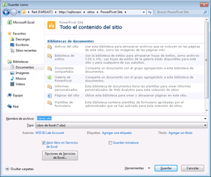

# Uso de la Galería de Power Pivot
  [!INCLUDE[ssGemini](../../includes/ssgemini-md.md)] es una biblioteca de documentos de SharePoint especial que permite obtener una eficaz vista previa y administrar los documentos de los libros de Excel publicados y los informes de Reporting Services que contienen datos de [!INCLUDE[ssGemini](../../includes/ssgemini-md.md)] .  
  
> [!NOTE]  
>  Según cómo esté configurado el servidor, podría ver mensajes de error o advertencia en el área de vista previa para documentos concretos. Los mensajes pueden aparecer cuando un libro de Excel se establece para actualizar sus datos automáticamente cada vez que se abre. Los mensajes de advertencia de actualización de datos aparecerán como imagen de vista previa si Servicios de Excel está configurado para mostrar mensajes de error de advertencia de actualización de datos. Los administradores de servicios o de la granja pueden modificar la configuración para permitir que aparezca una vista previa de la hoja de cálculo real. Para más información, vea [Create a trusted location for Power Pivot sites in Central Administration](../../analysis-services/power-pivot-sharepoint/create-a-trusted-location-for-power-pivot-sites-in-central-administration.md).  
  
##   En este tema  
 [Requisitos previos](#prereq)  
  
 [Iconos de la Galería de Power Pivot](#icons)  
  
 [Almacenamiento de un libro de Excel en la Galería de Power Pivot](#add)  
  
 [Creación de nuevos informes o libros basados en un libro Power Pivot publicado](#newdocs)  
  
 [Abrir un libro o informe en el modo de página completa](#view)  
  
 [Programar la actualización de datos para los libros Power Pivot publicados en la Galería de Power Pivot](#newdr)  
  
 [Eliminación de un libro o informe en la Galería de Power Pivot](#delete)  
  
 [Actualizar una imagen en miniatura](#image)  
  
 [Problemas conocidos](#bkmk_known_issues)  
  
##   Requisitos previos  
  
> [!NOTE]  
>  La Galería de Power Pivot requiere Microsoft Silverlight.  El navegador Microsoft Edge no es compatible con Silverlight.   
> Para ver el contenido de la biblioteca en Edge, haga clic en la pestaña **Biblioteca** de la Galería de Power Pivot y, luego, cambie la vista de la biblioteca de documentos a **Todos los documentos**.    
> Para cambiar la vista predeterminada, haga clic en la pestaña **Biblioteca** y, después, en Modificar vista. Haga clic en "Establecer esta vista como predeterminada" y, después, en Aceptar para guardar la vista predeterminada.  
>  Para obtener más información sobre la compatibilidad de Edge, consulte [A break from the past, part 2: Saying goodbye to ActiveX, VBScript...](https://blogs.windows.com/msedgedev/2015/05/06/a-break-from-the-past-part-2-saying-goodbye-to-activex-vbscript-attachevent/)en el blog de Windows.  
  
 Para obtener una lista completa de requisitos previos, consulte [Create and Customize Power Pivot Gallery](../../analysis-services/power-pivot-sharepoint/create-and-customize-power-pivot-gallery.md).  
  
##   Iconos de la Galería de Power Pivot  
 Los iconos proporcionan un indicador visual sobre la disponibilidad y el estado del contenido.  
  
|Icono|Description|  
|----------|-----------------|  
||El icono de reloj de arena aparece cuando se está generando una imagen en miniatura de cada página del documento. Actualice la página para mostrar la actualización la imagen.|  
||El icono de páginas aparece cuando un libro o el informe tiene más páginas de las que se pueden mostrar en la Galería de [!INCLUDE[ssGemini](../../includes/ssgemini-md.md)] . Para ver todas las páginas, debe usar una aplicación cliente.|  
||El icono de error aparece cuando no se pudo representar una imagen en miniatura para el documento. El documento se publica en la biblioteca, pero no se puede representar en las vistas personalizadas de la Galería de [!INCLUDE[ssGemini](../../includes/ssgemini-md.md)] . Debe poder ver el documento en una aplicación cliente, por ejemplo, el complemento [!INCLUDE[ssGemini](../../includes/ssgemini-md.md)] para Excel.|  
||El icono de contenido no disponible aparece cuando el documento que ha cargado no se puede representar en la Galería de [!INCLUDE[ssGemini](../../includes/ssgemini-md.md)] . Los tipos de documento compatibles son los libros [!INCLUDE[ssGemini](../../includes/ssgemini-md.md)] y los informes creados en el Generador de informes de SQL Server 2008 R2 Reporting Services.   Este icono también aparece si recicla un documento desde la Papelera de reciclaje.   Si va a obtener este icono para un documento que antes presentó una imagen de vista previa válida, puede actualizar la imagen modificando una propiedad de documento y guardando sus cambios a continuación.|  
||El icono de contenido bloqueado aparece cuando las imágenes en miniatura se deshabilitan deliberadamente para este documento. [!INCLUDE[ssGemini](../../includes/ssgemini-md.md)] no genera imágenes en miniatura para los libros de Excel que no contienen ningún dato de [!INCLUDE[ssGemini](../../includes/ssgemini-md.md)] o para los libros [!INCLUDE[ssGemini](../../includes/ssgemini-md.md)] o los informes de Reporting Services que no cumplen los requisitos para la generación de instantáneas. Para obtener más información, vea la sección Requisitos previos en este tema.|  
  
##   Almacenamiento de un libro de Excel en la Galería de Power Pivot  
 Puede publicar libros [!INCLUDE[ssGemini](../../includes/ssgemini-md.md)] en la biblioteca mediante todas las técnicas de uso compartido que Excel 2010 proporciona. Por ejemplo, en Excel 2010, puede utilizar Guardar como para especificar toda o parte de una ruta de acceso de SharePoint a una biblioteca.  
  
1.  Guarde el archivo.  
  
2.  1.  **Excel 2010:** en el menú Archivo, haga clic en **Guardar y enviar**.  
  
    2.  Haga clic en **Guardar en SharePoint**.  
  
    3.  Haga clic en **Opciones de publicación** si desea usar Opciones de Excel Services para seleccionar hojas o parámetros individuales que desee publicar. Por ejemplo, la pestaña Parámetros de Opciones de Excel Services le permite elegir qué segmentaciones de datos aparecen en el libro publicado.  
  
    1.  **Excel 2013**  : en el menú Archivo, haga clic en **Guardar**.  
  
    2.  Haga clic en **Opciones de vista de explorador** si desea usar Opciones de Excel Services para seleccionar hojas o parámetros individuales que desee publicar. Por ejemplo, la pestaña Parámetros de Opciones de Excel Services le permite elegir qué segmentaciones de datos aparecen en el libro publicado.  
  
3.  En el cuadro de diálogo Guardar como, en Nombre de archivo, escriba una dirección URL completa o parcial para la Galería de [!INCLUDE[ssGemini](../../includes/ssgemini-md.md)] . Si escribe una parte de la dirección URL, como el nombre del servidor, puede examinar el sitio para encontrar la Galería de [!INCLUDE[ssGemini](../../includes/ssgemini-md.md)] . Para ello, haga clic en **Guardar** para abrir una conexión al servidor que especificó.  
  
       
  
1.  Con el cuadro de diálogo Guardar como, seleccione la Galería de [!INCLUDE[ssGemini](../../includes/ssgemini-md.md)] del sitio.  
  
2.  Haga clic en **Abrir** para abrir la biblioteca.  
  
3.  Haga clic en **Guardar** para publicar el libro en la biblioteca.  
  
 En una ventana del explorador, compruebe que el documento aparece en la Galería de [!INCLUDE[ssGemini](../../includes/ssgemini-md.md)] . Los documentos publicados recientemente aparecerán en la lista. La configuración de la biblioteca determina dónde aparece el documento (por ejemplo, clasificado en orden ascendente por fecha o alfabéticamente por nombre). Podría necesitar actualizar la ventana del explorador para ver las incorporaciones más recientes.  
  
#### Carga de un libro en la Galería de Power Pivot  
 También puede cargar un libro si desea partir de SharePoint y seleccionar en el equipo qué archivo publicar.  
  
1.  En un sitio de SharePoint, abra la Galería de [!INCLUDE[ssGemini](../../includes/ssgemini-md.md)] .  
  
2.  En la cinta de opciones Biblioteca, haga clic en **Documentos**.  
  
3.  En **Cargar documento**, seleccione una opción de carga y, a continuación, escriba el nombre y la ubicación del archivo que desea cargar. La configuración de la biblioteca determina dónde aparece el documento. Puede que tenga que actualizar la ventana del explorador para ver la incorporación más reciente.  
  
##   Creación de nuevos informes o libros basados en un libro Power Pivot publicado  
 En el caso de los libros de [!INCLUDE[ssGemini](../../includes/ssgemini-md.md)] que publique en la Galería de [!INCLUDE[ssGemini](../../includes/ssgemini-md.md)] , puede crear libros adicionales o informes de Reporting Services que usen el libro publicado como origen de datos conectado.  
  
|||  
|-|-|  
||Haga clic en la parte de la flecha descendente del botón Nuevo informe para iniciar el Generador de informes o Excel 2010. [!INCLUDE[ssGemini](../../includes/ssgemini-md.md)] La Galería debe usar una de las vistas prediseñadas (Teatro, Galería o Carrusel) para que el botón Nuevo informe esté disponible.|  
  
#### Crear un informe con el Generador de informes  
 Crear un nuevo informe basado en un libro [!INCLUDE[ssGemini](../../includes/ssgemini-md.md)] existente en la biblioteca requiere que Reporting Services esté configurado para la integración de SharePoint para los mismos sitios que contienen la Galería de [!INCLUDE[ssGemini](../../includes/ssgemini-md.md)] . Al seleccionar la opción Crear informe del Generador de informes, este se descarga del servidor de informes y se instala en la estación de trabajo local cuando se usa por primera vez. Se crea un archivo de informe del marcador de posición para el nuevo informe y se guarda en la Galería de [!INCLUDE[ssGemini](../../includes/ssgemini-md.md)] . La información de conexión al libro [!INCLUDE[ssGemini](../../includes/ssgemini-md.md)] se crea automáticamente como un nuevo origen de datos en el informe. Como paso siguiente, puede integrar los conjuntos de datos y el diseño del informe en el área de trabajo de diseño. Cuando use el Generador de informes para ensamblar un informe, puede guardar los cambios y el resultado final en el documento de informe, en la galería. Para evitar desconexiones de datos posteriores, asegúrese de mantener unidos los archivos de libro e informe en la misma biblioteca.  
  
#### Abrir nuevo libro de Excel  
 Para crear un nuevo libro de Excel a partir de un libro existente, ya debe tener Excel y [!INCLUDE[ssGeminiClient](../../includes/ssgeminiclient-md.md)] en el equipo local. Al elegir Abrir nuevo libro de Excel se inicia Excel, se abre un archivo de libro en blanco (.xlsx) y se cargan en segundo plano los datos de [!INCLUDE[ssGemini](../../includes/ssgemini-md.md)] como un origen de datos conectado. En el libro nuevo solo se utilizan los datos de la ventana de [!INCLUDE[ssGemini](../../includes/ssgemini-md.md)] del libro original. Se excluyen las tablas dinámicas o los gráficos dinámicos del libro original. El nuevo libro se vincula a los datos del libro original. Los datos no se copian en el nuevo libro.  
  
##   Abrir un libro o informe en el modo de página completa  
 Haga clic en cualquier imagen en miniatura visible del documento del que se ha obtenido la vista previa para abrirlo en el modo de página completa, independientemente de la vista previa de la Galería de [!INCLUDE[ssGemini](../../includes/ssgemini-md.md)] . [!INCLUDE[ssGemini](../../includes/ssgemini-md.md)] se abrirán en un explorador. Los informes de Reporting Services se abrirán en el componente web del visor de informes que forma parte de la implementación de Reporting Services en un servidor de SharePoint.  
  
 Una solución alternativa a ver el libro en un explorador es abrirlo en Excel en una estación de trabajo del cliente. Debe tener Excel 2013 o Excel 2010 y el complemento [!INCLUDE[ssGeminiClient](../../includes/ssgeminiclient-md.md)] para ver el archivo. Puede utilizar Excel 2007 para abrir el archivo, pero no puede utilizarlo para dinamizar los datos. Por esta razón se recomienda Excel 2013 o Excel 2010 tanto para ver como para crear datos de [!INCLUDE[ssGemini](../../includes/ssgemini-md.md)] . Si no tiene las aplicaciones necesarias, debe utilizar un explorador para ver el libro de SharePoint.  
  
##   Programar la actualización de datos para los libros Power Pivot publicados en la Galería de Power Pivot  
 [!INCLUDE[ssGemini](../../includes/ssgemini-md.md)] en un libro de Excel publicado pueden actualizarse a los intervalos programados.  
  
|||  
|-|-|  
||Haga clic en el botón Administrar datos para crear o ver una programación que recupere los datos actualizados de los orígenes de datos conectados. Para obtener instrucciones sobre cómo crear una programación, vea [Programar una actualización de datos (PowerPivot para SharePoint)](http://msdn.microsoft.com/en-us/8571208f-6aae-4058-83c6-9f916f5e2f9b).|  
  
##   Eliminación de un libro o informe en la Galería de Power Pivot  
 Para eliminar un documento de la biblioteca, cambie primero a la vista Todos los documentos.  
  
1.  En un sitio de SharePoint, abra la Galería de [!INCLUDE[ssGemini](../../includes/ssgemini-md.md)] .  
  
2.  En la cinta de opciones, haga clic en **Biblioteca**.  
  
3.  En Administrar vistas, en la lista Vista actual, haga clic en la flecha abajo y seleccione Todos los documentos.  
  
4.  Seleccione el libro o informe que desea eliminar.  
  
5.  En Documentos (archivos), en Administrar, haga clic en el botón **Eliminar documento** .  
  
##   Actualizar una imagen en miniatura  
 Utilice los siguientes pasos para regenerar una imagen en miniatura para un documento de la Galería de [!INCLUDE[ssGemini](../../includes/ssgemini-md.md)] .  
  
1.  Cambie la Galería de [!INCLUDE[ssGemini](../../includes/ssgemini-md.md)] a la vista Todos los documentos. Para ello, haga clic en **Biblioteca** en la cinta de opciones y cambie la **Vista Actual** a **Todos los documentos**.  
  
2.  Seleccione el libro o informe para el que desea actualizar la imagen en miniatura.  
  
3.  Haga clic en la flecha abajo a la derecha y seleccione **Modificar propiedades**.  
  
4.  Haga clic en **Guardar**. Al guardar el documento, obliga al servicio de instantánea a regenerar la imagen de vista previa.  
  
##   Problemas conocidos  
  
### El tipo de documento no se admite  
 No se admite el tipo de contenido **Documento de Galería de [!INCLUDE[ssGemini](../../includes/ssgemini-md.md)]**. Si habilita el tipo de contenido **Documento de Galería de [!INCLUDE[ssGemini](../../includes/ssgemini-md.md)]** para una biblioteca de documentos e intenta crear un documento de ese tipo, verá un mensaje de error similar al siguiente:  
  
-   'Nuevo documento' requiere una aplicación compatible con Microsoft Sharepoint Foundation y un explorador web. Para agregar un documento a esta biblioteca de documentos, haga clic en el botón 'Cargar documento'.  
  
-   "La dirección de Internet 'http://[nombre de servidor]/testSite/PowerPivot Gallery/ReportGallery/Forms/Template.xlsx' no es válida."“Microsoft Excel no puede obtener acceso al archivo 'http://[nombre de servidor]/testSite/PowerPivot Gallery/ReportGallery/Forms/Template.xlsx'. Existen varias razones posibles:  
  
 El tipo de contenido **Documento de Galería de [!INCLUDE[ssGemini](../../includes/ssgemini-md.md)]** no se agrega automáticamente a las bibliotecas de documentos. No encontrará este problema a menos que habilite manualmente el tipo de contenido no admitido.  
  
## Vea también  
 [Create a trusted location for Power Pivot sites in Central Administration](../../analysis-services/power-pivot-sharepoint/create-a-trusted-location-for-power-pivot-sites-in-central-administration.md)   
 [Eliminar galería de PowerPivot](../../analysis-services/power-pivot-sharepoint/delete-power-pivot-gallery.md)   
 [Crear y personalizar la Galería de PowerPivot](../../analysis-services/power-pivot-sharepoint/create-and-customize-power-pivot-gallery.md)   
 [Programar una actualización de datos (Power Pivot para SharePoint)](http://msdn.microsoft.com/en-us/8571208f-6aae-4058-83c6-9f916f5e2f9b)  
  
  
