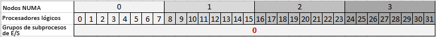
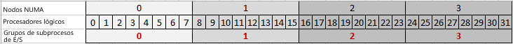
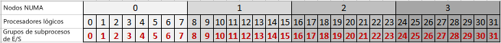

# Propiedades de grupos de subprocesos
  [!INCLUDE[ssASnoversion](../../includes/ssasnoversion-md.md)] usa el subprocesamiento múltiple para realizar muchas operaciones, mejorando el rendimiento global del servidor al ejecutar varios trabajos en paralelo. Para administrar los subprocesos de manera más eficaz, [!INCLUDE[ssASnoversion](../../includes/ssasnoversion-md.md)] utiliza grupos de subprocesos para preasignar subprocesos y facilitar la disponibilidad de subprocesos para el trabajo siguiente.  
  
 Cada instancia de [!INCLUDE[ssASnoversion](../../includes/ssasnoversion-md.md)] mantiene su propio conjunto de grupos de subprocesos. Hay diferencias en la forma en que las instancias tabulares y multidimensionales usan los grupos de subprocesos. Por ejemplo, solo las instancias multidimensionales usan el grupo de subprocesos **IOProcess** . Por tanto, la propiedad **PerNumaNode** , que se describe en este tema, no es significativa para las instancias tabulares. En la sección [Referencia de propiedad](#bkmk_propref) siguiente, se llama a los requisitos de modo de cada propiedad.
  
 Este tema contiene las siguientes secciones:  
  
-   [Administración de subprocesos en Analysis Services](#bkmk_threadarch)  
  
-   [Referencia de propiedades de grupos de subprocesos](#bkmk_propref)  
  
-   [Configurar GroupAffinity para establecer afinidad entre subprocesos y procesadores en un grupo de procesadores](#bkmk_groupaffinity)  
  
-   [Establecer PerNumaNode para crear subprocesos de E/S con afinidad con un nodo NUMA](#bkmk_pernumanode)  
  
-   [Determinar la configuración del grupo de subprocesos actual](#bkmk_currentsettings)  
  
-   [Propiedades dependientes o relacionadas](#bkmk_related)  
  
-   [Acerca de MSMDSRV.INI](#bkmk_msmdrsrvini)  
  
> [!NOTE]  
>  La implementación tabular en sistemas NUMA queda fuera del ámbito de este tema. Aunque las soluciones tabulares se pueden implementar correctamente en sistemas NUMA, las características de rendimiento de la tecnología de base de datos en memoria que utilizan los modelos tabulares pueden presentar ventajas limitadas en las arquitecturas con mucho escalado vertical. Para más información, vea [Analysis Services Case Study: Using Tabular Models in Large-scale Commercial Solutions (Caso práctico de Analysis Services: uso de modelos tabulares en soluciones comerciales a gran escala)](http://msdn.microsoft.com/library/dn751533.aspx) y [Hardware Sizing a Tabular Solution (Ajuste de tamaño del hardware en una solución tabular)](http://go.microsoft.com/fwlink/?LinkId=330359).  
  
##   Administración de subprocesos en Analysis Services  
 [!INCLUDE[ssASnoversion](../../includes/ssasnoversion-md.md)] usa el subprocesamiento múltiple para aprovechar los recursos de CPU disponibles al aumentar el número de tareas que se ejecutan en paralelo. El motor de almacenamiento es multiproceso. Algunos ejemplos de trabajos multiproceso que se ejecutan dentro del motor de almacenamiento son el procesamiento de objetos en paralelo, el control de consultas discretas que se han insertado en el motor de almacenamiento o la devolución de valores de datos solicitados por una consulta. El motor de fórmulas, debido a la naturaleza serie de los cálculos que evalúa, es de subproceso único. Cada consulta se ejecuta principalmente en un solo subproceso, solicitando y esperando a menudo los datos devueltos por el motor de almacenamiento. Los subprocesos de consulta tienen ejecuciones más largas y solo se liberan cuando se completa toda la consulta.  
  
 De forma predeterminada, en las versiones [!INCLUDE[ssSQL11](../../includes/sssql11-md.md)] y posteriores, [!INCLUDE[ssASnoversion](../../includes/ssasnoversion-md.md)] utilizará todos los procesadores lógicos disponibles, hasta 640 en los sistemas que ejecutan ediciones superiores de Windows y SQL Server. En el inicio, el proceso msmdsrv.exe se asignará a un grupo de procesadores específico, pero con el tiempo se pueden programar los subprocesos en cualquier procesador lógico, en cualquier grupo de procesadores.  
  
 Un efecto secundario del uso de un gran número de procesadores es que a veces puede experimentar una degradación del rendimiento a medida que las cargas de consulta y de procesamiento se reparten entre un gran número de procesadores y la contención de las estructuras de datos compartidos aumenta. Esto puede ocurrir especialmente en sistemas de tecnología avanzada que utilizan la arquitectura NUMA, pero también en sistemas no NUMA que ejecutan aplicaciones que usan muchos datos en el mismo hardware.  
  
 Para mitigar este problema, puede establecer afinidad entre tipos de operaciones de [!INCLUDE[ssASnoversion](../../includes/ssasnoversion-md.md)] y un conjunto específico de procesadores lógicos. La propiedad **GroupAffinity** permite crear máscaras de afinidad personalizadas que especifican qué recurso del sistema se utilizará para cada uno de los tipos de grupos de subprocesos administrados por [!INCLUDE[ssASnoversion](../../includes/ssasnoversion-md.md)].
 
Se recomienda la actualización acumulativa 1 (CU1) para SQL Server 2016 o posterior para la configuración de **GroupAffinity** en las instancias tabulares. 
  
 **GroupAffinity** es una propiedad que se puede establecer en cualquiera de los grupos de subprocesos usados para varias cargas de trabajo de [!INCLUDE[ssASnoversion](../../includes/ssasnoversion-md.md)] :  
  
-   **ThreadPool \ Parsing \ Short**  es un grupo de análisis para solicitudes cortas. Las solicitudes que caben dentro de un único mensaje de red se consideran cortas. 
  
-   **ThreadPool \ Parsing \ Long**  es un grupo de análisis para todas las demás solicitudes que no caben dentro de un único mensaje de red. 
  
    > [!NOTE]  
    >  Se puede utilizar un subproceso de un grupo de análisis para ejecutar una consulta. Las consultas que se ejecutan con rapidez, como una solicitud rápida Discover o Cancel, a veces se ejecutan inmediatamente en lugar de ponerse en cola en el grupo de subprocesos Query. 
  
-   **ThreadPool \ Query** es el grupo de subprocesos que ejecuta todas las solicitudes no administradas por el grupo de subprocesos de análisis. Los subprocesos de este grupo de subprocesos ejecutarán todos los tipos de operaciones, como comandos Discover, MDX, DAX, DMX y DDL. A
  
-   **ThreadPool \ IOProcess** se usa para los trabajos de E/S asociados a las consultas del motor de almacenamiento en el motor multidimensional. Se espera que el trabajo realizado por estos subprocesos no tenga dependencias de otros subprocesos. Normalmente, estos subprocesos analizarán un único segmento de una partición y realizarán el filtrado y la agregación de los datos del segmento. Los subprocesos de**IOProcess** son especialmente sensibles a las configuraciones de hardware NUMA. Por tanto, este grupo de subprocesos tiene la propiedad de configuración **PerNumaNode** , que se puede utilizar para optimizar el rendimiento si es necesario. 
  
-   **ThreadPool \ Process** es para trabajos más largos del motor de almacenamiento, incluidas agregaciones, indexación y operaciones de confirmación. El modo de almacenamiento ROLAP utiliza subprocesos del grupo de subprocesos Processing.  

- **VertiPaq \ ThreadPool** es el grupo de subprocesos para ejecutar recorridos de tabla en un modelo tabular.
  
 Para atender solicitudes, [!INCLUDE[ssASnoversion](../../includes/ssasnoversion-md.md)] puede superar el límite máximo de grupos de subprocesos, solicitando subprocesos adicionales si es necesario para realizar el trabajo. Sin embargo, cuando un subproceso termina de ejecutar su tarea, si el número actual de subprocesos es mayor que el límite máximo, el subproceso finaliza simplemente, en lugar de volver al grupo de subprocesos.  
  
> [!NOTE]  
>  Superar el número máximo de grupos de subprocesos es una protección que solo se invoca cuando surgen determinadas condiciones de interbloqueo. Para evitar la creación descontrolada de subprocesos más allá del máximo, los subprocesos se crean gradualmente (después de un breve retraso) una vez que se ha alcanzado el límite máximo. Superar el número máximo de subprocesos puede provocar una ralentización de la ejecución de la tarea. Si los contadores de rendimiento muestran que los números de subprocesos superan periódicamente el tamaño máximo del grupo de subprocesos, puede considerarlo como un indicador de que los tamaños de los grupos de subprocesos son demasiado pequeños para el grado de simultaneidad que se solicita al sistema.  
  
 De forma predeterminada, el tamaño del grupo de subprocesos lo determina [!INCLUDE[ssASnoversion](../../includes/ssasnoversion-md.md)]y depende del número de núcleos. Puede observar los valores predeterminados seleccionados si examina el archivo msmdsrv.log después de iniciarse el servidor. Como ejercicio de optimización del rendimiento, puede elegir aumentar el tamaño del grupo de subprocesos, así como otras propiedades, para mejorar el rendimiento de consultas o de procesamiento.  
  
##   Referencia de propiedades de grupos de subprocesos  
 En esta sección se describen las propiedades del grupo de subprocesos que se encuentran en el archivo msmdsrv.ini de cada instancia de [!INCLUDE[ssASnoversion](../../includes/ssasnoversion-md.md)] . Un subconjunto de estas propiedades también aparece en SQL Server Management Studio.  
  
 Las propiedades se muestran en orden alfabético.  
  
|Nombre|Tipo|Description|Valor predeterminado|Instrucciones|  
|----------|----------|-----------------|-------------|--------------|  
|**IOProcess** \ **Concurrency**|double|Valor de punto flotante de doble precisión que determina el algoritmo para establecer un destino en el número de subprocesos que se pueden poner en cola al mismo tiempo.|2.0|Una propiedad avanzada que no debería cambiar, salvo a petición de expertos en soporte técnico de [!INCLUDE[msCoName](../../includes/msconame-md.md)] .   Se utiliza simultaneidad para inicializar grupos de subprocesos, que se implementan utilizando puertos de terminación de E/S en Windows. Vea [I/O Completion Ports (Puertos de terminación de E/S)](http://msdn.microsoft.com/library/windows/desktop/aa365198\(v=vs.85\).aspx) para obtener más detalles.   Se aplica solo a modelos multidimensionales.|  
|**IOProcess** \ **GroupAffinity**|string|Matriz de valores hexadecimales correspondientes a los grupos de procesadores en el sistema, que se usa para establecer la afinidad de los subprocesos en el grupo de subprocesos IOProcess y los procesadores lógicos de cada grupo de procesadores.|none|Puede utilizar esta propiedad para crear afinidades personalizadas. La propiedad está vacía de forma predeterminada.   Vea [Configurar GroupAffinity para establecer afinidad entre subprocesos y procesadores en un grupo de procesadores](#bkmk_groupaffinity) para obtener más detalles.   Se aplica solo a modelos multidimensionales.|  
|**IOProcess** \ **MaxThreads**|int|Entero de 32 bits con signo que especifica el número máximo de subprocesos que se van a incluir en el grupo de subprocesos.|0|0 indica que el servidor determina los valores predeterminados. De forma predeterminada, el servidor establece este valor en 64 o en 10 veces el número de procesadores lógicos, lo que sea mayor. Por ejemplo, en un sistema de 4 núcleos con hyperthreading, el valor máximo de un grupo de subprocesos es 80 subprocesos.   Si establece este valor en un valor negativo, el servidor multiplica ese valor por el número de procesadores lógicos. Por ejemplo, cuando se establece en -10 en un servidor que tiene 32 procesadores lógicos, el valor máximo es 320 subprocesos.   El valor máximo está sujeto a los procesadores disponibles para cualquier máscara de afinidad personalizada que definiera previamente. Por ejemplo, si ya ha establecido la afinidad del grupo de subprocesos para que utilice 8 procesadores de 32 y ahora establece MaxThreads en -10, el límite superior del grupo de subprocesos sería 10 por 8, o 80 subprocesos.   Los valores reales utilizados para esta propiedad del grupo de subprocesos se escriben en el archivo de registro de msmdsrv al iniciarse el servicio.   Para obtener más información sobre la optimización de los valores del grupo de subprocesos, vea la [Guía de operaciones de Analysis Services](http://msdn.microsoft.com/library/hh226085.aspx).   Se aplica solo a modelos multidimensionales.|  
|**IOProcess** \ **MinThreads**|int|Entero de 32 bits con signo que especifica el número mínimo de subprocesos que se van a preasignar para el grupo de subprocesos.|0|0 indica que el servidor determina los valores predeterminados. De forma predeterminada, el valor mínimo es 1.   Si establece este valor en un valor negativo, el servidor multiplica ese valor por el número de procesadores lógicos.   Los valores reales utilizados para esta propiedad del grupo de subprocesos se escriben en el archivo de registro de msmdsrv al iniciarse el servicio.   Para obtener más información sobre la optimización de los valores del grupo de subprocesos, vea la [Guía de operaciones de Analysis Services](http://msdn.microsoft.com/library/hh226085.aspx).   Se aplica solo a modelos multidimensionales.|  
|**IOProcess** \ **PerNumaNode**|int|Entero de 32 bits con signo que determina el número de grupos de subprocesos creados para el proceso msmdsrv.|-1|Los valores válidos son -1, 0, 1, 2.   -1 = El servidor selecciona otra estrategia de grupos de subprocesos de E/S según el número de nodos NUMA. En los sistemas que tienen menos de 4 nodos NUMA, el comportamiento del servidor es igual que cuando es 0 (se crea un grupo de subprocesos IOProcess para el sistema). En los sistemas que tienen 4 o más nodos, el comportamiento es igual que cuando es 1 (se crean grupos de subprocesos IOProcess para cada nodo).   0 = Deshabilita los grupos de subprocesos según los nodos NUMA para que el proceso msmdsrv.exe solo utilice un grupo de subprocesos de IOProcess.   1 = Habilita un grupo de subprocesos de IOProcess por nodo NUMA.   2 = Un grupo de subprocesos de IOProcess por procesador lógico. Se establece afinidad entre los subprocesos de cada grupo de subprocesos y el nodo NUMA del procesador lógico, estableciéndose el procesador ideal en el procesador lógico.   Vea [Establecer PerNumaNode para crear subprocesos de E/S con afinidad con un nodo NUMA](#bkmk_pernumanode) para obtener más detalles.   Se aplica solo a modelos multidimensionales.|  
|**IOProcess** \ **PriorityRatio**|int|Entero de 32 bits con signo que se puede utilizar para asegurarse que los subprocesos con menor prioridad se ejecutan en ocasiones incluso aunque una cola con mayor prioridad no esté vacía.|2|Una propiedad avanzada que no debería cambiar, salvo a petición de expertos en soporte técnico de [!INCLUDE[msCoName](../../includes/msconame-md.md)] .   Se aplica solo a modelos multidimensionales.|  
|**IOProcess** \ **StackSizeKB**|int|Entero de 32 bits con signo que se puede usar para ajustar la asignación de memoria durante la ejecución de subprocesos.|0|Una propiedad avanzada que no debería cambiar, salvo a petición de expertos en soporte técnico de [!INCLUDE[msCoName](../../includes/msconame-md.md)] .   Se aplica solo a modelos multidimensionales.|  
|**Parsing**  \ **Long** \ **Concurrency**|double|Valor de punto flotante de doble precisión que determina el algoritmo para establecer un destino en el número de subprocesos que se pueden poner en cola al mismo tiempo.|2.0|Una propiedad avanzada que no debería cambiar, salvo a petición de expertos en soporte técnico de [!INCLUDE[msCoName](../../includes/msconame-md.md)] .   Se utiliza simultaneidad para inicializar grupos de subprocesos, que se implementan utilizando puertos de terminación de E/S en Windows. Vea [I/O Completion Ports (Puertos de terminación de E/S)](http://msdn.microsoft.com/library/windows/desktop/aa365198\(v=vs.85\).aspx) para obtener más detalles.|  
|**Parsing**  \ **Long** \ **GroupAffinity**|string|Una matriz de valores hexadecimales correspondientes a los grupos de procesadores del sistema, que se usa para establecer la afinidad de los subprocesos de análisis y los procesadores lógicos en cada grupo de procesadores.|none|Puede utilizar esta propiedad para crear afinidades personalizadas. La propiedad está vacía de forma predeterminada.   Vea [Configurar GroupAffinity para establecer afinidad entre subprocesos y procesadores en un grupo de procesadores](#bkmk_groupaffinity) para obtener más detalles.|  
|**Parsing**  \ **Long** \ **NumThreads**|int|Propiedad de entero de 32 bits con signo que define el número de subprocesos que se pueden crear para los comandos largos.|0|0 indica que el servidor determina los valores predeterminados. El comportamiento predeterminado es establecer **NumThreads** en un valor absoluto de 4, o 2 veces el número de procesadores lógicos, lo que sea mayor.   Si establece este valor en un valor negativo, el servidor multiplica ese valor por el número de procesadores lógicos. Por ejemplo, cuando se establece en -10 en un servidor que tiene 32 procesadores lógicos, el valor máximo es 320 subprocesos.   El valor máximo está sujeto a los procesadores disponibles para cualquier máscara de afinidad personalizada que definiera previamente. Por ejemplo, si ya ha establecido la afinidad del grupo de subprocesos para que utilice 8 procesadores de 32 y ahora establece NumThreads en -10, el límite superior del grupo de subprocesos sería 10 por 8, u 80 subprocesos.   Los valores reales utilizados para esta propiedad del grupo de subprocesos se escriben en el archivo de registro de msmdsrv al iniciarse el servicio.|  
|**Parsing**  \ **Long** \ **PriorityRatio**|int|Entero de 32 bits con signo que se puede utilizar para asegurarse que los subprocesos con menor prioridad se ejecutan en ocasiones incluso aunque una cola con mayor prioridad no esté vacía.|0|Una propiedad avanzada que no debería cambiar, salvo a petición de expertos en soporte técnico de [!INCLUDE[msCoName](../../includes/msconame-md.md)] .|  
|**Parsing**  \ **Long** \ **StackSizeKB**|int|Entero de 32 bits con signo que se puede usar para ajustar la asignación de memoria durante la ejecución de subprocesos.|0|Una propiedad avanzada que no debería cambiar, salvo a petición de expertos en soporte técnico de [!INCLUDE[msCoName](../../includes/msconame-md.md)] .|  
|**Parsing**  \ **Short** \ **Concurrency**|double|Valor de punto flotante de doble precisión que determina el algoritmo para establecer un destino en el número de subprocesos que se pueden poner en cola al mismo tiempo.|2.0|Una propiedad avanzada que no debería cambiar, salvo a petición de expertos en soporte técnico de [!INCLUDE[msCoName](../../includes/msconame-md.md)] .   Se utiliza simultaneidad para inicializar grupos de subprocesos, que se implementan utilizando puertos de terminación de E/S en Windows. Vea [I/O Completion Ports (Puertos de terminación de E/S)](http://msdn.microsoft.com/library/windows/desktop/aa365198\(v=vs.85\).aspx) para obtener más detalles.|  
|**Parsing**  \ **Short** \ **GroupAffinity**|string|Una matriz de valores hexadecimales correspondientes a los grupos de procesadores del sistema, que se usa para establecer la afinidad de los subprocesos de análisis y los procesadores lógicos en cada grupo de procesadores.|none|Puede utilizar esta propiedad para crear afinidades personalizadas. La propiedad está vacía de forma predeterminada.   Vea [Configurar GroupAffinity para establecer afinidad entre subprocesos y procesadores en un grupo de procesadores](#bkmk_groupaffinity) para obtener más detalles.|  
|**Parsing**  \ **Short** \ **NumThreads**|int|Propiedad de entero de 32 bits con signo que define el número de subprocesos que se pueden crear para los comandos cortos.|0|0 indica que el servidor determina los valores predeterminados. El comportamiento predeterminado es establecer **NumThreads** en un valor absoluto de 4, o 2 veces el número de procesadores lógicos, lo que sea mayor.   Si establece este valor en un valor negativo, el servidor multiplica ese valor por el número de procesadores lógicos. Por ejemplo, cuando se establece en -10 en un servidor que tiene 32 procesadores lógicos, el valor máximo es 320 subprocesos.   El valor máximo está sujeto a los procesadores disponibles para cualquier máscara de afinidad personalizada que definiera previamente. Por ejemplo, si ya ha establecido la afinidad del grupo de subprocesos para que utilice 8 procesadores de 32 y ahora establece NumThreads en -10, el límite superior del grupo de subprocesos sería 10 por 8, u 80 subprocesos.   Los valores reales utilizados para esta propiedad del grupo de subprocesos se escriben en el archivo de registro de msmdsrv al iniciarse el servicio.|  
|**Parsing**  \ **Short** \ **PriorityRatio**|int|Entero de 32 bits con signo que se puede utilizar para asegurarse que los subprocesos con menor prioridad se ejecutan en ocasiones incluso aunque una cola con mayor prioridad no esté vacía.|0|Una propiedad avanzada que no debería cambiar, salvo a petición de expertos en soporte técnico de [!INCLUDE[msCoName](../../includes/msconame-md.md)] .|  
|**Parsing**  \ **Short** \ **StackSizeKB**|int|Entero de 32 bits con signo que se puede usar para ajustar la asignación de memoria durante la ejecución de subprocesos.|64 * procesadores lógicos|Una propiedad avanzada que no debería cambiar, salvo a petición de expertos en soporte técnico de [!INCLUDE[msCoName](../../includes/msconame-md.md)] .|  
|**Process** \ **Concurrency**|double|Valor de punto flotante de doble precisión que determina el algoritmo para establecer un destino en el número de subprocesos que se pueden poner en cola al mismo tiempo.|2.0|Una propiedad avanzada que no debería cambiar, salvo a petición de expertos en soporte técnico de [!INCLUDE[msCoName](../../includes/msconame-md.md)] .   Se utiliza simultaneidad para inicializar grupos de subprocesos, que se implementan utilizando puertos de terminación de E/S en Windows. Vea [I/O Completion Ports (Puertos de terminación de E/S)](http://msdn.microsoft.com/library/windows/desktop/aa365198\(v=vs.85\).aspx) para obtener más detalles.|  
|**Process** \ **GroupAffinity**|string|Matriz de valores hexadecimales correspondientes a los grupos de procesadores en el sistema, que se usa para establecer la afinidad de los subprocesos de procesamiento y los procesadores lógicos en cada grupo de procesadores.|none|Puede utilizar esta propiedad para crear afinidades personalizadas. La propiedad está vacía de forma predeterminada.   Vea [Configurar GroupAffinity para establecer afinidad entre subprocesos y procesadores en un grupo de procesadores](#bkmk_groupaffinity) para obtener más detalles.|  
|**Process** \ **MaxThreads**|int|Entero de 32 bits con signo que especifica el número máximo de subprocesos que se van a incluir en el grupo de subprocesos.|0|0 indica que el servidor determina los valores predeterminados. De forma predeterminada, el servidor establece este valor en un valor absoluto de 64, o el número de procesadores lógicos, lo que sea mayor. Por ejemplo, en un sistema de 64 núcleos con hyperthreading habilitado (lo que genera 128 procesadores lógicos), el máximo del grupo de subprocesos es 128 subprocesos.   Si establece este valor en un valor negativo, el servidor multiplica ese valor por el número de procesadores lógicos. Por ejemplo, cuando se establece en -10 en un servidor que tiene 32 procesadores lógicos, el valor máximo es 320 subprocesos.   El valor máximo está sujeto a los procesadores disponibles para cualquier máscara de afinidad personalizada que definiera previamente. Por ejemplo, si ya ha establecido la afinidad del grupo de subprocesos para que utilice 8 procesadores de 32 y ahora establece MaxThreads en -10, el límite superior del grupo de subprocesos sería 10 por 8, o 80 subprocesos.   Los valores reales utilizados para esta propiedad del grupo de subprocesos se escriben en el archivo de registro de msmdsrv al iniciarse el servicio.   Para obtener más información sobre la optimización de los valores del grupo de subprocesos, vea la [Guía de operaciones de Analysis Services](http://msdn.microsoft.com/library/hh226085.aspx).|  
|**Process** \ **MinThreads**|int|Entero de 32 bits con signo que especifica el número mínimo de subprocesos que se van a preasignar para el grupo de subprocesos.|0|0 indica que el servidor determina los valores predeterminados. De forma predeterminada, el valor mínimo es 1.   Si establece este valor en un valor negativo, el servidor multiplica ese valor por el número de procesadores lógicos.   Los valores reales utilizados para esta propiedad del grupo de subprocesos se escriben en el archivo de registro de msmdsrv al iniciarse el servicio.   Para obtener más información sobre la optimización de los valores del grupo de subprocesos, vea la [Guía de operaciones de Analysis Services](http://msdn.microsoft.com/library/hh226085.aspx).|  
|**Process** \ **PriorityRatio**|int|Entero de 32 bits con signo que se puede utilizar para asegurarse que los subprocesos con menor prioridad se ejecutan en ocasiones incluso aunque una cola con mayor prioridad no esté vacía.|2|Una propiedad avanzada que no debería cambiar, salvo a petición de expertos en soporte técnico de [!INCLUDE[msCoName](../../includes/msconame-md.md)] .|  
|**Process** \ **StackSizeKB**|int|Entero de 32 bits con signo que se puede usar para ajustar la asignación de memoria durante la ejecución de subprocesos.|0|Una propiedad avanzada que no debería cambiar, salvo a petición de expertos en soporte técnico de [!INCLUDE[msCoName](../../includes/msconame-md.md)] .|  
|**Query**  \ **Concurrency**|double|Valor de punto flotante de doble precisión que determina el algoritmo para establecer un destino en el número de subprocesos que se pueden poner en cola al mismo tiempo.|2.0|Una propiedad avanzada que no debería cambiar, salvo a petición de expertos en soporte técnico de [!INCLUDE[msCoName](../../includes/msconame-md.md)] .   Se utiliza simultaneidad para inicializar grupos de subprocesos, que se implementan utilizando puertos de terminación de E/S en Windows. Vea [I/O Completion Ports (Puertos de terminación de E/S)](http://msdn.microsoft.com/library/windows/desktop/aa365198\(v=vs.85\).aspx) para obtener más detalles.|  
|**Query** \ **GroupAffinity**|string|Matriz de valores hexadecimales correspondientes a los grupos de procesadores en el sistema, que se usa para establecer la afinidad de los subprocesos de procesamiento y los procesadores lógicos en cada grupo de procesadores.|none|Puede utilizar esta propiedad para crear afinidades personalizadas. La propiedad está vacía de forma predeterminada.   Vea [Configurar GroupAffinity para establecer afinidad entre subprocesos y procesadores en un grupo de procesadores](#bkmk_groupaffinity) para obtener más detalles.|  
|**Query**  \ **MaxThreads**|int|Entero de 32 bits con signo que especifica el número máximo de subprocesos que se van a incluir en el grupo de subprocesos.|0|0 indica que el servidor determina los valores predeterminados. De forma predeterminada, el servidor establece este valor en un valor absoluto de 10, o 2 veces el número de procesadores lógicos, lo que sea mayor. Por ejemplo, en un sistema de 4 núcleos con hyperthreading, el número máximo de subprocesos es 16.   Si establece este valor en un valor negativo, el servidor multiplica ese valor por el número de procesadores lógicos. Por ejemplo, cuando se establece en -10 en un servidor que tiene 32 procesadores lógicos, el valor máximo es 320 subprocesos.   El valor máximo está sujeto a los procesadores disponibles para cualquier máscara de afinidad personalizada que definiera previamente. Por ejemplo, si ya ha establecido la afinidad del grupo de subprocesos para que utilice 8 procesadores de 32 y ahora establece MaxThreads en -10, el límite superior del grupo de subprocesos sería 10 por 8, o 80 subprocesos.   Los valores reales utilizados para esta propiedad del grupo de subprocesos se escriben en el archivo de registro de msmdsrv al iniciarse el servicio.   Para obtener más información sobre la optimización de los valores del grupo de subprocesos, vea la [Guía de operaciones de Analysis Services](http://msdn.microsoft.com/library/hh226085.aspx).|  
|**Query** \ **MinThreads**|int|Entero de 32 bits con signo que especifica el número mínimo de subprocesos que se van a preasignar para el grupo de subprocesos.|0|0 indica que el servidor determina los valores predeterminados. De forma predeterminada, el valor mínimo es 1.   Si establece este valor en un valor negativo, el servidor multiplica ese valor por el número de procesadores lógicos.   Los valores reales utilizados para esta propiedad del grupo de subprocesos se escriben en el archivo de registro de msmdsrv al iniciarse el servicio.   Para obtener más información sobre la optimización de los valores del grupo de subprocesos, vea la [Guía de operaciones de Analysis Services](http://msdn.microsoft.com/library/hh226085.aspx).|  
|**Query** \ **PriorityRatio**|int|Entero de 32 bits con signo que se puede utilizar para asegurarse que los subprocesos con menor prioridad se ejecutan en ocasiones incluso aunque una cola con mayor prioridad no esté vacía.|2|Una propiedad avanzada que no debería cambiar, salvo a petición de expertos en soporte técnico de [!INCLUDE[msCoName](../../includes/msconame-md.md)] .|  
|**Query**  \ **StackSizeKB**|int|Entero de 32 bits con signo que se puede usar para ajustar la asignación de memoria durante la ejecución de subprocesos.|0|Una propiedad avanzada que no debería cambiar, salvo a petición de expertos en soporte técnico de [!INCLUDE[msCoName](../../includes/msconame-md.md)] .|  
|**VertiPaq** \ **CPUs**|int|Un entero de 32 bits con signo que especifica el número máximo de procesadores que se van a usar para las consultas tabulares.|0|0 indica que el servidor determina los valores predeterminados. De forma predeterminada, el servidor establece este valor en un valor absoluto de 10, o 2 veces el número de procesadores lógicos, lo que sea mayor. Por ejemplo, en un sistema de 4 núcleos con hyperthreading, el número máximo de subprocesos es 16.   Si establece este valor en un valor negativo, el servidor multiplica ese valor por el número de procesadores lógicos. Por ejemplo, cuando se establece en -10 en un servidor que tiene 32 procesadores lógicos, el valor máximo es 320 subprocesos.   El valor máximo está sujeto a los procesadores disponibles para cualquier máscara de afinidad personalizada que definiera previamente. Por ejemplo, si ya ha establecido la afinidad del grupo de subprocesos para que utilice 8 procesadores de 32 y ahora establece MaxThreads en -10, el límite superior del grupo de subprocesos sería 10 por 8, o 80 subprocesos.   Los valores reales utilizados para esta propiedad del grupo de subprocesos se escriben en el archivo de registro de msmdsrv al iniciarse el servicio.|  
  |**VertiPaq** \ **GroupAffinity**|string|Matriz de valores hexadecimales correspondientes a los grupos de procesadores en el sistema, que se usa para establecer la afinidad de los subprocesos de procesamiento y los procesadores lógicos en cada grupo de procesadores.|none|Puede utilizar esta propiedad para crear afinidades personalizadas. La propiedad está vacía de forma predeterminada.   Vea [Configurar GroupAffinity para establecer afinidad entre subprocesos y procesadores en un grupo de procesadores](#bkmk_groupaffinity) para obtener más detalles. Se aplica solo a modelos tabulares.| 
    
##   Configurar GroupAffinity para establecer afinidad entre subprocesos y procesadores en un grupo de procesadores  
 **GroupAffinity** se proporciona con fines de optimización avanzada. Puede usar la propiedad **GroupAffinity** para establecer afinidad entre los grupos de subprocesos de [!INCLUDE[ssASnoversion](../../includes/ssasnoversion-md.md)] y determinados procesadores; sin embargo, para la mayoría de las instalaciones, [!INCLUDE[ssASnoversion](../../includes/ssasnoversion-md.md)] se comporta mejor si puede utilizar todos los procesadores lógicos disponibles. Por tanto, la afinidad de grupo no se especifica de forma predeterminada.  
  
 Si las pruebas de rendimiento indican la necesidad de optimizar la CPU, puede considerar la posibilidad de usar un método de nivel superior, como utilizar el Administrador de recursos de Windows Server para establecer afinidad entre procesadores lógicos y un proceso de servidor. Este enfoque puede ser más sencillo de implementar y administrar que definir afinidades personalizadas para grupos de subprocesos individuales.  
  
 Si ese método es insuficiente, puede lograr una precisión mayor si define afinidades personalizadas para los grupos de subprocesos. Es más probable que se recomiende personalizar la configuración de afinidad en los sistemas de varios núcleos (ya sean NUMA o no NUMA) que experimentan una degradación del rendimiento debido a que los grupos de subprocesos se extienden a demasiados procesadores. Aunque puede establecer **GroupAffinity** en sistemas que tienen menos de 64 procesadores lógicos, la ventaja de hacerlo es insignificante e incluso puede reducir el rendimiento.  
  
> [!NOTE]  
>  **GroupAffinity** está restringido por las ediciones que limitan el número de núcleos usados por [!INCLUDE[ssASnoversion](../../includes/ssasnoversion-md.md)]. Al iniciarse, [!INCLUDE[ssASnoversion](../../includes/ssasnoversion-md.md)] usa la información de la edición y las propiedades **GroupAffinity** para calcular máscaras de afinidad para cada grupo de subprocesos administrados por [!INCLUDE[ssASnoversion](../../includes/ssasnoversion-md.md)]. La edición estándar puede usar un máximo de 24 núcleos. Si instala la edición estándar de [!INCLUDE[ssASnoversion](../../includes/ssasnoversion-md.md)] en un sistema grande de varios núcleos que tiene más de 24 núcleos, [!INCLUDE[ssASnoversion](../../includes/ssasnoversion-md.md)] solo usará 24 de ellos. Para más información sobre los valores máximos del procesador, vea los límites de escala entre cuadros en [Características compatibles con las ediciones de SQL Server 2016](https://msdn.microsoft.com/library/cc645993.aspx).  
  
### Sintaxis  
 El valor es hexadecimal para cada grupo de procesadores, donde el valor hexadecimal representa los procesadores lógicos que [!INCLUDE[ssASnoversion](../../includes/ssasnoversion-md.md)] intenta usar primero al asignar subprocesos para un grupo de subprocesos determinado.  
  
 **Máscara de bits para procesadores lógicos**  
  
 Puede tener hasta 64 procesadores lógicos dentro de un solo grupo de procesadores. La máscara de bits es 1 (o 0) para cada procesador lógico del grupo utilizado (o no utilizado) por un grupo de subprocesos. Una vez que calcule la máscara de bits, calcule el valor hexadecimal como el valor para **GroupAffinity**.  
  
 **Varios grupos de procesadores**  
  
 Los grupos de procesadores se determinan al iniciarse el sistema. **GroupAffinity** acepta valores hexadecimales para cada grupo de procesadores en una lista delimitada por comas. Dados varios grupos de procesadores (hasta 10 en los sistemas más avanzados), puede omitir los grupos individuales si especifica 0x0. Por ejemplo, en un sistema con cuatro grupos de procesadores (0, 1, 2, 3), podría excluir los grupos 0 y 2 si especificara 0x0 para los valores primero y tercero.  
  
 `<GroupAffinity>0x0, 0xFF, 0x0, 0xFF</GroupAffinity>`  
  
### Pasos para calcular la máscara de afinidad del procesador  
 Puede establecer **GroupAffinity** en msmdsrv.ini o en las páginas de propiedades del servidor en SQL Server Management Studio.  
  
1.  **Determinar el número de procesadores y grupos de procesadores**  
  
     Puede descargar la [utilidad Coreinfo de winsysinternals](http://technet.microsoft.com/sysinternals/cc835722.aspx).  
  
     Ejecute **coreinfo** para obtener esta información de la sección Asignación de procesadores lógicos a grupos. Se genera una línea diferente para cada procesador lógico.  
  
2.  Secuenciar los procesadores, de derecha a izquierda: `7654 3210`  
  
     El ejemplo muestra solo 8 procesadores (de 0 a 7), pero un grupo de procesadores puede tener un máximo de 64 procesadores lógicos y puede haber hasta 10 grupos de procesadores en un servidor Windows de clase empresarial.  
  
3.  **Calcular la máscara de bits para los grupos de procesadores que desea utilizar**  
  
     `7654 3210`  
  
     Reemplace el número con un 0 o un 1, en función de si desea excluir o incluir el procesador lógico. En un sistema que tenga ocho procesadores, el cálculo podría ser similar al siguiente si desea utilizar los procesadores 7, 6, 5, 4 y 1 para Analysis Services:  
  
     `1111 0010`  
  
4.  **Convertir el número binario en un valor hexadecimal**  
  
     Mediante una calculadora o una herramienta de conversión, convierta el número binario en su equivalente hexadecimal. En nuestro ejemplo, `1111 0010` se convierte en `0xF2`.  
  
5.  **Especificar el valor hexadecimal en la propiedad GroupAffinity**  
  
     En msmdsrv.ini o en la página de propiedades del servidor en Management Studio, establezca **GroupAffinity** en el valor calculado en el paso 4.  
  
> [!IMPORTANT]  
>  La configuración de **GroupAffinity** es una tarea manual que abarca varios pasos. A la hora de calcular **GroupAffinity**, compruebe los cálculos detenidamente. Aunque [!INCLUDE[ssASnoversion](../../includes/ssasnoversion-md.md)] devuelve un error si la máscara total no es válida, una combinación de valores válidos y no válidos hace que [!INCLUDE[ssASnoversion](../../includes/ssasnoversion-md.md)] omita la propiedad. Por ejemplo, si la máscara de bits incluye valores adicionales, [!INCLUDE[ssASnoversion](../../includes/ssasnoversion-md.md)] omite el valor, utilizando todos los procesadores del sistema. No hay ningún error o advertencia que le avise cuando se realice esta acción, pero puede comprobar el archivo msmdsrv.log para ver cómo se han establecido realmente las afinidades.  
  
##   Establecer PerNumaNode para crear subprocesos de E/S con afinidad con un nodo NUMA  
 En instancias multidimensionales de Analysis Services, puede establecer **PerNumaNode** en el grupo de subprocesos **IOProcess** para optimizar aún más la programación y la ejecución de subprocesos. Mientras que **GroupAffinity** identifica qué conjunto de procesadores lógicos se van a utilizar para un grupo de subprocesos determinado, **PerNumaNode** va un paso más allá al especificar si se van a crear varios grupos de subprocesos, con afinidad con algún subconjunto de los procesadores lógicos permitidos.  
  
> [!NOTE]  
>  En Windows Server 2012, utilice el Administrador de tareas para ver el número de nodos NUMA del equipo. En el Administrador de tareas, en la pestaña Rendimiento, seleccione **CPU** y haga clic con el botón derecho en el área del gráfico para ver los nodos NUMA. O bien, [descargue](http://technet.microsoft.com/sysinternals/cc835722.aspx) la utilidad Coreinfo de Windows Sysinternals y ejecute `coreinfo –n` para devolver los nodos NUMA y los procesadores lógicos de cada nodo.  
  
 Los valores válidos para **PerNumaNode** son -1, 0, 1 y 2, como se describe en la sección [Referencia de propiedades de grupos de subprocesos](#bkmk_propref) de este tema.  
  
### Valor predeterminado (recomendado)  
 En los sistemas que tienen nodos NUMA, se recomienda usar la configuración predeterminada de PerNumaNode=-1, lo que permite a [!INCLUDE[ssASnoversion](../../includes/ssasnoversion-md.md)] ajustar el número de grupos de subprocesos y su afinidad de subprocesos según el número de nodos. Si el sistema tiene menos de 4 nodos, [!INCLUDE[ssASnoversion](../../includes/ssasnoversion-md.md)] implementa los comportamientos descritos por **PerNumaNode**=0, mientras que **PerNumaNode**=1 se usa en los sistemas que tienen 4 o más nodos.  
  
### Elegir un valor  
 También puede invalidar el valor predeterminado para usar otro valor válido.  
  
 **PerNumaNode=0**  
  
 Los nodos NUMA se pasan por alto. Solo habrá un grupo de subprocesos IOProcess y todos los subprocesos de ese grupo de subprocesos tendrán afinidad con todos los procesadores lógicos. De forma predeterminada (donde PerNumaNode=-1), este es el valor operativo si el equipo tiene menos de 4 nodos NUMA.  
  
   
  
 **PerNumaNode=1**  
  
 Se crean grupos de subprocesos IOProcess para cada nodo NUMA. El hecho de tener grupos de subprocesos independiente mejora el acceso coordinado a los recursos locales, como la memoria caché local en un nodo NUMA.  
  
   
  
 **PerNumaNode=2**  
  
 Este valor es para sistemas muy avanzados que ejecutan muchas cargas de trabajo de [!INCLUDE[ssASnoversion](../../includes/ssasnoversion-md.md)] . Esta propiedad establece la afinidad de grupos de subprocesos de IOProcess en su nivel más específico, creando y estableciendo afinidad de grupos de subprocesos diferentes en el nivel de procesador lógico.  
  
 En el ejemplo siguiente, en un sistema que tiene 4 nodos NUMA y 32 procesadores lógicos, al establecer **PerNumaNode** en 2 se tendrían 32 grupos de subprocesos IOProcess. Los subprocesos de los 8 primeros grupos de subprocesos tendrían afinidad con todos los procesadores lógicos del nodo NUMA 0, pero con el procesador ideal establecido en 0, 1, 2 hasta 7. Los 8 grupos de subprocesos siguientes tendrían afinidad con todos los procesadores lógicos del nodo NUMA 1, con el procesador ideal establecido en 8, 9, 10 hasta 15, y así sucesivamente.  
  
   
  
 En este nivel de afinidad, el programador siempre intenta utilizar el procesador lógico ideal primero, dentro del nodo NUMA preferido. Si el procesador lógico no está disponible, el programador elige otro procesador del mismo nodo, o del mismo grupo de procesadores si no hay otros subprocesos disponibles. Para más información y ejemplos, vea [Valores de configuración de Analysis Services 2012 (blog de Wordpress)](http://go.microsoft.com/fwlink/?LinkId=330387).  
  
###   Distribución del trabajo entre los subprocesos IOProcess  
 Mientras piensa si establece la propiedad **PerNumaNode** , puede ser útil saber cómo se usan los subprocesos **IOProcess** para ayudarle a tomar una decisión más informada.  
  
 Recuerde que **IOProcess** se utiliza para los trabajos de E/S asociados a las consultas del motor de almacenamiento en el motor multidimensional.  
  
 Cuando se examina un segmento, el motor identifica la partición a la que pertenece el segmento e intenta poner en cola el trabajo de segmento en el grupo de subprocesos utilizado por la partición. En general, todos los segmentos que pertenecen a una partición pondrán en cola sus tareas en el mismo grupo de subprocesos. En los sistemas NUMA, este comportamiento es especialmente ventajoso porque todos los recorridos de una partición utilizarán memoria de la memoria caché del sistema de archivos que se asigna localmente a ese nodo NUMA.  
  
 En los escenarios siguientes se sugieren ciertos ajustes que pueden mejorar a veces el rendimiento de las consultas en sistemas NUMA:  
  
-   Para los grupos de medida que tienen pocas particiones (por ejemplo, que tienen una sola partición), aumente el número de particiones. El uso de una sola partición hará que el motor siempre ponga en cola las tareas en un grupo de subprocesos (grupo de subprocesos 0). Si se agregan más particiones, el motor puede utilizar grupos de subprocesos adicionales.  
  
     O bien, si no puede crear particiones adicionales, pruebe a establecer **PerNumaNode**=0 como medio de aumentar el número de subprocesos disponibles para el grupo de subprocesos 0.  
  
-   En las bases de datos en las que los recorridos de los segmentos se distribuyen uniformemente entre varias particiones, establecer **PerNumaNode** en 1 o 2 puede mejorar el rendimiento de las consultas porque aumenta el número total de grupos de subprocesos **IOProcess** utilizados por el sistema.  
  
-   En las soluciones que tienen varias particiones, pero solo se recorre detenidamente una, pruebe a establecer **PerNumaNode**=0 para ver si mejora el rendimiento.  
  
 Aunque los recorridos de particiones y dimensiones utilizan el grupo de subprocesos **IOProcess** , los recorridos de dimensiones solo utilizan el grupo de subprocesos 0. Esto puede producir una carga ligeramente desigual en ese grupo de subprocesos, pero el desequilibrio debe ser temporal, ya que los recorridos de dimensiones suelen ser muy rápidos e infrecuentes.  
  
> [!NOTE]  
>  Al cambiar una propiedad de servidor, recuerde que la opción de configuración se aplica a todas las bases de datos que se ejecutan en la instancia actual. Elija la configuración que beneficie a las bases de datos más importantes o al mayor número de bases de datos. No puede establecer la afinidad del procesador en el nivel de base de datos, ni puede establecer afinidad entre particiones individuales y procesadores específicos.  
  
 Para más información sobre la arquitectura de los trabajos, vea la sección 2.2 de la [Guía de rendimiento de SQL Server Analysis Services](http://www.microsoft.com/download/details.aspx?id=17303).  
  
##   Propiedades dependientes o relacionadas  
 Como se explica en la sección 2.4 de la [Guía de operaciones de Analysis Services](http://msdn.microsoft.com/library/hh226085.aspx), si aumenta el grupo de subprocesos de procesamiento, debe asegurarse de que los valores de **CoordinatorExecutionMode** y **CoordinatorQueryMaxThreads** permitan usar el mayor tamaño del grupo de subprocesos en su totalidad.  
  
 Analysis Services utiliza un subproceso coordinador para recopilar los datos necesarios para completar una solicitud de procesamiento o de consulta. En primer lugar, el coordinador pone en la cola un trabajo para cada partición que se debe tocar. Cada uno de esos trabajos continúa poniendo en cola más trabajos, en función del número total de segmentos que se deben analizar en la partición.  
  
 El valor predeterminado de **CoordinatorExecutionMode** es -4, lo que significa que hay un límite de 4 trabajos en paralelo por núcleo; esto limita el número total de trabajos de coordinador que una solicitud de subcubo puede ejecutar en paralelo en el motor de almacenamiento.  
  
 El valor predeterminado de **CoordinatorQueryMaxThreads** es 16, lo que limita el número de trabajos de segmento que se pueden ejecutar en paralelo para cada partición.  
  
##   Determinar la configuración del grupo de subprocesos actual  
 En cada inicio del servicio, [!INCLUDE[ssASnoversion](../../includes/ssasnoversion-md.md)] muestra los valores del grupo de subprocesos actual en el archivo msmdsrv.log, incluidos los subprocesos mínimos y máximos, la máscara de afinidad de procesador y la simultaneidad.  
  
 El ejemplo siguiente es un extracto del archivo de registro y muestra la configuración predeterminada para el grupo de subprocesos Query (MinThread=0, MaxThread=0, Concurrency=2), en un sistema de 4 núcleos con hyper-threading habilitado. La máscara de afinidad es 0xFF, que indica 8 procesadores lógicos. Observe que se anteponen ceros a la máscara. Puede omitir los ceros iniciales.  
  
 `"10/28/2013 9:20:52 AM) Message: The Query thread pool now has 1 minimum threads, 16 maximum threads, and a concurrency of 16.  Its thread pool affinity mask is 0x00000000000000ff. (Source: \\?\C:\Program Files\Microsoft SQL Server\MSAS11.MSSQLSERVER\OLAP\Log\msmdsrv.log, Type: 1, Category: 289, Event ID: 0x4121000A)"`  
  
 Recuerde que el algoritmo para establecer **MinThread** y **MaxThread** incorpora la configuración del sistema, especialmente el número de procesadores. En la entrada de blog siguiente se proporciona información sobre cómo se calculan los valores: [Valores de configuración de Analysis Services 2012 (blog de Wordpress)](http://go.microsoft.com/fwlink/?LinkId=330387). Tenga en cuenta que estos valores y comportamientos están sujetos a ajustes en versiones posteriores.  
  
 La lista siguiente muestra ejemplos de otros valores de máscara de afinidad para distintas combinaciones de procesadores:  
  
-   La afinidad para los procesadores 3-2-1-0 en un sistema de 8 núcleos produce esta máscara de bits: 00001111, y un valor hexadecimal: 0xF  
  
-   La afinidad para los procesadores 7-6-5-4 en un sistema de 8 núcleos produce esta máscara de bits: 11110000, y un valor hexadecimal: 0xF0  
  
-   La afinidad para los procesadores 5-4-3-2 en un sistema de 8 núcleos produce esta máscara de bits: 00111100, y un valor hexadecimal: 0x3C  
  
-   La afinidad para los procesadores 7-6-1-0 en un sistema de 8 núcleos produce esta máscara de bits: 11000011, y un valor hexadecimal: 0xC3  
  
 Recuerde que en los sistemas que tienen varios grupos de procesadores, se genera una máscara de afinidad diferente para cada grupo, en una lista separada por comas.  
  
##   Acerca de MSMDSRV.INI  
 El archivo msmdsrv.ini de contiene la configuración de una instancia de [!INCLUDE[ssASnoversion](../../includes/ssasnoversion-md.md)] que afecta a todas las bases de datos que se ejecutan en esa instancia. No puede utilizar propiedades de configuración del servidor para optimizar el rendimiento de una sola base de datos y excluir todas las demás. Sin embargo, puede instalar varias instancias de [!INCLUDE[ssASnoversion](../../includes/ssasnoversion-md.md)] y configurar cada instancia para que utilice propiedades que benefician a bases de datos que comparten características o cargas de trabajo similares.  
  
 Todas las propiedades de configuración del servidor están incluidas en el archivo msmdsrv.ini. Los subconjuntos de las propiedades que es más probable que se modifiquen aparecen también en las herramientas de administración, como SSMS.  
  
 El contenido de msmdsrv.ini es idéntico para las instancias tabulares y multidimensionales de [!INCLUDE[ssASnoversion](../../includes/ssasnoversion-md.md)]. Sin embargo, algunos valores solo se aplican a un modo. Las diferencias en el comportamiento según el modo de servidor se indican en la documentación de referencia de las propiedades.  
  
> [!NOTE]  
>  Para obtener instrucciones sobre cómo establecer las propiedades, vea [Configurar las propiedades de servidor en Analysis Services](../../analysis-services/server-properties/server-properties-in-analysis-services.md).  
  
## Vea también  
 [Acerca de los procesos y subprocesos](http://msdn.microsoft.com/library/windows/desktop/ms681917\(v=vs.85\).aspx)   
 [Varios procesadores](http://msdn.microsoft.com/library/windows/desktop/ms684251\(v=vs.85\).aspx)   
 [Grupos de procesadores](http://msdn.microsoft.com/library/windows/desktop/dd405503\(v=vs.85\).aspx)   
 [Cambios en SQL Server 2012 en el grupo de subprocesos de Analysis Services](http://blogs.msdn.com/b/psssql/archive/2012/01/31/analysis-services-thread-pool-changes-in-sql-server-2012.aspx)   
 [Analysis Services 2012 configuración (Blog de Wordpress)](http://go.microsoft.com/fwlink/?LinkId=330387)   
 [Sistemas que tienen más de 64 procesadores compatibles](http://msdn.microsoft.com/library/windows/hardware/gg463349.aspx)   
 [Guía de operaciones de SQL Server Analysis Services](http://go.microsoft.com/fwlink/?LinkID=225539)  
  
  

