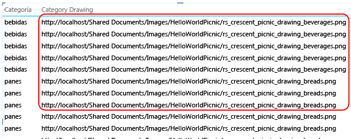
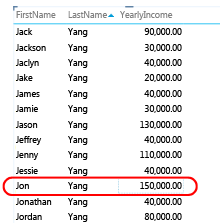
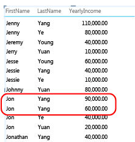
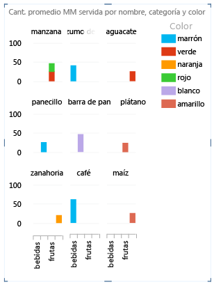
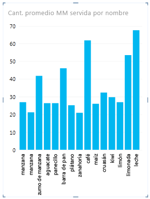

# Power View: configurar las propiedades de comportamiento de tablas para informes
[!INCLUDE[ssas-appliesto-sqlas-aas](../../includes/ssas-appliesto-sqlas-aas.md)]
  Si va a utilizar un modelo tabular como modelo de datos para [!INCLUDE[ssCrescent](../../includes/sscrescent-md.md)], puede establecer las propiedades del comportamiento de las tablas que exponen filas de detalles en un nivel más específico. El establecimiento de las propiedades del comportamiento de las tablas cambia el comportamiento de agrupación de las filas de detalle y genera una mejor colocación predeterminada de la información de identificación (como nombres, carnets con fotografía o imágenes de logotipo) en diseños de mosaicos, tarjetas y gráficos.  
  
 [!INCLUDE[ssCrescent](../../includes/sscrescent-md.md)]diferencia de otras aplicaciones de informes en que agrupará los elementos automáticamente durante el diseño del informe, evaluando las columnas que se han colocado en la lista de campos de informe con el formato de presentación que se están utilizando. En la mayoría de los casos, la agrupación predeterminada genera un resultado óptimo. Pero en algunas tablas, normalmente aquellas que contienen datos detallados, el comportamiento de agrupación predeterminada agrupará a veces filas que no deberían estarlo. Para estas tablas, puede establecer propiedades que cambien la forma de evaluar los grupos.  
  
 El establecimiento de las propiedades de comportamiento de las tablas se recomienda para las tablas donde las filas individuales tengan un interés primordial, como los registros de empleado o de cliente. En cambio, entre las tablas que no se benefician de estas propiedades están aquellas que actúan como tabla de búsqueda (por ejemplo, las tablas de fechas, las de categorías de producto o las de departamentos, donde la tabla consta de un número relativamente reducido de filas y de columnas), o las tablas de resumen que contienen filas que solo ofrecen interés cuando se resumen (por ejemplo, los datos del censo que se acumulan por sexo, edad o ubicación geográfica). En las tablas de resumen y de búsqueda, el comportamiento de agrupación predeterminada genera el mejor resultado.  
  
> [!NOTE]  
>  Las propiedades del comportamiento de las tablas solo afectan a los modelos tabulares utilizados como modelos de datos en [!INCLUDE[ssCrescent](../../includes/sscrescent-md.md)]. Las propiedades del comportamiento de las tablas no se admiten en los informes dinámicos de Excel.  
  
 Las propiedades del comportamiento de las tablas son:  
  
-   **Identificador de fila** : especifica una columna que contiene solo valores únicos, lo que permite utilizar esa columna como clave interna de agrupación.  
  
-   **Mantener filas únicas** : especifica qué columnas proporcionan valores que se tienen que tratar como únicos, aunque estén duplicados (por ejemplo, nombre y apellidos de empleado, para los casos en que dos o varios empleados compartan el mismo nombre).  
  
-   **Etiqueta predeterminada** : especifica qué columna proporciona un nombre para mostrar que representará los datos de fila (por ejemplo, el nombre de empleado en un registro de empleado).  
  
-   **Imagen predeterminada** : especifica qué columna proporciona una imagen que representará los datos de fila (por ejemplo, un carnet con fotografía en un registro del empleado).  
  
> [!NOTE]  
>  En la sección siguiente puede ver un enfoque de las optimizaciones de diseño desde el punto de vista de un formato de presentación determinado:  [Optimizar diseños específicos](#bkmk_optimizeforlayout).  
  
## Abrir el cuadro de diálogo de comportamiento de la tabla  
  
1.  En [!INCLUDE[ssBIDevStudioFull](../../includes/ssbidevstudiofull-md.md)], haga clic en la tabla (pestaña) para la que esté configurando una lista de campos predeterminada.  
  
2.  En la ventana **Propiedades** , en la propiedad **Comportamiento de la tabla** , haga clic en **Haga clic para editar**.  
  
3.  En el cuadro de diálogo **Comportamiento de la tabla** , establezca el **Identificador de tabla**y después especifique otras propiedades en este cuadro de diálogo.  
  
## Establecer la propiedad Identificador de fila  
 En la tabla, el identificador de fila especifica una columna única que contiene solo valores únicos y ningún valor en blanco. La propiedad Identificador de fila se utiliza para cambiar la agrupación de forma que los grupos no se basen en la composición de campos de una fila, sino en una columna fija que se utilice siempre para identificar de forma única una fila, independientemente de los campos que se usen en un diseño de informe determinado.  
  
 El establecimiento de esta propiedad cambia el comportamiento de agrupación predeterminada de una agrupación dinámica basada en las columnas presentes en el lienzo a un comportamiento fijo de agrupación que resume basándose en el identificador de fila. El cambio del comportamiento de agrupación predeterminada es pertinente para los diseños de informe como, por ejemplo, una matriz, que en caso contrario agruparía (o mostraría subtotales) para cada columna de la fila.  
  
 En [!INCLUDE[ssCrescent](../../includes/sscrescent-md.md)], el establecimiento de un identificador de fila habilita las siguientes propiedades adicionales: **Mantener filas únicas** , **Etiqueta predeterminada** e **Imagen predeterminada** .  
  
 También puede utilizar **Identificador de tabla** como una propiedad independiente para habilitar:  
  
-   El uso de imágenes binarias en los informes. Mediante la eliminación de la ambigüedad en torno a la singularidad de las filas, [!INCLUDE[ssCrescent](../../includes/sscrescent-md.md)] puede determinar cómo asignar imágenes predeterminadas y etiquetas predeterminadas a una determinada fila.  
  
-   Quite los subtotales no deseados de un informe de matriz. La agrupación predeterminada en el nivel de campo crea un subtotal para cada campo. Si desea que solo se calcule un subtotal en el nivel de fila, con el establecimiento del identificador de fila obtendrá este resultado.  
  
 No puede establecer un identificador de fila para las tablas marcadas como tablas de fechas. En las tablas de fechas, el identificador de fila se especifica cuando se marca la tabla. Para obtener más información, consulte [marcar como tabla de fechas, cuadro de diálogo ](http://msdn.microsoft.com/library/698b5ef1-b79b-4d76-9847-39669b4f5bb9).  
  
## Definindo a propriedade Manter Linhas Exclusivas  
 Esta propiedad permite especificar las columnas que contienen información de identidad (como un nombre de empleado o un código de producto) de manera que se distinga una fila de otra. En los casos en que las filas parezcan idénticas (como dos clientes con el mismo nombre), las columnas que especifique para esta propiedad se repetirán en la tabla de informe.  
  
 Dependiendo de qué columnas agregue al informe, puede que encuentre filas que se tratan como filas idénticas porque los valores de cada fila parecen iguales (como dos clientes con el nombre Jon Yang). Esto podría suceder porque otras columnas que proporcionan diferenciación (como el segundo nombre, la dirección o la fecha de nacimiento) no están en el lienzo de informe. En este escenario, el comportamiento predeterminado es agrupar las filas aparentemente idénticas en una sola, que resumirá los valores calculados de las filas combinadas en un solo resultado más amplio.  
  
 Si establece la propiedad **Mantener filas únicas** , podrá designar una o varias columnas para que se repitan siempre, aunque haya instancias duplicadas, siempre que se agregue esa columna al lienzo de informe. Los valores calculados asociados a la fila ahora se asignarán según cada fila individual en lugar de acumularlos en una sola fila. Al elegir las columnas para la propiedad  **Mantener filas únicas** , elija aquellas que contengan valores únicos o casi únicos.  
  
> [!NOTE]  
>  Dado que las columnas que el usuario final seleccione pueden afectar a la agrupación, que cambiará el contexto de filtro en los cálculos de las expresiones, los diseñadores de modelos deben tener la precaución de crear medidas que devuelvan resultados correctos. Para obtener más información, vea el tema sobre [Preguntas más frecuentes acerca de la vista avanzada](http://go.microsoft.com/fwlink/?LinkId=220674).  
  
## Establecer una etiqueta predeterminada  
 Esta propiedad especifica una etiqueta que aparece en la franja de navegación de un informe de mosaico. Cuando se utiliza con una imagen predeterminada, la etiqueta predeterminada aparece debajo de la imagen. Cuando no hay una imagen, la etiqueta predeterminada aparece sola. Al elegir una etiqueta predeterminada, seleccione la columna que proporcione más información acerca de la fila (por ejemplo, un nombre).  
  
 En un diseño de mosaico, la etiqueta predeterminada aparece en el área de título debajo de una imagen, de acuerdo con la definición de la propiedad de imagen predeterminada. Por ejemplo, si tiene una lista de empleados, podría presentar en forma de mosaico la información de empleado, utilizando el carnet con la fotografía como imagen predeterminada y el nombre del empleado como etiqueta predeterminada. En un mosaico, la etiqueta predeterminada aparece debajo de la imagen predeterminada. Estas columnas siempre aparecen en el mosaico, aunque no se seleccionen de forma explícita en la lista de campos del informe.  
  
## Establecer una imagen predeterminada  
 Esta propiedad especifica una imagen que aparecerá en la franja de navegación de un informe de mosaico o en la parte frontal de una tarjeta. En el informe, cuando seleccione la columna que contiene la imagen predeterminada, esta aparecerá situada en la franja de navegación de un diseño de informe de mosaico o en la parte frontal de una tarjeta. Una imagen predeterminada debe tener contenido visual. Algunos ejemplos son: un carnet con fotografía en la tabla de empleados, un logotipo de cliente en una tabla de clientes o el contorno de un país en una tabla geográfica.  
  
> [!NOTE]  
>  Las imágenes se pueden extraer de direcciones URL en un archivo de imagen de un servidor web o como datos binarios insertados en el libro. Si la imagen se basa en una dirección URL, asegúrese también de establecer la columna como tipo de imagen para que [!INCLUDE[ssCrescent](../../includes/sscrescent-md.md)] recupere la imagen en lugar de mostrar la dirección URL como datos de texto en el informe.  
  
##   Optimizar diseños específicos  
 Esta sección describe el efecto de establecer las propiedades del comportamiento de las tablas desde el punto de vista de un formato de presentación determinado y las características de los datos. Si intenta ajustar el diseño de un informe de matriz, por ejemplo, puede utilizar esta información para comprender cómo mejorar una presentación de matriz mediante propiedades de comportamiento de tablas en el modelo.  
  
### Faltan imágenes  
 Las propiedades que establezca en el modelo determinan si las imágenes se visualizarán en un informe o se representarán como valores de texto en el informe.  
  
   
  
 De forma predeterminada, el texto del modelo se interpreta como texto en el informe. Si una columna de texto es una dirección URL a una imagen del informe, recuerde establecer la propiedad **Dirección URL de la imagen** de modo que [!INCLUDE[ssCrescent](../../includes/sscrescent-md.md)] recupere el archivo de imagen. En las imágenes binarias, recuerde establecer la propiedad **Identificador de tabla** .  
  
### Las tablas no tienen una o varias filas  
 El comportamiento de agrupación predeterminada produce a veces un resultado que es lo contrario de lo que se pensó; concretamente, las filas de detalles que están presentes en el modelo no aparecen en el informe. De forma predeterminada, [!INCLUDE[ssCrescent](../../includes/sscrescent-md.md)] agrupa las columnas que se agregan al lienzo. Si agrega **Nombre de país** al informe, cada país aparecerá una vez en el lienzo, aunque la tabla base contenga miles de filas que incluyen varias instancias de cada nombre de país. En este caso, el comportamiento de agrupación predeterminada genera el resultado correcto.  
  
 Sin embargo, considere otro ejemplo en el que tal vez desee que aparezcan varias instancias de una fila, ya que las filas subyacentes contienen, de hecho, datos sobre entidades distintas. En este ejemplo, suponga que tiene dos clientes con el mismo nombre, **Jon Yang**. Si se usa el comportamiento de agrupación predeterminada, en el informe solo aparecerá una instancia de **Jon Yang** . Además, dado que en la lista solo aparece una instancia, la medida **Ingresos anuales** será la suma de ese valor para ambos clientes.  
  
   
  
 Para cambiar el comportamiento de agrupación predeterminada, establezca las propiedades **Identificador de tabla** y **Mantener filas únicas** . En **Mantener filas únicas**, elija la columna Apellido para que este valor se repita para una fila, aunque ya aparezca en otra. Después de cambiar las propiedades y volver a publicar el libro, puede crear el mismo informe, solo que en esta ocasión verá los de clientes llamados **Jon Yang**con los **Ingresos anuales** correctamente asignados a cada uno de ellos.  
  
   
  
### El diseño de la matriz está demasiado amontonado  
 Cuando se muestra una tabla de detalles en una matriz, la agrupación predeterminada proporciona un valor resumido para cada columna. Dependiendo de los objetivos que tenga, podría haber más resúmenes de lo que le gustaría. Para cambiar este comportamiento, puede establecer **Identificador de tabla**. No será necesario establecer más propiedades adicionales; el identificador de fila es suficiente para cambiar la agrupación de forma que los resúmenes que se calculen para cada fila se basen en su identificador único de fila.  
  
 Compare estas imágenes de antes y después que muestran cómo el establecimiento de esta propiedad afecta al diseño de una matriz.  
  
 **Antes: agrupación predeterminada basada en los campos de la matriz**  
  
   
  
 **Después: agrupación según el identificador de fila**  
  
   
  
### Gráfico que muestra demasiados elementos y niveles en el eje  
 Los informes de gráfico que muestran datos detallados deben utilizar el identificador de fila como eje. Sin un identificador de fila, el eje es indeterminado, lo que produce un diseño basado en suposiciones que puede que no tenga sentido. Para cambiar este comportamiento, puede establecer **Identificador de tabla**. No será necesario establecer más propiedades adicionales; el identificador de fila es suficiente para cambiar la agrupación de forma que los resúmenes que se calculen para cada fila se basen en su identificador único de fila.  
  
 Compare estas imágenes de antes y después que muestran cómo el establecimiento de esta propiedad afecta al diseño de un gráfico. Es el mismo informe, con los mismos campos y presentación. La única diferencia consiste es que la imagen inferior muestra un informe después de haberse establecido **Identificador de tabla** en la tabla de elementos.  
  
 **Antes: agrupación predeterminada basada en los campos de un gráfico**  
  
   
  
 **Después: agrupación según el identificador de fila (el identificador de fila se convierte en el eje)**  
  
   
  
## Pasos siguientes  
 Después de haber evaluado las tablas del modelo y establecer las propiedades del comportamiento de las tablas para que las que contengan filas de detalles aparezcan siempre como elementos individuales, puede optimizar aún más el modelo mediante propiedades o configuraciones adicionales.  
  
  
