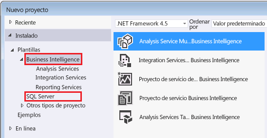

# Herramientas y aplicaciones utilizadas en Analysis Services
  Encuentre las herramientas y las aplicaciones que necesitará para crear modelos de Analysis Services y para administrar las bases de datos asociadas en una instancia de Analysis Services.  
  
## Diseñadores de modelo de Analysis Services  
 Los modelos tabulares y multidimensionales se crean a partir de plantillas de proyectos en una solución construida dentro del shell de Visual Studio. La plantilla del proyecto proporciona los diseñadores necesarios para crear las tablas, relaciones, cubos, dimensiones y roles que conforman una solución de Analysis Services. El shell proporciona el área de trabajo visual, las páginas de propiedades y el marco de trabajo de comandos dentro del que se crea el proyecto. El diseñador de modelos que suministra las plantillas y el shell es una descarga web gratuita.  
  
 Los modelos tienen una configuración de nivel de compatibilidad que determina qué características va a haber disponibles y qué versión de Analysis Services ejecuta el modelo.  El diseñador de modelos determina en parte si se va a poder especificar un nivel de compatibilidad dado.  
  
 Los modelos tabulares que usan las funciones más recientes de SQL Server 2016 (como los archivos BIM en formato JSON tabular o el filtrado cruzado bidireccional) se deben crear en el nivel de compatibilidad 1200, en la versión de SQL Server Data Tools para Visual Studio 2015 que se distribuye simultáneamente con SQL Server 2016 (encontrará el vínculo de descarga más abajo).  
  
 Si necesita un nivel de compatibilidad inferior (porque quiera implementar un modelo en una versión anterior de Analysis Services, por ejemplo), puede seguir recurriendo al diseñador de modelos en SSDT para Visual Studio 2015. Las versiones más recientes de la herramienta permiten crear cualquier tipo de modelo (tabular o multidimensional), en cualquier nivel de compatibilidad que necesite. No será necesario tener a mano las herramientas anteriores para generar o editar un modelo antiguo.  
  
### Descargar el diseñador de modelos  
 [!INCLUDE[ssBIDevStudio](../includes/ssbidevstudio-md.md)], conocido anteriormente como SQL Server Data Tools para Business Intelligence (SSDT-BI) y antes como Business Intelligence Development Studio (BIDS), sirve para crear modelos de Analysis Services.  
  
||  
|-|  
|**[Descargar SSDT para Visual Studio 2015](https://msdn.microsoft.com/mt429383)**|  
  
 Se recomienda usar SQL Server Data Tools para Visual Studio 2015 en lugar de otras versiones anteriores del diseñador. Contiene plantillas de proyecto para todo tipo de contenido de SQL Server: bases de datos relacionales, modelos de Analysis Services, informes de Reporting Services y paquetes de Integration Services.  
  
 SSDT se ejecuta en el shell de Visual Studio 2015. Si ya tiene Visual Studio 2015, el programa de instalación de SSDT solo agrega las plantillas de proyecto. Si no tiene Visual Studio 2015, se instalarán las plantillas y el shell.  
  
 Si tiene instalada en el equipo una versión anterior de SSDT-BI o BIDS, la versión más reciente se instala en paralelo con la versión anterior.  
  
 Después de instalar SSDT, las plantillas de Business Intelligence deben aparecer en el cuadro de diálogo Nuevo proyecto.  
  
   
  
## Herramientas administrativas  
  
### Descargar SQL Server Management Studio  
 Management Studio es la herramienta de administración principal para todas las características de SQL Server, incluida Analysis Services. Ahora es una descarga independiente.  
  
||  
|-|  
|**[Descargar SQL Server Management Studio](https://msdn.microsoft.com/library/mt238290.aspx)**|  
  
 En SQL Server 2016, Management Studio incluye eventos extendidos (xEvents) para Analysis Services, lo que constituye una alternativa ligera a los seguimientos de SQL Server Profiler usados para supervisar la actividad y diagnosticar problemas de servidor. Para obtener más información, consulte [Monitor Analysis Services with SQL Server Extended Events](../analysis-services/instances/monitor-analysis-services-with-sql-server-extended-events.md) .  
  
### SQL Server Profiler  
 Aunque esté oficialmente en desuso por la aparición de los xEvents, SQL Server Profiler ofrece un método conocido para controlar las conexiones, ejecutar consultas MDX y otras operaciones del servidor. SQL Server Profiler está instalado de forma predeterminada. Puede encontrarlo con aplicaciones SQL Server en aplicaciones de Windows Server 2012.  
  
### PowerShell  
 Puede utilizar comandos de PowerShell para realizar muchas tareas administrativas. Para más información, vea [PowerShell scripting in Analysis Services](../analysis-services/instances/powershell-scripting-in-analysis-services.md) (Scripting de PowerShell en Analysis Services).  
  
### Herramientas de la comunidad y de terceros  
 Consulte la [página de codeplex Analysis Services](http://sqlsrvanalysissrvcs.codeplex.com/) para obtener ejemplos de código de la comunidad. Los [foros](http://social.msdn.microsoft.com/Forums/sqlserver/home?forum=sqlanalysisservices) pueden ser útiles para buscar recomendaciones de herramientas de terceros compatibles con Analysis Services.  
  
## Vea también  
 [Nivel de compatibilidad de una base de datos multidimensional &#40;Analysis Services&#41;](../analysis-services/multidimensional-models/compatibility-level-of-a-multidimensional-database-analysis-services.md)   
 [Nivel de compatibilidad para modelos tabulares de Analysis Services](../analysis-services/tabular-models/compatibility-level-for-tabular-models-in-analysis-services.md)  
  
  