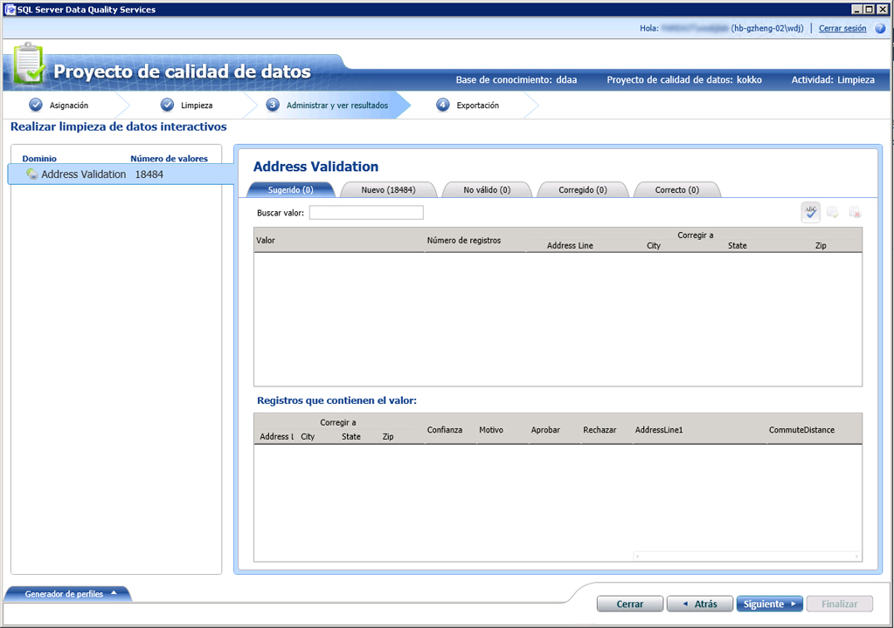

# Limpiar datos con datos de referencia de conocimiento (externos)-Data Quality Services (DQS)

[!INCLUDE [SQL Server - Windows only ASDBMI  ](../includes/applies-to-version/sql-windows-only-asdbmi.md)]

  En este tema se describe cómo limpiar los datos utilizando el conocimiento de los proveedores de datos de referencia. Aunque los pasos que se siguen para limpiar los datos mediante el conocimiento de los proveedores de datos de referencia son los mismos que los que se usan en la ejecución de una actividad de limpieza, tal como se explica en [Limpiar datos mediante el conocimiento de DQS &#40;interno&#41;](../data-quality-services/cleanse-data-using-dqs-internal-knowledge.md), en este tema se proporciona información específica para la limpieza de datos mediante el servicio de datos de referencia de [!INCLUDE[ssDQSnoversion](../includes/ssdqsnoversion-md.md)] (DQS).  

> [!IMPORTANT]
> En este artículo se mencionan algunos servicios de datos de referencia de terceros que anteriormente no estaban disponibles desde Azure DataMarket. DataMarket y Data Services (incluidos los datos de dirección de Melissa, por ejemplo), se suspendieron después del 31/12/2016. Como resultado, ya no se pueden ejecutar los ejemplos de este artículo con los servicios especificados de DataMarket. Sin embargo, se pueden usar los servicios de datos de referencia que están disponibles directamente en línea de los proveedores de datos de referencia de terceros.
 
 Cuando se utiliza la característica de servicio de datos de referencia en DQS para limpiar los datos, el proceso de limpieza de DQS envía los valores de dominio asignados al proveedor del servicio de datos de referencia en forma de solicitud de procesamiento por lotes. El servicio de datos de referencia responde con la información siguiente:  
  
-   Corrección sugerida  
  
-   Confianza  
  
-   Información adicional sobre el dominio asignado. Los datos de referencia también pueden normalizar, analizar o enriquecer el origen con datos adicionales. Esta información se proporciona en campos adicionales de la respuesta.  
  
 Después de obtener la respuesta del servicio de datos de referencia, en DQS ocurre lo siguiente durante la actividad de limpieza:  
  
-   Dependiendo de los valores especificados para **Umbral de corrección automática** y **Confianza mínima** durante la asignación de los dominios con el servicio de datos de referencia, los valores de dominio se corrigen o se sugieren automáticamente en función del nivel de confianza.  
  
    > [!NOTE]  
    >  Los valores de umbral que se aplican durante la limpieza de datos utilizando el conocimiento del servicio de datos de referencia son los especificados durante la asignación de un dominio a un servicio de datos de referencia, no los especificados en la pestaña **Configuración general** de la sección **Configuración** . Para obtener información sobre cómo especificar los valores de umbral para la limpieza de los datos de referencia, vea el paso 9 de [Adjuntar un dominio o un dominio compuesto a datos de referencia](../data-quality-services/attach-domain-or-composite-domain-to-reference-data.md).  
  
-   Los valores de dominio se clasifican en las categorías siguientes: **Sugerido**, **Nuevo**, **No válido**, **Corregido**y **Correcto**.  
  
-   Los datos adicionales se anexan al origen, y la información, junto con los datos limpios, está disponible para su exportación.  
  
## Antes de empezar  
  
###   Requisitos previos  
 Debe haber asignado los dominios requeridos de una base de conocimiento de DQS al servicio de datos de referencia apropiado. Además, la base de conocimiento debe contener conocimiento sobre el tipo de datos que desea limpiar. Por ejemplo, si quiere limpiar los datos de origen que contienen direcciones de EE. UU., debe asignar los dominios a un proveedor de servicios de datos de referencia que proporcione datos de alta calidad para esas direcciones. Para más información, vea [Adjuntar un dominio o un dominio compuesto a datos de referencia](../data-quality-services/attach-domain-or-composite-domain-to-reference-data.md).  
  
###   Seguridad  
  
####   Permisos  
 Debe disponer del rol dqs_kb_editor o dqs_kb_operator en la base de datos DQS_MAIN para realizar la limpieza de datos.  
  
##   Limpiar los datos mediante el conocimiento de los datos de referencia  
 Continuaremos con el mismo ejemplo del uso de los dominios que asignamos en el tema anterior, [adjuntar dominio o dominio compuesto a datos de referencia](../data-quality-services/attach-domain-or-composite-domain-to-reference-data.md), con el servicio de datos Melissa en Azure Marketplace. Ahora, utilizaremos los mismos dominios para limpiar algunas direcciones de EE. UU. de ejemplo. Los pasos necesarios para limpiar los datos son los mismos que los que se describen en [Limpiar datos mediante el conocimiento de DQS &#40;interno&#41;](../data-quality-services/cleanse-data-using-dqs-internal-knowledge.md). Sin embargo, requeriremos su atención siempre que sea necesario durante el proceso.  
  
1.  Cree un proyecto de calidad de datos y seleccione la actividad **Limpieza** . Consulte [Create a Data Quality Project](../data-quality-services/create-a-data-quality-project.md).  
  
2.  En la página **Asignación** , asigne los 4 dominios siguientes a las columnas apropiadas de los datos de origen: **Address Line**, **City**, **State**y **Zip**. Haga clic en **Next**.  
  
    > [!NOTE]  
    >  Como ha asignado los cuatro dominios dentro del dominio compuesto **Address Verification** , la limpieza de datos ahora se realizará en el nivel de dominio compuesto, y no en el nivel de dominio individual.  
  
3.  En la página **Limpieza** , ejecute el proceso de limpieza asistido por PC haciendo clic en **Iniciar**. Una vez finalizado el proceso de limpieza, haga clic en **Siguiente**.  
  
    > [!NOTE]  
    >  En la página **Limpieza** , DQS muestra información sobre los dominios adjuntados al servicio de datos de referencia de estas dos formas:  
    >   
    >  -   Aparece un mensaje debajo del botón **Inicio** : "dominios \<Domain1> , \<Domain2> ,... \<DomainN> se limpian mediante el proveedor de servicios de datos de referencia ". En este ejemplo, se mostrará el mensaje siguiente: "El dominio Access Verification se limpia mediante el proveedor de servicios de datos al que se hace referencia".  
    > -   Un icono, el "), se muestra en el área **generador de perfiles** con los dominios adjuntos al proveedor de servicios de datos de referencia. En este ejemplo, el icono se mostrará en el dominio compuesto **Address Verification** .  
  
4.  En la página **Administrar y ver resultados** , revise los valores de dominio. El servicio de datos de referencia puede mostrar varias sugerencias, si están disponibles, para un valor dependiendo del número máximo de sugerencias especificadas en el cuadro **Candidatos sugeridos** durante la asignación del dominio al servicio de datos de referencia. Por ejemplo, se muestran dos sugerencias para la dirección de EE. UU. siguiente:  
  
     **Valor original:**  
  
    |Address Line|City|State|Zip|  
    |------------------|----------|-----------|---------|  
    |1 msft way|Redmond||98052|  
  
     **Valores sugeridos:**  
  
    |Address Line|City|State|Zip|  
    |------------------|----------|-----------|---------|  
    |1 Microsoft Way|Redmond|WA|98052|  
    |PO BOX 1|Redmond|WA|98073|  
  
       
  
    > [!NOTE]  
    >  En los dominios compuestos, DQS también resalta en otro color los dominios individuales que se corrigieron durante el proceso de limpieza asistido por PC. Por ejemplo, en este caso, los dominios **Address line** y **State** se corrigieron y, por consiguiente, se han resaltado en cian.  
  
5.  Después de que finalice la revisión de todos los valores de dominio, haga clic en **Siguiente** para exportar los datos.  
  
6.  En la página **Exportar** , observará que además de la información habitual acerca de la actividad de limpieza para cada dominio (Origen, Motivo, Confianza y Estado), existe información adicional proporcionada por el servicio de datos de referencia Melissa Data sobre los datos de la dirección, como la latitud y la longitud de esta, el nombre del condado, el tipo de dirección (edificio, calle, etc.), y otros.  
  
7.  Exporte los datos al destino requerido (SQL Server, CSV o Excel) y haga clic en **Finalizar** para cerrar el proyecto.  
  
    > [!IMPORTANT]  
    >  Si utiliza la versión de 64 bits de Excel, no puede exportar los datos limpiados en un archivo de Excel; puede exportar únicamente a una base de datos de SQL Server o un archivo .csv.  
  
  
