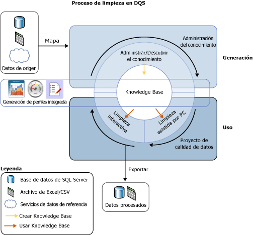
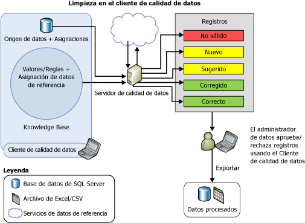

# Limpieza de datos
  La limpieza de datos es el proceso de analizar la calidad de los datos en un origen de datos; para ello, se aprueban o rechazan manualmente las sugerencias del sistema y, de esta manera, se hacen modificaciones en los datos. La limpieza de datos en [!INCLUDE[ssDQSnoversion](../includes/ssdqsnoversion-md.md)] (DQS) incluye un proceso asistido por PC que analiza cómo se ajustan los datos al conocimiento de una base de conocimiento y un proceso interactivo que permite al administrador de datos revisar y modificar los resultados obtenidos en los procesos asistidos por PC con el fin de garantizar que la limpieza de datos resulta exactamente como se deseaba efectuar.  
  
 El administrador de datos también puede realizar la limpieza de datos en el proceso de empaquetado de Integration Services. En este caso, el administrador de datos utilizaría [!INCLUDE[ssDQSCleansingLong](../includes/ssdqscleansinglong-md.md)] para realizar automáticamente la limpieza de datos mediante una base de conocimiento existente. Para obtener más información, consulte [transformación limpieza de DQS](../integration-services/data-flow/transformations/dqs-cleansing-transformation.md).  
  
 La característica de limpieza de datos en DQS tiene las siguientes ventajas:  
  
-   Identifica datos incompletos o incorrectos en el origen de datos (archivo de Excel o base de datos de SQL Server) y, posteriormente, corrige o alerta sobre los datos no válidos.  
  
-   Proporciona un proceso de dos pasos para limpiar los datos: *asistido* y *interactivo*. El proceso asistido por PC usa el conocimiento de una base de conocimiento de DQS para procesar automáticamente los datos y sugiere reemplazos o correcciones. El paso siguiente, el interactivo, permite al administrador de datos aprobar, rechazar o modificar los cambios que ha propuesto DQS durante proceso de limpieza de datos asistido por PC.  
  
-   Estandariza y enriquece los datos del cliente con los valores de dominio, las reglas de dominio y los datos de referencia. Por ejemplo, estandarizar el uso del término cambiando "C/" a "Calle", enriquecer datos rellenando los elementos que faltan cambiando "1 Microsoft way Redmond 98006" a "1 Microsoft Way, Redmond, WA 98006".  
  
-   Proporciona una interfaz tipo asistente sencilla, intuitiva y coherente para que el usuario navegue por los datos e inspeccione errores en un conjunto muy grande de datos.  
  
 La ilustración siguiente muestra cómo se realiza la limpieza de datos en DQS:  
  
   
  
##   Limpieza asistida por PC  
 El proceso de limpieza de datos de DQS aplica la base de conocimiento a los datos que se van a limpiar y propone cambios en los datos. El administrador de datos tiene acceso a cada cambio propuesto, lo que le permite evaluar y corregir los cambios. Para realizar la limpieza de datos, el administrador de datos procede como sigue:  
  
1.  Crea un proyecto de calidad de datos, selecciona una base de conocimiento que se usará de referencia en el análisis y en la limpieza de los datos de origen y selecciona la actividad **Limpieza** . Varios proyectos de calidad de datos pueden utilizar la misma base de conocimiento.  
  
2.  Especifique la tabla o vista de la base de datos o un archivo de Excel que contenga los datos de origen que se van a limpiar. La base de datos o el archivo de Excel pueden ser los mismos que se usaron para la detección de conocimiento, o puede ser otra base de datos u otro archivo de Excel.  
  
    > [!NOTE]  
    >  Si selecciona el mismo origen de datos para la detección del conocimiento y las actividades de limpieza, no habrá ningún cambio en los datos. Se recomienda que ejecute la detección de conocimiento en datos de muestra y, posteriormente, limpie los datos de origen con el conocimiento que se generó durante la actividad de detección de conocimiento.  
  
3.  Asigne los campos de datos que se van a limpiar a los dominios o dominios compuestos apropiados en la base de conocimiento. Si se asigna un campo a un dominio compuesto, la asignación se produce entre el campo y el dominio compuesto y no con los dominios individuales en el dominio compuesto. Por otra parte, la limpieza de datos para el campo asignado se lleva a cabo según las reglas que se especificaron para el dominio compuesto y no para los dominios individuales en el dominio compuesto. Para obtener más información acerca de los dominios compuestos, vea [DQS Knowledge Bases and Domains](../data-quality-services/dqs-knowledge-bases-and-domains.md).  
  
4.  Ejecute el proceso de limpieza asistida por PC haciendo clic en **iniciar** en el **Cleanse** página.  
  
 El proceso de limpieza de datos busca la mejor coincidencia de una instancia de datos para los valores conocidos del dominio de datos. El proceso aplica el conocimiento de la calidad de datos a todos los datos de origen, a diferencia del proceso de detección de conocimiento, que se ejecuta sobre un porcentaje de los datos de muestra.  
  
 El proceso asistido por PC muestra información sobre la calidad de los datos en [!INCLUDE[ssDQSClient](../includes/ssdqsclient-md.md)] durante el proceso de limpieza interactiva. Además de tener en cuenta las reglas de error de sintaxis, DQS también utiliza datos de referencia y algoritmos avanzados para clasificar los datos mediante el *nivel de confianza*. El nivel de confianza indica el grado de certeza de DQS para la corrección o sugerencia. El nivel de confianza se basa en los umbrales siguientes:  
  
-   Un *umbral de corrección automática* por encima del cual DQS sugerirá un cambio y hacerlo a menos que el Administrador de datos lo rechaza. Puede especificar el valor de umbral de corrección automática en la pestaña **Configuración general** de la pantalla **Configuración** . Para obtener más información, vea [Configure Threshold Values for Cleansing and Matching](../data-quality-services/configure-threshold-values-for-cleansing-and-matching.md).  
  
-   Un *umbral de sugerencia automática* valor por debajo del umbral de corrección automática, por encima del cual DQS sugerirá un cambio y lo realizará si el Administrador de datos lo aprueba. Puede especificar el valor de umbral de sugerencia automática en la pestaña **Configuración general** de la pantalla **Configuración** . Para obtener más información, vea [Configure Threshold Values for Cleansing and Matching](../data-quality-services/configure-threshold-values-for-cleansing-and-matching.md).  
  
 DQS deja cualquier valor con un nivel de confianza inferior al umbral de sugerencia automática tal como esté a menos que el administrador de datos especifique un cambio.  
  
##   Limpieza interactiva  
 En función del proceso de limpieza asistido por PC, DQS proporciona al administrador de datos la información que necesita para tomar una decisión sobre si debe cambiar los datos. DQS clasifica los datos en las cinco pestañas siguientes:  
  
-   **Sugiere**: valores para los que DQS detectó sugerencias con un nivel de confianza mayor que el *umbral de sugerencia automática* pero inferior el *umbral de corrección automática* valor. Debe revisar estos valores y aprobarlos o rechazarlos según corresponda.  
  
-   **Nuevo**: valores válidos para el que DQS no tiene suficiente información (sugerencia) y, por tanto, no se puede asignar a ninguna otra pestaña. Además, esta pestaña también contiene valores que tienen un nivel de confianza inferior al *umbral de sugerencia automática* pero lo suficientemente alto para que se identifiquen como válidos.  
  
-   **No válido**: valores que se marcaron como no válidos en el dominio de la base de conocimiento o valores que no cumplieron una regla de dominios o datos de referencia. Esta pestaña también contendrá los valores que rechaza el usuario en cualquiera de las otras cuatro pestañas durante el proceso de limpieza interactivo.  
  
-   **Corregir**: procesan los valores corregidos por DQS durante la limpieza automatizada que DQS detectó una corrección para el valor con el nivel de confianza superior el *umbral de corrección automática* valor. Esta pestaña también contendrá los valores para los que el usuario especificó un valor correcto en la columna de **Corregir a** durante la limpieza interactiva y que fueron posteriormente aprobados haciendo clic en el botón de opción de la columna **Aprobar** en cualquiera de las otras cuatro pestañas.  
  
-   **Correcto**: valores que se estiman correctos. Por ejemplo, si el valor coincide con un valor de dominio. Si procede, puede invalidar la limpieza de DQS; para ello, rechace los valores en esta pestaña o especifique una palabra alternativa en la columna **Corregir a** y haga clic en el botón de opción de la columna **Aceptar** . Esta pestaña también contendrá los valores que aprobó el usuario durante la limpieza interactiva haciendo clic en el botón de opción de la columna **Aprobar** en la pestaña **Nuevo** o **No válido** .  
  
> [!NOTE]  
>  En el **sugerido**, **corregido**, y **correcto** fichas, DQS muestra el valor inicial de un dominio, si procede, en la **corregir a** columna con respecto al valor de dominio respectivo.  
  
 El administrador de datos usa [!INCLUDE[ssDQSClient](../includes/ssdqsclient-md.md)] para ver los cambios propuestos por DQS y decidir si implementarlos o no. Puede comprobar si los valores que DQS ha designado como correctos son en realidad correctos. Puede comprobar si los cambios ya realizados por DQS, con un alto nivel de confianza, deben realizarse. Puede decidir si desea aprobar los cambios sugeridos automáticamente. Y puede revisar los valores que no se han cambiado, por si desea realizar un cambio no encontrado por el proceso asistido por PC.  
  
 DQS combinará los cambios realizados por el administrador de datos con los resultados de la limpieza de datos asistida por PC. Estos cambios permanecerán en el proyecto; sin embargo, no se agregarán a la base de conocimiento. Durante la limpieza de datos, la base de conocimiento asociada es de solo lectura.  
  
 Cuando la limpieza de datos ha finalizado, puede elegir si exportar los datos procesados a una nueva tabla en una base de datos de SQL Server, a un archivo .csv o a un archivo de Excel. Los datos de origen en los que se realiza la limpieza se mantienen en su estado original. El administrador de datos puede utilizar los datos limpios independientes para corregir los datos de origen reales.  
  
 La ilustración siguiente muestra cómo se realiza la limpieza de datos mediante la aplicación [!INCLUDE[ssDQSClient](../includes/ssdqsclient-md.md)] :  
  
   
  
##   Corregir el valor inicial  
 La corrección del valor inicial se aplica a los valores de dominio que tienen sinónimos y donde el usuario quiere usar uno de los valores de sinónimos como valor inicial en lugar de otros con el fin de proporcionar una representación coherente del valor. Por ejemplo, “Nueva York”, “NYC” y “gran manzana” son sinónimos, y el usuario desea utilizar “Nueva York” como valor inicial en lugar de “NYC” y “gran manzana”. DQS admite la corrección de valores principales durante el proceso de limpieza al objeto de ayudarle a normalizar los datos. La corrección del valor inicial se realiza únicamente si el dominio se habilitó para la misma cuando se creó. De forma predeterminada, todos los dominios se habilitan para la corrección del valor inicial salvo que se haya desactivado la casilla **Usar valores iniciales** mientras se creaba un dominio. Para obtener más información sobre esta casilla, vea [Set Domain Properties](../data-quality-services/set-domain-properties.md).  
  
##   Estandarizar datos limpios  
 Puede elegir si desea exportar los datos limpios en el formato normalizado según el formato de salida que se haya definido para los dominios. Al crear un dominio, puede seleccionar el formato que se aplicará cuando los valores de datos del dominio se generen. Para obtener más información acerca de cómo especificar formatos de salida para un dominio, vea la lista **Dar formato a la salida para** en [Set Domain Properties](../data-quality-services/set-domain-properties.md).  
  
 Al exportar datos limpios en la página **Exportar** en el asistente para el proyecto de calidad de datos, se especifica si desea que los datos limpios se exporten en el formato estandarizado; para ello, se activa la casilla **Estandarizar salida** . De forma predeterminada, los datos limpios se exportan en el formato estandarizado, es decir, la casilla está activada. Para obtener más información acerca de cómo exportar los datos limpios, vea [Limpiar datos usando DQS & #40; interno & #41; Conocimiento](../data-quality-services/cleanse-data-using-dqs-internal-knowledge.md).  
  
##   Tareas relacionadas  
  
|Descripción de la tarea|Tema|  
|----------------------|-----------|  
|Describe cómo configurar los umbrales para la actividad de limpieza.|[Configurar los valores de umbral para la limpieza y coincidencia](../data-quality-services/configure-threshold-values-for-cleansing-and-matching.md)|  
|Describe cómo limpiar los datos mediante conocimiento generado en DQS.|[Limpiar datos con DQS & #40; interno & #41; Conocimiento](../data-quality-services/cleanse-data-using-dqs-internal-knowledge.md)|  
|Describe cómo limpiar datos con conocimiento desde un servicio de datos de referencia.|[Limpiar datos con datos de referencia & #40; Nº 41; & externos Conocimiento](../data-quality-services/cleanse-data-using-reference-data-external-knowledge.md)|  
|Describe cómo limpiar un dominio compuesto.|[Limpiar datos en un dominio compuesto](../data-quality-services/cleanse-data-in-a-composite-domain.md)|  
  
## Vea también  
 [Proyectos de calidad de datos & #40; DQS & #41;](../data-quality-services/data-quality-projects-dqs.md)   
 [Coincidencia de datos](../data-quality-services/data-matching.md)  
  
  