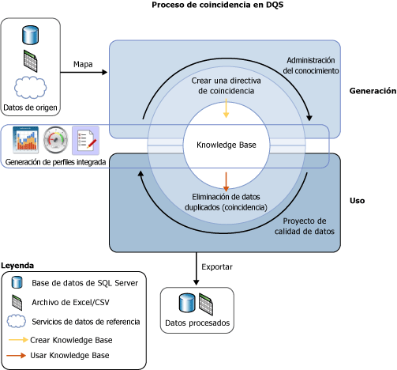

# Coincidencia de datos
  El proceso de búsqueda de coincidencias de datos de [!INCLUDE[ssDQSnoversion](../includes/ssdqsnoversion-md.md)] (DQS) permite reducir la duplicación de datos y mejorar la precisión de estos en un origen de datos. Este proceso analiza el grado de duplicación de todos los registros de un único origen de datos, y devuelve las probabilidades ponderadas de una coincidencia entre cada conjunto de registros comparados. A continuación, puede decidir qué registros son coincidencias y tomar las medidas apropiadas en los datos de origen.  
  
 El proceso de búsqueda de coincidencias de DQS ofrece las ventajas siguientes:  
  
-   La búsqueda de coincidencias le permite eliminar las diferencias entre los valores de datos que deberían ser iguales, determinando el valor correcto y reduciendo el número de errores que pueden producir las diferencias en los datos. Por ejemplo, con frecuencia los nombres y las direcciones son los datos identificativos de un origen de datos, especialmente los datos de clientes, pero los datos se pueden desfasar y deteriorar con el tiempo. El proceso de búsqueda de coincidencias permite identificar y corregir estos errores, facilitando en gran manera el uso y el mantenimiento de los datos.  
  
-   Dicho proceso le permite garantizar que los valores que son equivalentes, pero que se escribieron utilizando formatos o estilos diferentes, se representan de manera uniforme.  
  
-   Asimismo, es capaz de identificar las coincidencias exactas y las aproximadas, lo que le permite quitar los datos duplicados a medida que se definen. Es necesario definir el punto en el que una coincidencia aproximada es realmente una coincidencia. También se deberán definir los campos que se evalúan para la búsqueda de coincidencias y los que no.  
  
-   DQS le permite crear una directiva de coincidencia mediante un proceso asistido por PC, modificarla de forma interactiva en función de los resultados de búsqueda de coincidencias y agregarla a una base de conocimiento que se puede reutilizar.  
  
-   Puede decidir si es necesario volver a indizar los datos copiados del origen en la tabla de ensayo, dependiendo del estado de la directiva de coincidencia y de los datos de origen. Si opta por no hacerlo, el rendimiento mejorará.  
  
 Puede realizar el proceso de búsqueda de coincidencias junto con otros procesos de limpieza de datos para mejorar la calidad global de los datos. También puede realizar la eliminación de datos duplicados mediante la funcionalidad DQS integrada en Master Data Services. Para obtener más información, consulte [Master Data Services Overview & #40; MDS & #41;](../master-data-services/master-data-services-overview-mds.md).  
  
 La ilustración siguiente muestra cómo se realiza la búsqueda de coincidencias de datos en DQS:  
  
   
  
##   Cómo realizar la búsqueda de coincidencias de datos  
 Al igual que ocurre con otros procesos de calidad de datos de DQS, la búsqueda de coincidencias se efectúa creando una base de conocimiento y ejecutando una actividad de búsqueda de coincidencias en un proyecto de calidad de datos mediante los pasos siguientes:  
  
1.  Crear una directiva de coincidencia en la base de conocimiento  
  
2.  Realizar un proceso de eliminación de datos duplicados en una actividad de búsqueda de coincidencias que forma parte de un proyecto de calidad de datos.  
  
###   Crear una directiva de coincidencia  
 Para preparar la base de conocimiento para el proceso de búsqueda de coincidencias, cree una directiva de coincidencia en ella que defina la forma en la que DQS asigna la probabilidad de coincidencia. Una directiva de coincidencia consta de una o varias reglas de coincidencia que identifican los dominios que se utilizarán cuando DQS evalúe el grado de coincidencia de un registro con otro, y especifica la importancia de cada valor de dominio en la evaluación de coincidencias. En la regla se debe especificar si los valores de dominio deben ser una coincidencia exacta o simplemente similares, y hasta qué punto. También se debe especificar si una coincidencia de dominio es un requisito previo.  
  
 La actividad de directiva de coincidencia del Asistente para la administración de la base de conocimiento analiza los datos de ejemplo aplicando cada una de las reglas de coincidencia para comparar los registros del intervalo de registros de dos en dos. Los registros cuyas puntuaciones de coincidencia sean superiores a un mínimo especificado se agrupan en clústeres en los resultados de búsqueda de coincidencias. Estos resultados de búsqueda de coincidencias no se agregan a la base de conocimiento, pero se pueden utilizar para optimizar las reglas de coincidencia. La creación de una directiva de coincidencia puede ser un proceso iterativo en el que se modifican las reglas de coincidencia en función de los resultados de búsqueda de coincidencias o las estadísticas de generación de perfiles.  
  
 En un dominio, es posible especificar que las cadenas de datos se normalicen al cargar datos del origen de datos. Este proceso consiste en reemplazar los caracteres especiales por un valor NULL o un espacio, lo que a menudo elimina las diferencias entre dos cadenas. Esto puede aumentar la precisión de la búsqueda de coincidencias, permitiendo a menudo que un resultado de búsqueda de coincidencias supere el umbral de coincidencia mínimo, algo que sin la normalización no sucedería.  
  
> [!NOTE]  
>  Los valores NULL de los campos correspondientes de dos registros se considerarán una coincidencia.  
  
 La directiva de coincidencia se ejecuta en dominios asignados a los datos de ejemplo. Es posible especificar si los datos se copian del origen de datos en la tabla de ensayo y se vuelven a indizar al ejecutar la directiva de coincidencia o no. Puede hacerlo al generar la base de conocimiento y al ejecutar el proyecto de búsqueda de coincidencias. Si no vuelve a indizar los datos, es probable que el rendimiento mejore. No será necesario volver a indizar los datos si se cumplen las condiciones siguientes: la directiva de coincidencia no ha cambiado, y no ha actualizado el origen de datos, reasignado la directiva, seleccionado un nuevo origen de datos o asignado uno o varios dominios nuevos.  
  
 Las reglas de coincidencia se guardan en la base de conocimiento a medida que se crean. Sin embargo, una base de conocimiento solo estará disponible para su uso en un proyecto de calidad de datos una vez que se haya publicado. Además, hasta que se realice la publicación, las reglas de coincidencia que contiene solo las podrá cambiar el usuario que la creó.  
  
###   Ejecutar un proyecto de búsqueda de coincidencias  
 DQS realiza la eliminación de datos duplicados comparando cada una de las filas de los datos de origen con todas las demás, utilizando la directiva de coincidencia definida en la base de conocimiento, y generando una probabilidad de que las filas sean una coincidencia. Esto se lleva a cabo en un proyecto de calidad de datos de tipo Coincidencia. El proceso de búsqueda de coincidencias es uno de los pasos principales de un proyecto de calidad de datos. El mejor momento para realizarlo es después de la limpieza de datos, de modo que los datos que se van a comparar no tengan errores. Antes de ejecutar un proceso de búsqueda de coincidencias, puede exportar los resultados del proyecto de limpieza a una tabla de datos o un archivo .csv, para crear a continuación un proyecto de búsqueda de coincidencias en el que asigne los resultados de limpieza a los dominios de dicho proyecto.  
  
 Un proyecto de búsqueda de coincidencias de datos consta de un proceso asistido por PC y de un proceso interactivo. El proyecto de búsqueda de coincidencias aplica las reglas de coincidencia de la directiva correspondiente al origen de datos que se va a evaluar. Este proceso evalúa la probabilidad de que dos filas cualesquiera sean coincidencias valiéndose de una puntuación de coincidencia. Solo aquellos registros con una probabilidad de coincidencia superior a un valor establecido por el administrador de datos en la directiva de coincidencia se considerarán una coincidencia.  
  
 Cuando DQS realiza el análisis de coincidencia, crea clústeres de registros que considera como coincidencias. DQS identifica de forma aleatoria uno de los registros de cada clúster como el registro dinámico, o inicial. El administrador de datos comprueba los resultados de búsqueda de coincidencias y rechaza aquellos registros que no sean una coincidencia apropiada para un clúster. A continuación, el administrador de datos seleccionará una regla de permanencia que DQS utilizará para determinar el registro que permanecerá tras el proceso de búsqueda de coincidencias y reemplazará a los registros coincidentes. La regla de permanencia puede ser “Registro dinámico” (la regla predeterminada), “Registro más completo y más largo”, “Registro más completo” o “Registro más largo”. DQS determina el registro que permanece (inicial) de cada clúster en función del registro que coincide con mayor exactitud con los criterios de la regla de permanencia. Si hay varios registros de un determinado clúster que cumplen la regla de permanencia, DQS selecciona uno de ellos de forma aleatoria. DQS le ofrece la posibilidad de mostrar los clústeres que tienen registros en común como un único clúster; para ello, seleccione “Mostrar clústeres no superpuestos”. Debe ejecutar el proceso de búsqueda de coincidencias para poder mostrar los resultados de acuerdo con este valor.  
  
 Puede exportar los resultados del proceso de búsqueda de coincidencias a una tabla de SQL Server o a un archivo .csv. Es posible exportar los resultados de búsqueda de coincidencias de dos formas: la primera consiste en exportar los registros coincidentes y los no coincidentes, y la segunda en exportar los registros de permanencia que incluyen solo el registro que permanece de un clúster y los resultados no coincidentes. En los registros de permanencia, si el mismo registro se identifica como el que permanece para varios clústeres, dicho registro solo se exportará una vez.  
  
## En esta sección  
 En DQS puede realizar las tareas siguientes relacionadas con la búsqueda de coincidencias:  
  
|||  
|-|-|  
|Crear y probar reglas de coincidencia en una directiva de coincidencia|[Crear una directiva de coincidencia](../data-quality-services/create-a-matching-policy.md)|  
|Ejecutar la búsqueda de coincidencias en un proyecto de calidad de datos|[Ejecutar un proyecto de coincidencia](../data-quality-services/run-a-matching-project.md)|  
  
  