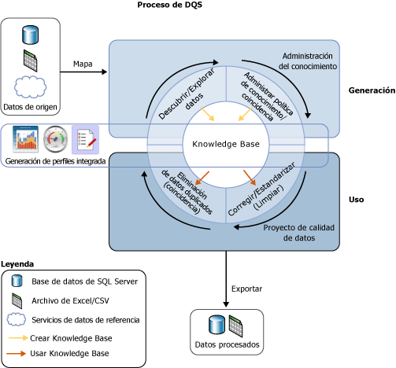

# Introducción a Data Quality Services

[!INCLUDE[appliesto-ss-xxxx-xxxx-xxx-md-winonly](../includes/appliesto-ss-xxxx-xxxx-xxx-md-winonly.md)]

  La solución de calidad de datos que aporta [!INCLUDE[ssDQSnoversion](../includes/ssdqsnoversion-md.md)] (DQS) permite al administrador de datos o al profesional de TI mantener la calidad de los datos y asegurarse de que los datos son apropiados para su uso empresarial. DQS es una solución controlada por conocimiento que proporciona métodos asistidos por PC e interactivos para administrar la integridad y la calidad de los orígenes de datos. DQS permite detectar, compilar y administrar conocimientos sobre sus datos. Puede utilizar ese conocimiento para limpiar datos, buscar coincidencias y generar perfiles de los datos. Asimismo, puede aprovechar los servicios basados en la nube de proveedores de datos de referencia en un proyecto de calidad de datos DQS.  
  
##   La necesidad empresarial de DQS  
 Los datos incorrectos pueden ser consecuencia de errores provocados por los usuarios al introducirlos, daños durante la transmisión o el almacenamiento, definiciones de diccionarios de datos no coincidentes y otros tipos de problemas de calidad de datos y procesos. Si se agregan datos de diferentes orígenes que utilicen distintos estándares de datos puede provocar que los datos sean incoherentes, como la aplicación de una regla arbitraria o sobrescribir datos históricos. Los datos incorrectos afectan a la capacidad de un negocio de realizar sus funciones empresariales y de proporcionar servicios a sus clientes, lo que puede dar lugar a la pérdida de credibilidad y de ingresos, descontento de los clientes y problemas de cumplimiento de la normativa. Los sistemas automatizados a menudo no funcionan con datos incorrectos, y los datos erróneos hacen malgastar el tiempo y la energía de las personas realizando procesos manuales. Los datos incorrectos pueden causar estragos en el análisis de datos, elaboración de informes, minería de datos y almacenamiento.  
  
 Los datos de alta calidad son fundamentales en la eficacia de los negocios e instituciones. Las organizaciones de cualquier tamaño pueden utilizar DQS para mejorar el valor de información de los datos, lo cual ofrece datos más adecuados para su uso previsto. Una solución de calidad de datos puede hacer que los datos sean más confiables, accesibles y reutilizables. Puede mejorar la integridad, la precisión, la conformidad y la coherencia de los datos, además de resolver los problemas que provocan los datos no válidos en Business Intelligence o cargas de trabajo de almacenamiento, así como en los sistemas OLTP.  
  
 DQS habilita a los usuarios corporativos, trabajadores de la información o profesionales de TI que no son expertos en bases de datos ni programadores para que puedan crear, mantener y ejecutar las operaciones de calidad de datos de su organización con un tiempo mínimo de instalación o de preparación.  
  
##   Responder a esa necesidad con DQS  
 No se ha definido calidad de datos en términos absolutos. Depende de si los datos son apropiados para el fin para el que están destinados. DQS identifica datos potencialmente incorrectos y le aporta un cálculo sobre las probabilidades que existen de que los datos sean efectivamente incorrectos. DQS le proporciona una descripción semántica de los datos para que pueda decidir sobre su adecuación. DQS permite solucionar los problemas que conlleva un estado incompleto, falta de conformidad, incoherencias, inexactitud, invalidez y duplicación de los datos.  
  
 DQS proporciona las siguientes características para resolver problemas de calidad de datos.  
  
-   **Limpieza de datos:** modificación, eliminación o enriquecimiento de datos que no sean correctos o estén incompletos, mediante el uso de procesos asistidos por PC e interactivos. Para obtener más información, consulte [Data Cleansing](../data-quality-services/data-cleansing.md).  
  
-   **Coincidencia:** identificación de duplicados semánticos en un proceso basado en reglas que le permite determinar lo que constituye una coincidencia y realizar la eliminación de los datos duplicados. Para obtener más información, consulte [Data Matching](../data-quality-services/data-matching.md).  
  
-   **Reference Data Services:** comprobación de la calidad de los datos mediante servicios de un proveedor de datos de referencia. Puede usar los servicios de datos de referencia de [Microsoft Azure Marketplace](http://azure.microsoft.com/marketplace/) para limpiar, validar, buscar coincidencias y enriquecer datos con facilidad. Para obtener más información, consulte [Reference Data Services in DQS](../data-quality-services/reference-data-services-in-dqs.md).  
  
-   **Generación de perfiles:** análisis de un origen de datos para proporcionar una visión general de la calidad de los datos en cada etapa de la detección del conocimiento, administración de dominios, búsqueda de coincidencias y procesos de limpieza de datos. La generación de perfiles es una herramienta muy útil en una solución de calidad de datos DQS. Puede crear una solución de calidad de datos en la que la generación de perfiles sea tan importante como la administración del conocimiento, la búsqueda de coincidencias y la limpieza de datos. Para obtener más información, consulte [Data Profiling and Notifications in DQS](../data-quality-services/data-profiling-and-notifications-in-dqs.md).  
  
-   **Supervisión:** seguimiento e indicación del estado de las actividades de calidad de datos. Con la supervisión, podrá comprobar que la solución de calidad de datos está haciendo lo que se pretende que haga. Para obtener más información, consulte [DQS Administration](../data-quality-services/dqs-administration.md).  
  
-   **Base de conocimiento:** Data Quality Services es una solución controlada por conocimiento que analiza los datos en función del conocimiento que haya generado con DQS. De esta forma, podrá crear procesos de calidad de datos que mejoren de forma continuada el conocimiento sobre los datos y que, al hacerlo, se mejore constantemente la calidad de los datos.  
  
 En la siguiente ilustración se muestra el proceso de DQS:  
  
   
  
##   Una solución controlada por conocimiento  
 Las base de conocimiento de DQS es un repositorio de tres tipos de conocimiento: conocimiento previo, conocimiento generado por [!INCLUDE[ssDQSServer](../includes/ssdqsserver-md.md)]y conocimiento generado por el usuario. Con DQS, podrá almacenar conocimientos sobre los datos en la base de conocimiento, agregar reglas de negocios y modificar el conocimiento según considere y, a continuación, aplicarlo para probar la integridad y la exactitud de los datos. Después de generar la base de conocimiento, puede mejorarla continuamente y, posteriormente, reutilizarla en diversos procesos de mejora de calidad de los datos.  
  
 El conocimiento en una base de conocimiento identifica datos potencialmente incorrectos y propone cambios para estos datos. Puede buscar coincidencias de datos, lo que permite llevar a cabo la eliminación de los datos duplicados. Puede comparar los datos de un origen con los datos de referencia basados en nube que son mantenidos y garantizados por los proveedores de calidad de los datos. El administrador de datos o el profesional de TI comprueba tanto el conocimiento de la base de conocimiento como los cambios que se realizan en los datos y llevan a cabo la limpieza, la eliminación de datos duplicados y los servicios de datos de referencia.  
  
 Las bases de datos almacenan todo el conocimiento relacionado con un tipo específico de origen de datos. Por ejemplo, puede mantener una base de conocimiento para una base de datos de clientes y otra base de conocimiento para una base de datos de empleados. El conocimiento se encuentra en uno o varios dominios de datos, cada uno de los cuales es una representación semántica de un tipo de datos en un campo de datos. Una base de conocimiento para una base de datos cliente puede tener dominios para nombres de empresas, direcciones, contactos, información de contacto y así sucesivamente. Un dominio contiene una lista de valores de confianza, valores no válidos y datos erróneos. El conocimiento de dominios incluye las asociaciones de sinónimos, las relaciones de términos, la validación y las reglas de negocios, así como las directivas de búsqueda de coincidencias. Gracias a este conocimiento, el administrador de datos puede tomar una decisión fundamentada sobre si se deben corregir instancias específicas de los valores en un dominio.  
  
 Con DQS, podrá realizar operaciones de importación y exportación con una base de conocimiento. Puede importar o exportar dominios o bases de conocimiento mediante un archivo DQS. Puede importar valores o dominios desde un archivo Excel. Por otra parte, puede importar de vuelva a un dominio los valores que se hayan encontrado en un proceso de limpieza basado en la base de conocimiento. Estas operaciones permiten mejorar continuamente las bases de conocimiento, de forma que se garantice que el conocimiento adquirido a través de decisiones y descubrimientos se enruta de nuevo a la base de conocimiento.  
  
 La solución controlada por conocimiento de DQS utiliza dos pasos fundamentales para limpiar los datos:  
  
-   Un proceso de **administración del conocimiento** que genera la base de conocimiento  
  
-   Un **proyecto de calidad de datos** que propone cambios en los datos de origen en función del conocimiento de la base de conocimiento.  
  
 Para más información, vea [Bases de conocimiento y dominios de DQS](../data-quality-services/dqs-knowledge-bases-and-domains.md) y [Proyectos de calidad de datos &#40;DQS&#41;](../data-quality-services/data-quality-projects-dqs.md).  
  
##   Componentes de DQS  
 Data Quality Services se compone de [!INCLUDE[ssDQSServer](../includes/ssdqsserver-md.md)] y [!INCLUDE[ssDQSClient](../includes/ssdqsclient-md.md)]. Estos componentes hacen posible el desempeño de servicios de calidad de datos de forma independiente de otras operaciones de SQL Server. Ambos se instalan desde el programa de instalación de SQL Server.  
  
 [!INCLUDE[ssDQSServer](../includes/ssdqsserver-md.md)] se implementa como tres catátalos de SQL Server que podrá administrar y supervisar en SQL Server Management Studio (DQS_MAIN, DQS_PROJECTS y DQS_STAGING_DATA). DQS_MAIN incluye procedimientos almacenados de DQS, el motor de DQS y las bases de conocimiento publicadas. DQS_PROJECTS incluye los datos necesarios para las actividades relacionadas con la administración de bases de conocimiento y con los proyectos de DQS. DQS_STAGING_DATA aporta una base de datos de almacenamiento provisional intermedia donde puede copiar los datos de origen para realizar operaciones de DQS y después exportar los datos procesados.  
  
 [!INCLUDE[ssDQSClient](../includes/ssdqsclient-md.md)] es una aplicación independiente que permite desarrollar la administración del conocimiento, los proyectos de calidad de datos y la administración en una interfaz de usuario. La aplicación se diseñó para los administradores de datos y administradores de DQS. Es un archivo ejecutable independiente que lleva a cabo la detección del conocimiento, la administración de dominios, la creación de directivas de búsqueda de coincidencias, la limpieza de datos, las coincidencias, la generación de perfiles, la supervisión y la administración del servidor. [!INCLUDE[ssDQSClient](../includes/ssdqsclient-md.md)] se puede instalar y ejecutar en el mismo equipo que [!INCLUDE[ssDQSServer](../includes/ssdqsserver-md.md)] o en otro equipo. Muchas operaciones en [!INCLUDE[ssDQSClient](../includes/ssdqsclient-md.md)] se controlan mediante asistentes para facilitar su uso.  
  
##   Funcionalidad de la calidad de datos en Integration Services y Master Data Services  
 La funcionalidad de la calidad de datos que proporciona Data Quality Services se integra en un componente de SQL Server Integration Services (SSIS) y en las características de Master Data Services (MDS) para permitirle realizar procesos de calidad de datos en esos servicios.  
  
 **[!INCLUDE[ssDQSCleansingLong](../includes/ssdqscleansinglong-md.md)]**  
  
 [!INCLUDE[ssDQSCleansingLong](../includes/ssdqscleansinglong-md.md)] le permite realizar limpiezas de datos como parte de un paquete de Integration Services. Cuando se ejecuta el paquete, la limpieza de datos se ejecuta como un archivo por lotes. Se trata de una alternativa a la ejecución de un proyecto de limpieza en la aplicación de [!INCLUDE[ssDQSClient](../includes/ssdqsclient-md.md)] . Puede garantizar la calidad de los datos automáticamente. No es necesario llevar a cabo los pasos interactivos de un proyecto de limpieza de datos en la aplicación de [!INCLUDE[ssDQSClient](../includes/ssdqsclient-md.md)] . Puede incluir el proceso de limpieza de datos en un flujo de datos que contenga otros componentes de Integration Services. Para más información, vea [Transformación Limpieza de DQS](../integration-services/data-flow/transformations/dqs-cleansing-transformation.md).  
  
 **Procesos de calidad de datos en Master Data Services**  
  
 La funcionalidad de Data Quality Services se ha integrado en Master Data Services (MDS), de modo que puede realizar la desduplicación de los datos de origen y los datos maestros del complemento Master Data Services de Microsoft SQL Server 2014 para Microsoft Excel. Para efectuar la coincidencia y la carga de datos administrados por MDS en una hoja de cálculo de Excel, combínelos con los datos no administrados por MDS y después realice la coincidencia en Excel. Los componentes de [!INCLUDE[ssDQSServer](../includes/ssdqsserver-md.md)] se deben instalar con MDS. Para obtener más información, consulte  [Coincidencia de calidad de datos en el Complemento MDS para Excel](../master-data-services/microsoft-excel-add-in/data-quality-matching-in-the-mds-add-in-for-excel.md).  
  
  
