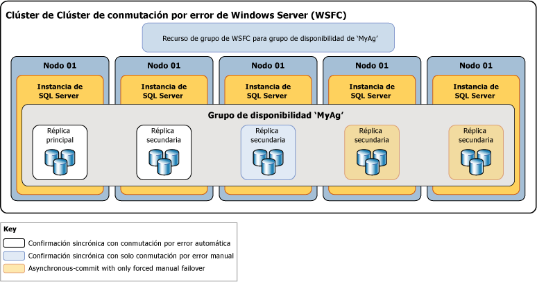

# Diferencias entre los modos de disponibilidad para un grupo de disponibilidad Always On
[!INCLUDE [SQL Server](../../../includes/applies-to-version/sqlserver.md)]

  En [!INCLUDE[ssHADR](../../../includes/sshadr-md.md)], el *modo de disponibilidad* es una propiedad de réplica que determina si una réplica de disponibilidad determinada puede ejecutarse en modo de confirmación sincrónica. En cada réplica de disponibilidad se debe configurar el modo de disponibilidad para el modo de confirmación sincrónica, el modo de confirmación asincrónica o el modo de solo configuración.  Si la réplica principal se configura para el *modo de confirmación asincrónica*, no espera a que ninguna réplica secundaria escriba las entradas del registro de transacciones entrantes en el disco ( *se fortalece el registro*). Si una réplica secundaria dada se configura para el modo de confirmación asincrónica, la réplica principal no espera a que esa réplica secundaria proteja el registro. Si la réplica principal y una réplica secundaria determinada se configuran ambas para el *modo de confirmación sincrónica*, la réplica principal espera a que la réplica secundaria confirme que ha reforzado el registro (a menos que la réplica secundaria no pueda hacer ping a la réplica principal en el *período de tiempo de espera de sesión*de la principal). 
  

> [!NOTE]  
>  Si el período de tiempo de espera de sesión de la réplica principal es superado por una réplica secundaria, la replicación principal pasa temporalmente al modo de confirmación asincrónicoa para esa replicación secundaria. Cuando la replicación secundaria vuelva a conectarse con la replicación primaria, se reanuda el modo de confirmación sincrónica.  
  
##   Modos de disponibilidad admitidos  
 [!INCLUDE[ssHADR](../../../includes/sshadr-md.md)] admite tres modos de disponibilidad: el modo de confirmación asincrónica, el modo de confirmación sincrónica y el modo de solo configuración, como se indica a continuación:  
  
-   *Modo de confirmación asincrónica* es una solución de recuperación ante desastres que funciona bien cuando las réplicas de disponibilidad se distribuyen a distancias considerables. Si cada réplica secundaria se está ejecutando en modo de confirmación asincrónica, la réplica principal no espera ninguna réplica secundaria para proteger el registro. En su lugar, inmediatamente después de escribir el registro en el archivo de registro local, la réplica principal envía la confirmación de la transacción al cliente. La réplica principal se ejecuta con la mínima latencia de transacciones respecto a una réplica secundaria que se configura para el modo de confirmación asincrónica.  Si la principal actual se configura para el modo de disponibilidad de confirmación asincrónica, confirmará las transacciones de forma asincrónica para todas las réplicas secundarias independientemente de su configuración del modo de disponibilidad individual.  
  
     Para obtener más información, vea [Modo de disponibilidad de confirmación asincrónica](#AsyncCommitAvMode), más adelante en este tema.  
  
-   El*modo de confirmación sincrónica* establece prioridades de alta disponibilidad sobre el rendimiento, pero a costa de aumentar la latencia de las transacciones. En modo de confirmación sincrónica, las transacciones esperan a enviar la confirmación de transacción al cliente hasta que la réplica secundaria ha protegido el registro en el disco. Cuando la sincronización de datos comienza en una base de datos secundaria, la réplica secundaria comienza a aplicar los registros entrantes desde la base de datos principal correspondiente. En cuanto se protege cada entrada del registro, la base de datos secundaria entra en el estado de SYNCHRONIZED. Después, la réplica secundaria protege cada nueva transacción antes de que se escriba la entrada de registro en el archivo de registro local. Cuando todas las bases de datos secundarias de una réplica secundaria se sincronizan, el modo de confirmación sincrónica admite la conmutación por error manual y, opcionalmente, la conmutación automática por error.  
  
     Para obtener más información, vea [Modo de disponibilidad de confirmación sincrónica](#SyncCommitAvMode), más adelante en este tema.  

-   El *modo de solo configuración* se aplica a los grupos de disponibilidad que no están en un clúster de conmutación por error de Windows Server. Una réplica en modo de solo configuración no contiene datos de usuario. En el modo de solo configuración, la base de datos maestra de la réplica almacena metadatos de configuración del grupo de disponibilidad. Para más información, vea [Availability group with configuration only replica (Grupo de disponibilidad con réplica de solo configuración)](../../../linux/sql-server-linux-availability-group-ha.md).
  
 En la ilustración siguiente se muestra un grupo de disponibilidad con cinco réplicas de disponibilidad. La réplica principal y una réplica secundaria se configuran para el modo de confirmación sincrónica con conmutación automática por error. Se configura otra réplica secundaria para el modo de confirmación sincrónica con conmutación por error manual planeada únicamente y se configuran dos réplicas secundarias para el modo de confirmación asincrónica, que solo admite la conmutación por error manual forzada (denominada normalmente *conmutación por error forzada*).  
  
   
  
 El comportamiento de sincronización y de conmutación por error entre dos réplicas de disponibilidad depende del modo de disponibilidad de ambas réplicas. Por ejemplo, para que tenga lugar la confirmación sincrónica, la réplica principal actual y la réplica secundaria en cuestión se debe configurar para la confirmación sincrónica. Asimismo, para que se produzca la conmutación por error automática, ambas réplicas deben configurarse para la conmutación automática por error. Por lo tanto, el comportamiento para el escenario de implementación mostrado anteriormente se puede resumir en la tabla siguiente, en la que se explora el comportamiento con cada réplica principal potencial:  
  
|Réplica principal actual|Destinos de conmutación por error automática|Comportamiento de modo de confirmación sincrónica con|Comportamiento de modo de confirmación asincrónica con|Conmutación por error automática posible|  
|-----------------------------|--------------------------------|--------------------------------------------|---------------------------------------------|---------------------------------|  
|01|02|02 y 03|04|Sí|  
|02|01|01 y 03|04|Sí|  
|03||01 y 02|04|No|  
|04|||01, 02 y 03|No|  
  
 Normalmente, el nodo 04 como réplica de confirmación asincrónica, se implementa en un sitio de recuperación ante desastres. El hecho de que los nodos 01, 02, 03 se mantengan en el modo de confirmación asincrónica después de conmutar por error al nodo 04 ayuda a evitar la degradación del rendimiento potencial en el grupo de disponibilidad debido a la alta latencia de red entre los dos sitios.  
  
##   Asynchronous-Commit Availability Mode  
 En el *modo de confirmación asincrónica*, la réplica secundaria nunca se sincroniza con la réplica principal. Aunque una base de datos secundaria puede tener acceso a la base de datos principal correspondiente, cualquier base de datos secundaria podría retrasarse en cualquier momento. El modo de confirmación asincrónica puede resultar útil en un escenario de recuperación de desastres en el que la réplica principal y la réplica secundaria están separadas por una distancia significativa, y donde no se desean errores pequeños que puedan afectar a la réplica principal, o en situaciones donde es más importante el rendimiento que la protección de los datos sincronizados. Además, puesto que la réplica principal no espera reconocimientos de la réplica secundaria, los problemas de la réplica secundaria nunca afectan a la réplica principal.  
  
 Una réplica secundaria de confirmación asincrónica intenta hacer frente a las entradas de registro recibidas de la réplica principal. Pero en modo de confirmación asincrónica, las bases de datos secundarias permanecen sin sincronizar y es más probable que se retrasen detrás las bases de datos principales. Normalmente, la diferencia entre una base de datos secundaria de confirmación asincrónica y la base de datos principal correspondiente es pequeña. Pero la diferencia puede ser considerable si el servidor que hospeda la replicación secundaria está sobrecargado o la red es lenta.  
  
 El único formato de conmutación por error que admite el modo de confirmación asincrónica es conmutación por error forzada (con posible pérdida de datos). Forzar la conmutación es un último recurso destinado únicamente para situaciones en las que la réplica principal actual permanece disponible durante un período prolongado y la disponibilidad inmediata de las bases de datos principales es más importante que el riesgo de posibles pérdidas de datos. El destino de la conmutación por error debe ser una réplica cuyo rol esté en el estado SECONDARY o RESOLVING. El destino de la conmutación por error asume el rol principal y sus copias de las bases de datos se convierten en la base de datos principal. Cualquier base de datos secundaria restante, junto con las bases de datos principales anteriores, una vez que estén disponibles, se suspende hasta que se reanuden de forma manual e individualmente. En el modo de confirmación asincrónica, se pierde cualquier registro de transacciones que la replicación principal original no hubiera enviado a la replicación secundaria anterior. Esto significa que algunas o todas las nuevas bases de datos principales podrían carecer de las transacciones confirmadas recientemente. Para obtener más información sobre el funcionamiento de la conmutación por error forzada y los procedimientos recomendados para usarla, vea [Conmutación por error y modos de conmutación por error &#40;grupos de disponibilidad AlwaysOn&#41;](../../../database-engine/availability-groups/windows/failover-and-failover-modes-always-on-availability-groups.md).  
  
##   Synchronous-Commit Availability Mode  
 En modo de disponibilidad de confirmación sincrónica (*modo de confirmación sincrónica*), al unirse a un grupo de disponibilidad, una base de datos secundaria se pone al mismo nivel que la base de datos principal correspondiente y entra en el estado SYNCHRONIZED. Las bases de datos secundarias permanecen en ese estado mientras continúa la sincronización de datos. Esto garantiza que cada transacción confirmada en la base de datos principal dada también se ha confirmado en la nueva base de datos secundaria correspondiente. Cuando se sincroniza cada base de datos secundaria de una réplica secundaria determinada, el estado de sincronización de dicha réplica en su conjunto es HEALTHY.  
  
 **En esta sección:**  
  
-   [Factores que interrumpen la sincronización de datos](#DisruptSync)  
  
-   [Cómo funciona la sincronización en una réplica secundaria](#HowSyncWorks)  
  
-   [Modo de confirmación sincrónica con modo de conmutación por error manual](#SyncCommitWithManual)  
  
-   [Modo de confirmación sincrónica con conmutación automática por error](#SyncCommitWithAuto)  
  
###   Factores que interrumpen la sincronización de datos  
 Una vez que todas las bases de datos están sincronizadas, la réplica secundaria entra en el estado HEALTHY. La réplica secundaria sincronizada permanecerá en este estado a menos que ocurra lo siguiente:  
  
-   Un retraso de la red o del equipo o, o una interferencia provoca que se agote el tiempo de espera de la sesión entre la réplica secundaria y la réplica principal.  
  
    > [!NOTE]  
    >  Para obtener más información sobre la propiedad session-time de las réplicas de disponibilidad, vea [Información general de los grupos de disponibilidad AlwaysOn &#40;SQL Server&#41;](../../../database-engine/availability-groups/windows/overview-of-always-on-availability-groups-sql-server.md).  
  
-   Se suspende una base de datos secundaria en la réplica secundaria. La réplica secundaria deja de estar sincronizada y su estado de sincronización se marca como NOT_HEALTHY. La réplica secundaria no puede entrar de nuevo en el estado HEALTHY hasta que la base de datos secundaria suspendida se pospone y se vuelve a sincronizar, o se quita del grupo de disponibilidad.  
  
-   Agrega una base de datos principal al grupo de disponibilidad. Las réplicas secundarias previamente sincronizadas entran en el estado de sincronización NOT_HEALTHY. Este estado indica que al menos una base de datos tiene el estado de sincronización NOT SYNCHRONIZING. Una réplica secundaria determinada no puede volver a tener el estado HEALTHY hasta que una base de datos secundaria correspondiente se ha preparado en la réplica, se ha unido al grupo de disponibilidad y se ha sincronizado con la nueva base de datos principal.  
  
-   Cambia la réplica principal o la réplica secundaria al modo de disponibilidad de confirmación asincrónica. Después de cambiar al modo de confirmación asincrónica, la réplica secundaria permanecerá en el estado HEALTHY mientras continúe la sincronización de datos. Sin embargo, si solo se cambia la réplica principal al modo de confirmación asincrónica, la réplica secundaria en modo de confirmación sincrónica entrará en el estado de sincronización PARTIALLY_HEALTHY. Este estado indica que al menos una base de datos tiene el estado de sincronización SYNCHRONIZING, pero que ninguna de las bases de datos tiene el estado NOT SYNCHRONIZING.  
  
-   Cambia cualquier réplica secundaria al modo de disponibilidad de confirmación sincrónica. Esto hace que réplica secundaria se marque con un estado de sincronización PARTIALLY_HEALTHY. hasta que todas sus bases de datos tengan el estado de sincronización SYNCHRONIZED.  
  
> [!TIP]  
>  Para ver el estado de sincronización de un grupo de disponibilidad, una réplica de disponibilidad o una base de datos de disponibilidad, consulte las columnas **synchronization_health** o **synchronization_health_desc** de [sys.dm_hadr_availability_group_states](../../../relational-databases/system-dynamic-management-views/sys-dm-hadr-availability-group-states-transact-sql.md), [sys.dm_hadr_availability_replica_states](../../../relational-databases/system-dynamic-management-views/sys-dm-hadr-availability-replica-states-transact-sql.md)o [sys.dm_hadr_database_replica_states](../../../relational-databases/system-dynamic-management-views/sys-dm-hadr-database-replica-states-transact-sql.md), respectivamente.  
  
###   Cómo funciona la sincronización en una réplica secundaria  
 En modo de confirmación sincrónica, después de que una réplica secundaria se una al grupo de disponibilidad y establezca una sesión con la réplica principal, la réplica secundaria escribe las entradas de registro entrantes en el disco (*protege el registro*) y envía un mensaje de confirmación a la réplica principal. Una vez que el registro protegido de la base de datos secundaria llega al final del registro de la base de datos principal, el estado de la base de datos secundaria se establece en SYNCHRONIZED. El tiempo necesario para la sincronización depende básicamente de la diferencia entre la base de datos secundaria y la base de datos principal en el momento de iniciar la sesión (diferencia calculada por el número de registros inicialmente recibidos de la réplica principal), la carga de trabajo en la base de datos principal y la velocidad del equipo de la instancia del servidor que hospeda la réplica secundaria.  
  
 La operación sincrónica se mantiene de la siguiente manera:  
  
1.  Al recibir una transacción de un cliente, la réplica principal escribe el registro de la transacción en el registro de transacciones y envía simultáneamente la entrada del registro a las réplicas secundarias.  
  
2.  Una vez que se ha escrito la entrada de registro en el registro de transacciones de la base de datos principal, la transacción solo se puede deshacer si se produce una conmutación por error en ese momento a una base de datos secundaria que no ha recibido el registro. La réplica principal espera la confirmación de la réplica secundaria de confirmación sincrónica.  
  
3.  La réplica secundaria protege el registro y devuelve una confirmación a la réplica principal.  
  
4.  Al recibir la confirmación de la réplica secundaria, la réplica principal finaliza el proceso de confirmación y envía un mensaje de confirmación al cliente.  
  
    > [!NOTE]  
    >  Si se agota el tiempo de espera de una réplica secundaria de confirmación sincrónica sin confirmar que se ha protegido el registro, la principal marca las réplicas secundarias como error. El estado conectado de la réplica secundaria cambia a DISCONNECTED, y la réplica principal deja de esperar la confirmación de la réplica secundaria. Este comportamiento garantiza que una réplica secundaria de confirmación sincrónica no impida que se proteja el registro de transacciones de la réplica principal.  
  
 El modo de confirmación sincrónica protege los datos exigiendo que estos estén sincronizados entre dos lugares, a costa de un ligero aumento de la latencia de las transacciones.  
  
###  Modo de confirmación sincrónica con modo de conmutación por error manual  
 Cuando estas réplicas están conectadas y la base de datos está sincronizada, se admite la conmutación por error manual. Si la réplica secundaria baja un nivel, la réplica principal no se ve afectada. La réplica principal se ejecuta expuesta si no existen réplicas SYNCHRONIZED (es decir, sin enviar datos a ninguna réplica secundaria). Si se pierde la réplica principal, las réplicas secundarias entran en el estado RESOLVING, pero el propietario de la base de datos puede forzar una conmutación por error a la réplica secundaria (con posible pérdida de datos). Para obtener más información, vea [Conmutación por error y modos de conmutación por error &#40;Grupos de disponibilidad AlwaysOn&#41;](../../../database-engine/availability-groups/windows/failover-and-failover-modes-always-on-availability-groups.md).  
  
###   Modo de confirmación sincrónica con conmutación automática por error  
 La conmutación automática por error proporciona alta disponibilidad al asegurar que la base de datos estará de nuevo disponible rápidamente después de la pérdida de la réplica principal. Para configurar un grupo de disponibilidad para la conmutación automática por error, debe establecer la réplica principal actual y al menos una réplica secundaria en el modo de confirmación sincrónica con conmutación automática por error. Puede tener hasta tres réplicas de conmutación por error automática.  
  
 Además, para que la conmutación automática por error sea posible en un momento dado, esta réplica secundaria se debe sincronizar con la réplica principal (es decir, todas las bases de datos secundarias están sincronizadas), y los clústeres de conmutación por error de Windows Server (WSFC) deben tener quórum. Si la réplica principal no está disponible en estas condiciones, se produce la conmutación automática por error. La réplica secundaria cambia al rol de principal y ofrece su base de datos como la base de datos principal. Para obtener más información, vea la sección "Conmutación automática por error" del tema [Conmutación por error y modos de conmutación por error &#40;Grupos de disponibilidad AlwaysOn&#41;](../../../database-engine/availability-groups/windows/failover-and-failover-modes-always-on-availability-groups.md).  
  
> [!NOTE]  
>  Para obtener más información sobre el cuórum WSFC y [!INCLUDE[ssHADR](../../../includes/sshadr-md.md)], vea [Configuración de los votos y modos de cuórum WSFC &#40;SQL Server&#41;](../../../sql-server/failover-clusters/windows/wsfc-quorum-modes-and-voting-configuration-sql-server.md).  

### Latencia de datos en la réplica secundaria
La implementación del acceso de solo lectura en las réplicas secundarias resulta útil si las cargas de trabajo de solo lectura pueden tolerar cierta latencia de datos. En las situaciones en las que la latencia de datos no es aceptable, considere la posibilidad de ejecutar cargas de trabajo de solo lectura en la réplica principal.

La réplica principal envía las entradas de registro de los cambios en la base de datos principal a las réplicas secundarias. En cada base de datos secundaria, un subproceso de rehacer dedicado aplica las entradas de registro. En una base de datos secundaria de acceso de lectura, un cambio determinado de datos no aparece en los resultados de la consulta hasta que la entrada del registro que contiene el cambio se haya aplicado a la base de datos secundaria y la transacción se haya confirmado en la base de datos principal.+

Esto significa que hay latencia, normalmente solo se trata de unos segundos, entre las réplicas principales y secundarias. No obstante, en casos excepcionales, por ejemplo, si los problemas de red reducen el rendimiento, la latencia puede ser importante. La latencia aumenta cuando se producen cuellos de botella de E/S y cuando se suspende el movimiento de los datos. Para supervisar el movimiento de datos suspendido, puede usar el [panel Always On](../../../database-engine/availability-groups/windows/use-the-always-on-dashboard-sql-server-management-studio.md) o la [vista de administración dinámica sys.dm_hadr_database_replica_states](../../../relational-databases/system-dynamic-management-views/sys-dm-hadr-database-replica-states-transact-sql.md).

Para obtener más información sobre la investigación de la latencia de fase de puesta al día en la réplica secundaria, vea [Solución de problemas: cambios en la réplica principal que no se reflejan en la réplica secundaria](../../../database-engine/availability-groups/windows/troubleshoot-primary-changes-not-reflected-on-secondary.md).
  
##   Tareas relacionadas  
 **Para cambiar el modo de disponibilidad y el modo de conmutación por error**  
  
-   [Cambiar el modo de disponibilidad de una réplica de disponibilidad &#40;SQL Server&#41;](../../../database-engine/availability-groups/windows/change-the-availability-mode-of-an-availability-replica-sql-server.md)  
  
-   [Cambiar el modo de conmutación por error de una réplica de disponibilidad &#40;SQL Server&#41;](../../../database-engine/availability-groups/windows/change-the-failover-mode-of-an-availability-replica-sql-server.md)  
  
 **Para ajustar los votos de quórum**  
  
-   [Ver la configuración de NodeWeight de cuórum de clúster](../../../sql-server/failover-clusters/windows/view-cluster-quorum-nodeweight-settings.md)  
  
-   [Configurar los valores de NodeWeight de cuórum de clúster](../../../sql-server/failover-clusters/windows/configure-cluster-quorum-nodeweight-settings.md)  
  
-   [Forzar el inicio de un clúster WSFC sin un quórum](../../../sql-server/failover-clusters/windows/force-a-wsfc-cluster-to-start-without-a-quorum.md)  
  
 **Para realizar una conmutación manual por error**  
  
-   [Realizar una conmutación por error manual planeada de un grupo de disponibilidad &#40;SQL Server&#41;](../../../database-engine/availability-groups/windows/perform-a-planned-manual-failover-of-an-availability-group-sql-server.md)  
  
-   [Realizar una conmutación por error manual forzada de un grupo de disponibilidad &#40;SQL Server&#41;](../../../database-engine/availability-groups/windows/perform-a-forced-manual-failover-of-an-availability-group-sql-server.md)  
  
-   [Usar el Asistente para grupo de disponibilidad de conmutación por error &#40;SQL Server Management Studio&#41;](../../../database-engine/availability-groups/windows/use-the-fail-over-availability-group-wizard-sql-server-management-studio.md)  
  
 **Para ver los estados del grupo de disponibilidad, la réplica de disponibilidad y las bases de datos**  
  
-   [sys.dm_hadr_availability_group_states &#40;Transact-SQL&#41;](../../../relational-databases/system-dynamic-management-views/sys-dm-hadr-availability-group-states-transact-sql.md)  
  
-   [sys.dm_hadr_availability_replica_states &#40;Transact-SQL&#41;](../../../relational-databases/system-dynamic-management-views/sys-dm-hadr-availability-replica-states-transact-sql.md)  
  
-   [sys.dm_hadr_database_replica_states &#40;Transact-SQL&#41;](../../../relational-databases/system-dynamic-management-views/sys-dm-hadr-database-replica-states-transact-sql.md)  
  
##   Contenido relacionado  
  
-   [Guía de soluciones AlwaysOn de Microsoft SQL Server para lograr alta disponibilidad y recuperación ante desastres](https://go.microsoft.com/fwlink/?LinkId=227600)  
  
-   [Blog del equipo de AlwaysOn de SQL Server: blog oficial del equipo de AlwaysOn de SQL Server](https://blogs.msdn.microsoft.com/sqlalwayson/)  
  
## Consulte también  
 [Información general de los grupos de disponibilidad AlwaysOn &#40;SQL Server&#41;](../../../database-engine/availability-groups/windows/overview-of-always-on-availability-groups-sql-server.md)   
 [Conmutación por error y modos de conmutación por error &#40;Grupos de disponibilidad AlwaysOn&#41;](../../../database-engine/availability-groups/windows/failover-and-failover-modes-always-on-availability-groups.md)   
 [Clústeres de conmutación por error de Windows Server &#40;WSFC&#41; con SQL Server](../../../sql-server/failover-clusters/windows/windows-server-failover-clustering-wsfc-with-sql-server.md)  
  
  
